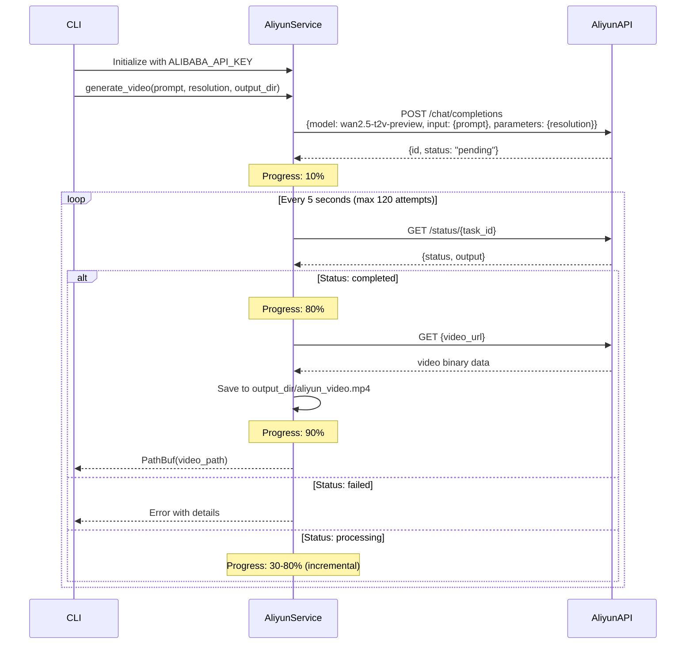

# Model Configuration: Replace OpenAI Sora with wan2.5-i2v-preview

## Overview

Replace the OpenAI Sora video generation implementation with Alibaba Aliyun's wan2.5-i2v-preview model for all video generation in the CLI and remove all Sora-related code.

## Current State

The CLI video command currently uses:
- Model: OpenAI Sora (`sora-2-pro`) via `VideoGenerationService` in `src/video.rs`
- API: OpenAI Video API (`https://api.openai.com/v1/videos`)
- Environment variable: `OPENAI_API_KEY`
- Supported styles: realistic, anime, 3d, cinematic, biotech, cyberpunk, educational
- Default style: `cyberpunk`

## Target State

The CLI video command should use:
- Model: Alibaba Aliyun wan2.5-i2v-preview exclusively
- API: Alibaba Bailian API (`https://bailian.cn-beijing.aliyuncs.com/api/v1/chat/completions`)
- Environment variable: `ALIBABA_API_KEY` (replaces `OPENAI_API_KEY`)
- Supported styles: All existing style options will be passed as prompts to Alibaba API
- Default style: `cyberpunk` (maintained for backward compatibility)
- All OpenAI Sora code removed from `src/video.rs`

## Motivation

Simplify the video generation implementation by using a single model (Alibaba wan2.5-i2v-preview) and removing the OpenAI Sora dependency. This eliminates:
- The need for OpenAI API key and organization verification
- Dual service maintenance complexity
- Model selection logic
- Multiple API integration points

## Design Strategy

### Single Model Approach

The system will use only the Alibaba wan2.5-i2v-preview model for all video generation:

| Component | Implementation |
|-----------|----------------|
| Model | Alibaba wan2.5-i2v-preview (fixed) |
| Service | AliyunVideoService |
| API Key | ALIBABA_API_KEY (required) |
| Styles | All existing styles (realistic, anime, 3d, cinematic, biotech, cyberpunk, educational) |
| Style Handling | Styles are incorporated into prompts sent to Alibaba API |

### Prompt Construction Strategy

Style options are translated into prompt modifiers for the Alibaba model:

1. User provides text content and optional `--style` parameter
2. System constructs prompt by combining:
   - Base text content from input file or subtitle
   - Style modifier based on selected style
   - Custom prompt from `--prompt` argument (if provided)
3. Final prompt is sent to Alibaba wan2.5-i2v-preview API

### CLI Integration Point

The CLI video command handler in `src/main.rs` (function `handle_video`) needs to be simplified:

1. Remove OpenAI service instantiation
2. Replace with Alibaba service instantiation
3. Remove service routing logic
4. Keep style parameter parsing for prompt construction

### Environment Variable Strategy

Single environment variable:

- `ALIBABA_API_KEY`: Required for all video generation
- `OPENAI_API_KEY`: Removed (no longer needed)

The system should validate `ALIBABA_API_KEY` presence before attempting video generation.

## Affected Components

### CLI Module (`src/main.rs`)

The `handle_video` function requires modification to:

- Remove OpenAI service code
- Instantiate only Alibaba service
- Validate `ALIBABA_API_KEY` presence
- Construct prompts incorporating style information
- Remove conditional service routing logic

### Alibaba Service Integration

The existing Alibaba service implementation in `abogen-ui/crates/ui/services/aliyun_video.rs` provides the necessary functionality but resides in the UI crate.

**Recommended Approach:** Extract to Core

Create a new module `src/aliyun_video.rs` that implements Alibaba video generation for CLI usage:

**Implementation Requirements:**
- Mirror the functionality of `abogen-ui/crates/ui/services/aliyun_video.rs`
- Remove Dioxus signal dependencies (use standard callbacks instead)
- Provide progress callbacks compatible with CLI logging
- Share the same API contract and request/response structures
- Handle all style options by incorporating them into prompts

### API Contract

Alibaba service configuration parameters:

**Required Parameters:**
- Prompt (text description for video, including style modifiers)
- Resolution (720p, 1080p, 4k)
- Output directory path

**Alibaba wan2.5-i2v-preview Specifications:**
- Model: Fixed to `wan2.5-i2v-preview`
- API endpoint: `https://bailian.cn-beijing.aliyuncs.com/api/v1/chat/completions`
- Status polling: 5-second intervals
- Maximum wait time: 10 minutes (120 attempts)
- Resolution format: `WIDTHxHEIGHT` (e.g., `1920x1080`)
- Authentication: Bearer token via `ALIBABA_API_KEY`

## Progress Tracking and Logging

### Progress Milestones

Alibaba service should report progress at these milestones:

| Phase | Progress % | Description |
|-------|-----------|-------------|
| Job creation | 10% | API request sent |
| Queued | 20% | Job accepted by service |
| Processing | 30-80% | Video generation in progress |
| Download | 90% | Downloading generated video |
| Complete | 100% | Video ready |

### Logging Strategy

CLI logging should provide visibility into:
- API key validation status
- Job creation confirmation with job ID
- Polling status updates (every 12 attempts / every minute)
- Download progress
- Final output path

Error logging should cover:
- Missing `ALIBABA_API_KEY`
- API request failures with HTTP status codes
- Timeout conditions (10 minute maximum)
- Alibaba-specific error codes and messages from API responses

## Error Handling

### API Key Validation

Before making API calls, validate `ALIBABA_API_KEY` presence:

Error message format:
```
Error: Alibaba API key not found. Please set ALIBABA_API_KEY environment variable.

Example:
  export ALIBABA_API_KEY=your_api_key_here
```

### Alibaba API Errors

**Error Response Handling:**
- API response contains `error` field with `code` and `message`
- Parse error details and present to user clearly
- Log full error response for debugging

**Status Polling:**
- Timeout after 120 attempts (10 minutes)
- Invalid status responses should be logged and retried
- Unknown status values continue polling until timeout

**HTTP Errors:**
- Non-2xx status codes during job creation
- Failed downloads
- Network connectivity issues

### Failure Modes

All video generation failures should:
1. Display clear error message to user
2. Preserve any generated audio/subtitle files
3. Exit with non-zero status code
4. Suggest corrective actions when possible

## Configuration Compatibility

### Command-Line Arguments

Minimal changes to existing CLI argument structure (remove wan2.5-t2v-preview from style list):

```
voxweave video <INPUT> [OPTIONS]

Options:
  --style <STYLE>           Video style (realistic, anime, 3d, cinematic, biotech, 
                            cyberpunk, educational)
                            [default: cyberpunk]
  --resolution <RESOLUTION> Video resolution (720p, 1080p, 4k) [default: 1080p]
  --format <FORMAT>         Video format (mp4, mov, webm) [default: mp4]
  --prompt <PROMPT>         Custom visual prompt (overrides style-based prompt)
  --voice <VOICE>           Voice identifier
  -o, --output <OUTPUT>     Output directory
  -s, --speed <SPEED>       Playback speed multiplier [default: 1.0]
```

Note: All styles now use Alibaba wan2.5-i2v-preview model with style-specific prompts.

### Example Usage

All video generation uses Alibaba wan2.5-i2v-preview:

```bash
# Set API key
export ALIBABA_API_KEY=your_api_key_here

# Generate with cyberpunk style (default)
voxweave video input.txt --resolution 1080p

# Generate with cinematic style
voxweave video presentation.md --style cinematic --resolution 720p

# Generate with custom prompt (overrides style)
voxweave video story.txt --prompt "Epic fantasy battle scene" --resolution 4k
```

## Video Generation Workflow

### Unified Workflow (Alibaba wan2.5-i2v-preview)




## Implementation Phases

### Phase 1: Core Service Creation

Create Alibaba video service in core library:

1. Create `src/aliyun_video.rs` module
2. Port functionality from `abogen-ui/crates/ui/services/aliyun_video.rs`
3. Remove Dioxus signal dependencies
4. Implement CLI-compatible progress and logging callbacks
5. Implement request/response structures for Alibaba API
6. Implement status polling with timeout handling
7. Add comprehensive error handling

### Phase 2: CLI Integration and OpenAI Removal

Replace OpenAI implementation with Alibaba:

1. Remove `VideoGenerationService` from `src/video.rs`
2. Remove OpenAI API client code
3. Update `handle_video` function in `src/main.rs`
4. Remove `OPENAI_API_KEY` references
5. Add `ALIBABA_API_KEY` validation
6. Implement style-to-prompt conversion logic
7. Update progress and error reporting

### Phase 3: Style Prompt Mapping

Implement style-based prompt construction:

1. Create style-to-prompt mapping function
2. Handle custom `--prompt` override
3. Combine base content with style modifiers
4. Test prompt construction for all style options

### Phase 4: Testing and Validation

Ensure Alibaba service works correctly from CLI:

1. Test with valid `ALIBABA_API_KEY` for all styles
2. Test error handling for missing API key
3. Test timeout scenarios
4. Validate progress reporting
5. Verify output file formats and locations
6. Test custom prompt override functionality

## Data Model

### Request Structure for Alibaba API

```
AliyunVideoRequest
├── model: String ("wan2.5-t2v-preview")
├── input: AliyunVideoInput
│   └── prompt: String
└── parameters: AliyunVideoParameters (optional)
    ├── resolution: String (optional) - "1280x720" | "1920x1080" | "3840x2160"
    └── duration: u32 (optional) - Duration in seconds
```

### Response Structure for Alibaba API

**Job Creation Response:**
```
AliyunVideoResponse
├── id: String (task ID)
├── status: String ("pending" | "queued" | "processing" | "completed" | "failed")
├── output: AliyunVideoOutput (optional)
│   ├── video_url: String (optional)
│   └── task_id: String (optional)
└── error: AliyunError (optional)
    ├── code: String
    └── message: String
```

### Style-to-Prompt Mapping

Style options are converted to prompt modifiers:

| Style | Prompt Modifier |
|-------|----------------|
| `realistic` | "Photorealistic cinematic video" |
| `anime` | "Anime-style animated video" |
| `3d` | "3D rendered video with high-quality graphics" |
| `cinematic` | "Cinematic movie-style video with dramatic lighting" |
| `biotech` | "Futuristic biotech laboratory with DNA particles and holographic displays" |
| `cyberpunk` | "Cyberpunk neon cityscape with vibrant colors and futuristic aesthetics" |
| `educational` | "Clean professional educational video with clear visuals" |

Final prompt construction:
```
{prompt_modifier} depicting: {base_content}
```

If `--prompt` is provided, it completely replaces the constructed prompt.

## Dependencies

No new dependencies required. All necessary libraries are already in use:

| Dependency | Version | Purpose | Status |
|------------|---------|---------|--------|
| reqwest | 0.11 | HTTP client for Alibaba API | ✅ Existing |
| serde | 1.0 | JSON serialization | ✅ Existing |
| serde_json | 1.0 | JSON handling | ✅ Existing |
| tokio | 1.0 | Async runtime | ✅ Existing |

**Removed Dependencies:**
- No dependencies are removed (OpenAI used the same HTTP stack)

## Backward Compatibility

### Breaking Changes

**Environment Variable Change:**
- `OPENAI_API_KEY` is no longer used or recognized
- `ALIBABA_API_KEY` is now required for all video generation
- Users must update their scripts and environment configurations

**Migration Path:**
```bash
# Old (no longer works)
export OPENAI_API_KEY=sk-...
voxweave video input.txt

# New (required)
export ALIBABA_API_KEY=your_alibaba_key
voxweave video input.txt
```

### Unchanged CLI Commands

Non-video functionality remains unchanged:

- `voxweave convert` - Audio generation without video (unaffected)
- `voxweave list-voices` - Voice listing (unaffected)

### Style Compatibility

All existing style options continue to work:
- `realistic`, `anime`, `3d`, `cinematic`, `biotech`, `cyberpunk`, `educational`
- Default style remains `cyberpunk`
- Styles now generate appropriate prompts for Alibaba API instead of routing to different services

## Security Considerations

### API Key Storage

The `ALIBABA_API_KEY` should be stored as an environment variable, never hardcoded:

Users should be advised to:
- Store key in shell configuration files (e.g., `.zshrc`, `.bashrc`)
- Use secret management tools in CI/CD environments
- Never commit API keys to version control
- Rotate keys periodically

### API Key Validation

The system should:
- Check for `ALIBABA_API_KEY` presence before making requests
- Never log or display the full API key in error messages
- Mask API key in debug output (show only first/last few characters)
- Fail fast with clear error if key is missing

### HTTPS Enforcement

Alibaba service uses HTTPS endpoint:
- `https://bailian.cn-beijing.aliyuncs.com/api/v1/chat/completions`

No unencrypted HTTP communication is permitted.

## Performance Considerations

### Timeout Configuration

| Parameter | Value | Rationale |
|-----------|-------|-----------|
| Poll Interval | 5 seconds | Balances responsiveness with API rate limits |
| Max Attempts | 120 | Allows up to 10 minutes for video generation |
| Max Duration | 10 minutes | Typical generation time for most videos |

### Network Efficiency

**Polling Strategy:**
- 5-second intervals reduce unnecessary API calls
- 120 maximum attempts (10 minutes total)
- Progress logging every 12 attempts (every minute)
- Immediate completion detection when status changes

**Download Handling:**
- Asynchronous download to avoid blocking
- Stream directly to file (no intermediate memory buffer)
- Progress indication during large downloads

### Resource Usage

Video operations involve:
- Large binary downloads (several MB to hundreds of MB)
- Temporary storage during download
- File I/O to output directory
- Network bandwidth for API requests and video download

All operations are handled asynchronously using Tokio runtime.

## Testing Strategy

### Unit Testing

Test individual components in isolation:

**Alibaba Service Module (`src/aliyun_video.rs`):**
- Request structure serialization
- Response structure deserialization
- Error response parsing
- Resolution string conversion (720p → 1280x720)
- API URL construction
- Style-to-prompt mapping

**CLI Handler (`src/main.rs`):**
- API key validation
- Error message generation
- Style argument parsing
- Prompt construction logic

### Integration Testing

Test complete workflows with mock API responses:

**Successful Video Generation:**
1. Parse command arguments with various styles
2. Validate `ALIBABA_API_KEY`
3. Construct appropriate prompts for each style
4. Mock successful job creation
5. Mock polling with status progression
6. Mock video download
7. Verify output file creation

**Error Scenarios:**
1. Missing `ALIBABA_API_KEY`
2. Invalid style (if validation is added)
3. API request failure (network error)
4. API error response (invalid credentials, quota exceeded)
5. Timeout during polling (10 minutes)
6. Failed video generation (API returns failed status)
7. Download failure (network interruption)

### Manual Testing Checklist

Before release, manually verify:

- [ ] Alibaba service with valid `ALIBABA_API_KEY` generates video
- [ ] All styles (realistic, anime, 3d, cinematic, biotech, cyberpunk, educational) work
- [ ] Custom `--prompt` overrides style-based prompts
- [ ] Missing `ALIBABA_API_KEY` shows clear error message
- [ ] Progress updates appear correctly in console
- [ ] Timeout handling works correctly
- [ ] Generated videos play correctly
- [ ] Output files are saved to correct location with correct names
- [ ] Different resolutions (720p, 1080p, 4k) work correctly

## Documentation Updates

### Files Requiring Updates

| Document | Changes Required |
|----------|------------------|
| `README.md` | Replace `OPENAI_API_KEY` with `ALIBABA_API_KEY` in environment variables |
| `CLI_VIDEO_GENERATION.md` | Replace all OpenAI Sora references with Alibaba wan2.5-i2v-preview |
| `VIDEO_CLI_QUICKREF.md` | Update all examples to use `ALIBABA_API_KEY` |
| `QUICKSTART.md` | Replace OpenAI setup with Alibaba API setup instructions |
| `src/main.rs` | Update CLI help text to remove wan2.5-t2v-preview from style list |

### Documentation Content

**Environment Variables Section:**

Replace OpenAI documentation with Alibaba:

```
ALIBABA_API_KEY: API key for Alibaba Cloud Bailian service (REQUIRED)
  - Required for all video generation
  - Obtain from Alibaba Cloud console (https://bailian.console.aliyun.com/)
  - Format: export ALIBABA_API_KEY=your_key_here
```

**Usage Examples:**

Replace all examples to use Alibaba:

```bash
# Set API key (required)
export ALIBABA_API_KEY=your_alibaba_key

# Generate video with default cyberpunk style
voxweave video story.txt --resolution 1080p

# Generate video with cinematic style
voxweave video presentation.md --style cinematic --resolution 720p

# Generate video with custom prompt
voxweave video input.txt --prompt "Epic space battle" --resolution 4k
```

**Troubleshooting Section:**

Update for Alibaba-only:

```
Problem: "ALIBABA_API_KEY not found" error
Solution: Set the environment variable before running the command
  export ALIBABA_API_KEY=your_api_key_here

Problem: Timeout during video generation
Solution: 
  - Video generation timeout is 10 minutes
  - Check Alibaba Cloud API service status
  - Verify API quota availability in console
  - Try reducing resolution or content length

Problem: Video generation failed
Solution:
  - Check API key is valid and active
  - Verify you have sufficient quota/credits
  - Review error message from Alibaba API
  - Check content complies with Alibaba usage policies
```

## Future Enhancements

### Multi-Model Support

Potential future enhancements:

- Support for additional Alibaba video models as they become available
- Support for Alibaba's image-to-video models (wan2.5-i2v)
- Configuration file for model selection
- Automatic model selection based on content type

### Performance Optimization

Potential optimizations:

- Adaptive polling intervals based on historical completion times
- Caching for repeated prompts
- Resume support for interrupted downloads
- Batch video generation with queue management
- Parallel generation for multiple files

### Enhanced Prompt Engineering

Improve prompt construction:

- Content-aware prompt enhancement
- Style blending (combine multiple style modifiers)
- Negative prompts (specify what to avoid)
- Prompt templates library
- AI-assisted prompt optimization

## Acceptance Criteria

The implementation is complete when:

1. ✅ All OpenAI Sora code is removed from `src/video.rs`
2. ✅ `src/aliyun_video.rs` module implements Alibaba video generation for CLI
3. ✅ CLI validates `ALIBABA_API_KEY` before video generation
4. ✅ All existing styles (realistic, anime, 3d, cinematic, biotech, cyberpunk, educational) work with Alibaba API
5. ✅ Style-to-prompt mapping correctly generates prompts for each style
6. ✅ Custom `--prompt` parameter overrides style-based prompts
7. ✅ Progress updates are displayed correctly in console
8. ✅ Error messages clearly indicate missing API key or service failures
9. ✅ Generated videos are saved to correct output directory with correct names
10. ✅ All documentation is updated to reflect Alibaba-only implementation
11. ✅ `OPENAI_API_KEY` references are removed from documentation
12. ✅ Manual testing confirms successful video generation with all styles
13. ✅ Existing non-video CLI functionality (convert, list-voices) still works
14. ✅ All resolution options (720p, 1080p, 4k) work correctly
