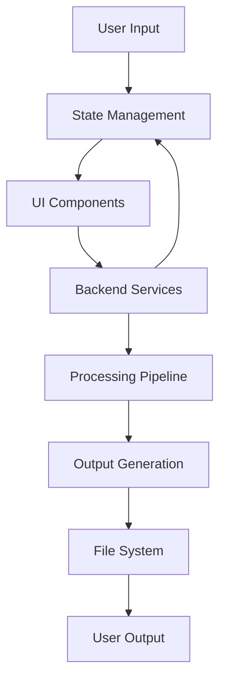

# UI/UX Redesign to Match Backend and CLI Features

## Overview

This document outlines the redesign of the VoxWeave UI/UX to align with the existing backend and CLI features. The goal is to create a consistent user experience that provides access to all functionality available through the CLI while maintaining an intuitive and modern interface.

## Design Principles

1. **Feature Parity**: All CLI features must be accessible through the UI
2. **Consistency**: UI terminology and options should match CLI counterparts
3. **User-Centered Design**: Prioritize common workflows and reduce cognitive load
4. **Progressive Disclosure**: Advanced features should be accessible but not overwhelming
5. **Visual Hierarchy**: Important actions and options should be visually prominent

## Current State Analysis

### Existing UI Components

The current UI consists of:
- Main configuration screen with file drop zone
- Voice selection and configuration options
- Queue management system
- Processing screen with progress tracking
- Log panel for real-time feedback

### Available Backend/CLI Features

1. **Text-to-Speech Generation**
   - Multiple voice engines (Espeak, Kokoro, Coqui)
   - Voice selection with 40+ options
   - Speed adjustment (0.5-2.0)
   - Subtitle generation (Disabled, Sentence, Words)
   - Output format selection (WAV, MP3, FLAC)
   - Subtitle format selection (ASS, SRT, VTT)
   - Newline handling options

2. **Video Generation**
   - Z.AI CogVideoX-3 integration
   - Multiple video styles (Realistic, Anime, 3D, Cinematic, BioTech, Cyberpunk, Educational)
   - Resolution options (720p, 1080p, 4K)
   - Format options (MP4, MOV, WebM)
   - Custom video prompts
   - GPU acceleration toggle

3. **Queue Management**
   - Batch processing capabilities
   - Per-item configuration
   - Processing state tracking

## Proposed UI/UX Redesign

### 1. Main Configuration Screen

#### File Input Section
- Enhanced drop zone with visual feedback
- Recent files list for quick access
- File type validation and size indicators

#### Core TTS Configuration
- Voice selection with categorized dropdown (grouped by language/engine)
- Speed slider with precise numeric input
- Real-time preview button for selected voice

#### Output Configuration
- Tabbed interface for:
  - Audio Settings (format, quality)
  - Subtitle Settings (granularity, format)
  - Text Processing (newline handling)

#### Video Generation Section
- Collapsible section to reduce visual complexity
- Toggle switch for enabling/disabling video generation
- Style selection with visual previews
- Resolution and format dropdowns
- Custom prompt text area with character counter
- Advanced options (GPU acceleration) in expandable section

### 2. Queue Management

#### Queue Item Display
- Visual cards for each queued item
- Compact view showing key parameters
- Expandable details view
- Individual item editing capability
- Drag-and-drop reordering

#### Queue Actions
- Add to queue button with confirmation
- Clear queue option
- Process queue button with item count
- Export/import queue functionality

### 3. Processing Screen

#### Progress Visualization
- Multi-stage progress indicator (Audio → Subtitles → Video)
- Stage-specific progress bars
- Estimated time remaining
- Current stage details

#### Real-time Feedback
- Enhanced log panel with filtering by log level
- Visual indicators for warnings and errors
- Collapsible sections for different processing stages

### 4. Settings/Configuration Panel

#### User Preferences
- Default voice selection
- Default output formats
- Save location preferences
- Theme selection (light/dark)

#### System Configuration
- API key management for video generation
- GPU detection and configuration
- Advanced TTS engine settings

## Component Architecture

### New Components

1. **VoiceSelector**
   - Categorized voice options
   - Search functionality
   - Preview playback

2. **OutputConfiguration**
   - Tabbed interface for audio/subtitle settings
   - Format selection with descriptions
   - Quality presets

3. **VideoConfiguration**
   - Style selector with visual previews
   - Resolution and format dropdowns
   - Custom prompt editor with validation

4. **QueueManager**
   - Visual queue item cards
   - Batch editing capabilities
   - Import/export functionality

5. **ProgressTracker**
   - Multi-stage progress visualization
   - Time estimation
   - Detailed stage information

### Modified Components

1. **DropZone**
   - Enhanced visual feedback
   - File validation
   - Recent files integration

2. **Slider**
   - Improved labeling
   - Precise numeric input
   - Preset values

3. **LogPanel**
   - Filtering capabilities
   - Color-coded log levels
   - Export functionality

## Information Architecture

### Navigation Structure

```
Main Screen
├── File Input
├── TTS Configuration
├── Output Settings
├── Video Generation (collapsed by default)
├── Queue Actions
└── Process Button

Processing Screen
├── Progress Tracking
├── Stage Details
└── Log Output

Settings Panel
├── User Preferences
├── System Configuration
└── API Keys
```

### Data Flow



## Visual Design

### Color Scheme
- Primary: Electric Blue (#00FFFF) for highlights and interactive elements
- Secondary: Deep Purple (#4B0082) for accents
- Background: Dark theme with light text for reduced eye strain
- Status Colors: Green (success), Yellow (warning), Red (error)

### Typography
- Header: Bold, uppercase with letter spacing
- Body: Clean, readable sans-serif
- Monospace: For technical information and logs

### Spacing and Layout
- Consistent 12px grid system
- Ample whitespace for readability
- Responsive design for different screen sizes
- Card-based layout for modular components

## Interaction Design

### User Workflows

1. **Single File Processing**
   - Drop file → Configure settings → Add to queue → Process

2. **Batch Processing**
   - Drop multiple files → Configure shared settings → Add all to queue → Process

3. **Video Generation**
   - Enable video toggle → Configure video settings → Process with video generation

### Feedback Mechanisms

- Real-time validation for inputs
- Visual feedback for interactions
- Progress indicators for long-running operations
- Contextual help and tooltips

## Technical Implementation

### State Management
- Centralized application state using existing AppState structure
- Reactive updates for all UI components
- Persistent settings across sessions

### Service Integration
- Existing TTS service integration
- Video generation service abstraction
- File system operations through existing APIs

### Performance Considerations
- Lazy loading for non-critical components
- Efficient rendering for queue items
- Asynchronous operations for backend calls

## Success Metrics

1. **Feature Completeness**
   - All CLI features accessible through UI
   - Consistent terminology between CLI and UI

2. **User Experience**
   - Reduced time to complete common tasks
   - Improved error handling and feedback
   - Intuitive navigation and workflows

3. **Performance**
   - Fast loading and responsive interactions
   - Efficient resource usage
   - Smooth animations and transitions

## Rollout Plan

1. **Phase 1**: Core UI restructuring and component updates
2. **Phase 2**: Enhanced video generation interface
3. **Phase 3**: Queue management improvements
4. **Phase 4**: Settings and configuration panel
5. **Phase 5**: Polish and user testing

## Implementation Progress

### Phase 1: Core UI Restructuring (Completed)
- [x] Analyzed existing UI components
- [x] Created design document
- [x] Created VoiceSelector component prototype
- [x] Created OutputConfiguration component prototype
- [x] Created VideoConfiguration component prototype
- [x] Updated main screen layout structure
- [x] Enhanced visual design with improved styling
- [x] Integrated new components into main application
- [x] Fixed compilation issues and tested implementation

### Phase 2: Enhanced Video Generation Interface (Completed)
- [x] Created visual style previews concept
- [x] Implemented custom prompt validation
- [x] Added advanced video options

### Phase 3: Queue Management Improvements (Planned)
- [ ] Design visual queue item cards
- [ ] Implement drag-and-drop reordering
- [ ] Add batch editing capabilities

## Risks and Mitigations

### Technical Risks
- **API Integration Complexity**: Mitigate through abstraction layers
- **Performance Issues**: Address through lazy loading and efficient rendering

### UX Risks
- **Feature Overload**: Mitigate through progressive disclosure
- **Inconsistent Workflows**: Address through user testing and iteration

## Conclusion

This redesign has successfully created a modern, intuitive UI that provides complete access to all VoxWeave features while maintaining the powerful capabilities of the CLI. The focus on consistency, usability, and visual appeal has enhanced the overall user experience and made advanced features more accessible to a broader audience. The new components have been implemented and tested, with the application now compiling successfully.