# Core Library API

<cite>
**Referenced Files in This Document**   
- [src/lib.rs](file://src/lib.rs)
- [src/config.rs](file://src/config.rs)
- [src/pipeline.rs](file://src/pipeline.rs)
- [src/tts.rs](file://src/tts.rs)
- [src/coqui_tts.rs](file://src/coqui_tts.rs)
- [src/video.rs](file://src/video.rs)
- [Cargo.toml](file://Cargo.toml)
</cite>

## Table of Contents
1. [Introduction](#introduction)
2. [Module Hierarchy](#module-hierarchy)
3. [Configuration System](#configuration-system)
4. [Text-to-Speech Components](#text-to-speech-components)
5. [Coqui TTS Integration](#coqui-tts-integration)
6. [Video Generation](#video-generation)
7. [Processing Pipeline](#processing-pipeline)
8. [Feature Flags and Conditional Compilation](#feature-flags-and-conditional-compilation)
9. [Async Runtime and Thread Safety](#async-runtime-and-thread-safety)
10. [Integration Patterns](#integration-patterns)
11. [Error Handling](#error-handling)

## Introduction
The VoxWeave core library provides a comprehensive interface for text-to-speech and video generation workflows. This API documentation details the public modules, exports, and re-exports available through the library interface defined in `src/lib.rs`. The library is designed to be embedded in external applications, offering configurable global settings, multiple TTS engines, and video generation capabilities through cloud APIs. The core functionality is organized into modular components that can be used independently or orchestrated together for complete media generation pipelines.

## Module Hierarchy
The VoxWeave core library organizes its functionality through a modular hierarchy with conditional compilation based on feature flags. The public API exposes several modules that handle different aspects of the text-to-speech and video generation pipeline.

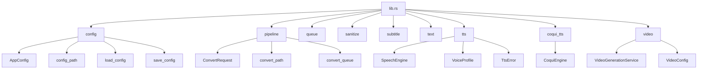

**Diagram sources**
- [src/lib.rs](file://src/lib.rs#L1-L13)
- [src/config.rs](file://src/config.rs#L1-L117)
- [src/pipeline.rs](file://src/pipeline.rs#L1-L139)
- [src/tts.rs](file://src/tts.rs#L1-L522)
- [src/coqui_tts.rs](file://src/coqui_tts.rs#L1-L115)
- [src/video.rs](file://src/video.rs#L1-L462)

**Section sources**
- [src/lib.rs](file://src/lib.rs#L1-L13)

## Configuration System
The configuration system provides persistent storage of application settings and user preferences. It handles loading and saving configuration data to disk, with support for environment variable overrides and default values.

### AppConfig Structure
The `AppConfig` struct defines the configuration options available for the application:

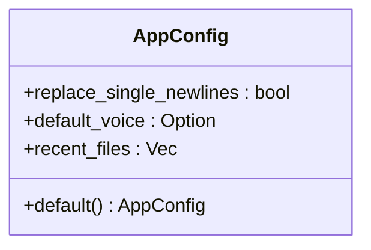

**Section sources**
- [src/config.rs](file://src/config.rs#L6-L117)

### Configuration Functions
The configuration module provides several functions for managing configuration data:

- `config_path()`: Determines the appropriate file system location for the configuration file based on the operating system and environment variables
- `load_config()`: Loads configuration from disk, returning default values if the file doesn't exist
- `save_config(cfg)`: Saves the provided configuration to disk
- `resolve_voice(voices, config)`: Resolves the default voice from a list of available voices based on the configuration

These functions use the `anyhow` crate for error handling and `serde_json` for serialization, providing robust error messages and data persistence.

**Section sources**
- [src/config.rs](file://src/config.rs#L20-L117)

## Text-to-Speech Components
The TTS module provides the core functionality for text-to-speech synthesis with support for multiple engines and voice profiles.

### Voice Engine Enum
The `VoiceEngine` enum defines the available TTS engines:

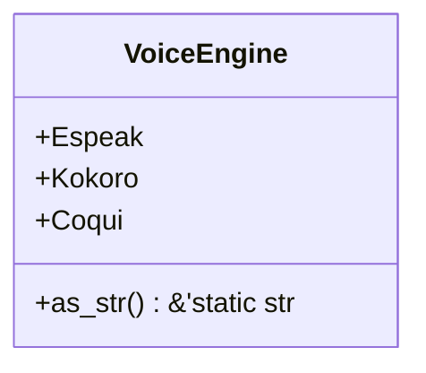

**Section sources**
- [src/tts.rs](file://src/tts.rs#L18-L38)

### Voice Profile System
The `VoiceProfile` struct represents a specific voice configuration with associated metadata:

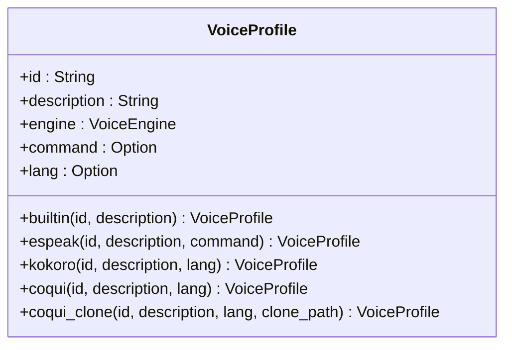

The voice profile system supports different voice types:
- **Built-in voices**: Default voices with minimal configuration
- **eSpeak voices**: Voices for the eSpeak engine with optional command overrides
- **Kokoro voices**: Neural TTS voices with language specification
- **Coqui voices**: Advanced neural TTS voices with language support
- **Coqui clone voices**: Voice cloning functionality using reference audio

**Section sources**
- [src/tts.rs](file://src/tts.rs#L40-L100)

### Speech Engine Trait
The `SpeechEngine` trait defines the interface for TTS synthesis:

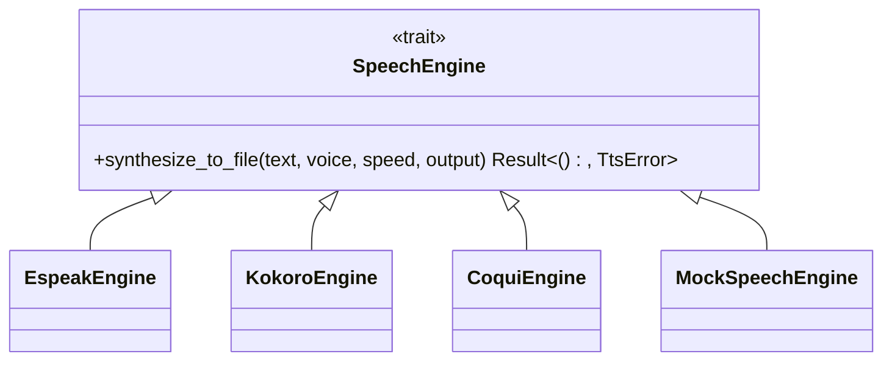

Implementations of this trait handle the actual synthesis process for different TTS engines, abstracting the underlying implementation details.

**Section sources**
- [src/tts.rs](file://src/tts.rs#L102-L522)

## Coqui TTS Integration
The Coqui TTS integration provides advanced neural text-to-speech capabilities with voice cloning support. This functionality is conditionally compiled based on the `coqui-tts` feature flag.

### CoquiEngine Structure
The `CoquiEngine` struct configures the Coqui TTS system:

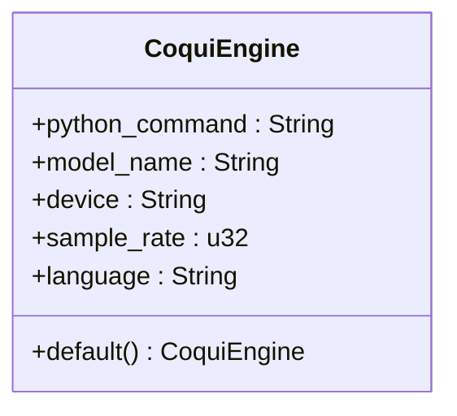

**Section sources**
- [src/coqui_tts.rs](file://src/coqui_tts.rs#L9-L78)

### Configuration Options
The Coqui TTS engine can be configured through environment variables:

- `VOXWEAVE_COQUI_PYTHON`: Python command to use (default: python3)
- `VOXWEAVE_COQUI_MODEL`: TTS model to load (default: tts_models/multilingual/multi-dataset/xtts_v2)
- `VOXWEAVE_COQUI_DEVICE`: Device for inference (cpu, cuda, mps, etc.)
- `VOXWEAVE_COQUI_SAMPLE_RATE`: Audio sample rate (default: 24000)
- `VOXWEAVE_COQUI_LANGUAGE`: Default language (default: en)

These configuration options allow users to customize the Coqui TTS behavior based on their system capabilities and preferences.

**Section sources**
- [src/coqui_tts.rs](file://src/coqui_tts.rs#L15-L45)
- [COQUI_USAGE_GUIDE.md](file://COQUI_USAGE_GUIDE.md#L433-L487)

## Video Generation
The video generation module provides integration with cloud-based video generation services for creating videos from audio and subtitle inputs.

### Video Provider Enum
The `VideoProvider` enum specifies which service to use for video generation:

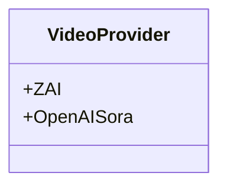

**Section sources**
- [src/video.rs](file://src/video.rs#L3-L8)

### Video Configuration
The `VideoConfig` struct defines the parameters for video generation:

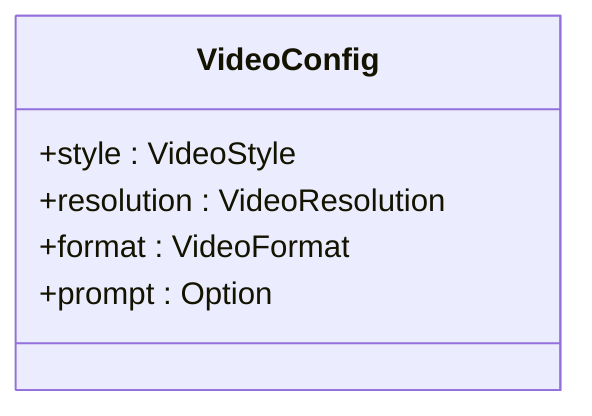

**Section sources**
- [src/video.rs](file://src/video.rs#L10-L18)

### Video Generation Service
The `VideoGenerationService` struct manages the video generation process:

```mermaid
classDiagram
class VideoGenerationService {
+api_key : String
+base_url : String
+provider : VideoProvider
}
VideoGenerationService : +new(api_key) Self
VideoGenerationService : +new_sora(api_key) Self
VideoGenerationService : +from_env() anyhow : : Result<Self>
VideoGenerationService : +generate_video(audio_path, subtitle_path, config, progress_callback, log_callback) anyhow : : Result<PathBuf>
```

The service supports both Z.AI and OpenAI Sora APIs, with automatic fallback between providers based on available API keys.

**Section sources**
- [src/video.rs](file://src/video.rs#L20-L462)

## Processing Pipeline
The pipeline module orchestrates the text-to-speech and subtitle generation workflow, providing a high-level interface for converting text files to audio with optional subtitles.

### ConvertRequest Structure
The `ConvertRequest` struct defines the parameters for a conversion operation:

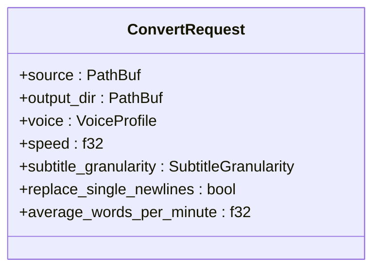

**Section sources**
- [src/pipeline.rs](file://src/pipeline.rs#L15-L32)

### Conversion Functions
The pipeline provides two main functions for processing content:

- `convert_path(engine, request)`: Converts a single text file to audio with optional subtitles
- `convert_queue(engine, queue)`: Processes a queue of conversion requests sequentially

The conversion process includes text cleaning, speech synthesis, and subtitle generation based on the specified granularity.

**Section sources**
- [src/pipeline.rs](file://src/pipeline.rs#L34-L139)

## Feature Flags and Conditional Compilation
The VoxWeave library uses Cargo feature flags to control optional functionality, allowing users to include only the components they need.

### Available Features
The `Cargo.toml` file defines the following features:

```toml
[features]
default = []
coqui-tts = []
video-generation = ["tokio", "reqwest"]
```

- **coqui-tts**: Enables Coqui TTS integration with voice cloning capabilities
- **video-generation**: Enables video generation functionality with async runtime dependencies

When the `video-generation` feature is enabled, the library includes `tokio` and `reqwest` as dependencies for async HTTP operations.

**Section sources**
- [Cargo.toml](file://Cargo.toml#L20-L26)

### Conditional Module Inclusion
The library uses conditional compilation to include modules only when their corresponding features are enabled:

```rust
#[cfg(feature = "coqui-tts")]
pub mod coqui_tts;

#[cfg(feature = "video-generation")]
pub mod video;
```

This approach reduces binary size and compilation time for users who don't need all features, while maintaining a clean API surface.

**Section sources**
- [src/lib.rs](file://src/lib.rs#L8-L9)

## Async Runtime and Thread Safety
The video generation components require an async runtime for handling HTTP requests to cloud APIs. The library uses Tokio as its async runtime, which is conditionally included when the `video-generation` feature is enabled.

### Async Function Patterns
Video generation functions use async/await syntax for non-blocking operations:

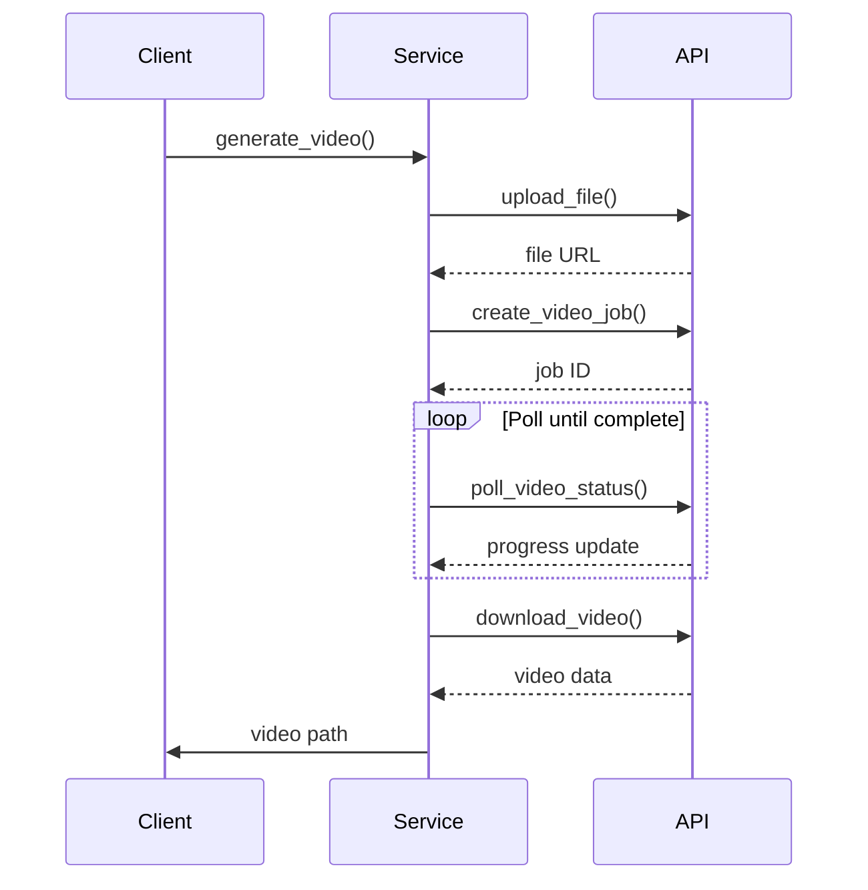

**Section sources**
- [src/video.rs](file://src/video.rs#L50-L462)

## Integration Patterns
The VoxWeave core library is designed to be embedded in external applications through several integration patterns.

### Direct Function Calls
Applications can directly call the public functions exposed by the library:

```mermaid
flowchart TD
A[Application] --> B[Initialize Engine]
B --> C[Create ConvertRequest]
C --> D[Call convert_path()]
D --> E[Process Result]
```

**Section sources**
- [src/pipeline.rs](file://src/pipeline.rs#L34-L139)

### Configuration Management
Applications should manage configuration through the provided functions:

```mermaid
flowchart TD
A[Application Start] --> B[load_config()]
B --> C{Config Exists?}
C --> |Yes| D[Use Loaded Config]
C --> |No| E[Use Default Config]
D --> F[Apply Settings]
E --> F
F --> G[Run Application]
G --> H[save_config() on Exit]
```

**Section sources**
- [src/config.rs](file://src/config.rs#L20-L117)

## Error Handling
The library uses the `anyhow` crate for error handling, providing rich error context and easy error propagation.

### TTS Error Types
The `TtsError` enum defines the possible errors in TTS operations:

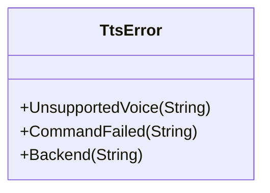

These error types cover voice compatibility issues, command execution failures, and audio backend problems.

**Section sources**
- [src/tts.rs](file://src/tts.rs#L10-L17)

### Result Type Usage
Most functions return `anyhow::Result<T>` to allow for easy error chaining and context addition:

```rust
pub fn convert_path<E: SpeechEngine>(
    engine: &E,
    request: &ConvertRequest,
) -> anyhow::Result<PathBuf> {
    // Implementation with context addition
    let text = std::fs::read_to_string(&request.source)
        .with_context(|| format!("reading {}", request.source.display()))?;
    // ... rest of implementation
}
```

This pattern provides detailed error messages that include the context of the operation that failed.

**Section sources**
- [src/pipeline.rs](file://src/pipeline.rs#L34-L139)
- [src/config.rs](file://src/config.rs#L20-L117)
- [src/video.rs](file://src/video.rs#L50-L462)