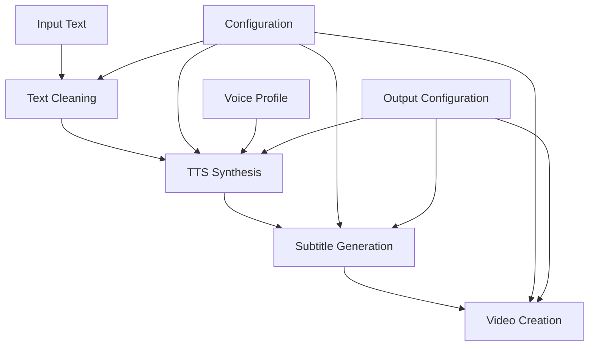
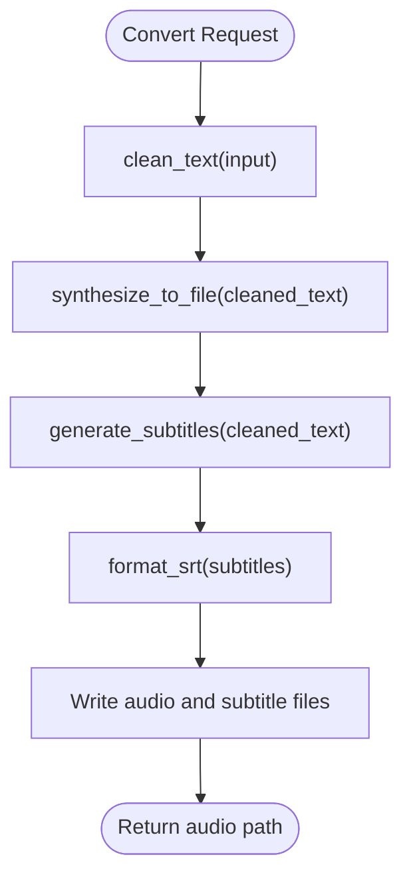
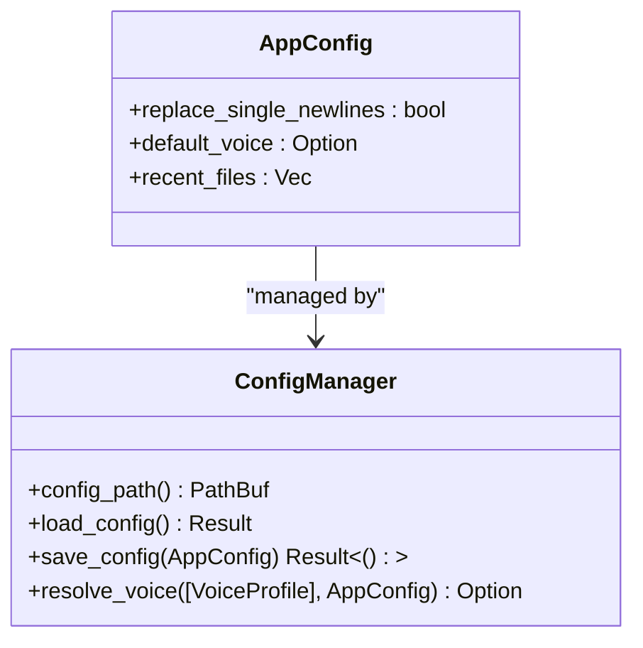
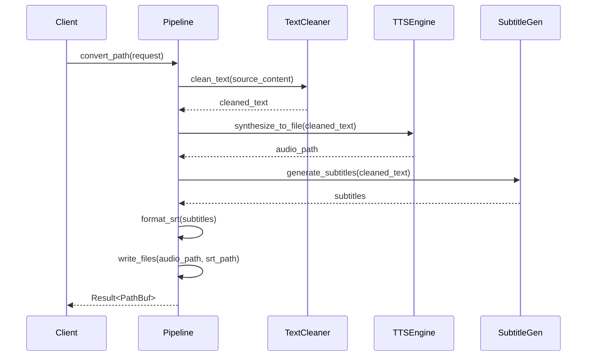

# Processing Pipeline API

<cite>
**Referenced Files in This Document**   
- [pipeline.rs](file://src/pipeline.rs)
- [config.rs](file://src/config.rs)
- [text.rs](file://src/text.rs)
- [subtitle.rs](file://src/subtitle.rs)
- [tts.rs](file://src/tts.rs)
- [video.rs](file://src/video.rs)
</cite>

## Table of Contents
1. [Introduction](#introduction)
2. [Pipeline Architecture](#pipeline-architecture)
3. [Core Processing Functions](#core-processing-functions)
4. [Configuration Management](#configuration-management)
5. [Data Flow and Error Handling](#data-flow-and-error-handling)
6. [Async Execution and Tokio Integration](#async-execution-and-tokio-integration)
7. [Use Case Examples](#use-case-examples)
8. [Conclusion](#conclusion)

## Introduction
The VoxWeave processing pipeline orchestrates text-to-speech synthesis, subtitle generation, and video creation workflows. This document details the core orchestration functions in `src/pipeline.rs` that coordinate these stages, with configuration options from `src/config.rs` controlling pipeline behavior. The system supports multiple TTS engines, subtitle timing algorithms, and video generation backends, providing a flexible framework for automated content creation.

## Pipeline Architecture

**Diagram sources**
- [pipeline.rs](file://src/pipeline.rs#L1-L139)
- [text.rs](file://src/text.rs#L1-L70)
- [subtitle.rs](file://src/subtitle.rs#L1-L156)
- [tts.rs](file://src/tts.rs#L1-L522)
- [video.rs](file://src/video.rs#L1-L462)

**Section sources**
- [pipeline.rs](file://src/pipeline.rs#L1-L139)

## Core Processing Functions

The pipeline module provides two primary functions for processing text content: `convert_path` for single-file processing and `convert_queue` for batch operations. These functions coordinate the execution of text cleaning, TTS synthesis, and subtitle generation.

The `ConvertRequest` struct encapsulates all parameters needed for pipeline execution, including source path, output directory, voice profile, speech speed, subtitle granularity, newline replacement behavior, and average words per minute for timing calculations.

**Diagram sources**
- [pipeline.rs](file://src/pipeline.rs#L1-L139)
- [text.rs](file://src/text.rs#L1-L70)
- [subtitle.rs](file://src/subtitle.rs#L1-L156)

**Section sources**
- [pipeline.rs](file://src/pipeline.rs#L1-L139)

## Configuration Management

**Diagram sources**
- [config.rs](file://src/config.rs#L1-L117)

**Section sources**
- [config.rs](file://src/config.rs#L1-L117)

The `AppConfig` struct in `src/config.rs` manages application-level settings that affect pipeline behavior. Key configuration options include:

- **replace_single_newlines**: Controls whether single newlines are replaced with spaces during text cleaning
- **default_voice**: Specifies the default voice profile ID to use when none is explicitly provided
- **recent_files**: Maintains a history of recently processed files

Configuration is persisted in JSON format within the system's configuration directory, with paths determined by the `directories` crate. The `resolve_voice` function uses the configuration to select appropriate voice profiles from the available options.

## Data Flow and Error Handling

The pipeline follows a sequential data flow pattern where each stage processes the output of the previous stage:

1. **Text Cleaning**: Input text is normalized by collapsing whitespace and reducing multiple blank lines
2. **TTS Synthesis**: Cleaned text is converted to speech using the selected voice engine
3. **Subtitle Generation**: Subtitles are created with timing based on word count and average words per minute
4. **Output Generation**: Audio and subtitle files are written to the specified output directory

Error propagation follows Rust idioms using the `anyhow` crate for context-rich error reporting. Each operation includes appropriate context to aid debugging, such as file paths for I/O operations and descriptive messages for synthesis failures.

**Diagram sources**
- [pipeline.rs](file://src/pipeline.rs#L1-L139)
- [text.rs](file://src/text.rs#L1-L70)
- [subtitle.rs](file://src/subtitle.rs#L1-L156)
- [tts.rs](file://src/tts.rs#L1-L522)

**Section sources**
- [pipeline.rs](file://src/pipeline.rs#L1-L139)
- [text.rs](file://src/text.rs#L1-L70)
- [subtitle.rs](file://src/subtitle.rs#L1-L156)

## Async Execution and Tokio Integration

The pipeline supports asynchronous execution through Tokio, with the `video-generation` feature enabling non-blocking video creation. The runtime configuration includes:

- Multi-threaded runtime for concurrent operations
- File system access via async I/O
- Process spawning for external command execution
- Timer utilities for polling operations

Video generation operations leverage async/await patterns for efficient resource utilization during long-running tasks such as uploading assets, polling job status, and downloading results. Progress callbacks allow real-time updates without blocking the main execution thread.

**Section sources**
- [Cargo.toml](file://Cargo.toml#L1-L27)
- [video.rs](file://src/video.rs#L1-L462)

## Use Case Examples

### Batch Processing Workflow
For processing multiple text files, the `convert_queue` function iterates through queue items, applying consistent configuration while maintaining individual file settings. This enables efficient batch conversion of content libraries.

### Voice Cloning Integration
The pipeline supports voice cloning through the Coqui TTS engine, where custom voice profiles can be created with reference audio files. The `VoiceProfile::coqui_clone` constructor accepts a clone path that is used during synthesis.

### Automated Video Generation
When combined with the video generation module, the pipeline can create complete video content from text input. The workflow includes:
1. Text-to-speech synthesis with selected voice
2. Subtitle generation with accurate timing
3. Video creation using Z.AI or OpenAI Sora APIs
4. Optional subtitle embedding into the final video

**Section sources**
- [pipeline.rs](file://src/pipeline.rs#L1-L139)
- [tts.rs](file://src/tts.rs#L1-L522)
- [video.rs](file://src/video.rs#L1-L462)

## Conclusion
The VoxWeave processing pipeline provides a comprehensive framework for transforming text content into multimodal outputs. By coordinating text cleaning, TTS synthesis, subtitle generation, and video creation, it enables automated content production with configurable behavior through the `AppConfig` system. The modular design allows for flexible integration of different TTS engines and video generation backends, while robust error handling ensures reliable operation. The async-enabled architecture supports efficient processing of both individual files and batch operations.