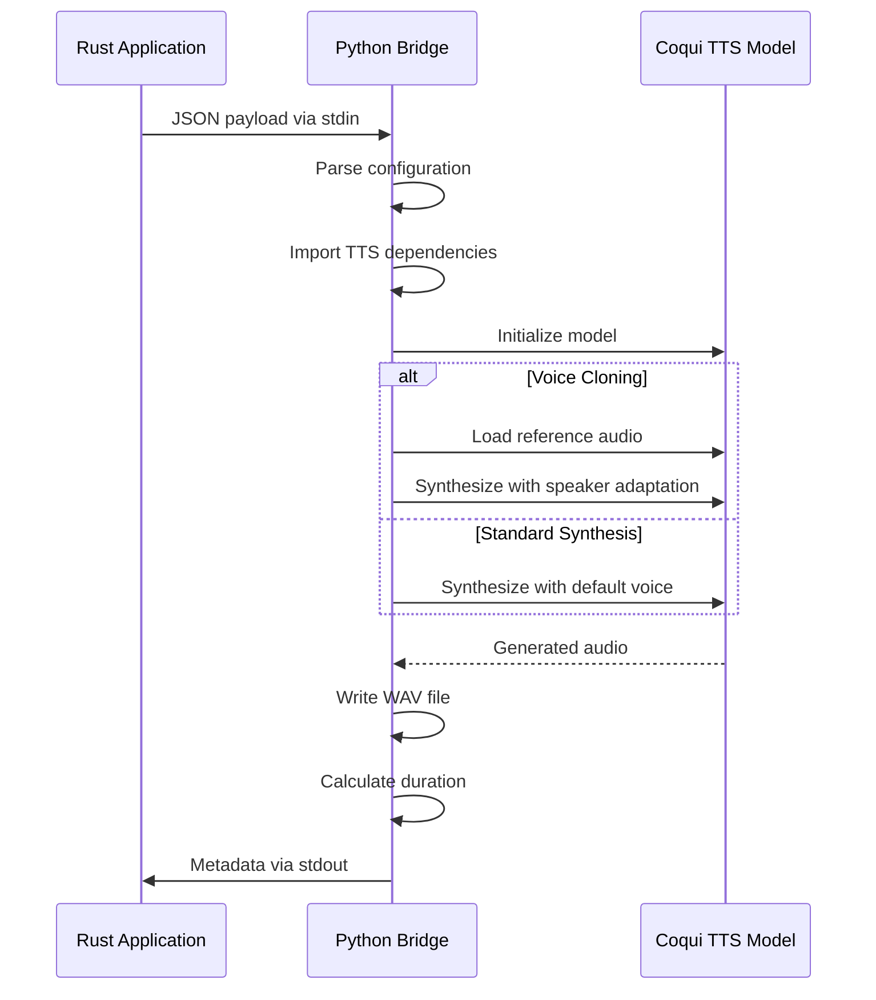

# CoquiTTS Engine API

<cite>
**Referenced Files in This Document**   
- [coqui_tts.rs](file://src/coqui_tts.rs)
- [tts.rs](file://src/tts.rs)
- [python/kokoro_bridge.py](file://python/kokoro_bridge.py)
</cite>

## Table of Contents
1. [Introduction](#introduction)
2. [CoquiEngine Configuration](#coquiengine-configuration)
3. [Default Implementation](#default-implementation)
4. [SpeechEngine Implementation](#speechengine-implementation)
5. [Voice Cloning Workflow](#voice-cloning-workflow)
6. [JSON Payload Structure](#json-payload-structure)
7. [Error Handling](#error-handling)
8. [Usage Examples](#usage-examples)
9. [Performance Optimization](#performance-optimization)
10. [Python Bridge Script](#python-bridge-script)

## Introduction
The CoquiTTS Engine provides text-to-speech synthesis capabilities with advanced voice cloning functionality. This API documentation details the CoquiEngine implementation, configuration options, voice cloning workflow, and integration patterns. The engine communicates with Python's Coqui TTS library through a JSON-based bridge protocol, enabling high-quality multilingual speech synthesis with speaker adaptation capabilities.

**Section sources**
- [coqui_tts.rs](file://src/coqui_tts.rs#L1-L115)
- [tts.rs](file://src/tts.rs#L1-L522)

## CoquiEngine Configuration
The CoquiEngine struct manages TTS synthesis parameters and Python integration settings. It contains the following configuration fields:

- **python_command**: Path to Python interpreter (default: "python3")
- **model_name**: Coqui model identifier (default: "tts_models/multilingual/multi-dataset/xtts_v2")
- **device**: Execution device ("cpu", "cuda", "mps", etc.) 
- **sample_rate**: Audio output sample rate in Hz (default: 24,000)
- **language**: Default language code for synthesis (default: "en")

These fields control the TTS synthesis process and Python bridge execution environment.

**Section sources**
- [coqui_tts.rs](file://src/coqui_tts.rs#L5-L15)

## Default Implementation
The Default implementation for CoquiEngine reads configuration from environment variables, providing flexible runtime configuration:

- **VOXWEAVE_COQUI_PYTHON**: Python interpreter path
- **VOXWEAVE_COQUI_MODEL**: Coqui model identifier
- **VOXWEAVE_COQUI_DEVICE**: Execution device (cpu/cuda/mps)
- **VOXWEAVE_COQUI_SAMPLE_RATE**: Audio output rate
- **VOXWEAVE_COQUI_LANGUAGE**: Default language code

The implementation includes validation and fallbacks, such as ensuring sample rate is positive and defaulting to 24,000 Hz when invalid.

**Section sources**
- [coqui_tts.rs](file://src/coqui_tts.rs#L17-L40)

## SpeechEngine Implementation
The SpeechEngine trait implementation handles TTS synthesis through Python bridge communication. The process involves:

1. Validating the voice profile uses Coqui engine
2. Determining the synthesis language (voice-specific or default)
3. Checking for voice cloning requirements
4. Constructing JSON payload with synthesis parameters
5. Executing Python bridge script with stdin/stdout communication
6. Processing execution results and errors

The implementation ensures proper error propagation and resource management during synthesis.

**Section sources**
- [coqui_tts.rs](file://src/coqui_tts.rs#L42-L115)

## Voice Cloning Workflow
Voice cloning functionality uses the VoiceProfile's command field to store the path to a reference audio file. When synthesizing speech:

1. The system checks if the command field contains a valid audio file path
2. If present and accessible, the speaker_wav parameter is included in the JSON payload
3. The Python bridge uses this reference audio for speaker adaptation
4. The XTTS v2 model generates speech with the cloned voice characteristics

This approach enables personalized voice synthesis using just a few seconds of reference audio.

**Section sources**
- [coqui_tts.rs](file://src/coqui_tts.rs#L60-L63)
- [tts.rs](file://src/tts.rs#L85-L92)

## JSON Payload Structure
The JSON payload passed to the Python bridge script contains the following structure:

```json
{
  "text": "string",
  "output": "string",
  "sample_rate": "number",
  "model_name": "string",
  "device": "string",
  "language": "string",
  "speed": "number",
  "speaker_wav": "string|null"
}
```

The speaker_wav parameter is only included when voice cloning is enabled, containing the path to the reference audio file.

**Section sources**
- [coqui_tts.rs](file://src/coqui_tts.rs#L65-L78)

## Error Handling
The CoquiTTS engine implements comprehensive error handling for various failure scenarios:

- **Missing Python dependencies**: Caught during bridge script execution with descriptive error messages
- **CUDA memory issues**: Handled by the Python bridge with appropriate error reporting
- **Audio file validation**: Checks for existence and accessibility of reference audio files
- **Process execution failures**: Captures and propagates command execution errors
- **Invalid configuration**: Validates parameters during engine initialization

Errors are propagated through the TtsError enum with descriptive messages for troubleshooting.

**Section sources**
- [coqui_tts.rs](file://src/coqui_tts.rs#L90-L105)
- [tts.rs](file://src/tts.rs#L453-L471)

## Usage Examples
### Standard TTS Synthesis
```rust
let engine = CoquiEngine::default();
let voice = VoiceProfile::coqui("coqui-en", "English", "en");
engine.synthesize_to_file("Hello world", &voice, 1.0, &output_path)?;
```

### Voice Cloning
```rust
let voice = VoiceProfile::coqui_clone(
    "my-clone", 
    "My Cloned Voice", 
    "en", 
    "/path/to/reference.wav"
);
engine.synthesize_to_file("Text with cloned voice", &voice, 1.0, &output_path)?;
```

**Section sources**
- [tts.rs](file://src/tts.rs#L85-L92)
- [coqui_tts.rs](file://src/coqui_tts.rs#L42-L115)

## Performance Optimization
### GPU Utilization
Configure the engine to use GPU acceleration by setting:
```bash
export VOXWEAVE_COQUI_DEVICE="cuda"  # NVIDIA GPUs
export VOXWEAVE_COQUI_DEVICE="mps"   # Apple Silicon
```

### Batch Processing
For multiple synthesis tasks:
- Reuse the CoquiEngine instance
- Process items sequentially to maintain GPU context
- Monitor memory usage to avoid CUDA out-of-memory errors
- Consider CPU fallback for long texts or memory-constrained environments

**Section sources**
- [coqui_tts.rs](file://src/coqui_tts.rs#L28-L30)
- [tts.rs](file://src/tts.rs#L453-L471)

## Python Bridge Script
The embedded COQUI_BRIDGE_SCRIPT in tts.rs handles the Python-side TTS processing:

- Receives JSON payload via stdin
- Initializes the Coqui TTS model with specified parameters
- Performs speech synthesis with optional voice cloning
- Writes audio to the specified output file
- Returns metadata (duration) via stdout
- Reports errors via stderr

The script manages dependency imports, model initialization, and error handling, providing a robust interface between Rust and Python.



**Diagram sources**
- [tts.rs](file://src/tts.rs#L453-L522)
- [coqui_tts.rs](file://src/coqui_tts.rs#L79-L98)

**Section sources**
- [tts.rs](file://src/tts.rs#L453-L522)
- [coqui_tts.rs](file://src/coqui_tts.rs#L79-L98)