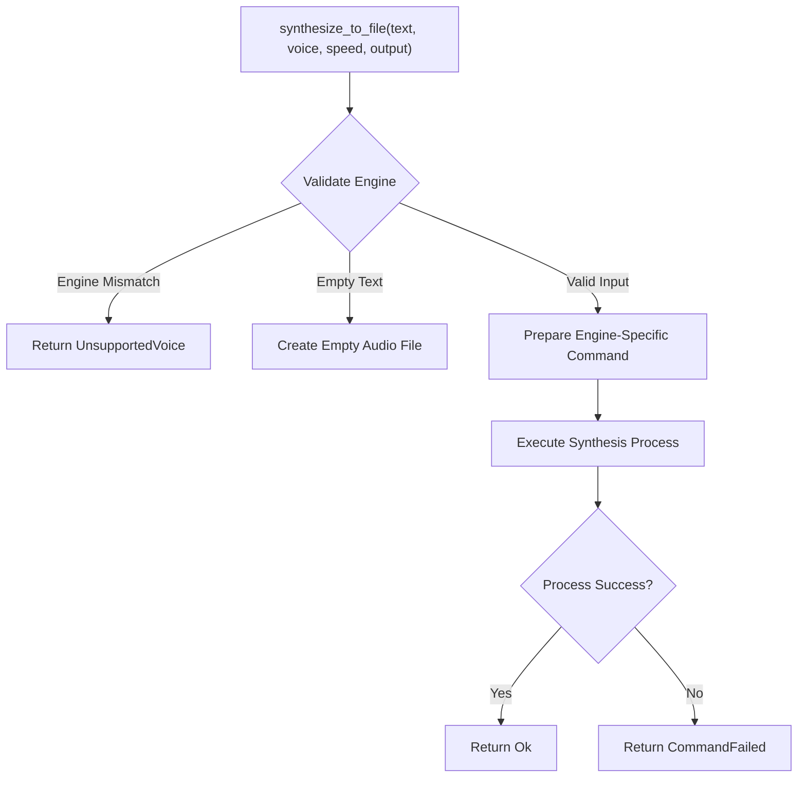
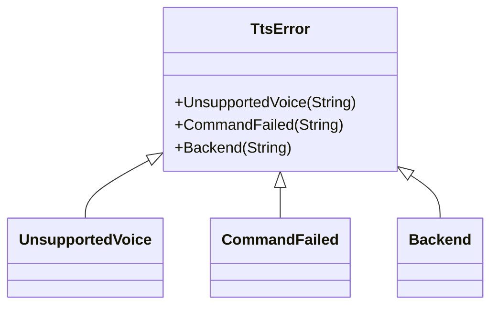
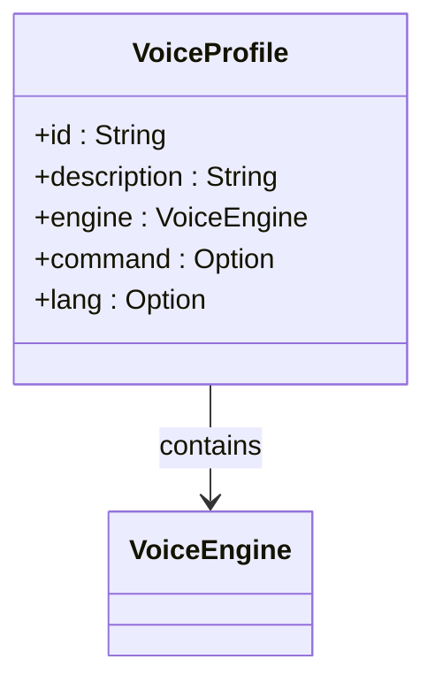
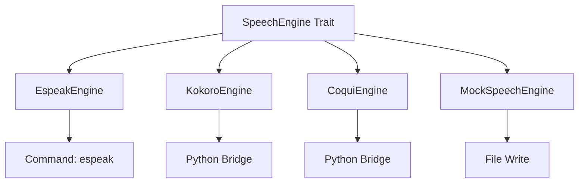
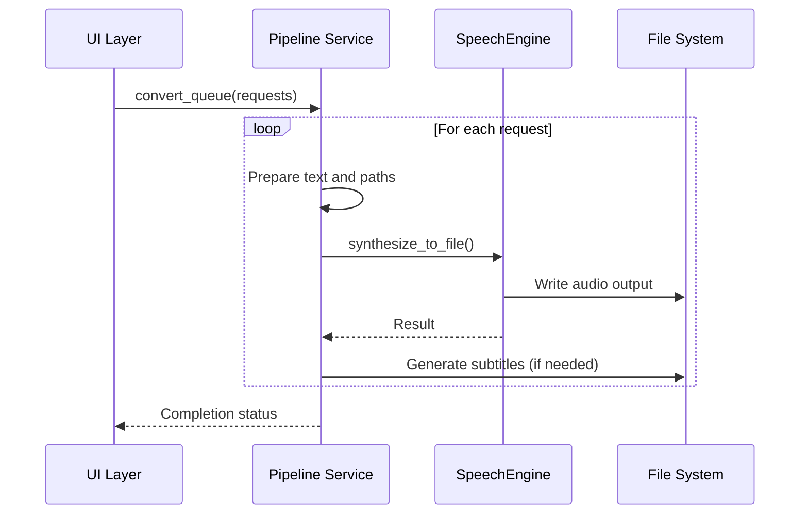
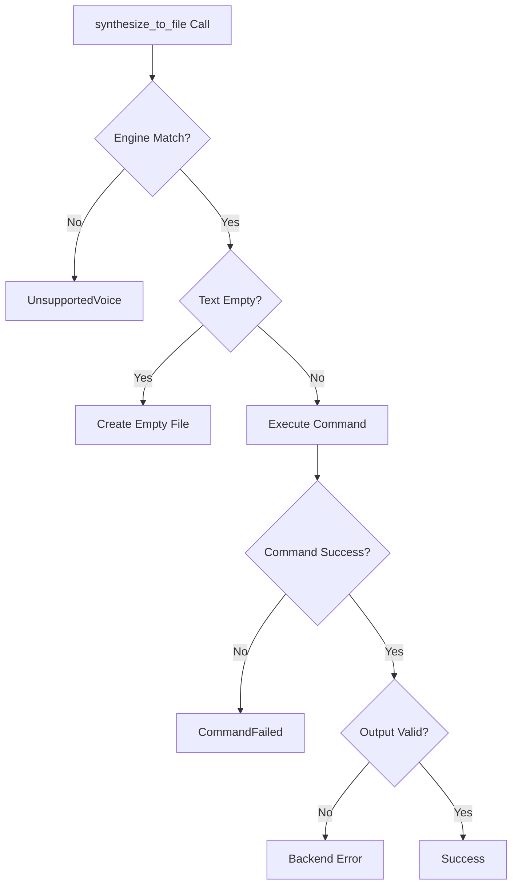

# Core TTS Interface

<cite>
**Referenced Files in This Document**   
- [tts.rs](file://src/tts.rs)
- [coqui_tts.rs](file://src/coqui_tts.rs)
- [pipeline.rs](file://src/pipeline.rs)
- [python/kokoro_bridge.py](file://python/kokoro_bridge.py)
</cite>

## Table of Contents
1. [Introduction](#introduction)
2. [SpeechEngine Trait](#speechengine-trait)
3. [TtsError Enum](#ttserror-enum)
4. [VoiceEngine Enum](#voiceengine-enum)
5. [VoiceProfile Struct](#voiceprofile-struct)
6. [Implementation Engines](#implementation-engines)
7. [Pipeline Integration](#pipeline-integration)
8. [Error Handling Patterns](#error-handling-patterns)
9. [Performance Considerations](#performance-considerations)
10. [Code Examples](#code-examples)

## Introduction
The Core TTS Interface provides a unified text-to-speech synthesis system with support for multiple backend engines. This documentation details the core components and their interactions, focusing on the SpeechEngine trait, voice management, and error handling mechanisms. The interface supports three distinct TTS engines (Espeak, Kokoro, and Coqui) through a common API, enabling flexible voice synthesis with various quality and feature characteristics.

## SpeechEngine Trait
The SpeechEngine trait defines the core interface for text-to-speech synthesis, providing a consistent API across different backend implementations. The primary method `synthesize_to_file` handles the conversion of text input to audio output with configurable voice and speed parameters.



**Section sources**
- [tts.rs](file://src/tts.rs#L80-L88)

### Method Parameters
- **text**: Input text string to be synthesized into speech
- **voice**: VoiceProfile struct specifying the voice characteristics and engine
- **speed**: Audio playback speed multiplier (float value)
- **output**: Path object specifying the destination for the generated audio file

The method returns a Result type, with Ok(()) on successful synthesis or a TtsError variant on failure. Each engine implementation validates that the provided VoiceProfile matches its engine type before proceeding with synthesis.

## TtsError Enum
The TtsError enum defines the error conditions that can occur during TTS synthesis operations. It implements both Debug and Error traits, providing descriptive error messages for debugging and user feedback.



**Diagram sources**
- [tts.rs](file://src/tts.rs#L1-L20)

### Error Variants
- **UnsupportedVoice**: Triggered when a VoiceProfile's engine type doesn't match the executing engine. Contains the voice ID string for identification.
- **CommandFailed**: Indicates failure in executing external commands or processes. Contains the error message from the failed operation.
- **Backend**: Represents errors in the underlying audio system or file operations. Contains the specific backend error message.

These error types enable precise error handling and user feedback, allowing applications to distinguish between configuration issues, execution failures, and system-level problems.

## VoiceEngine Enum
The VoiceEngine enum specifies the available TTS backend engines and provides string representation for external command invocation.

```mermaid
classDiagram
class VoiceEngine {
+Espeak
+Kokoro
+Coqui
}
VoiceEngine --> "as_str()" : returns string
```

**Diagram sources**
- [tts.rs](file://src/tts.rs#L22-L38)

### Engine Variants
- **Espeak**: Lightweight, fast speech synthesis with basic voice quality
- **Kokoro**: Neural TTS with higher quality voices and language support
- **Coqui**: Advanced neural TTS with voice cloning capabilities

The `as_str()` method returns the lowercase string representation of each engine ("espeak", "kokoro", "coqui"), which is used for command-line invocation and configuration lookup.

**Section sources**
- [tts.rs](file://src/tts.rs#L22-L38)

## VoiceProfile Struct
The VoiceProfile struct encapsulates voice configuration parameters, serving as a portable voice specification that can be serialized and shared across system components.



**Diagram sources**
- [tts.rs](file://src/tts.rs#L40-L55)

### Fields
- **id**: Unique identifier for the voice profile
- **description**: Human-readable description of the voice
- **engine**: VoiceEngine enum specifying the backend engine
- **command**: Optional command parameter (used for espeak voices or Coqui voice cloning paths)
- **lang**: Optional language code for multilingual support

### Factory Methods
The struct provides several factory methods for creating specialized voice profiles:

- **builtin()**: Creates an Espeak voice profile with default settings
- **espeak()**: Creates a configurable Espeak voice profile
- **kokoro()**: Creates a Kokoro voice profile with language specification
- **coqui()**: Creates a standard Coqui voice profile
- **coqui_clone()**: Creates a Coqui voice profile with voice cloning capability, storing the reference audio path in the command field

**Section sources**
- [tts.rs](file://src/tts.rs#L57-L102)

## Implementation Engines
The TTS system implements the SpeechEngine trait through multiple backend-specific engines, each with its own characteristics and requirements.

### Engine Architecture


**Diagram sources**
- [tts.rs](file://src/tts.rs#L104-L289)
- [coqui_tts.rs](file://src/coqui_tts.rs#L43-L115)

### Engine Characteristics
- **EspeakEngine**: Uses the espeak command-line tool with configurable voice parameters and speed normalization
- **KokoroEngine**: Interfaces with Python-based Kokoro TTS through a bridge script with JSON payload
- **CoquiEngine**: Interfaces with Coqui TTS XTTS v2 model through Python bridge with voice cloning support
- **MockSpeechEngine**: Testing implementation that writes text directly to output file

Each engine validates the VoiceProfile's engine type before processing and handles its specific command execution and error conditions.

**Section sources**
- [tts.rs](file://src/tts.rs#L104-L289)
- [coqui_tts.rs](file://src/coqui_tts.rs#L43-L115)

## Pipeline Integration
The TTS interface integrates with the broader pipeline system through the convert_path and convert_queue functions, enabling batch processing of text-to-speech conversions.



**Diagram sources**
- [pipeline.rs](file://src/pipeline.rs#L30-L75)

The pipeline system handles text cleaning, directory creation, and subtitle generation in addition to the core TTS functionality. It uses the SpeechEngine trait generically, allowing any engine implementation to be used without modification to the pipeline logic.

**Section sources**
- [pipeline.rs](file://src/pipeline.rs#L1-L139)

## Error Handling Patterns
The TTS system employs a comprehensive error handling strategy that distinguishes between different failure modes and provides meaningful error information.

### Error Flow


The system uses Rust's Result type extensively, propagating errors through the call stack with appropriate context. External command failures are captured and returned as CommandFailed variants, while file system and serialization issues are reported as Backend errors.

**Section sources**
- [tts.rs](file://src/tts.rs#L1-L289)

## Performance Considerations
The TTS interface is designed with performance and resource management in mind, particularly for repeated synthesis operations and concurrent execution.

### Key Performance Factors
- **Engine Initialization**: Engines are configured through environment variables and cached configuration, minimizing setup overhead
- **External Process Overhead**: Kokoro and Coqui engines invoke Python processes, which have startup costs that should be considered in high-frequency scenarios
- **Thread Safety**: Engine implementations are designed to be Send and Sync, allowing safe use across threads
- **Memory Usage**: Audio data is streamed to disk rather than held in memory, reducing memory footprint

For applications requiring high-throughput synthesis, consider reusing engine instances and batching operations through the pipeline system to amortize process startup costs.

**Section sources**
- [tts.rs](file://src/tts.rs#L217-L289)
- [coqui_tts.rs](file://src/coqui_tts.rs#L43-L115)

## Code Examples
The following examples demonstrate common usage patterns for the TTS interface.

### Basic Synthesis
```rust
use voxweave::tts::{SpeechEngine, VoiceProfile};
use voxweave::coqui_tts::CoquiEngine;
use std::path::Path;

let engine = CoquiEngine::default();
let voice = VoiceProfile::coqui("coqui-en", "English Voice", "en");
let output_path = Path::new("output.wav");

engine.synthesize_to_file(
    "Hello from the TTS system",
    &voice,
    1.0,
    output_path
)?;
```

### Voice Cloning
```rust
let voice = VoiceProfile::coqui_clone(
    "my-clone",
    "My Cloned Voice",
    "en",
    "/path/to/reference/audio.wav"
);

engine.synthesize_to_file(
    "This uses voice cloning technology",
    &voice,
    1.0,
    &output_path
)?;
```

### Error Handling
```rust
match engine.synthesize_to_file(text, &voice, speed, &output) {
    Ok(()) => println!("Synthesis completed successfully"),
    Err(TtsError::UnsupportedVoice(id)) => {
        eprintln!("Voice not supported: {}", id)
    },
    Err(TtsError::CommandFailed(msg)) => {
        eprintln!("Command execution failed: {}", msg)
    },
    Err(TtsError::Backend(msg)) => {
        eprintln!("Backend error: {}", msg)
    }
}
```

**Section sources**
- [tts.rs](file://src/tts.rs#L1-L289)
- [coqui_tts.rs](file://src/coqui_tts.rs#L1-L115)
- [pipeline.rs](file://src/pipeline.rs#L1-L139)