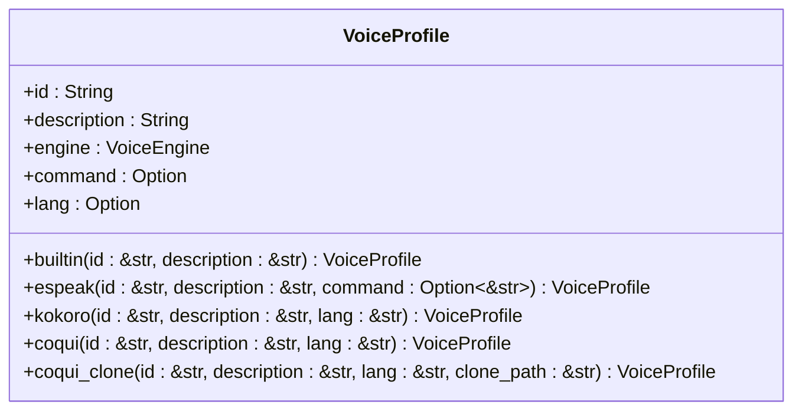
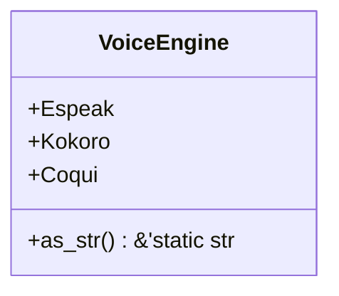
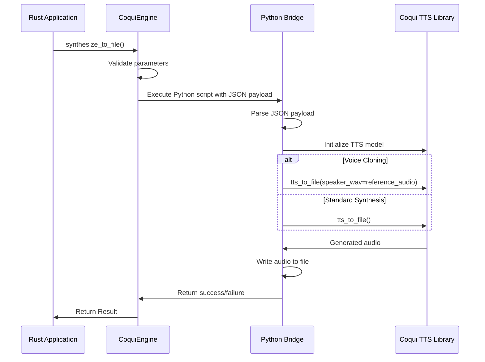

# Text-to-Speech Engine API

<cite>
**Referenced Files in This Document**   
- [tts.rs](file://src/tts.rs)
- [coqui_tts.rs](file://src/coqui_tts.rs)
- [kokoro_bridge.py](file://python/kokoro_bridge.py)
- [COQUI_USAGE_GUIDE.md](file://COQUI_USAGE_GUIDE.md)
- [Cargo.toml](file://Cargo.toml)
</cite>

## Table of Contents
1. [Introduction](#introduction)
2. [Core Components](#core-components)
3. [SpeechEngine Trait](#speechengine-trait)
4. [VoiceProfile Structure](#voiceprofile-structure)
5. [VoiceEngine Enum](#voiceengine-enum)
6. [CoquiTTS Integration](#coquitts-integration)
7. [Code Examples](#code-examples)
8. [Error Handling](#error-handling)
9. [Performance Optimization](#performance-optimization)
10. [Configuration](#configuration)

## Introduction
The Text-to-Speech (TTS) system in VoxWeave provides a flexible API for audio synthesis through multiple backend engines. The architecture supports three distinct voice synthesis technologies: Espeak for lightweight text-to-speech, Kokoro for neural voice synthesis, and CoquiTTS for advanced voice cloning and multilingual support. The system is designed with extensibility in mind, allowing new voice engines to be integrated through the SpeechEngine trait. This documentation details the core API components, configuration options, and usage patterns for implementing high-quality voice synthesis in applications.

**Section sources**
- [tts.rs](file://src/tts.rs#L0-L522)

## Core Components
The TTS system consists of several key components that work together to provide voice synthesis capabilities. The SpeechEngine trait defines the interface for all voice synthesis engines, while the VoiceProfile struct encapsulates voice characteristics and configuration. The VoiceEngine enum identifies the backend technology used for synthesis, and specific engine implementations like CoquiEngine provide the actual synthesis logic. The system uses a Python bridge mechanism for CoquiTTS integration, enabling access to advanced deep learning models while maintaining a Rust-native API surface. Configuration is managed through environment variables, allowing runtime customization of engine behavior without code changes.

**Section sources**
- [tts.rs](file://src/tts.rs#L0-L522)
- [coqui_tts.rs](file://src/coqui_tts.rs#L0-L115)

## SpeechEngine Trait
The SpeechEngine trait defines the contract for all text-to-speech implementations in the system. It specifies a single method, synthesize_to_file, which takes text input, a voice profile, speed parameter, and output path to generate audio files. The method returns a Result type that handles both successful synthesis and various error conditions. All engine implementations must conform to this interface, ensuring consistent usage patterns across different backend technologies. The trait enables polymorphic behavior, allowing applications to switch between voice engines without changing their core synthesis logic.

```mermaid
flowchart TD
A["synthesize_to_file(text: &str, voice: &VoiceProfile, speed: f32, output: &Path)"] --> B{Validate Engine}
B --> |Correct Engine| C[Process Text Input]
C --> D{Empty Text?}
D --> |Yes| E[Create Empty Audio File]
D --> |No| F[Execute Synthesis Command]
F --> G[Send Payload to Backend]
G --> H{Command Successful?}
H --> |Yes| I[Process Output Metadata]
H --> |No| J[Return CommandFailed Error]
I --> K[Return Success]
J --> L[Return Error]
E --> K
K --> M[Return Result<(), TtsError>]
```

**Diagram sources**
- [tts.rs](file://src/tts.rs#L104-L109)

## VoiceProfile Structure
The VoiceProfile struct represents a specific voice configuration with properties including a unique identifier, descriptive text, associated voice engine, optional command specification, and language code. Factory methods provide convenient construction of profiles for different engine types. The coqui and coqui_clone methods create profiles for standard Coqui voices and voice cloning scenarios respectively, with the clone path stored in the command field. Voice profiles serve as the primary mechanism for specifying voice characteristics in synthesis operations, allowing applications to manage and select from multiple voice options.



**Diagram sources**
- [tts.rs](file://src/tts.rs#L60-L102)

## VoiceEngine Enum
The VoiceEngine enum defines the available backend technologies for voice synthesis, with variants for Espeak, Kokoro, and Coqui engines. Each variant corresponds to a specific implementation with different capabilities and requirements. The enum provides an as_str method that returns a string representation for use in configuration and logging. This enumeration enables type-safe engine selection and facilitates conditional logic based on the active engine type. The design allows for future expansion with additional engine variants while maintaining backward compatibility.



**Diagram sources**
- [tts.rs](file://src/tts.rs#L45-L58)

## CoquiTTS Integration
The CoquiTTS integration enables advanced voice synthesis capabilities through a Python bridge mechanism. The CoquiEngine struct implements the SpeechEngine trait and manages communication with the Python-based TTS system via subprocess execution. The integration supports both standard voice synthesis and voice cloning using reference audio files. Configuration is handled through environment variables that specify the Python interpreter, model name, device target, sample rate, and default language. The system passes synthesis parameters as JSON payloads to the Python bridge script, which interfaces with the Coqui TTS library to generate audio output.



**Diagram sources**
- [coqui_tts.rs](file://src/coqui_tts.rs#L42-L82)
- [tts.rs](file://src/tts.rs#L453-L471)

## Code Examples
The following examples demonstrate common usage patterns for the TTS API. Creating voice profiles is accomplished through the factory methods on the VoiceProfile struct, with different methods for various engine types. The CoquiEngine is instantiated through its Default implementation, which reads configuration from environment variables. Synthesis operations follow a consistent pattern across engine types, with error handling to manage potential failures in the synthesis process.

```mermaid
flowchart TD
A[Create Voice Profile] --> B{Voice Type}
B --> |Standard Coqui| C[VoiceProfile::coqui()]
B --> |Voice Cloning| D[VoiceProfile::coqui_clone()]
C --> E[Create CoquiEngine]
D --> E
E --> F[Call synthesize_to_file()]
F --> G{Success?}
G --> |Yes| H[Audio File Generated]
G --> |No| I[Handle TtsError]
```

**Section sources**
- [tts.rs](file://src/tts.rs#L104-L109)
- [coqui_tts.rs](file://src/coqui_tts.rs#L42-L82)

## Error Handling
The TTS system defines a comprehensive error handling mechanism through the TtsError enum, which includes variants for unsupported voices, command execution failures, and audio backend errors. These error types provide meaningful diagnostic information for troubleshooting synthesis issues. The system propagates errors from subprocess execution and Python bridge communication, enabling applications to handle failures gracefully. Specific error conditions include missing Python dependencies, GPU memory limitations, and invalid reference audio paths for voice cloning.

**Section sources**
- [tts.rs](file://src/tts.rs#L10-L25)

## Performance Optimization
For batch processing scenarios, several optimization strategies can be employed. Reusing engine instances across multiple synthesis operations avoids the overhead of repeated initialization. Processing synthesis requests in parallel leverages multi-core processors for improved throughput. When using CoquiTTS, selecting appropriate device targets (CPU, CUDA, or MPS) based on available hardware maximizes performance. For applications with predictable voice requirements, pre-loading voice profiles and maintaining engine instances in memory reduces latency for subsequent requests.

**Section sources**
- [coqui_tts.rs](file://src/coqui_tts.rs#L19-L40)

## Configuration
The TTS system is configured through environment variables that control various aspects of engine behavior. For CoquiTTS, these include VOXWEAVE_COQUI_PYTHON (Python interpreter), VOXWEAVE_COQUI_MODEL (TTS model specification), VOXWEAVE_COQUI_DEVICE (computation device), VOXWEAVE_COQUI_SAMPLE_RATE (audio sample rate), and VOXWEAVE_COQUI_LANGUAGE (default language). These variables provide runtime configurability without requiring code changes, allowing deployment-specific tuning of the synthesis system. Default values are provided for all configuration options, ensuring reasonable behavior when variables are not explicitly set.

**Section sources**
- [coqui_tts.rs](file://src/coqui_tts.rs#L19-L40)
- [COQUI_USAGE_GUIDE.md](file://COQUI_USAGE_GUIDE.md#L433-L487)