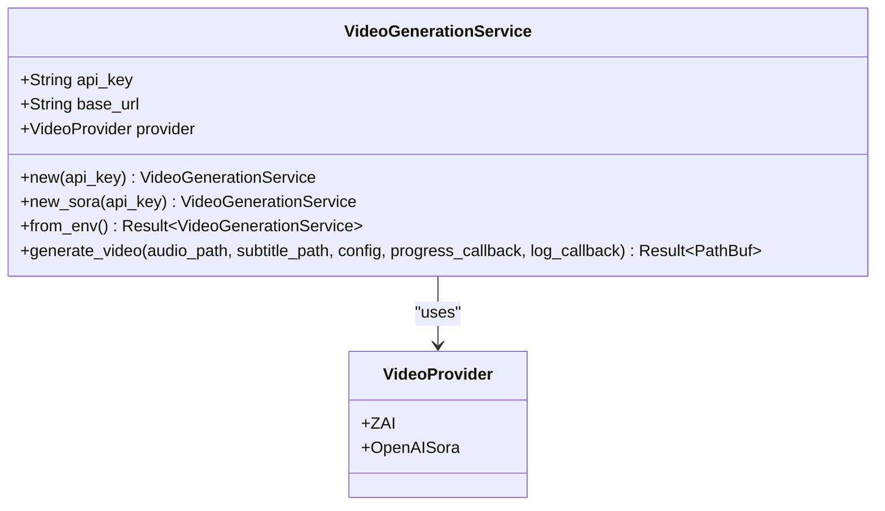
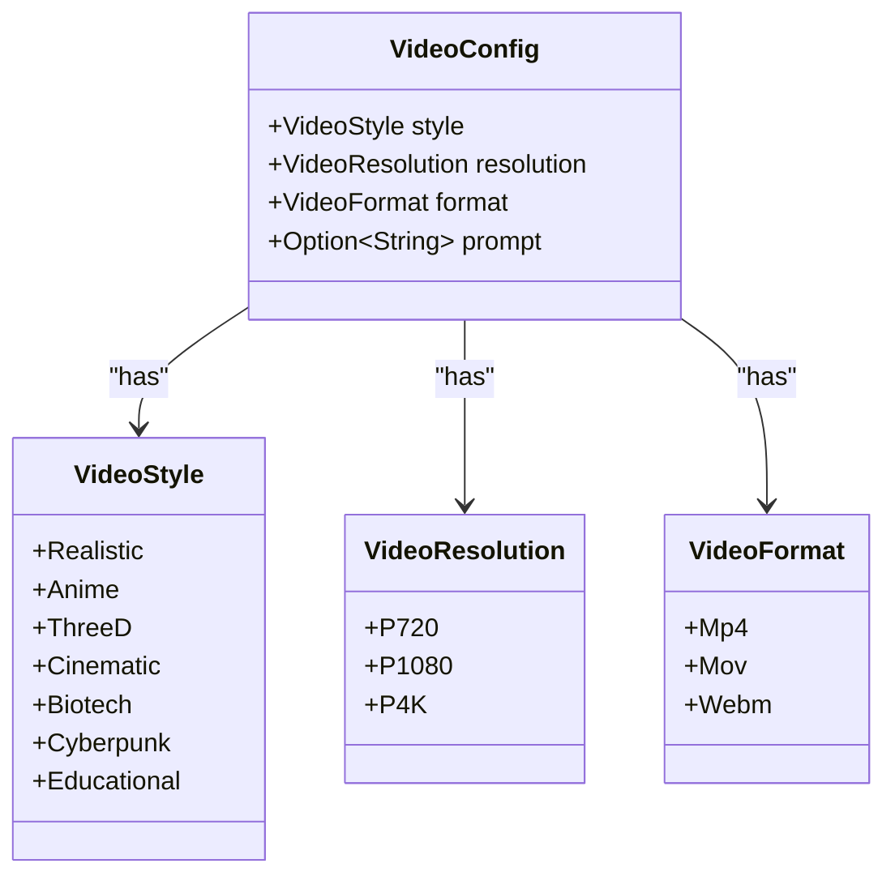
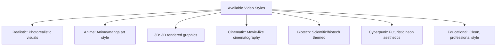
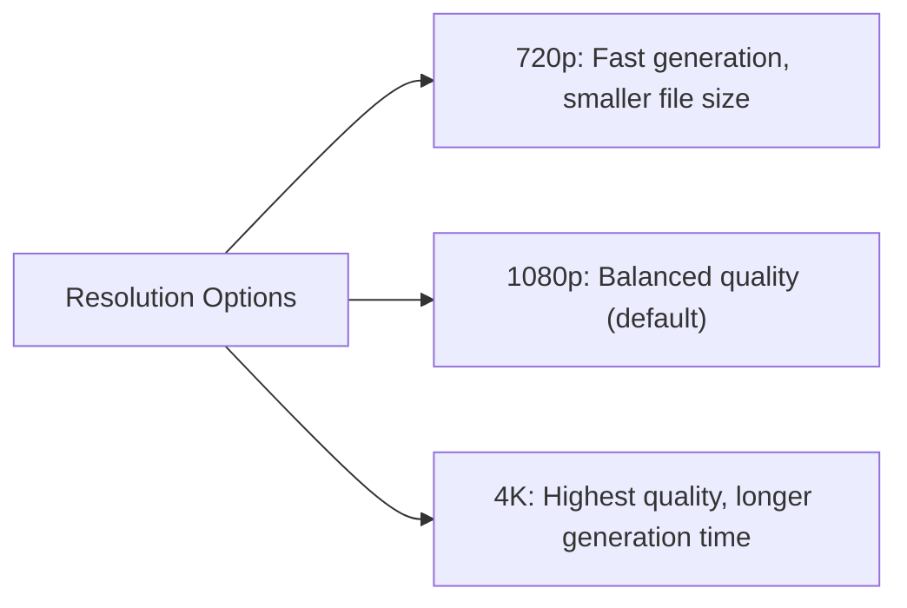
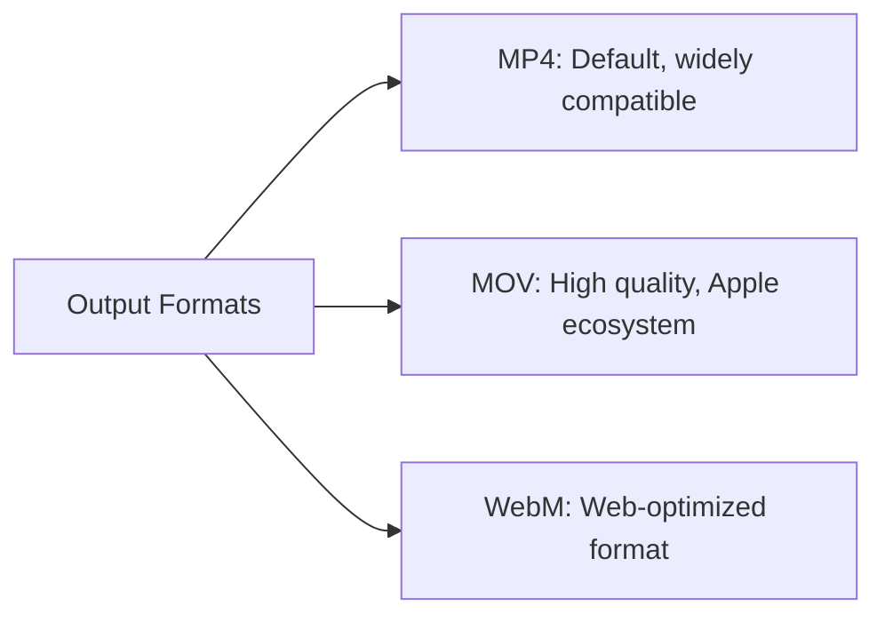
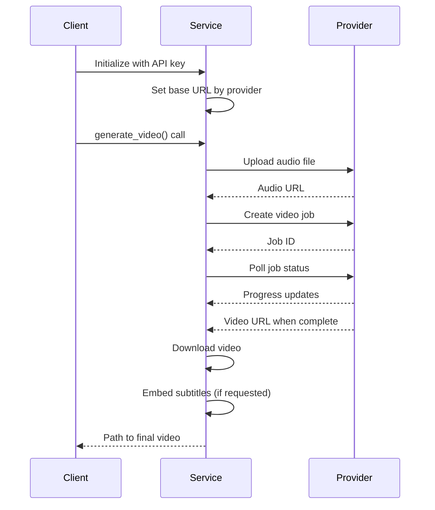
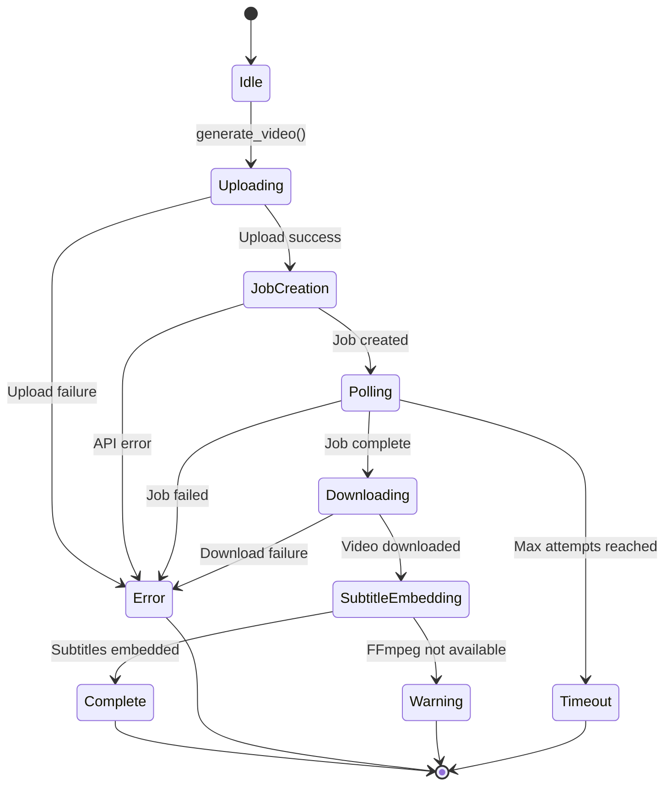
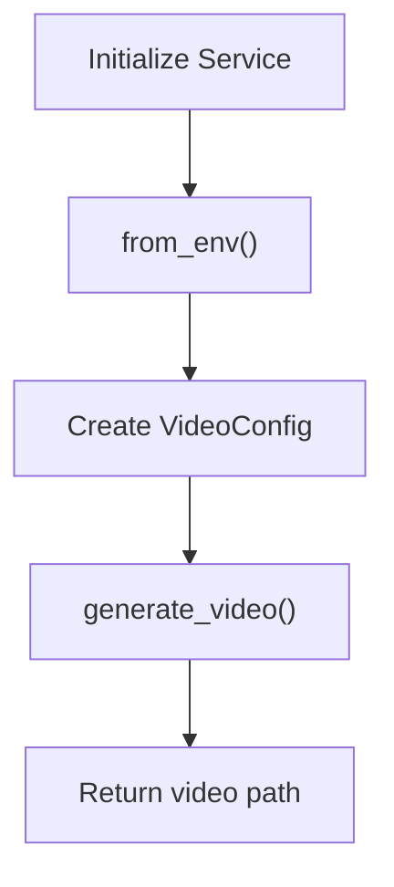
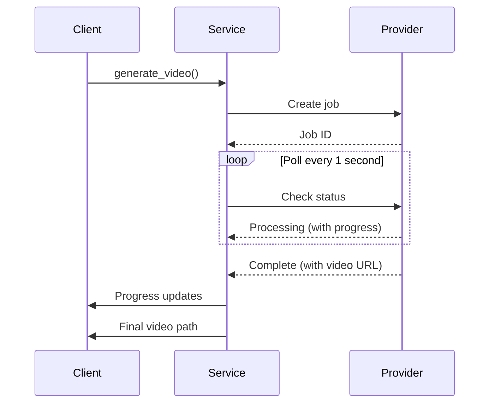
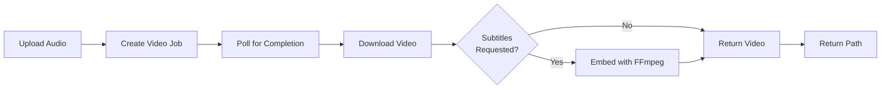

# Video Generation Service API

<cite>
**Referenced Files in This Document**   
- [video.rs](file://src/video.rs)
- [queue.rs](file://src/queue.rs)
- [config.rs](file://src/config.rs)
- [ZAI_VIDEO_FEATURE.md](file://abogen-ui/ZAI_VIDEO_FEATURE.md)
- [VIDEO_CLI_IMPLEMENTATION.md](file://VIDEO_CLI_IMPLEMENTATION.md)
</cite>

## Table of Contents
1. [Introduction](#introduction)
2. [Video Generation Service](#video-generation-service)
3. [Video Job Configuration](#video-job-configuration)
4. [Supported Video Styles](#supported-video-styles)
5. [Resolution and Format Options](#resolution-and-format-options)
6. [API Integration](#api-integration)
7. [Error Handling](#error-handling)
8. [Usage Examples](#usage-examples)
9. [Long-Running Operations](#long-running-operations)
10. [Streaming and Output](#streaming-and-output)

## Introduction

The Video Generation Service provides a comprehensive API for creating AI-generated videos through integration with external providers such as Z.AI and OpenAI Sora. The service handles the complete video generation pipeline from job creation to result retrieval, including audio processing, visual generation, and subtitle embedding. This documentation details the core components, configuration options, and usage patterns for the video generation functionality.

**Section sources**
- [video.rs](file://src/video.rs#L1-L50)
- [VIDEO_CLI_IMPLEMENTATION.md](file://VIDEO_CLI_IMPLEMENTATION.md#L1-L50)

## Video Generation Service

The `VideoGenerationService` struct is the primary interface for creating and managing video generation jobs. It provides methods for initializing the service with authentication credentials, generating videos from audio files, and handling the complete workflow including progress tracking and error recovery.



**Diagram sources**
- [video.rs](file://src/video.rs#L19-L65)

### Service Initialization

The service can be initialized in three ways:

1. **Direct API Key**: Using the `new()` method with a Z.AI API key
2. **OpenAI Sora**: Using the `new_sora()` method with an OpenAI API key
3. **Environment Variables**: Using `from_env()` which checks for `OPENAI_API_KEY` first, then falls back to `ZAI_API_KEY`

The service automatically configures the appropriate base URL based on the selected provider, with Z.AI using `https://api.z.ai/api/paas/v4` and OpenAI Sora using `https://api.openai.com/v1`.

**Section sources**
- [video.rs](file://src/video.rs#L36-L65)

## Video Job Configuration

The `VideoConfig` struct defines the parameters for video generation jobs, allowing customization of style, resolution, format, and visual prompts.



**Diagram sources**
- [video.rs](file://src/video.rs#L12-L17)
- [queue.rs](file://src/queue.rs#L2-L49)

### VideoJobRequest Fields

While the `VideoConfig` struct is used internally, the service accepts configuration through equivalent parameters that map to these fields:

- **Style**: Determines the visual aesthetic of the generated video
- **Resolution**: Specifies the output resolution (720p, 1080p, or 4K)
- **Format**: Output container format (MP4, MOV, or WebM)
- **Custom Prompts**: Optional text prompt to guide the visual generation
- **Subtitle Embedding**: Option to embed subtitle files into the final video

The service uses these parameters to construct appropriate API requests to the underlying video generation providers.

**Section sources**
- [video.rs](file://src/video.rs#L12-L17)
- [queue.rs](file://src/queue.rs#L2-L49)

## Supported Video Styles

The service supports multiple video styles, each producing distinct visual aesthetics. These styles are implemented as an enum with string representations used in API requests.



**Diagram sources**
- [queue.rs](file://src/queue.rs#L2-L11)

### Style Characteristics

Each style produces distinctive visual elements:

- **Biotech**: Features neon green and blue DNA particles, transparent data layers, and soft laboratory lighting with holographic effects
- **Cyberpunk**: Utilizes vibrant magenta and cyan lights, futuristic cityscapes, digital rain effects, and glitch animations for subtitles
- **Educational**: Employs minimalistic graphics, clear typography, and professional color schemes with smooth subtitle synchronization
- **Cinematic**: Creates movie-like cinematography with dramatic lighting and camera movements
- **Realistic**: Generates photorealistic visuals that resemble actual video footage

**Section sources**
- [queue.rs](file://src/queue.rs#L2-L11)
- [ZAI_VIDEO_FEATURE.md](file://abogen-ui/ZAI_VIDEO_FEATURE.md#L30-L70)

## Resolution and Format Options

The service supports multiple resolution and format combinations, allowing users to balance quality, file size, and generation time according to their needs.

### Resolution Options



**Diagram sources**
- [queue.rs](file://src/queue.rs#L27-L32)

### Format Options



**Diagram sources**
- [queue.rs](file://src/queue.rs#L44-L49)

The resolution directly impacts generation time, with typical durations of 1-2 minutes for 720p, 2-4 minutes for 1080p, and 4-5 minutes for 4K content. The format choice affects compatibility with different platforms and playback devices.

**Section sources**
- [queue.rs](file://src/queue.rs#L27-L49)
- [VIDEO_CLI_IMPLEMENTATION.md](file://VIDEO_CLI_IMPLEMENTATION.md#L131-L145)

## API Integration

The service integrates with external video generation APIs, primarily Z.AI and OpenAI Sora, handling authentication and request formatting automatically.



**Diagram sources**
- [video.rs](file://src/video.rs#L75-L250)

### Authentication

Authentication is handled through environment variables, with the service checking for API keys in the following order:

1. `OPENAI_API_KEY` for OpenAI Sora integration
2. `ZAI_API_KEY` for Z.AI integration

The `from_env()` method attempts to read these environment variables and will return an error if neither is set. This approach allows for secure credential management without hardcoding sensitive information in the application.

**Section sources**
- [video.rs](file://src/video.rs#L52-L65)

## Error Handling

The service implements comprehensive error handling for various failure scenarios encountered during video generation.



**Diagram sources**
- [video.rs](file://src/video.rs#L75-L250)

### Error Types

The service handles several specific error conditions:

- **API Rate Limiting**: When the provider's rate limits are exceeded
- **Invalid Style Parameters**: When unsupported style values are provided
- **Rendering Failures**: When the video generation process fails on the provider side
- **Timeout**: When video generation exceeds the maximum wait time (5 minutes)
- **File I/O Errors**: During upload, download, or subtitle embedding operations

For subtitle embedding, if ffmpeg is not available on the system, the service will continue with a warning rather than failing completely, returning the video without embedded subtitles.

**Section sources**
- [video.rs](file://src/video.rs#L180-L250)
- [VIDEO_CLI_IMPLEMENTATION.md](file://VIDEO_CLI_IMPLEMENTATION.md#L240-L260)

## Usage Examples

The following examples demonstrate how to configure and use the video generation service with different parameters.

### Basic Video Generation



**Diagram sources**
- [video.rs](file://src/video.rs#L75-L100)

### Cyberpunk Style Video

To generate a video with cyberpunk aesthetics:

```rust
let config = VideoConfig {
    style: VideoStyle::Cyberpunk,
    resolution: VideoResolution::P1080,
    format: VideoFormat::Mp4,
    prompt: Some("Futuristic cityscape with neon lights and flying vehicles".to_string()),
};
```

This configuration will produce a 1080p MP4 video with cyberpunk visuals, using the custom prompt to guide the content generation.

**Section sources**
- [video.rs](file://src/video.rs#L12-L17)
- [queue.rs](file://src/queue.rs#L2-L11)

### Cinematic 4K Video

For high-quality cinematic content:

```rust
let config = VideoConfig {
    style: VideoStyle::Cinematic,
    resolution: VideoResolution::P4K,
    format: VideoFormat::Mp4,
    prompt: Some("Cinematic shots with dramatic lighting and camera movements".to_string()),
};
```

Note that 4K videos have longer generation times and larger file sizes compared to lower resolutions.

**Section sources**
- [queue.rs](file://src/queue.rs#L27-L32)

## Long-Running Operations

Video generation is inherently a long-running operation, and the service provides mechanisms to handle this appropriately.



**Diagram sources**
- [video.rs](file://src/video.rs#L180-L220)

The service polls the provider API every second for up to 300 attempts (5 minutes maximum), providing progress updates through the optional progress callback. The progress is mapped from the provider's progress percentage to a 20-90% range during processing, with the final download and processing steps completing the remaining progress.

**Section sources**
- [video.rs](file://src/video.rs#L180-L220)

## Streaming and Output

The service handles video output and streaming through file system operations and optional subtitle embedding.

### Output Pipeline



**Diagram sources**
- [video.rs](file://src/video.rs#L75-L250)

### Output Configuration

The generated video is saved in the same directory as the input audio file, with a filename based on the audio file's stem and the specified format. For example, an audio file named `lecture.wav` with MP4 format will produce a video named `lecture.mp4`.

When subtitles are requested, the service uses ffmpeg to embed the subtitle file into the video stream. If ffmpeg is not available, the service will issue a warning but continue, returning the video without embedded subtitles.

**Section sources**
- [video.rs](file://src/video.rs#L222-L250)