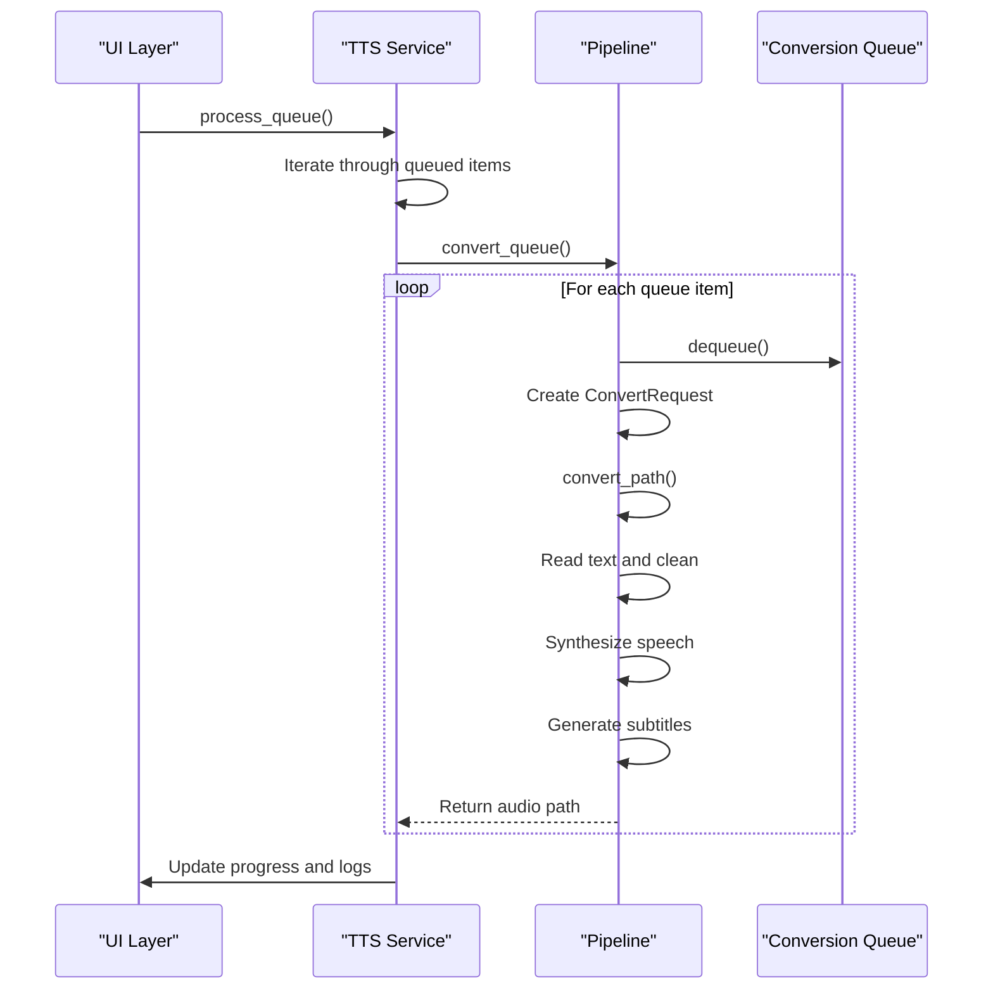
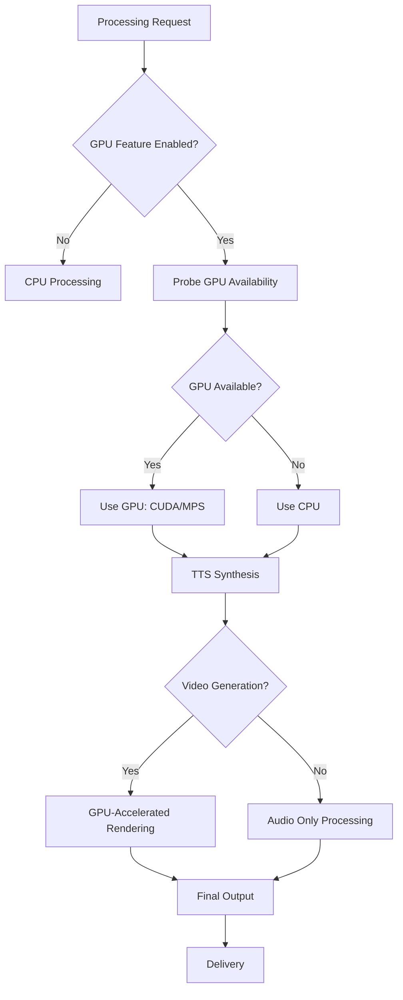

# Advanced Features

<cite>
**Referenced Files in This Document**   
- [queue.rs](file://src/queue.rs)
- [pipeline.rs](file://src/pipeline.rs)
- [subtitle.rs](file://src/subtitle.rs)
- [tts.rs](file://src/tts.rs)
- [state.rs](file://abogen-ui/crates/ui/state.rs)
- [gpu_probe.rs](file://abogen-ui/crates/ui/services/gpu_probe.rs)
- [tts_service.rs](file://abogen-ui/crates/ui/services/tts_service.rs)
- [mlt_video.rs](file://abogen-ui/crates/ui/services/mlt_video.rs)
- [kokoro_bridge.py](file://python/kokoro_bridge.py)
</cite>

## Table of Contents
1. [Queue Processing System](#queue-processing-system)
2. [Batch Operations and Pipeline Orchestration](#batch-operations-and-pipeline-orchestration)
3. [Custom Subtitle Timing Options](#custom-subtitle-timing-options)
4. [GPU Acceleration Support](#gpu-acceleration-support)
5. [State Management for Complex Workflows](#state-management-for-complex-workflows)
6. [Performance Optimization Tips](#performance-optimization-tips)
7. [Use Cases in Automated Content Creation](#use-cases-in-automated-content-creation)

## Queue Processing System

The queue processing system in `src/queue.rs` manages multiple conversion jobs with prioritization and error handling. It implements a FIFO (First-In-First-Out) queue structure through the `ConversionQueue` struct, which stores `QueueItem` objects containing all necessary processing parameters such as source path, output directory, voice profile, speed, subtitle granularity, and newline replacement settings.

The queue system provides standard operations including `enqueue` for adding items, `dequeue` for removing items in processing order, and utility methods for checking queue length and emptiness. The implementation ensures job order preservation as verified by unit tests, guaranteeing that jobs are processed in the exact sequence they were added to the queue.

Error handling is integrated through comprehensive logging via the `LogEntry` struct, which captures messages with associated log levels (Info, Notice, Warning, Error). This allows for detailed tracking of job progress and failure points throughout the processing pipeline.

**Section sources**
- [queue.rs](file://src/queue.rs#L1-L155)

## Batch Operations and Pipeline Orchestration

Batch processing operations are orchestrated through the `convert_queue` function in `src/pipeline.rs`, which processes multiple input files either through scripting interfaces or UI-managed queues. The pipeline system transforms text input into audio output while optionally generating synchronized subtitles based on configurable parameters.

The `ConvertRequest` struct defines all parameters needed for a conversion job, including source and output paths, voice profile, speed, subtitle granularity, and average words per minute for timing calculations. The `convert_path` function handles individual file processing by reading text, cleaning it, synthesizing speech, and generating subtitles when enabled.

For batch operations, the `convert_queue` function iteratively processes each item in the queue, converting text to audio files and returning paths to the generated outputs. This enables efficient processing of multiple files in sequence, with proper error propagation through the `anyhow::Result` type system.

The pipeline integrates with the UI layer through the `process_queue` function in `tts_service.rs`, which manages the complete workflow including reading source files, generating audio, converting audio formats, and producing subtitle files in various formats (SRT, ASS, VTT).



**Diagram sources**
- [pipeline.rs](file://src/pipeline.rs#L1-L140)
- [tts_service.rs](file://abogen-ui/crates/ui/services/tts_service.rs#L1-L540)

**Section sources**
- [pipeline.rs](file://src/pipeline.rs#L1-L140)
- [tts_service.rs](file://abogen-ui/crates/ui/services/tts_service.rs#L1-L540)

## Custom Subtitle Timing Options

The system provides flexible subtitle timing options that allow for sentence-based or word-based synchronization. The `SubtitleGranularity` enum in `src/queue.rs` defines three modes: `Disabled`, `Sentence`, and `Words(u8)` where the latter allows specifying the number of words per subtitle chunk.

The `generate_subtitles` function in `src/subtitle.rs` implements the timing logic, splitting text based on the selected granularity mode. For sentence-based timing, it uses a regular expression to identify sentence boundaries, while word-based timing groups words into configurable chunks. The function calculates timing based on an average words-per-minute rate, with a default of 150 WPM that can be adjusted.

The system supports multiple subtitle formats including SRT, ASS, and VTT through format conversion functions. The `format_srt` function generates standard SubRip files with proper timestamp formatting, while specialized formatting functions handle ASS and VTT formats with appropriate styling and metadata.

For video generation, the MLT (Media Lovin' Toolkit) integration in `mlt_video.rs` enables real-time word-highlighted subtitles, where each word is displayed as it is spoken. The `generate_word_timing` function creates precise timing for individual words based on audio duration, allowing for dynamic subtitle display during video playback.

```mermaid
flowchart TD
Start([Text Input]) --> Granularity{"Subtitle Granularity?"}
Granularity --> |Disabled| NoSubs[No subtitles generated]
Granularity --> |Sentence| SplitSentences["Split text into sentences"]
Granularity --> |Words(n)| SplitWords["Group words into chunks of n"]
SplitSentences --> CalculateTiming["Calculate timing based on WPM"]
SplitWords --> CalculateTiming
CalculateTiming --> Format{"Output Format?"}
Format --> |SRT| GenerateSRT["Generate SRT format"]
Format --> |ASS| GenerateASS["Generate ASS format"]
Format --> |VTT| GenerateVTT["Generate VTT format"]
GenerateSRT --> End([Subtitle File])
GenerateASS --> End
GenerateVTT --> End
```

**Diagram sources**
- [subtitle.rs](file://src/subtitle.rs#L1-L157)
- [mlt_video.rs](file://abogen-ui/crates/ui/services/mlt_video.rs#L1-L350)

**Section sources**
- [queue.rs](file://src/queue.rs#L1-L155)
- [subtitle.rs](file://src/subtitle.rs#L1-L157)
- [mlt_video.rs](file://abogen-ui/crates/ui/services/mlt_video.rs#L1-L350)

## GPU Acceleration Support

GPU acceleration is supported through the 'gpu' feature flag and device selection for both TTS and video generation workloads. The system automatically detects available hardware acceleration and configures processing accordingly.

The `gpu_probe.rs` service provides GPU availability detection, returning true when the 'gpu' feature is enabled. This allows the UI to present GPU acceleration options to users only when supported by the underlying system.

For TTS processing, the Coqui TTS engine (when the 'coqui-tts' feature is enabled) automatically selects the appropriate device based on availability. The Python bridge script in `kokoro_bridge.py` determines the device as "cuda" if CUDA is available, falling back to "cpu" otherwise. This dynamic selection ensures optimal performance by leveraging GPU acceleration when available while maintaining functionality on systems without dedicated graphics hardware.

The `KokoroEngine` in `tts.rs` respects the `VOXWEAVE_KOKORO_DEVICE` environment variable, allowing users to explicitly specify the processing device (cuda, mps for Apple Silicon, or cpu). This provides fine-grained control over hardware utilization, enabling users to balance performance and resource consumption based on their specific requirements.

Video generation workflows also benefit from GPU acceleration, particularly during the rendering phase. The MLT-based video composition system can leverage GPU-accelerated encoding through FFmpeg backends when available, significantly reducing processing time for large video files.



**Diagram sources**
- [tts.rs](file://src/tts.rs#L1-L523)
- [gpu_probe.rs](file://abogen-ui/crates/ui/services/gpu_probe.rs#L1-L27)
- [kokoro_bridge.py](file://python/kokoro_bridge.py#L1-L57)

**Section sources**
- [tts.rs](file://src/tts.rs#L1-L523)
- [gpu_probe.rs](file://abogen-ui/crates/ui/services/gpu_probe.rs#L1-L27)
- [kokoro_bridge.py](file://python/kokoro_bridge.py#L1-L57)

## State Management for Complex Workflows

State management for complex workflows is implemented in `state.rs`, which defines the application's state structure and reactive signals for UI updates. The `AppState` struct contains signals for all user-configurable options, enabling real-time updates and synchronization between UI components.

The state system tracks processing parameters including selected files, queue items, voice settings, subtitle options, video generation preferences, and processing status. The `QueuedItem` struct captures all configuration for individual processing jobs, including file information, voice selection, speed, subtitle mode, format preferences, and video generation settings.

Reactive signals such as `is_processing`, `progress`, and `logs` provide real-time feedback during job execution. The `logs` signal maintains a collection of `LogEntry` objects that capture processing events with associated log levels, enabling detailed monitoring of workflow execution.

Cancellation is supported through the `cancel_token` signal, allowing users to interrupt long-running processing tasks. This is particularly important for batch operations where users may need to stop processing due to errors or changing requirements.

The state management system integrates with the processing pipeline through the `process_queue` function, which reads current state values and updates progress and log information as jobs are processed. This creates a seamless connection between the UI layer and the underlying processing engine.

**Section sources**
- [state.rs](file://abogen-ui/crates/ui/state.rs#L1-L256)

## Performance Optimization Tips

For processing large batches of content, several performance optimization strategies can be employed:

1. **Batch Sizing**: Process files in moderate-sized batches rather than extremely large queues to maintain system responsiveness and enable easier error recovery.

2. **GPU Utilization**: Enable GPU acceleration when available, particularly for TTS synthesis which benefits significantly from CUDA or MPS acceleration.

3. **Parallel Processing**: While the current implementation processes jobs sequentially, consider implementing parallel processing for independent jobs when system resources permit.

4. **Format Selection**: Use WAV format for intermediate processing and convert to final formats (MP3, FLAC) only at the end to avoid repeated encoding operations.

5. **Resource Management**: Monitor system resources and adjust processing parameters accordingly. On memory-constrained systems, reduce batch sizes or disable video generation.

6. **Caching**: Implement caching mechanisms for frequently used voice profiles or processing templates to reduce configuration overhead.

7. **Error Handling**: Implement robust error handling to prevent single job failures from terminating entire batch operations.

8. **Progress Tracking**: Use the progress signals to monitor processing status and identify potential bottlenecks in the workflow.

**Section sources**
- [pipeline.rs](file://src/pipeline.rs#L1-L140)
- [tts_service.rs](file://abogen-ui/crates/ui/services/tts_service.rs#L1-L540)

## Use Cases in Automated Content Creation

These advanced features support various use cases in automated content creation pipelines and production environments:

1. **Educational Content**: Generate narrated educational videos with synchronized subtitles, leveraging sentence-based timing for clear comprehension.

2. **Multilingual Content**: Produce content in multiple languages using different voice profiles and language settings, with appropriate subtitle formatting.

3. **Accessibility**: Create accessible content with detailed subtitle options and multiple audio format outputs for different distribution channels.

4. **Social Media Content**: Generate short-form video content with word-by-word subtitle highlighting for platforms like TikTok or Instagram.

5. **Podcast Production**: Process large batches of podcast episodes with consistent voice settings and automatic subtitle generation.

6. **E-learning Platforms**: Integrate into e-learning systems for automated lecture video generation with synchronized captions.

7. **Content Localization**: Support content localization workflows by processing multiple language versions with appropriate voice and subtitle settings.

8. **Archival Processing**: Convert large archives of text content into audio format with batch processing capabilities.

The combination of queue management, batch processing, customizable subtitles, and GPU acceleration enables efficient production of high-quality audiovisual content at scale, making it suitable for both individual creators and enterprise content production environments.

**Section sources**
- [queue.rs](file://src/queue.rs#L1-L155)
- [pipeline.rs](file://src/pipeline.rs#L1-L140)
- [tts_service.rs](file://abogen-ui/crates/ui/services/tts_service.rs#L1-L540)