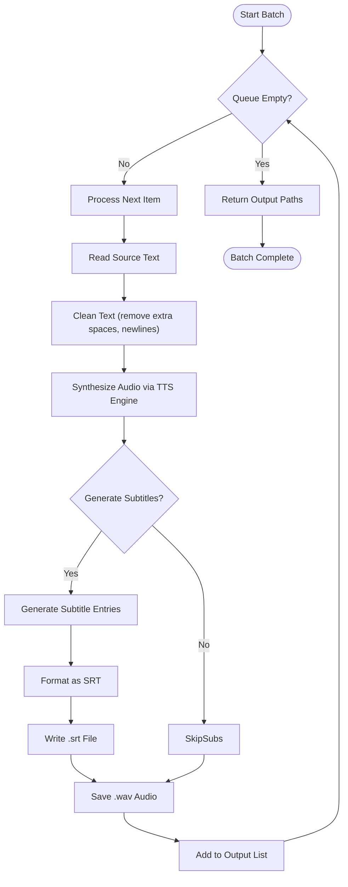
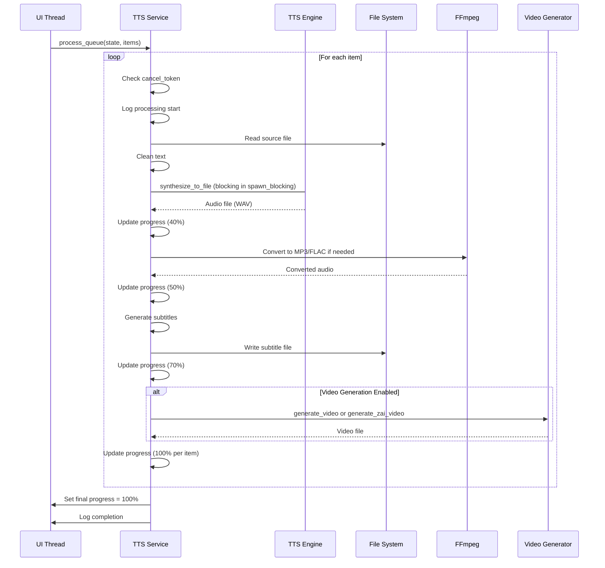
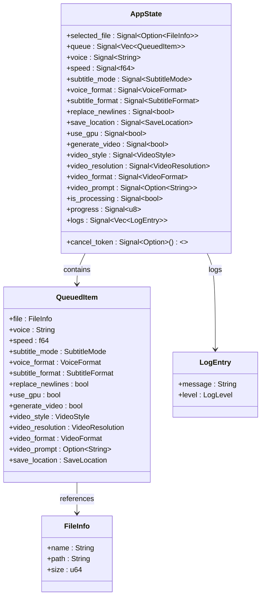
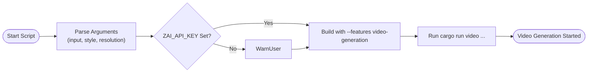

# Batch Operations

<cite>
**Referenced Files in This Document**   
- [pipeline.rs](file://src/pipeline.rs)
- [tts_service.rs](file://abogen-ui/crates/ui/services/tts_service.rs)
- [state.rs](file://abogen-ui/crates/ui/state.rs)
- [generate_video.sh](file://generate_video.sh)
</cite>

## Table of Contents
1. [Introduction](#introduction)
2. [Pipeline Orchestration in pipeline.rs](#pipeline-orchestration-in-pipeline-rs)
3. [Queue Processing in tts_service.rs](#queue-processing-in-tts_service-rs)
4. [UI State Management for Batch Operations](#ui-state-management-for-batch-operations)
5. [Automated Batch Workflows via CLI](#automated-batch-workflows-via-cli)
6. [Use Cases for Content Creators](#use-cases-for-content-creators)
7. [Best Practices for Batch Operation Design](#best-practices-for-batch-operation-design)
8. [Conclusion](#conclusion)

## Introduction
This document details the implementation and usage of batch operations within the VoxWeave system, focusing on the processing of multiple text files into audio and video content through both UI and command-line interfaces. The architecture supports robust error handling, resource management, and progress tracking across jobs. It enables content creators to efficiently convert entire directories of textual content into rich multimedia outputs using text-to-speech (TTS) and video generation pipelines.

The system integrates asynchronous processing, cancellation support, and per-job status reporting, ensuring resilience and usability even when handling large batches. This documentation covers the core orchestration logic, UI state synchronization, CLI automation scripts, and recommended patterns for reliable batch execution.

## Pipeline Orchestration in pipeline.rs

The `pipeline.rs` module defines the foundational logic for converting individual text files and processing entire queues of conversion requests. It encapsulates the end-to-end workflow from input reading to audio and subtitle generation.

The `convert_path` function handles a single file conversion by:
- Reading and cleaning the source text
- Synthesizing speech via a specified TTS engine
- Generating time-aligned subtitles based on configurable granularity
- Writing output files (audio and subtitles) to the designated directory

The `convert_queue` function orchestrates batch processing by iterating over a `ConversionQueue`, applying `convert_path` to each item. It collects successful outputs and propagates errors, allowing partial success in case of individual job failures. This design ensures that one failed item does not halt the entire batch.



**Diagram sources**
- [pipeline.rs](file://src/pipeline.rs#L45-L110)

**Section sources**
- [pipeline.rs](file://src/pipeline.rs#L1-L140)

## Queue Processing in tts_service.rs

The `process_queue` function in `tts_service.rs` implements the UI-driven batch processing logic, extending the core pipeline with user feedback, format conversion, and optional video generation.

Each queued item is processed sequentially with:
- Cancellation checks via `cancel_token` to allow user interruption
- Progress updates scaled across the total number of items
- Individual error handling that logs issues but continues processing
- Dynamic engine selection (Kokoro or Coqui) based on voice configuration
- Audio format conversion (WAV → MP3/FLAC) using FFmpeg where available
- Subtitle generation in ASS, SRT, or VTT formats
- Optional video generation through Z.AI or local MLT-based systems

The function runs in a `tokio::spawn` context, yielding control periodically with `tokio::task::yield_now().await` to prevent UI freezing during long-running synthesis tasks.



**Diagram sources**
- [tts_service.rs](file://abogen-ui/crates/ui/services/tts_service.rs#L211-L540)

**Section sources**
- [tts_service.rs](file://abogen-ui/crates/ui/services/tts_service.rs#L211-L540)

## UI State Management for Batch Operations

The UI state system, defined in `state.rs`, tracks batch progress and individual job statuses through reactive signals in the Dioxus framework.

Key state components include:
- `queue: Signal<Vec<QueuedItem>>`: Stores all files and their processing options
- `progress: Signal<u8>`: Global progress percentage (0–100)
- `logs: Signal<Vec<LogEntry>>`: Real-time log stream with severity levels
- `is_processing: Signal<bool>`: Indicates active batch execution
- `cancel_token: Signal<Option<()>>`: Triggers cancellation when set

Each `QueuedItem` contains per-file settings such as voice, speed, subtitle mode, output format, and save location. The UI binds these signals to interactive components, enabling dynamic updates without full re-renders.

When processing starts, the `MainScreen` component spawns the `process_queue` task and switches to `ProcessingScreen`, which displays a progress bar and live log panel. This ensures responsive feedback even during intensive operations.



**Diagram sources**
- [state.rs](file://abogen-ui/crates/ui/state.rs#L1-L255)

**Section sources**
- [state.rs](file://abogen-ui/crates/ui/state.rs#L1-L255)

## Automated Batch Workflows via CLI

The `generate_video.sh` script demonstrates how batch operations can be automated via the command line, enabling integration into larger content pipelines.

The script:
- Accepts input file, visual style, and resolution as parameters
- Validates the presence of `ZAI_API_KEY` for cloud video generation
- Builds the project with `video-generation` feature enabled
- Invokes `cargo run` with appropriate arguments to trigger video synthesis

This approach allows unattended processing of content, suitable for scheduled tasks or CI/CD workflows. Users can extend the script to iterate over directories, applying consistent styling and output settings.

Example usage:
```bash
./generate_video.sh samples/example.txt cyberpunk 1080p
```

The script gracefully degrades when `ZAI_API_KEY` is missing, falling back to audio-only generation while informing the user.



**Diagram sources**
- [generate_video.sh](file://generate_video.sh#L1-L42)

**Section sources**
- [generate_video.sh](file://generate_video.sh#L1-L42)

## Use Cases for Content Creators

Content creators can leverage batch operations to:
- Convert entire blogs or article directories into podcast-ready audio
- Generate subtitled videos for educational content at scale
- Produce multilingual versions of scripts using different voice profiles
- Automate daily content publishing pipelines from markdown sources

The system supports both interactive (UI) and automated (CLI) modes, allowing flexibility based on workflow needs. For example, a creator might use the UI to preview settings on a single file, then apply those settings across hundreds of files via script.

Partial failure handling ensures that network issues or file corruption do not abort the entire batch, maintaining productivity. Retry strategies can be implemented externally by re-queuing failed items based on log output.

## Best Practices for Batch Operation Design

To ensure optimal performance and reliability in batch operations:

### Error Resilience
- **Continue on failure**: Isolate job failures to prevent cascade aborts
- **Detailed logging**: Capture per-item outcomes for debugging and retry decisions
- **Validation pre-flight**: Check file existence and permissions before processing

### Performance Optimization
- **Yield control**: Use async yields to maintain UI responsiveness
- **Parallelize where safe**: Run independent jobs concurrently if resources allow
- **Efficient I/O**: Batch file operations and minimize disk seeks

### Resource Management
- **Limit concurrency**: Avoid overwhelming system resources (GPU, memory)
- **Cleanup intermediates**: Remove temporary files after conversion
- **Monitor usage**: Provide feedback on CPU, memory, and disk I/O

### Retry Strategies
- **Exponential backoff**: For transient network or API errors
- **Manual retry queue**: Allow users to reprocess failed items selectively
- **State persistence**: Save queue state to resume after crashes

## Conclusion

The VoxWeave system provides a comprehensive solution for batch processing text-to-speech and video generation tasks. Through a well-structured pipeline in `pipeline.rs`, resilient queue processing in `tts_service.rs`, and a responsive UI state system, it supports both interactive and automated workflows. The inclusion of shell scripts like `generate_video.sh` enables seamless integration into broader content creation pipelines, making it ideal for creators who need to process large volumes of textual content into rich media formats efficiently and reliably.