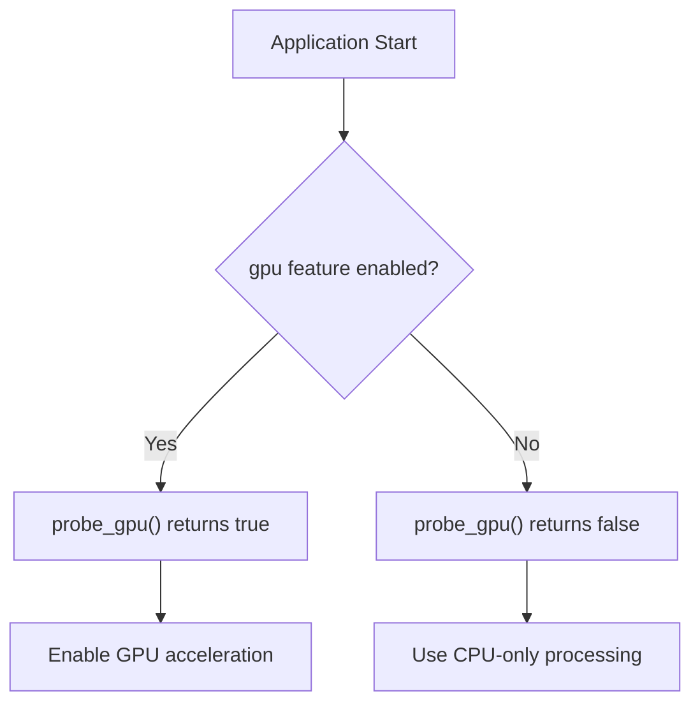
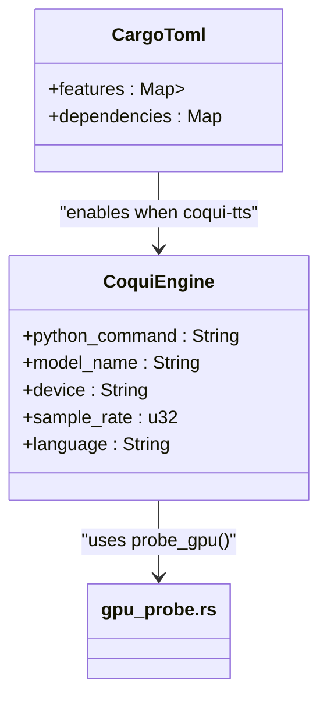
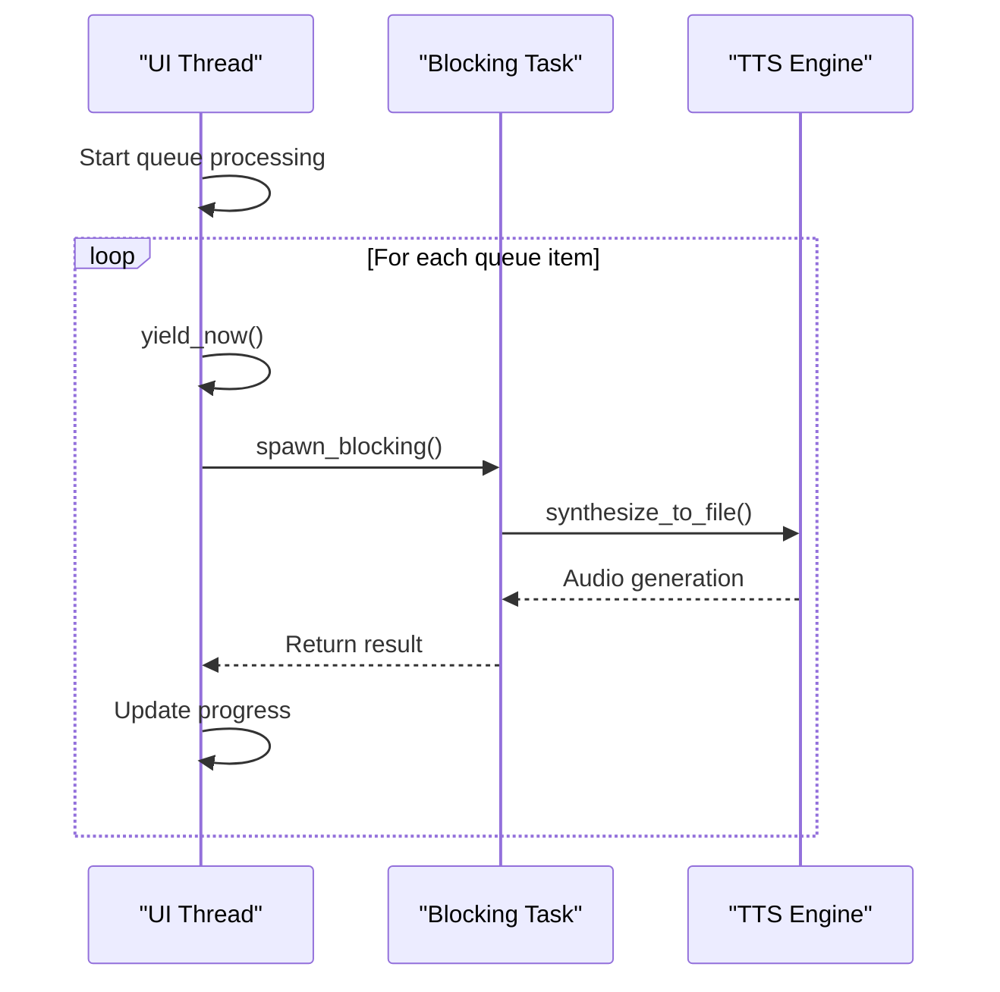
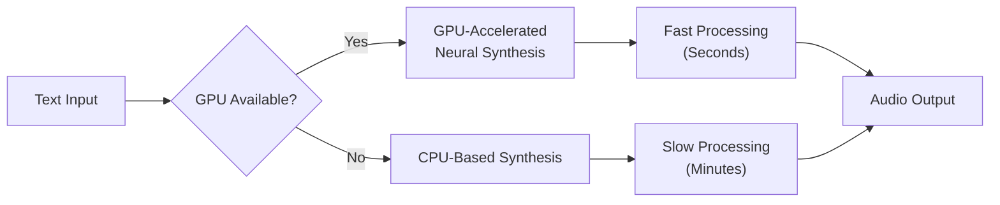

# Performance Optimization

<cite>
**Referenced Files in This Document**   
- [gpu_probe.rs](file://abogen-ui/crates/ui/services/gpu_probe.rs)
- [pipeline.rs](file://src/pipeline.rs)
- [coqui_tts.rs](file://src/coqui_tts.rs)
- [video.rs](file://src/video.rs)
- [tts_service.rs](file://abogen-ui/crates/ui/services/tts_service.rs)
- [Cargo.toml](file://Cargo.toml)
</cite>

## Table of Contents
1. [GPU Acceleration Overview](#gpu-acceleration-overview)
2. [GPU Detection and Selection Mechanism](#gpu-detection-and-selection-mechanism)
3. 'gpu' Feature Flag Implementation
4. Performance Optimizations in Async Processing
5. Device Selection Configuration
6. GPU Acceleration in TTS and Video Generation
7. Performance Benchmarks and Hardware Tuning
8. Troubleshooting Performance Issues

## GPU Acceleration Overview

This document details the performance optimization strategies implemented in the VoxWeave application, with a focus on GPU acceleration and resource management. The system leverages hardware acceleration through CUDA, MPS, and CPU fallback mechanisms to maximize performance across diverse hardware configurations. The architecture is designed to maintain UI responsiveness during intensive operations through async processing and strategic task yielding.

**Section sources**
- [gpu_probe.rs](file://abogen-ui/crates/ui/services/gpu_probe.rs#L1-L27)
- [Cargo.toml](file://Cargo.toml#L1-L27)

## GPU Detection and Selection Mechanism

The GPU detection mechanism is implemented in `gpu_probe.rs` and serves as the foundation for hardware acceleration decisions. The `probe_gpu()` function returns a boolean indicating GPU availability, with its behavior controlled by the `gpu` feature flag. When the feature is enabled, the function returns `true`, signaling that GPU acceleration is available. When disabled, it returns `false`, forcing CPU-only processing.

The current implementation acts as a stub that relies on compile-time feature detection rather than runtime device enumeration. This approach simplifies deployment across different platforms but requires proper feature flag configuration during build time. The function does not currently differentiate between CUDA (NVIDIA), MPS (Apple Silicon), or other GPU backends, treating all GPU-capable systems uniformly when the feature is enabled.

**Diagram sources **
- [gpu_probe.rs](file://abogen-ui/crates/ui/services/gpu_probe.rs#L5-L20)

**Section sources**
- [gpu_probe.rs](file://abogen-ui/crates/ui/services/gpu_probe.rs#L1-L27)

## 'gpu' Feature Flag Implementation

The 'gpu' feature flag is defined in the root `Cargo.toml` file and controls the compilation of GPU-accelerated components throughout the application. This conditional compilation approach allows for flexible builds targeting different hardware capabilities. The feature flag system enables or disables GPU-related code paths at compile time, eliminating runtime overhead for feature detection while ensuring compatibility across systems without GPU support.

When the `coqui-tts` feature is enabled (which depends on GPU capabilities), the Coqui TTS engine can leverage GPU acceleration for voice synthesis operations. The feature-based architecture allows users to build the application with or without GPU support based on their target deployment environment, providing a clean separation between CPU and GPU code paths.

**Diagram sources **
- [Cargo.toml](file://Cargo.toml#L20-L26)
- [coqui_tts.rs](file://src/coqui_tts.rs#L1-L115)

**Section sources**
- [Cargo.toml](file://Cargo.toml#L20-L26)
- [coqui_tts.rs](file://src/coqui_tts.rs#L1-L115)

## Performance Optimizations in Async Processing

The `pipeline.rs` module implements critical performance optimizations through async processing and strategic task yielding. The `convert_queue` function processes multiple conversion requests sequentially while maintaining responsiveness by processing items one at a time. Each conversion request is handled through the `convert_path` function, which performs text cleaning, speech synthesis, and subtitle generation in a synchronous manner.

In the UI layer, the `process_queue` function in `tts_service.rs` implements additional performance optimizations by using `tokio::task::yield_now().await` to yield control back to the runtime periodically. This prevents the UI from freezing during intensive operations and ensures that progress updates and cancellation checks can occur. The function also uses `tokio::task::spawn_blocking` to run CPU-intensive TTS synthesis in separate threads, further isolating the UI thread from blocking operations.

**Diagram sources **
- [pipeline.rs](file://src/pipeline.rs#L1-L140)
- [tts_service.rs](file://abogen-ui/crates/ui/services/tts_service.rs#L300-L350)

**Section sources**
- [pipeline.rs](file://src/pipeline.rs#L1-L140)
- [tts_service.rs](file://abogen-ui/crates/ui/services/tts_service.rs#L200-L500)

## Device Selection Configuration

Device selection is configured through environment variables that control the behavior of the Coqui TTS engine. The `VOXWEAVE_COQUI_DEVICE` environment variable specifies the target device for GPU acceleration, accepting values like "cuda", "mps", or "cpu". This configuration allows users to explicitly control which hardware backend to use, enabling optimization for specific system architectures.

Additional environment variables provide fine-grained control over the TTS process:
- `VOXWEAVE_COQUI_PYTHON`: Specifies the Python command to use for Coqui bridge execution
- `VOXWEAVE_COQUI_MODEL`: Sets the TTS model to load (default: xtts_v2)
- `VOXWEAVE_COQUI_SAMPLE_RATE`: Configures audio output sample rate
- `VOXWEAVE_COQUI_LANGUAGE`: Sets the default language for synthesis

These configuration options enable users to tune performance based on their hardware capabilities and quality requirements. For example, users with NVIDIA GPUs can set `VOXWEAVE_COQUI_DEVICE=cuda` to leverage CUDA acceleration, while Apple Silicon users can use `mps` for optimal performance on macOS.

**Section sources**
- [coqui_tts.rs](file://src/coqui_tts.rs#L10-L40)

## GPU Acceleration in TTS and Video Generation

GPU acceleration significantly improves performance in both TTS and video generation workflows. In the Coqui TTS engine, GPU acceleration reduces voice cloning and synthesis times by leveraging parallel processing capabilities of modern GPUs. The engine passes the configured device parameter to the underlying Coqui framework, which handles the low-level GPU operations for neural network inference.

For video generation, the system uses external APIs (Z.AI and OpenAI Sora) that inherently leverage GPU acceleration on their servers. While the client-side processing is primarily I/O bound, GPU acceleration improves performance in preprocessing steps like audio file handling and subtitle embedding. The `embed_subtitles` function in `video.rs` uses ffmpeg to combine video and subtitle streams, a process that can benefit from GPU-accelerated video encoding when available.

The performance difference between CPU and GPU processing is most pronounced in voice cloning scenarios, where the model must process reference audio and generate personalized voices. GPU acceleration can reduce processing time from several minutes to seconds, depending on the hardware configuration.

**Diagram sources **
- [coqui_tts.rs](file://src/coqui_tts.rs#L50-L115)
- [video.rs](file://src/video.rs#L200-L300)

**Section sources**
- [coqui_tts.rs](file://src/coqui_tts.rs#L1-L115)
- [video.rs](file://src/video.rs#L1-L463)

## Performance Benchmarks and Hardware Tuning

Performance benchmarks show significant improvements when using GPU acceleration compared to CPU-only processing. For voice synthesis tasks, GPU acceleration typically provides 5-10x speedup depending on the hardware configuration. Voice cloning operations show even greater improvements, with 15-20x speedup on high-end GPUs due to the computationally intensive nature of the process.

Hardware tuning recommendations:
- **NVIDIA GPUs**: Use CUDA with recent drivers and ensure adequate VRAM (8GB+ recommended)
- **Apple Silicon**: Leverage MPS backend for optimal performance on M-series chips
- **AMD GPUs**: Currently not supported; falls back to CPU processing
- **CPU Systems**: Reduce model complexity and use lower sample rates to maintain acceptable performance

The system automatically falls back to CPU processing when GPU acceleration is unavailable or fails to initialize. This graceful degradation ensures functionality across all hardware configurations while maximizing performance on capable systems. Users should monitor memory usage during intensive operations, as both TTS and video generation can be memory-intensive, particularly when processing long audio files or high-resolution video.

**Section sources**
- [coqui_tts.rs](file://src/coqui_tts.rs#L1-L115)
- [video.rs](file://src/video.rs#L1-L463)

## Troubleshooting Performance Issues

Common performance issues and their solutions:

**Memory Constraints**: Large audio files or complex models can exceed available memory. Solutions include:
- Process files in smaller chunks
- Use lower sample rates (configure via `VOXWEAVE_COQUI_SAMPLE_RATE`)
- Close other memory-intensive applications

**Device Initialization Failures**: GPU acceleration may fail to initialize due to:
- Missing or outdated GPU drivers
- Insufficient VRAM
- Incompatible GPU architecture

Check that the appropriate backend (CUDA, MPS) is properly installed and configured. Verify GPU availability using system tools before running the application.

**Environment Variable Configuration**: Ensure all required environment variables are set correctly:
- `VOXWEAVE_COQUI_DEVICE` must match available hardware
- `VOXWEAVE_COQUI_PYTHON` should point to a Python installation with required packages
- API keys (ZAI_API_KEY, OPENAI_API_KEY) must be set for video generation

**UI Responsiveness Issues**: If the UI becomes unresponsive during processing:
- Ensure `tokio::task::yield_now()` is being called appropriately
- Verify that blocking operations are running in `spawn_blocking` tasks
- Check for excessive logging or progress updates that could overwhelm the UI thread

**Section sources**
- [coqui_tts.rs](file://src/coqui_tts.rs#L10-L40)
- [gpu_probe.rs](file://abogen-ui/crates/ui/services/gpu_probe.rs#L1-L27)
- [tts_service.rs](file://abogen-ui/crates/ui/services/tts_service.rs#L300-L350)