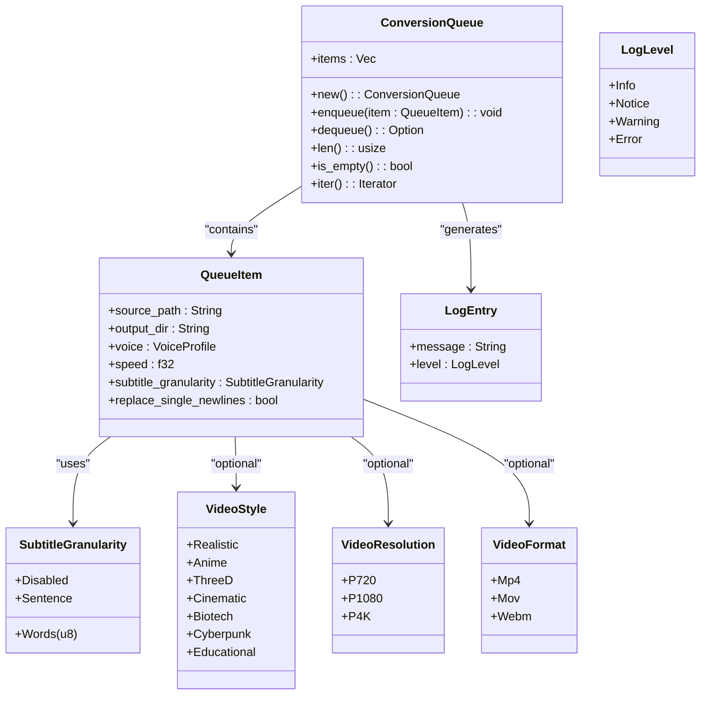

# Queue Processing

<cite>
**Referenced Files in This Document**   
- [queue.rs](file://src/queue.rs)
- [state.rs](file://abogen-ui/crates/ui/state.rs)
- [queue_modal.rs](file://abogen-ui/crates/ui/components/queue_modal.rs)
- [tts_service.rs](file://abogen-ui/crates/ui/services/tts_service.rs)
</cite>

## Table of Contents
1. [Introduction](#introduction)
2. [Queue System Architecture](#queue-system-architecture)
3. [Core Components](#core-components)
4. [UI State Integration](#ui-state-integration)
5. [Queue Processing Workflow](#queue-processing-workflow)
6. [Queue Modal Implementation](#queue-modal-implementation)
7. [Error Handling and Recovery](#error-handling-and-recovery)
8. [Performance Considerations](#performance-considerations)
9. [Conclusion](#conclusion)

## Introduction
The queue processing system in Voxweave manages multiple text-to-speech conversion jobs with prioritization, status tracking, and error handling. This document details the implementation of the job management system, focusing on the interaction between the backend queue structure and the frontend UI state management. The system enables users to add multiple files to a processing queue, configure conversion options for each item, and process them sequentially with real-time progress updates and cancellation support.

## Queue System Architecture



**Diagram sources**
- [queue.rs](file://src/queue.rs#L61-L130)

**Section sources**
- [queue.rs](file://src/queue.rs#L1-L154)

## Core Components

The queue system is built around the `ConversionQueue` struct which implements a FIFO (First-In-First-Out) data structure for managing conversion jobs. Each `QueueItem` contains all necessary information for processing a single file, including the source path, output directory, voice profile, speed settings, and subtitle configuration.

The `ConversionQueue` provides standard queue operations:
- `enqueue()`: Adds a new item to the end of the queue
- `dequeue()`: Removes and returns the first item from the queue
- `len()`: Returns the current number of items in the queue
- `is_empty()`: Checks if the queue is empty
- `iter()`: Provides an iterator over queue items

The system includes comprehensive test coverage to ensure FIFO ordering is preserved during processing, as demonstrated in the `queue_preserves_fifo_order` test case.

**Section sources**
- [queue.rs](file://src/queue.rs#L61-L130)

## UI State Integration

```mermaid
classDiagram
class AppState {
+selected_file : Signal<Option<FileInfo>>
+queue : Signal<Vec<QueuedItem>>
+voice : Signal<String>
+speed : Signal<f64>
+subtitle_mode : Signal<SubtitleMode>
+voice_format : Signal<VoiceFormat>
+subtitle_format : Signal<SubtitleFormat>
+replace_newlines : Signal<bool>
+save_location : Signal<SaveLocation>
+use_gpu : Signal<bool>
+generate_video : Signal<bool>
+video_style : Signal<VideoStyle>
+video_resolution : Signal<VideoResolution>
+video_format : Signal<VideoFormat>
+video_prompt : Signal<Option<String>>
+is_processing : Signal<bool>
+progress : Signal<u8>
+logs : Signal<Vec<LogEntry>>
+cancel_token : Signal<Option<()>>
}
class QueuedItem {
+file : FileInfo
+voice : String
+speed : f64
+subtitle_mode : SubtitleMode
+voice_format : VoiceFormat
+subtitle_format : SubtitleFormat
+replace_newlines : bool
+use_gpu : bool
+generate_video : bool
+video_style : VideoStyle
+video_resolution : VideoResolution
+video_format : VideoFormat
+video_prompt : Option<String>
+save_location : SaveLocation
}
class FileInfo {
+name : String
+path : String
+size : u64
}
class LogEntry {
+message : String
+level : LogLevel
}
AppState --> QueuedItem : "manages"
AppState --> LogEntry : "contains"
QueuedItem --> FileInfo : "references"
QueuedItem --> VideoStyle : "uses"
QueuedItem --> VideoResolution : "uses"
QueuedItem --> VideoFormat : "uses"
```

**Diagram sources**
- [state.rs](file://abogen-ui/crates/ui/state.rs#L186-L255)

**Section sources**
- [state.rs](file://abogen-ui/crates/ui/state.rs#L1-L255)

The UI state management is centered around the `AppState` struct which uses Dioxus signals to maintain reactive state across the application. The `queue` field is a signal containing a vector of `QueuedItem` objects, each representing a file ready for processing with its associated conversion options.

When a user adds a file to the queue, the system creates a `QueuedItem` using the current state values (voice, speed, subtitle settings, etc.) and appends it to the queue. The UI components reactively update to reflect the current queue state, including the number of items and processing status.

## Queue Processing Workflow

```mermaid
sequenceDiagram
participant UI as "UI Component"
participant State as "AppState"
participant Service as "TTS Service"
participant Engine as "TTS Engine"
UI->>State : Add file to queue
State->>State : Update queue signal
UI->>State : Start processing
State->>Service : Call process_queue()
loop For each queued item
Service->>Service : Check cancellation token
alt Cancelled
Service->>State : Update logs
Service->>UI : Return error
break
end
Service->>Service : Validate source file
alt File missing
Service->>State : Add error log
Service->>Service : Continue to next item
end
Service->>Service : Read source text
Service->>Service : Clean text
Service->>Engine : Synthesize audio
Engine->>Service : Return audio path
Service->>Service : Convert audio format
Service->>Service : Generate subtitles
Service->>Service : Generate video (if enabled)
Service->>State : Update progress (0-100%)
Service->>State : Add completion log
end
Service->>State : Set progress to 100%
Service->>State : Add success log
Service->>UI : Return success
```

**Diagram sources**
- [tts_service.rs](file://abogen-ui/crates/ui/services/tts_service.rs#L211-L540)

**Section sources**
- [tts_service.rs](file://abogen-ui/crates/ui/services/tts_service.rs#L1-L540)

The queue processing workflow begins when the user clicks the "START" button on the main screen. The `MainScreen` component validates that the queue is not empty and processing is not already in progress, then spawns an asynchronous task to process the queue.

The `process_queue` function in `tts_service.rs` handles the actual processing:
1. It iterates through each `QueuedItem` in sequence
2. For each item, it checks for cancellation via the `cancel_token`
3. Validates the source file exists before processing
4. Reads and cleans the source text
5. Generates audio using the selected TTS engine (Kokoro or Coqui)
6. Converts the audio to the requested format (WAV, MP3, or FLAC)
7. Generates subtitles if enabled
8. Optionally generates video using Z.AI or MLT
9. Updates progress and logs throughout the process

Progress is reported as a percentage (0-100) based on the number of completed items and their processing stages. The UI updates in real-time, providing visual feedback on the current processing status.

## Queue Modal Implementation

```mermaid
flowchart TD
A[Queue Modal Open] --> B{Queue Empty?}
B --> |Yes| C[Display "Queue is empty"]
B --> |No| D[Display Queue Items]
D --> E[For each item]
E --> F[Show file name and options]
F --> G{Position}
G --> |Not first| H[Show Move Up button]
G --> |Not last| I[Show Move Down button]
G --> J[Show Remove button]
H --> K[Swap with previous item]
I --> L[Swap with next item]
J --> M[Remove item from queue]
M --> N[Update queue signal]
K --> N
L --> N
N --> O[Re-render queue]
P[Close Modal] --> Q[Hide modal]
```

**Diagram sources**
- [queue_modal.rs](file://abogen-ui/crates/ui/components/queue_modal.rs#L1-L194)

**Section sources**
- [queue_modal.rs](file://abogen-ui/crates/ui/components/queue_modal.rs#L1-L194)

The `QueueModal` component provides a visual interface for managing the processing queue. When opened, it displays all queued items with their configuration options and provides controls for reordering and removing items.

Key features of the queue modal:
- **Item Display**: Shows each queued file with its name, voice, speed, audio format, and subtitle format
- **Reordering**: Up and down arrows allow users to change the processing order of items
- **Removal**: Each item has a remove button (✕) to delete it from the queue
- **Empty State**: Displays a message when the queue is empty
- **Responsive Design**: Uses flexbox layout with proper overflow handling for long queues

The modal is implemented as a Dioxus component that takes the `AppState` and an `is_open` signal as parameters. It uses the `queue` signal from the app state to display the current queue contents and updates the state directly when users modify the queue.

## Error Handling and Recovery

The queue processing system implements comprehensive error handling to manage various failure scenarios:

1. **Missing Source Files**: Before processing each item, the system checks if the source file exists. If not, it logs an error and continues to the next item rather than stopping the entire queue.

2. **Processing Interruptions**: Users can cancel processing at any time using the "CANCEL" button. The system sets a `cancel_token` in the app state, which is checked at the beginning of each item's processing cycle.

3. **TTS Engine Failures**: If audio synthesis fails, the error is caught and logged, allowing the system to continue with subsequent items.

4. **Format Conversion Issues**: When converting audio formats using ffmpeg, any failures are captured and returned as errors.

5. **Video Generation Failures**: If Z.AI video generation fails, the system logs the error and attempts fallback video generation methods.

The system uses a resilient approach where individual item failures do not prevent the processing of other queue items. Each error is logged with appropriate severity level (Error, Warning, Notice) and displayed in the UI's log panel for user visibility.

**Section sources**
- [tts_service.rs](file://abogen-ui/crates/ui/services/tts_service.rs#L211-L540)

## Performance Considerations

When managing large queues, several performance optimizations are implemented:

1. **Memory Usage**: The queue stores only essential information for each item, minimizing memory footprint. File contents are loaded only during processing and not stored in memory.

2. **UI Responsiveness**: The processing task runs asynchronously and yields control periodically using `tokio::task::yield_now().await` to prevent UI freezing.

3. **Progressive Updates**: Progress is updated incrementally, providing smooth visual feedback without overwhelming the rendering system.

4. **Batch Processing**: Items are processed sequentially but each step (audio generation, format conversion, subtitle creation) is optimized for performance.

5. **Resource Management**: Temporary files are cleaned up after processing, and system resources are released promptly.

For optimal performance with large queues:
- Process items in smaller batches
- Use GPU acceleration when available
- Choose efficient audio formats (WAV for fastest processing)
- Monitor system resources during extended processing sessions

**Section sources**
- [tts_service.rs](file://abogen-ui/crates/ui/services/tts_service.rs#L211-L540)

## Conclusion
The queue processing system in Voxweave provides a robust framework for managing multiple text-to-speech conversion jobs with comprehensive UI integration. The separation of concerns between the backend `ConversionQueue` and frontend `AppState` enables efficient job management with real-time feedback. The system supports prioritization through manual reordering, comprehensive status tracking via progress percentages and log entries, and resilient error handling that allows partial queue completion. The `QueueModal` component offers an intuitive interface for queue management, while the `process_queue` function handles the complex workflow of audio and video generation with proper cancellation support and resource management.