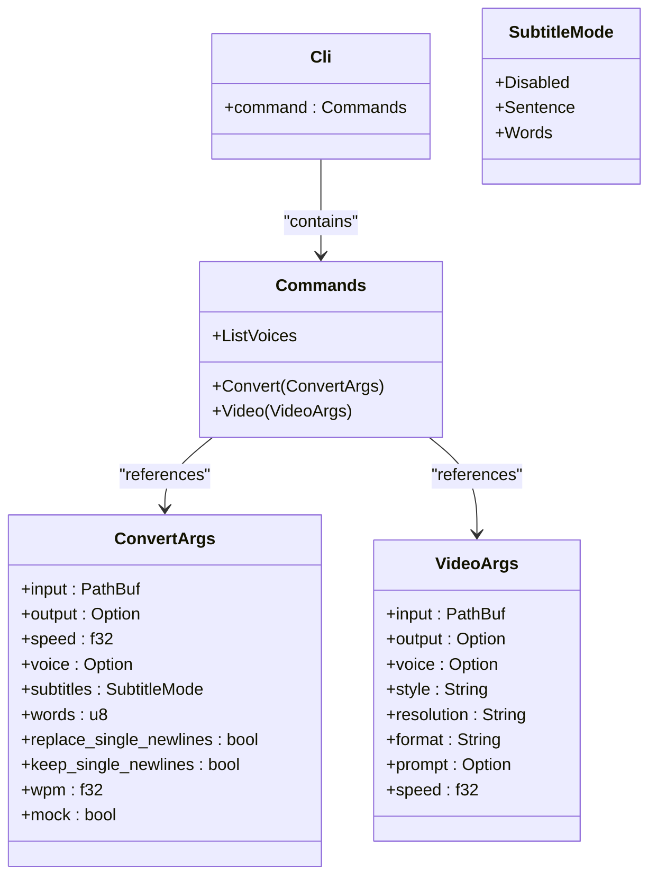
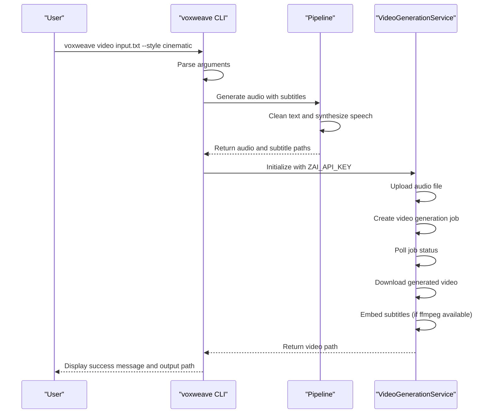
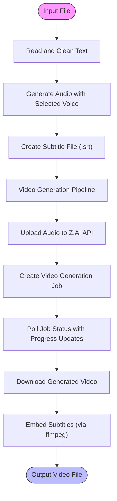
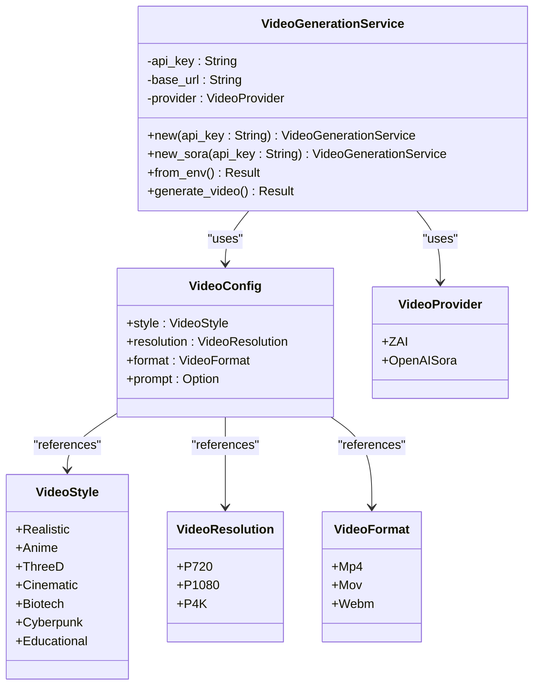

# CLI Usage

<cite>
**Referenced Files in This Document**   
- [src/main.rs](file://src/main.rs)
- [src/pipeline.rs](file://src/pipeline.rs)
- [src/video.rs](file://src/video.rs)
- [CLI_VIDEO_GENERATION.md](file://CLI_VIDEO_GENERATION.md)
- [VIDEO_CLI_QUICKREF.md](file://VIDEO_CLI_QUICKREF.md)
- [VIDEO_CLI_IMPLEMENTATION.md](file://VIDEO_CLI_IMPLEMENTATION.md)
</cite>

## Table of Contents
1. [Introduction](#introduction)
2. [Command Structure](#command-structure)
3. [Subcommands Overview](#subcommands-overview)
4. [Pipeline Orchestration](#pipeline-orchestration)
5. [Video Generation Implementation](#video-generation-implementation)
6. [Error Handling and Progress Reporting](#error-handling-and-progress-reporting)
7. [Advanced Usage Patterns](#advanced-usage-patterns)
8. [Conclusion](#conclusion)

## Introduction

The voxweave command-line interface provides a powerful tool for text-to-speech and video generation workflows. Built using Rust and the clap library, it offers three primary subcommands: `convert`, `list-voices`, and `video`. The CLI enables users to transform text content into audio with subtitles, generate AI-powered videos with embedded narration, and manage voice profiles efficiently. This documentation details the complete CLI functionality, focusing on practical usage patterns and underlying implementation.

**Section sources**
- [src/main.rs](file://src/main.rs#L1-L418)
- [CLI_VIDEO_GENERATION.md](file://CLI_VIDEO_GENERATION.md#L1-L324)

## Command Structure

The voxweave CLI follows a structured command pattern implemented through the clap library in src/main.rs. The main application entry point defines a top-level command with subcommands for different operations. Each subcommand accepts specific arguments and options that control the processing pipeline.

The core command structure is defined by the `Cli` struct which serves as the root parser, containing a `Commands` enum that represents the available subcommands. This design pattern allows for clear separation of concerns between different functionality domains while maintaining a consistent interface.



**Diagram sources**
- [src/main.rs](file://src/main.rs#L32-L145)

**Section sources**
- [src/main.rs](file://src/main.rs#L32-L145)
- [VIDEO_CLI_QUICKREF.md](file://VIDEO_CLI_QUICKREF.md#L1-L172)

## Subcommands Overview

### Convert Subcommand

The `convert` subcommand transforms text input into audio output with optional subtitle generation. It processes input files (text or Markdown) through a text cleaning pipeline before synthesizing speech using the selected voice engine. The command supports various options for controlling output format, playback speed, and subtitle behavior.

Key features include:
- Text normalization and cleaning
- Multiple voice engine support (eSpeak, Kokoro, Coqui)
- Configurable subtitle granularity (disabled, sentence, or word-based)
- Speed adjustment for audio output
- Mock mode for testing without actual audio generation

### List-Voices Subcommand

The `list-voices` command displays all available voice profiles with their identifiers, engine types, and descriptions. This read-only operation helps users identify appropriate voice options for their content before processing.

### Video Subcommand

The `video` subcommand orchestrates a complete video generation pipeline that combines audio synthesis with AI-powered visual generation. When the `video-generation` feature flag is enabled, this command becomes available and requires the ZAI_API_KEY environment variable for authentication with the video generation service.

The video command accepts several parameters:
- **--voice**: Specifies the voice profile for narration
- **--speed**: Controls audio playback speed (default: 1.0)
- **--style**: Selects the visual style (cyberpunk, cinematic, anime, etc.)
- **--resolution**: Sets output resolution (720p, 1080p, 4k)
- **--format**: Determines container format (mp4, mov, webm)
- **--prompt**: Provides custom visual guidance for the AI generator



**Diagram sources**
- [src/main.rs](file://src/main.rs#L147-L418)
- [src/video.rs](file://src/video.rs#L1-L463)

**Section sources**
- [src/main.rs](file://src/main.rs#L147-L418)
- [VIDEO_CLI_QUICKREF.md](file://VIDEO_CLI_QUICKREF.md#L1-L172)

## Pipeline Orchestration

The text-to-video pipeline is coordinated through the `pipeline.rs` module, which defines the `ConvertRequest` structure and associated processing functions. This module serves as the bridge between the CLI interface and the underlying audio generation components.

The pipeline execution follows these steps:
1. Read and clean the input text
2. Create a sanitized output filename based on the input
3. Generate audio using the selected voice engine
4. Create subtitle files when requested
5. Return the output path for downstream processing

The `convert_path` function accepts any speech engine implementation that satisfies the `SpeechEngine` trait, enabling flexibility in audio generation backends. The pipeline also handles directory creation and file I/O operations, ensuring proper error handling throughout the process.

For video generation, the CLI reuses the existing audio pipeline before proceeding to visual generation, demonstrating code reuse and modular design principles.



**Diagram sources**
- [src/pipeline.rs](file://src/pipeline.rs#L1-L140)
- [src/main.rs](file://src/main.rs#L147-L418)

**Section sources**
- [src/pipeline.rs](file://src/pipeline.rs#L1-L140)
- [VIDEO_CLI_IMPLEMENTATION.md](file://VIDEO_CLI_IMPLEMENTATION.md#L1-L335)

## Video Generation Implementation

The video generation functionality is implemented in `src/video.rs` as the `VideoGenerationService` struct, which handles communication with the Z.AI API. This service provides a comprehensive interface for creating narrated videos from audio and subtitle inputs.

The implementation follows a five-step process:
1. **File Upload**: The audio file is uploaded to Z.AI's storage system
2. **Job Creation**: A video generation job is created with specified parameters
3. **Status Polling**: The system polls for job completion with progress updates
4. **Video Download**: The generated video is downloaded to the local filesystem
5. **Subtitle Embedding**: Subtitles are embedded into the video using ffmpeg

The service supports multiple providers through the `VideoProvider` enum, currently including ZAI and OpenAISora. Configuration is managed through the `VideoConfig` struct, which encapsulates style, resolution, format, and prompt settings.

Authentication is handled through environment variables (`ZAI_API_KEY` or `OPENAI_API_KEY`), with fallback behavior that prioritizes OpenAI credentials. The implementation includes robust error handling for network issues, API errors, and timeout conditions.



**Diagram sources**
- [src/video.rs](file://src/video.rs#L1-L463)
- [VIDEO_CLI_IMPLEMENTATION.md](file://VIDEO_CLI_IMPLEMENTATION.md#L1-L335)

**Section sources**
- [src/video.rs](file://src/video.rs#L1-L463)
- [VIDEO_CLI_IMPLEMENTATION.md](file://VIDEO_CLI_IMPLEMENTATION.md#L1-L335)

## Error Handling and Progress Reporting

The CLI implements comprehensive error handling across all operations, providing clear feedback to users when issues occur. Errors are propagated using the `anyhow` crate, which preserves context throughout the call stack.

Common error scenarios and their handling:
- **Missing API Key**: The system checks for `ZAI_API_KEY` or `OPENAI_API_KEY` environment variables and provides specific instructions for setting them
- **Voice Not Found**: Validates voice identifiers against available profiles and suggests running `list-voices`
- **File I/O Errors**: Provides detailed context about file operations that fail
- **Network Errors**: Handles HTTP status codes and API error messages from remote services
- **Timeout Conditions**: Implements a 5-minute timeout for video generation with appropriate messaging

Progress reporting is implemented through callback functions that provide real-time feedback during long-running operations. The video generation process displays a percentage-based progress indicator and status messages for each stage of processing. Success and failure states are clearly indicated with checkmark (✓) and cross (✗) symbols in the terminal output.

The system also implements graceful degradation:
- When ffmpeg is unavailable, subtitles are provided as a separate .srt file
- Large audio files are handled with file:// URLs as fallback when upload fails
- Invalid style, resolution, or format values use sensible defaults

**Section sources**
- [src/main.rs](file://src/main.rs#L147-L418)
- [src/video.rs](file://src/video.rs#L1-L463)
- [CLI_VIDEO_GENERATION.md](file://CLI_VIDEO_GENERATION.md#L1-L324)

## Advanced Usage Patterns

### Batch Processing Scripts

The CLI's design enables automation through shell scripts for batch processing multiple files. Simple for-loops can process entire directories of content:

```bash
for file in content/*.txt; do
  voxweave video "$file" --style educational --resolution 1080p
done
```

For parallel processing, GNU parallel can be used to generate multiple videos concurrently:

```bash
parallel voxweave video {} --style educational ::: content/*.txt
```

### CI/CD Integration

The CLI is well-suited for integration into continuous integration and deployment pipelines. A GitHub Actions workflow might look like:

```yaml
name: Generate Video
on: [push]
jobs:
  video:
    runs-on: ubuntu-latest
    steps:
      - uses: actions/checkout@v2
      - name: Install Rust
        uses: actions-rs/toolchain@v1
      - name: Build VoxWeave
        run: cargo build --release --features video-generation
      - name: Generate Video
        env:
          ZAI_API_KEY: ${{ secrets.ZAI_API_KEY }}
        run: |
          ./target/release/voxweave video content.txt --style educational
```

### Scheduled Content Generation

Cron jobs can automate regular content creation:

```bash
#!/bin/bash
export ZAI_API_KEY="your_key_here"
DATE=$(date +%Y-%m-%d)
voxweave video "daily-content-${DATE}.txt" \
  --output "videos/${DATE}" \
  --style educational \
  --resolution 1080p
```

These advanced patterns leverage the CLI's scriptable interface, environment variable configuration, and predictable output structure to enable automated workflows in server environments and continuous integration systems.

**Section sources**
- [VIDEO_CLI_IMPLEMENTATION.md](file://VIDEO_CLI_IMPLEMENTATION.md#L1-L335)
- [CLI_VIDEO_GENERATION.md](file://CLI_VIDEO_GENERATION.md#L1-L324)
- [VIDEO_CLI_QUICKREF.md](file://VIDEO_CLI_QUICKREF.md#L1-L172)

## Conclusion

The voxweave CLI provides a comprehensive interface for text-to-speech and AI video generation workflows. Its modular architecture separates concerns between command parsing, audio processing, and video generation, enabling both simple usage for beginners and advanced automation for experienced users.

The implementation demonstrates effective use of Rust's type system and async capabilities, with clear error handling and progress reporting throughout long-running operations. By leveraging established libraries like clap for argument parsing and reqwest for HTTP operations, the CLI maintains reliability while focusing on domain-specific functionality.

For users, the CLI offers a powerful alternative to the desktop interface, particularly for batch processing, automation, and server-based deployments. The comprehensive documentation and example workflows lower the barrier to entry while still providing depth for advanced use cases.

**Section sources**
- [src/main.rs](file://src/main.rs#L1-L418)
- [src/pipeline.rs](file://src/pipeline.rs#L1-L140)
- [src/video.rs](file://src/video.rs#L1-L463)
- [CLI_VIDEO_GENERATION.md](file://CLI_VIDEO_GENERATION.md#L1-L324)
- [VIDEO_CLI_QUICKREF.md](file://VIDEO_CLI_QUICKREF.md#L1-L172)
- [VIDEO_CLI_IMPLEMENTATION.md](file://VIDEO_CLI_IMPLEMENTATION.md#L1-L335)