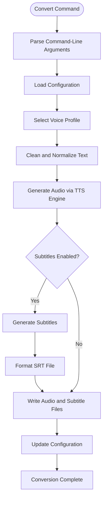
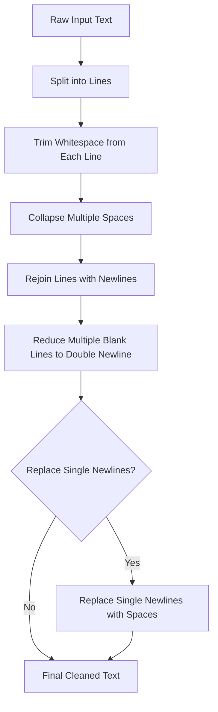
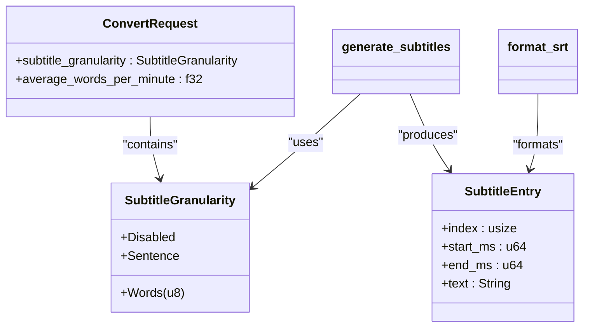
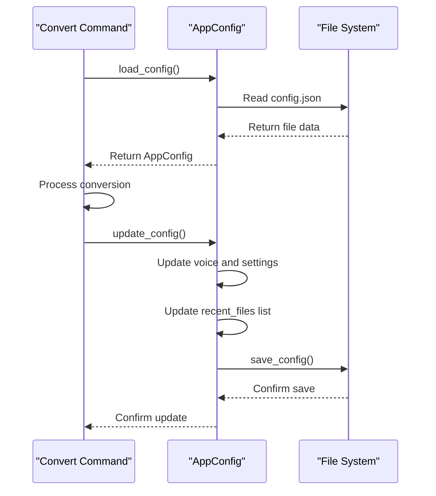
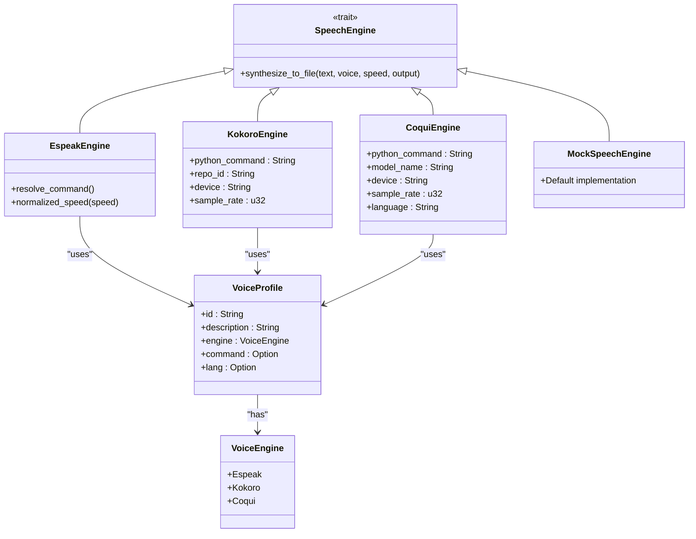

# Convert Command

<cite>
**Referenced Files in This Document**   
- [main.rs](file://src/main.rs)
- [pipeline.rs](file://src/pipeline.rs)
- [config.rs](file://src/config.rs)
- [subtitle.rs](file://src/subtitle.rs)
- [text.rs](file://src/text.rs)
- [tts.rs](file://src/tts.rs)
- [sanitize.rs](file://src/sanitize.rs)
- [queue.rs](file://src/queue.rs)
- [coqui_tts.rs](file://src/coqui_tts.rs)
</cite>

## Table of Contents
1. [Introduction](#introduction)
2. [Command Options](#command-options)
3. [Usage Examples](#usage-examples)
4. [Conversion Pipeline](#conversion-pipeline)
5. [Text Processing](#text-processing)
6. [Subtitle Generation](#subtitle-generation)
7. [Configuration and Persistence](#configuration-and-persistence)
8. [Error Handling](#error-handling)
9. [TTS Engine Integration](#tts-engine-integration)
10. [Advanced Features](#advanced-features)

## Introduction

The `convert` subcommand in the voxweave CLI transforms text and markdown files into audio files with optional SRT subtitles. This command serves as the primary interface for the text-to-speech pipeline, providing users with extensive control over voice selection, audio speed, subtitle formatting, and output configuration. The implementation in `src/main.rs` uses clap for command-line argument parsing and orchestrates the conversion process through the core pipeline in `src/pipeline.rs`.

The conversion process follows a structured workflow: text input is cleaned and normalized, audio is generated using the selected TTS engine, and subtitles are created based on the specified granularity. The command supports multiple TTS engines including espeak, Kokoro, and CoquiTTS (when built with the appropriate feature flag), allowing users to choose from various voices and synthesis qualities.

**Section sources**
- [main.rs](file://src/main.rs#L73-L104)

## Command Options

The `convert` command provides several options to customize the audio generation process:

- **--voice**: Specifies the voice identifier for speech synthesis. Users can view available voices with the `list-voices` command. The voice selection follows a hierarchy: command-line argument takes precedence, then the default voice from configuration, and finally falls back to the first available voice.

- **--speed**: Controls the playback speed multiplier where 1.0 represents normal speed. Values above 1.0 increase speed while values below 1.0 slow it down.

- **--output**: Sets the output directory for generated files. If not specified, the output is placed in the same directory as the input file.

- **--subtitles**: Determines the subtitle style with three options: `disabled` (no subtitles), `sentence` (one subtitle per sentence), and `words` (grouped by word count).

- **--words**: Specifies the number of words per subtitle when using `--subtitles words`. Defaults to 3 words per subtitle.

- **--replace-single-newlines**: Forces replacement of single newlines with spaces during text processing, useful for handling text formatted with hard wraps.

- **--keep-single-newlines**: Preserves single newlines in the text (overrides configuration), maintaining paragraph breaks in the output.

- **--wpm**: Sets the average words-per-minute for subtitle timing calculations, affecting the duration each subtitle is displayed.

- **--mock**: Uses the mock engine which writes cleaned text instead of generating audio, useful for testing without requiring TTS dependencies.

**Section sources**
- [main.rs](file://src/main.rs#L73-L104)

## Usage Examples

### Basic Audio Generation

The simplest usage converts a text file to audio using default settings:

```bash
voxweave convert samples/example.txt
```

This generates an audio file in the same directory as the input with the default voice and normal speed. To specify a custom output directory:

```bash
voxweave convert input.md --output ./audio_output
```

### Subtitle Configuration

To generate subtitles along with audio, use the `--subtitles` option:

```bash
voxweave convert document.txt --subtitles sentence
```

This creates both an audio file and an SRT subtitle file with one subtitle per sentence. For word-by-word subtitles with 4 words per group:

```bash
voxweave convert story.md --subtitles words --words 4
```

To disable subtitles entirely:

```bash
voxweave convert notes.txt --subtitles disabled
```

### Speed Adjustments

Adjust the playback speed for faster or slower narration:

```bash
voxweave convert lecture.txt --speed 1.2
```

This increases the speed by 20%. For a slower, more deliberate reading:

```bash
voxweave convert poetry.md --speed 0.8
```

### Voice Selection

Convert with a specific voice:

```bash
voxweave convert article.txt --voice en-us
```

To see all available voices:

```bash
voxweave list-voices
```

### Advanced Combinations

Combine multiple options for precise control:

```bash
voxweave convert book.md \
  --voice af_alloy \
  --speed 1.1 \
  --subtitles sentence \
  --output ./audiobook \
  --replace-single-newlines
```

For testing without audio generation:

```bash
voxweave convert draft.txt --mock --voice en-gb
```

**Section sources**
- [main.rs](file://src/main.rs#L73-L104)
- [pipeline.rs](file://src/pipeline.rs#L21-L55)

## Conversion Pipeline

The conversion process is orchestrated through the `convert_path` function in `src/pipeline.rs`, which serves as the core of the audio generation workflow. This function coordinates text processing, audio synthesis, and subtitle generation in a structured sequence.



**Diagram sources **
- [pipeline.rs](file://src/pipeline.rs#L21-L55)
- [main.rs](file://src/main.rs#L106-L188)

**Section sources**
- [pipeline.rs](file://src/pipeline.rs#L21-L55)

## Text Processing

Text processing is handled by the `clean_text` function in `src/text.rs`, which normalizes input text before audio generation. This process ensures consistent formatting and improves speech synthesis quality.

The cleaning process involves several steps:
1. Trimming whitespace from the beginning and end of each line
2. Collapsing multiple spaces into single spaces within lines
3. Reducing multiple consecutive blank lines to exactly two newlines
4. Optionally replacing single newlines with spaces based on the `replace_single_newlines` flag



The text cleaning process is essential for handling various text formatting styles, particularly markdown files that may use hard wraps or inconsistent spacing. The `replace_single_newlines` option is particularly useful for processing text that uses line breaks for formatting rather than paragraph separation.

**Diagram sources **
- [text.rs](file://src/text.rs#L3-L68)
- [sanitize.rs](file://src/sanitize.rs#L3-L160)

**Section sources**
- [text.rs](file://src/text.rs#L3-L68)

## Subtitle Generation

Subtitle generation is implemented in `src/subtitle.rs` and follows a structured approach to create timed SRT files that synchronize with the generated audio. The process involves chunking text according to the specified granularity and calculating appropriate timing based on reading speed.



**Diagram sources **
- [subtitle.rs](file://src/subtitle.rs#L3-L154)
- [queue.rs](file://src/queue.rs#L78-L88)

**Section sources**
- [subtitle.rs](file://src/subtitle.rs#L3-L154)

The `generate_subtitles` function creates subtitle entries based on the selected granularity:
- **Sentence mode**: Splits text at sentence boundaries using punctuation marks
- **Words mode**: Groups words into chunks of the specified size
- **Disabled mode**: Returns an empty list of subtitles

Timing is calculated based on the average words-per-minute (wpm) setting, with each word allocated a specific duration in milliseconds. The formula uses 60,000 milliseconds per minute divided by the wpm value to determine milliseconds per word. A minimum duration of 500ms is enforced for each subtitle entry to ensure readability.

The `format_srt` function converts subtitle entries into the standard SRT format with sequential numbering, timestamp formatting in HH:MM:SS,mmm format, and proper spacing between entries.

## Configuration and Persistence

The voxweave CLI maintains user preferences through a configuration system implemented in `src/config.rs`. This system persists the default voice selection, newline handling preference, and recent files list across sessions.



**Diagram sources **
- [config.rs](file://src/config.rs#L3-L115)
- [main.rs](file://src/main.rs#L190-L215)

**Section sources**
- [config.rs](file://src/config.rs#L3-L115)

The configuration is stored in a JSON file located in the operating system's standard configuration directory (e.g., ~/.config/voxweave/config.json on Linux). The `AppConfig` struct contains three key fields:
- **default_voice**: Stores the last used or preferred voice identifier
- **replace_single_newlines**: Remembers the user's preference for newline handling
- **recent_files**: Maintains a list of recently processed files (limited to 10 items)

When a conversion completes successfully, the configuration is automatically updated to reflect the current voice selection and newline handling setting. The input file is added to the recent files list, with duplicates removed and the list truncated to the most recent 10 files.

## Error Handling

The convert command implements comprehensive error handling to provide meaningful feedback when issues occur during the conversion process. Errors are propagated using the `anyhow` crate, which provides rich context for debugging.

Key error scenarios and handling:
- **Voice not found**: When a specified voice cannot be found in the available profiles, the command returns a clear error message suggesting the user run `voxweave list-voices` to see available options.

- **File I/O errors**: Issues with reading input files or writing output files generate descriptive error messages that include the file path and specific error cause.

- **TTS engine errors**: Problems with speech synthesis are reported with context about which engine failed and the nature of the failure.

- **Configuration errors**: Issues with loading or saving the configuration file are handled gracefully, with the system falling back to default settings when the config file is missing or corrupted.

The main error handling occurs in the `run` function in `src/main.rs`, which catches all errors and prints them to stderr with the "Error:" prefix before exiting with a non-zero status code. This ensures that even if unexpected errors occur, they are properly reported to the user rather than causing a panic.

**Section sources**
- [main.rs](file://src/main.rs#L5-L10)
- [tts.rs](file://src/tts.rs#L3-L520)

## TTS Engine Integration

The convert command integrates with multiple TTS engines through a unified interface defined by the `SpeechEngine` trait in `src/tts.rs`. This abstraction allows the pipeline to work with different speech synthesis backends while maintaining a consistent API.



**Diagram sources **
- [tts.rs](file://src/tts.rs#L3-L520)
- [coqui_tts.rs](file://src/coqui_tts.rs#L3-L113)

**Section sources**
- [tts.rs](file://src/tts.rs#L3-L520)

The system supports four engine types:
- **EspeakEngine**: Uses the espeak-ng command-line tool for speech synthesis
- **KokoroEngine**: Interfaces with the Kokoro TTS system through a Python bridge
- **CoquiEngine**: Integrates with CoquiTTS for high-quality speech with voice cloning capabilities
- **MockSpeechEngine**: Writes cleaned text to the output file instead of generating audio, useful for testing

The engine selection is determined by the voice profile's engine field, which is matched against the available engines. The `convert` command instantiates the appropriate engine based on this selection and passes it to the `convert_path` function in the pipeline.

## Advanced Features

### Mock Mode

The `--mock` option enables a testing mode that writes the cleaned text to the output file instead of generating audio. This feature is invaluable for developers and users who want to:
- Verify text processing behavior without installing TTS dependencies
- Test the pipeline with large files quickly
- Debug issues with text cleaning and formatting
- Preview how the input text will be processed before full audio generation

### Voice Management

The system provides comprehensive voice management through the `default_voice_profiles` function and `find_voice` utility. Users can:
- List all available voices with `voxweave list-voices`
- Select voices by ID from espeak, Kokoro, or CoquiTTS engines
- Benefit from automatic voice persistence in configuration
- Access detailed voice information including engine type and description

### Cross-Platform Compatibility

The `sanitize_name_for_os` function in `src/sanitize.rs` ensures generated filenames are compatible across different operating systems by:
- Replacing invalid characters with underscores
- Handling platform-specific reserved names (e.g., CON, PRN on Windows)
- Truncating long filenames to 255 characters
- Preventing hidden files on macOS and Linux by modifying names that start with a dot

This ensures that output files can be reliably created on Windows, macOS, and Linux systems without filename conflicts or compatibility issues.

**Section sources**
- [sanitize.rs](file://src/sanitize.rs#L3-L160)
- [main.rs](file://src/main.rs#L106-L188)
- [tts.rs](file://src/tts.rs#L3-L520)