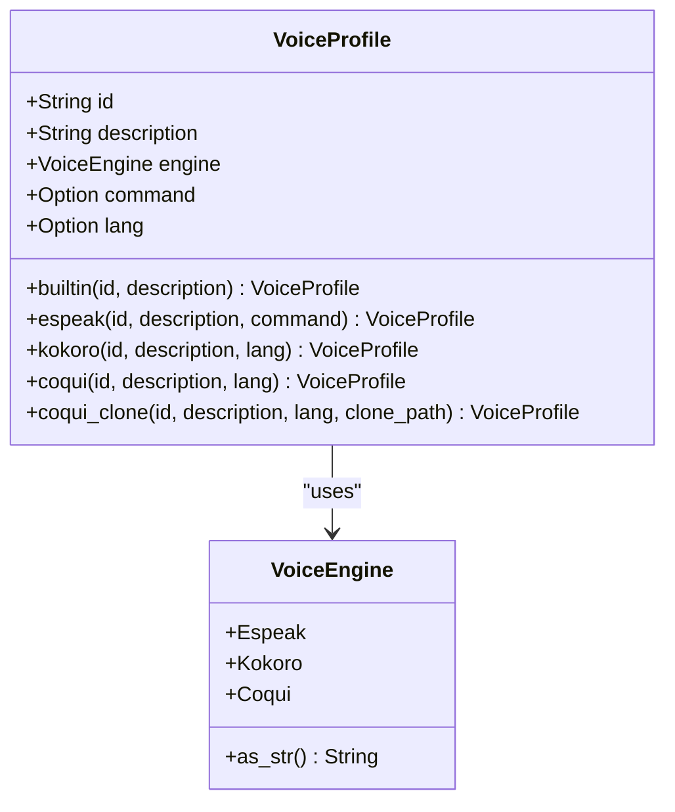
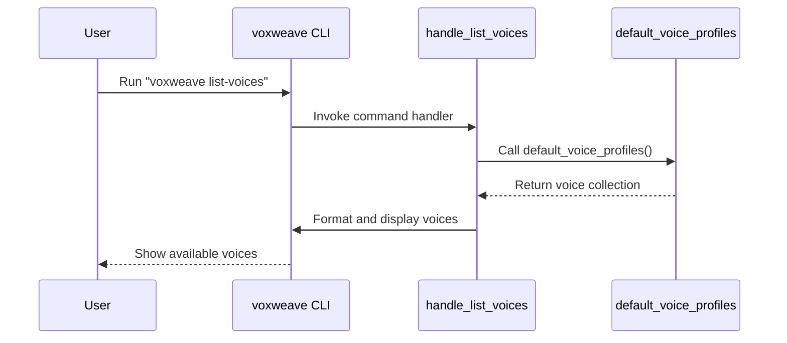

# List Voices Command

<cite>
**Referenced Files in This Document**   
- [main.rs](file://src/main.rs)
- [tts.rs](file://src/tts.rs)
- [COQUI_TTS_IMPLEMENTATION.md](file://COQUI_TTS_IMPLEMENTATION.md)
</cite>

## Table of Contents
1. [Introduction](#introduction)
2. [Command Purpose and Functionality](#command-purpose-and-functionality)
3. [Voice Profile Structure](#voice-profile-structure)
4. [Output Format and Display](#output-format-and-display)
5. [Voice Retrieval Mechanism](#voice-retrieval-mechanism)
6. [Voice Engine Types](#voice-engine-types)
7. [Usage Examples](#usage-examples)
8. [Common Issues and Troubleshooting](#common-issues-and-troubleshooting)
9. [Conclusion](#conclusion)

## Introduction
The `list-voices` subcommand in the voxweave CLI provides users with a comprehensive overview of all available text-to-speech (TTS) voices. This command serves as an essential reference tool for users to discover voice options before using them in audio generation commands. The implementation is designed to be simple, informative, and accessible to both beginners and advanced users.

**Section sources**
- [main.rs](file://src/main.rs#L186-L198)

## Command Purpose and Functionality
The `list-voices` command displays all available TTS voices that can be used with the voxweave CLI for text-to-speech conversion. When executed, it retrieves the complete set of voice profiles from the system and presents them in a structured format that includes each voice's identifier, engine type, and description.

This command serves several important purposes:
- Allows users to discover what voices are available in their current installation
- Provides the exact voice identifiers needed for other commands
- Shows which TTS engine powers each voice (e.g., espeak, kokoro, coqui)
- Displays descriptive information about each voice's characteristics

The command is particularly useful for new users who are unfamiliar with the voice options and need guidance on which voices to select for their text-to-speech conversions.

**Section sources**
- [main.rs](file://src/main.rs#L186-L198)

## Voice Profile Structure
Each voice in the system is represented by a `VoiceProfile` struct that contains essential information for voice selection and processing. The structure includes the following key fields:

- **id**: A unique identifier string used to reference the voice in commands
- **description**: A human-readable description of the voice characteristics
- **engine**: The TTS engine type that powers the voice synthesis
- **lang**: Optional language code indicating the primary language of the voice
- **command**: Optional additional command or path information (used for voice cloning)

The `VoiceProfile` struct supports multiple construction methods for different voice types, including built-in voices, espeak voices, kokoro voices, and Coqui voices with standard and cloning capabilities.



**Diagram sources**
- [tts.rs](file://src/tts.rs#L36-L43)

## Output Format and Display
The `list-voices` command presents voice information in a clean, tabular format that is easy to read and parse. The output follows a consistent structure with three main columns:

```
Available voices:
  voice_id          engine   Description of the voice characteristics
  en-us             espeak   English (US)
  en-gb             espeak   English (UK)
  af_sarah          kokoro   Sarah (American English)
  coqui-en          coqui    Coqui English
```

The formatting uses fixed-width columns with the following specifications:
- Voice ID: Left-aligned, 16 characters wide
- Engine type: Left-aligned, 8 characters wide
- Description: Variable width, follows the engine column

This tabular layout ensures that voice information is presented consistently, making it easy for users to scan through the available options and identify voices of interest.

**Section sources**
- [main.rs](file://src/main.rs#L186-L198)

## Voice Retrieval Mechanism
The `list-voices` command retrieves voice information through the `default_voice_profiles()` function, which aggregates voices from multiple sources within the system. This function serves as the central repository for all available voices and is called by various components of the application.

The voice retrieval process works as follows:
1. The `handle_list_voices()` function is invoked when the command is executed
2. It calls `default_voice_profiles()` to obtain the complete list of voice profiles
3. The function iterates through each voice in the collection
4. Each voice's information is formatted and printed to the console

The `default_voice_profiles()` function itself combines voices from different engines:
- Espeak voices defined in the `ESPEAK_VOICES` constant
- Kokoro voices generated from the `KOKORO_VOICES` array
- Coqui voices (when the coqui-tts feature is enabled)

This modular approach allows the system to support multiple TTS engines while presenting a unified interface to the user.



**Diagram sources**
- [main.rs](file://src/main.rs#L186-L198)
- [tts.rs](file://src/tts.rs#L286-L294)

## Voice Engine Types
The voxweave system supports multiple TTS engines, each with its own characteristics and capabilities. The `list-voices` command identifies which engine powers each voice, helping users understand the technology behind the voices they select.

### Espeak Engine
The espeak engine provides basic but reliable text-to-speech capabilities with support for multiple languages. These voices are lightweight and don't require additional dependencies.

### Kokoro Engine
The kokoro engine offers higher quality voices with more natural-sounding speech patterns. It requires Python dependencies but provides better audio quality than espeak.

### Coqui Engine
The coqui engine supports advanced features including voice cloning, allowing users to create personalized voices from audio samples. This engine requires additional Python packages (TTS, torch, numpy) and can utilize GPU acceleration.

When the coqui-tts feature is not enabled during compilation, the system will indicate that Coqui support is not available, preventing users from attempting to use Coqui voices.

**Section sources**
- [tts.rs](file://src/tts.rs#L12-L20)
- [COQUI_TTS_IMPLEMENTATION.md](file://COQUI_TTS_IMPLEMENTATION.md#L17-L21)

## Usage Examples
The `list-voices` command is typically used as a reference before executing other commands that require voice selection. Here are common usage patterns:

### Basic Usage
```bash
voxweave list-voices
```
This displays all available voices, allowing users to browse options before making a selection.

### Integration with Convert Command
```bash
# First, list available voices
voxweave list-voices

# Then use a specific voice for conversion
voxweave convert --input sample.txt --voice af_sarah
```

### Finding Voices by Language
Users can pipe the output to grep to find voices for specific languages:
```bash
voxweave list-voices | grep "English"
voxweave list-voices | grep "Spanish"
```

### Using Coqui Voices
When Coqui support is enabled:
```bash
voxweave list-voices | grep "coqui"
voxweave convert --input sample.txt --voice coqui-en
```

The voice identifiers displayed by `list-voices` can be directly used with the `--voice` parameter in other commands like `convert` and `video`.

**Section sources**
- [main.rs](file://src/main.rs#L186-L198)

## Common Issues and Troubleshooting
Users may encounter several common issues when working with the `list-voices` command and voice selection.

### Empty Voice List
If no voices are displayed, check that:
- The application compiled successfully
- Required dependencies are installed
- The binary has execute permissions

### Missing Coqui Voices
Coqui voices will not appear if:
- The application was not compiled with the `coqui-tts` feature flag
- Python dependencies (TTS, torch, numpy) are not installed
- The `--features coqui-tts` flag was not used during compilation

### Engine-Specific Availability
Voice availability depends on the enabled features:
- Basic build: Only espeak and kokoro voices
- With coqui-tts feature: All voices including Coqui options
- Without Python dependencies: Kokoro and Coqui voices may fail

### Voice Not Found Errors
When a voice cannot be found:
- Verify the exact voice ID from `list-voices` output
- Check for typos in the voice identifier
- Ensure the required engine dependencies are installed
- Confirm the voice exists in the current build configuration

Users should always run `voxweave list-voices` to verify available options in their specific installation before attempting to use a voice in other commands.

**Section sources**
- [main.rs](file://src/main.rs#L186-L198)
- [COQUI_TTS_IMPLEMENTATION.md](file://COQUI_TTS_IMPLEMENTATION.md#L17-L21)

## Conclusion
The `list-voices` command is an essential tool in the voxweave CLI that provides transparency into the available text-to-speech options. By displaying voice identifiers, engine types, and descriptions in a clear tabular format, it empowers users to make informed decisions about voice selection for their audio generation tasks.

The command's integration with the `default_voice_profiles()` function ensures that users always have access to up-to-date information about available voices, regardless of the underlying TTS engines or compilation features. This design supports both beginner users who need guidance on voice options and developers who may extend the system with additional voice support.

Understanding the output of `list-voices` is the first step to effectively using the voxweave CLI for text-to-speech conversion, video generation, and other audio processing tasks.