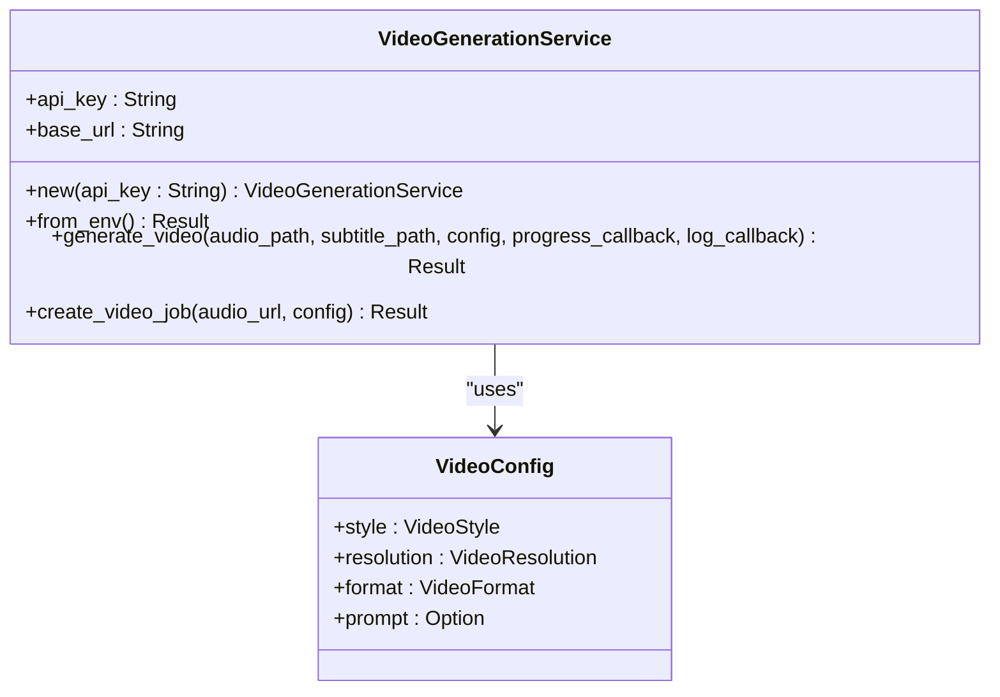
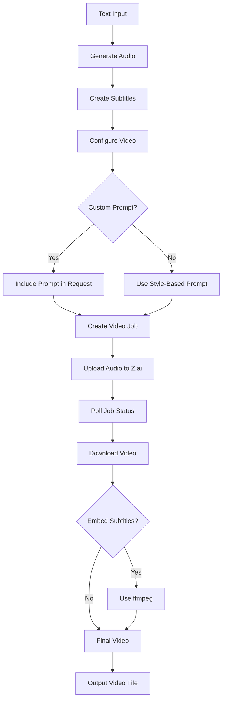
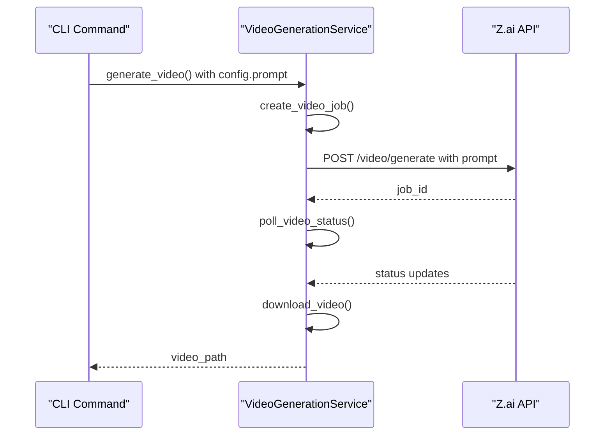

# Custom Prompts

<cite>
**Referenced Files in This Document**   
- [video.rs](file://src/video.rs)
- [CLI_VIDEO_GENERATION.md](file://CLI_VIDEO_GENERATION.md)
- [main.rs](file://src/main.rs)
</cite>

## Table of Contents
1. [Introduction](#introduction)
2. [Custom Prompt Implementation](#custom-prompt-implementation)
3. [Technical Architecture](#technical-architecture)
4. [API Integration Details](#api-integration-details)
5. [Best Practices for Effective Prompts](#best-practices-for-effective-prompts)
6. [Practical Examples](#practical-examples)
7. [Error Handling and Fallbacks](#error-handling-and-fallbacks)
8. [Conclusion](#conclusion)

## Introduction
The Voxweave CLI video command provides a powerful --prompt option that allows users to guide AI video generation with specific visual instructions beyond the selected style. This feature enables precise control over the generated visuals, making it possible to create videos that align exactly with the user's creative vision. The implementation in src/video.rs integrates seamlessly with the Z.ai API, providing both flexibility and reliability in video generation workflows.

## Custom Prompt Implementation

The custom prompt functionality is implemented through the VideoConfig struct in the video generation module. This configuration object contains an optional prompt field that can be set by users to provide specific visual instructions. When no custom prompt is provided, the system falls back to style-based prompts that match the selected video style.

**Diagram sources**
- [video.rs](file://src/video.rs#L66-L101)

**Section sources**
- [video.rs](file://src/video.rs#L45-L64)

## Technical Architecture

The video generation process follows a structured pipeline that begins with audio generation and culminates in a complete video file. The custom prompt is integrated at the job creation stage, where it's included in the request body sent to the Z.ai API. This architecture supports both the CLI and GUI applications, providing consistent behavior across different interfaces.

**Diagram sources**
- [video.rs](file://src/video.rs#L66-L101)
- [video.rs](file://src/video.rs#L149-L168)

**Section sources**
- [video.rs](file://src/video.rs#L66-L101)

## API Integration Details

The create_video_job method in the VideoGenerationService is responsible for constructing the API request to the Z.ai service. This method conditionally includes the custom prompt in the request body when provided by the user. The implementation also supports integration with different video providers, including ZAI and OpenAISora, through environment variable configuration.

When a custom prompt is specified, it's added directly to the JSON request body alongside other parameters such as audio URL, style, and resolution. If no prompt is provided, the API relies on the selected style to determine the visual characteristics of the generated video.

**Diagram sources**
- [video.rs](file://src/video.rs#L149-L168)
- [main.rs](file://src/main.rs#L327-L365)

**Section sources**
- [video.rs](file://src/video.rs#L149-L168)

## Best Practices for Effective Prompts

Creating effective prompts requires attention to specificity, phrasing, and coherence. Well-crafted prompts lead to more predictable and desirable video outputs. The following guidelines help users maximize the effectiveness of their custom prompts:

### Specificity Guidelines
- Be specific about visual elements, composition, and style
- Include details about lighting, color palette, and camera angles
- Specify the desired mood or atmosphere
- Mention any specific objects or scenes to include

### Positive Phrasing
- Use affirmative language rather than negative instructions
- Focus on what should be included rather than what should be avoided
- Describe the desired outcome rather than prohibited elements

### Avoiding Contradictions
- Ensure all elements in the prompt are compatible
- Avoid conflicting style descriptors (e.g., "minimalist cluttered scene")
- Maintain consistency in time period, location, and theme

**Section sources**
- [CLI_VIDEO_GENERATION.md](file://CLI_VIDEO_GENERATION.md#L88-L138)

## Practical Examples

The CLI_VIDEO_GENERATION.md document provides several practical examples of custom prompt usage. These examples demonstrate how specific visual instructions can guide the AI to produce targeted video content for different use cases.

For educational content, users can specify prompts like "Professional presentation with clean graphics and charts" to generate videos suitable for instructional materials. This level of detail ensures that the generated visuals align with the professional tone required for educational contexts.

Other examples include:
- "Fantasy adventure in vibrant anime style" for animated storytelling
- "Professional presentation with clean graphics and charts" for business presentations
- "Narrate this text with cinematic biotech visuals" for scientific content

These examples illustrate how custom prompts can transform generic video generation into a targeted content creation tool.

**Section sources**
- [CLI_VIDEO_GENERATION.md](file://CLI_VIDEO_GENERATION.md#L88-L138)

## Error Handling and Fallbacks

The implementation includes robust error handling for prompt-related issues. When a custom prompt is provided, it's validated and included in the API request. If the API call fails due to the prompt content, the system provides clear error messages to help users refine their instructions.

In cases where no prompt is provided, the system automatically falls back to style-based generation, ensuring that video creation can proceed even without custom instructions. This fallback mechanism maintains functionality while still encouraging users to experiment with custom prompts for enhanced results.

The five-minute timeout for video generation provides a reasonable limit while accommodating variations in API response times and content complexity.

**Section sources**
- [video.rs](file://src/video.rs#L250-L299)

## Conclusion
The custom prompt feature in the Voxweave CLI video command provides a powerful mechanism for guiding AI video generation with specific visual instructions. By allowing users to go beyond predefined styles, this feature enables precise control over the creative output. The implementation in src/video.rs demonstrates a clean integration with the Z.ai API, with proper fallback mechanisms and error handling. For beginners, template prompts provide an accessible entry point, while advanced users can leverage the full technical depth of the API integration for sophisticated video creation workflows.