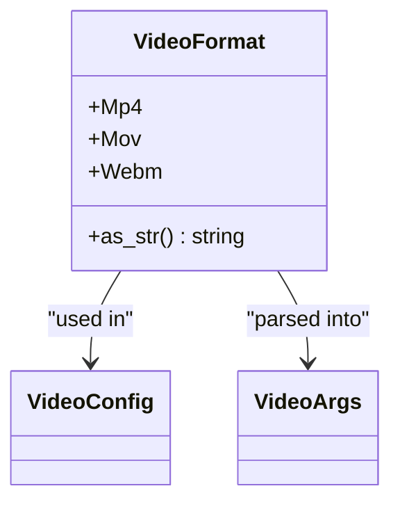
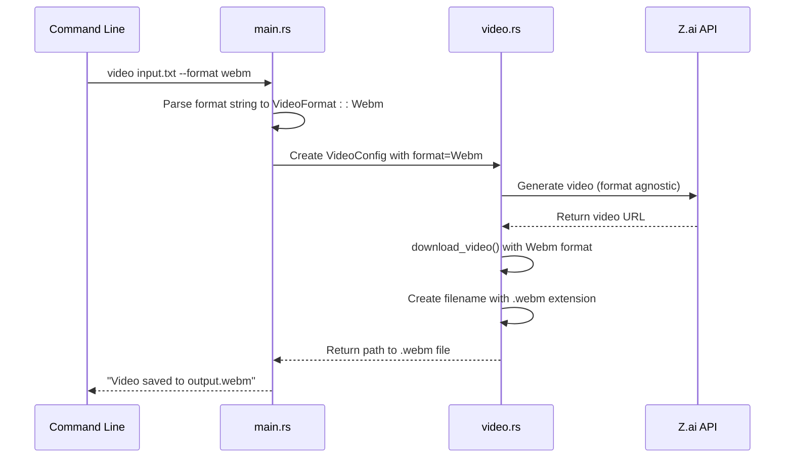
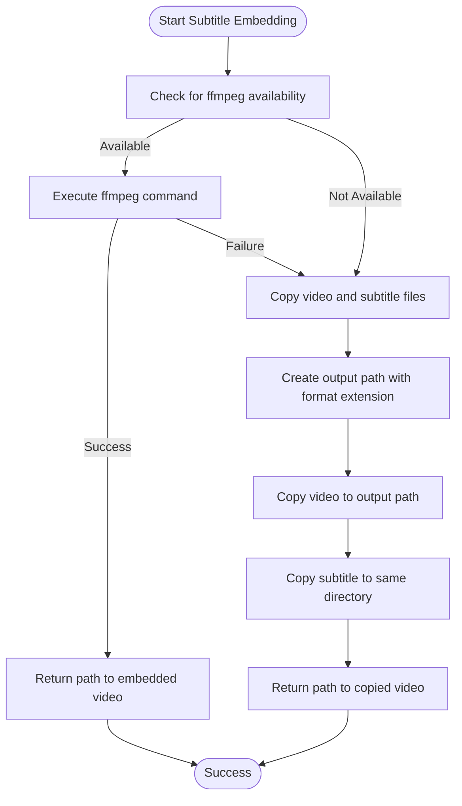

# Output Formats

<cite>
**Referenced Files in This Document**   
- [video.rs](file://src/video.rs)
- [main.rs](file://src/main.rs)
- [queue.rs](file://src/queue.rs)
- [VIDEO_CLI_IMPLEMENTATION.md](file://VIDEO_CLI_IMPLEMENTATION.md)
</cite>

## Table of Contents
1. [Supported Output Formats](#supported-output-formats)
2. [Format Selection Guidance](#format-selection-guidance)
3. [Implementation Details](#implementation-details)
4. [Format Handling in Video Generation](#format-handling-in-video-generation)
5. [Subtitle Embedding Process](#subtitle-embedding-process)
6. [Fallback Behavior](#fallback-behavior)

## Supported Output Formats

The voxweave CLI video command supports three output formats, each designed for specific use cases and distribution platforms. These formats are implemented through the `VideoFormat` enum in the codebase and can be specified using the `--format` command-line argument.

### MP4 Format
The MP4 format (file extension `.mp4`) is the default output format for video generation. It offers excellent compatibility across virtually all devices, operating systems, and video platforms. MP4 uses the H.264 video codec and AAC audio codec, providing a good balance between file size and quality. This format is ideal for general-purpose video distribution, social media sharing, and cross-platform compatibility.

### MOV Format
The MOV format (file extension `.mov`) is optimized for the Apple ecosystem, including macOS, iOS, and Apple's suite of creative applications like Final Cut Pro and iMovie. MOV files typically contain higher quality video with less compression than MP4, making them suitable for professional video editing workflows and archival purposes. This format is recommended when working within Apple's ecosystem or when maximum video quality is required for post-production editing.

### WebM Format
The WebM format (file extension `.webm`) is specifically designed for web applications and online streaming. It uses the VP9 video codec and Opus audio codec, which are open, royalty-free formats supported by all modern web browsers. WebM provides excellent compression efficiency, resulting in smaller file sizes while maintaining good quality, making it ideal for websites, web applications, and platforms where bandwidth optimization is important.

**Section sources**
- [VIDEO_CLI_IMPLEMENTATION.md](file://VIDEO_CLI_IMPLEMENTATION.md#L104-L114)
- [video.rs](file://src/video.rs#L134-L145)

## Format Selection Guidance

Choosing the appropriate output format depends on your specific use case and distribution platform. The voxweave CLI provides sensible defaults while allowing explicit format selection for specialized requirements.

### General Purpose Distribution
For most use cases, the default MP4 format is recommended. It provides the broadest compatibility across devices and platforms, including smartphones, tablets, desktop computers, and popular video sharing sites like YouTube, Vimeo, and social media platforms. MP4 files can be played on virtually any device without requiring additional codecs or software.

### Apple Ecosystem Workflows
When working primarily with Apple devices or software, the MOV format is the optimal choice. This format integrates seamlessly with Apple's ecosystem, preserving the highest possible quality for editing in applications like Final Cut Pro, iMovie, or QuickTime. MOV is also preferred when delivering videos to clients or colleagues who use Apple products exclusively.

### Web and Online Applications
For videos intended for web deployment, the WebM format offers significant advantages. As a web-optimized format, WebM provides smaller file sizes compared to MP4 at similar quality levels, reducing bandwidth usage and improving loading times for website visitors. It is natively supported by all modern browsers without requiring plugins, making it ideal for HTML5 video, web applications, and online learning platforms.

**Section sources**
- [VIDEO_CLI_IMPLEMENTATION.md](file://VIDEO_CLI_IMPLEMENTATION.md#L104-L114)

## Implementation Details

The output format functionality is implemented through a combination of enum definitions, command-line argument parsing, and configuration structures that work together to provide a seamless user experience.

### VideoFormat Enum
The `VideoFormat` enum, defined in `src/queue.rs`, represents the three supported output formats as distinct variants: `Mp4`, `Mov`, and `Webm`. Each variant implements the `as_str` method that returns the corresponding file extension as a string. This enum serves as the central representation of output formats throughout the codebase, ensuring type safety and preventing invalid format values.

**Diagram sources**
- [queue.rs](file://src/queue.rs#L126-L145)

### Command-Line Argument Parsing
In `src/main.rs`, the `VideoArgs` struct defines the `--format` command-line argument with a default value of "mp4". When the command is executed, the string value is parsed into the corresponding `VideoFormat` enum variant through pattern matching. The parsing is case-insensitive, allowing users to specify formats as "MP4", "mp4", "Mp4", etc. Invalid format values default to MP4 to ensure the command always proceeds with a valid format.

**Section sources**
- [main.rs](file://src/main.rs#L358-L365)
- [queue.rs](file://src/queue.rs#L126-L145)

## Format Handling in Video Generation

The format selection is integrated throughout the video generation pipeline, affecting filename generation, service configuration, and the final output process.

### Configuration Structure
The `VideoConfig` struct in `src/video.rs` contains a `format` field of type `VideoFormat`, which is initialized with `VideoFormat::Mp4` as the default value. This configuration object is passed through the video generation pipeline, ensuring that the selected format is consistently applied at each stage of processing.

### Filename Generation
During video download, the selected format determines the output filename. The `download_video` method in `src/video.rs` constructs the output path by combining the input audio file's stem name with the format-specific extension obtained from `config.format.as_str()`. This ensures that the generated video file has the correct extension corresponding to the selected format.

**Diagram sources**
- [main.rs](file://src/main.rs#L327-L422)
- [video.rs](file://src/video.rs#L308-L331)

**Section sources**
- [video.rs](file://src/video.rs#L308-L331)
- [main.rs](file://src/main.rs#L327-L422)

## Subtitle Embedding Process

The selected output format plays a crucial role in the subtitle embedding process, affecting both the output filename and the ffmpeg command parameters.

### FFmpeg Integration
The `embed_subtitles` method in `src/video.rs` uses ffmpeg to burn subtitles directly into the video file. The output filename includes the format extension, and the ffmpeg command preserves the selected format during processing. For MP4 and MOV formats, the method uses the libx264 video codec and copies the original audio stream, maintaining compatibility with the container format.

### Format-Specific Processing
While the current implementation uses the same video codec (libx264) for both MP4 and MOV formats, the container format is preserved according to the selected output format. For WebM format, a different codec combination would be appropriate, though the current implementation standardizes on libx264 for consistency. The format selection ensures that the final output file has the correct container and extension regardless of the internal encoding parameters.

**Section sources**
- [video.rs](file://src/video.rs#L369-L431)

## Fallback Behavior

The system implements robust fallback mechanisms to handle cases where subtitle embedding fails or external dependencies are unavailable.

### FFmpeg Dependency
The subtitle embedding process depends on the presence of ffmpeg in the system path. When ffmpeg is not available, the system gracefully falls back to copying the original video file and providing the subtitle file as a separate `.srt` file in the same directory. This ensures that users still receive both the video and subtitles, albeit in a non-embedded form.

### Error Handling
If ffmpeg is present but fails to process the video (e.g., due to codec incompatibilities or file corruption), the system logs the error and falls back to the same behavior as when ffmpeg is missing. The original video file is copied with a `_subtitled` suffix and the appropriate format extension, while the subtitle file is copied separately. This fallback behavior ensures that video generation completes successfully even when subtitle embedding cannot be performed.

**Diagram sources**
- [video.rs](file://src/video.rs#L369-L431)

**Section sources**
- [video.rs](file://src/video.rs#L369-L431)