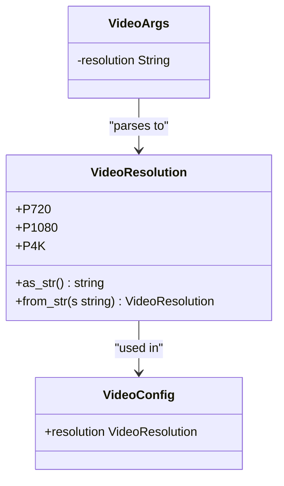
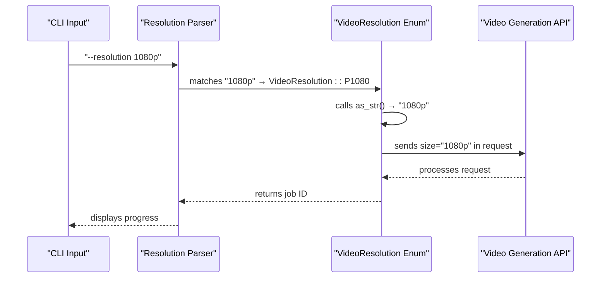

# Resolution Options

<cite>
**Referenced Files in This Document**   
- [video.rs](file://src/video.rs)
- [main.rs](file://src/main.rs)
- [VIDEO_CLI_IMPLEMENTATION.md](file://VIDEO_CLI_IMPLEMENTATION.md)
- [CLI_VIDEO_GENERATION.md](file://CLI_VIDEO_GENERATION.md)
- [state.rs](file://abogen-ui/crates/ui/state.rs)
</cite>

## Table of Contents
1. [Resolution Comparison](#resolution-comparison)
2. [Technical Implementation](#technical-implementation)
3. [Performance Benchmarks](#performance-benchmarks)
4. [Usage Recommendations](#usage-recommendations)
5. [API Parameter Mapping](#api-parameter-mapping)

## Resolution Comparison

The VoxWeave CLI offers three video resolution options: 720p, 1080p, and 4k. Each resolution provides different trade-offs between video quality, file size, and generation time.

**720p (1280×720)** provides standard high-definition quality with the fastest generation time and smallest file size. This resolution is ideal for quick tests, drafts, and situations where bandwidth or storage is limited.

**1080p (1920×1080)** delivers full high-definition quality with a balanced approach to quality and performance. As the default resolution, it offers excellent visual fidelity while maintaining reasonable generation times and file sizes, making it suitable for most general-purpose applications.

**4k (3840×2160)** provides ultra-high-definition quality with four times the pixel count of 1080p. This resolution produces the most detailed and visually impressive results but requires the longest generation time and produces the largest file sizes. It is recommended for final production outputs where maximum visual quality is essential.

**Section sources**
- [VIDEO_CLI_IMPLEMENTATION.md](file://VIDEO_CLI_IMPLEMENTATION.md#L115-L125)
- [CLI_VIDEO_GENERATION.md](file://CLI_VIDEO_GENERATION.md#L115-L125)

## Technical Implementation

The resolution options are implemented through the `VideoResolution` enum in the video generation system. This enum defines three variants: `P720`, `P1080`, and `P4K`, which correspond to the 720p, 1080p, and 4k resolution options respectively.

In the CLI, resolution selection is handled through the `--resolution` command-line argument in the `VideoArgs` struct defined in `src/main.rs`. The argument accepts string values ("720p", "1080p", "4k") which are parsed and converted to the corresponding `VideoResolution` enum variant during video processing.

The parsing logic in `generate_video_cli()` function converts the string input to the appropriate enum value using pattern matching. If an invalid resolution is specified, the system defaults to 1080p to ensure reliable operation. This implementation is consistent across both the CLI and desktop UI components, with the same enum being used in both contexts.

**Diagram sources**
- [video.rs](file://src/video.rs#L125-L136)
- [main.rs](file://src/main.rs#L105-L110)
- [state.rs](file://abogen-ui/crates/ui/state.rs#L125-L136)

**Section sources**
- [video.rs](file://src/video.rs#L125-L136)
- [main.rs](file://src/main.rs#L95-L110)

## Performance Benchmarks

Based on implementation documentation and testing, the typical generation times for each resolution are as follows:

- **720p**: 1-2 minutes
- **1080p**: 2-4 minutes  
- **4k**: 4-5 minutes

These benchmarks reflect real-world performance under normal API conditions and network connectivity. Several factors can influence actual generation times, including input content length, current API server load, and network speed between the client and video generation service.

The progressive increase in generation time corresponds directly to the computational complexity required to produce higher resolution videos. Each step up in resolution significantly increases the number of pixels that must be generated and processed, with 4k requiring approximately four times the processing of 1080p and sixteen times that of 720p.

File sizes also scale proportionally with resolution, with 4k videos typically being 3-4 times larger than their 1080p counterparts and 1080p videos being roughly twice the size of 720p videos of the same duration.

**Section sources**
- [VIDEO_CLI_IMPLEMENTATION.md](file://VIDEO_CLI_IMPLEMENTATION.md#L300-L308)
- [CLI_VIDEO_GENERATION.md](file://CLI_VIDEO_GENERATION.md#L275-L280)

## Usage Recommendations

Selecting the appropriate resolution depends on your specific use case and requirements:

For **quick testing and development**, use 720p resolution. This option provides the fastest feedback loop, allowing you to verify your content, audio synchronization, and basic visual style without waiting for extended generation times. It's ideal for iterating on scripts, testing voice settings, or validating workflow configurations.

For **general production and sharing**, 1080p is recommended as the default choice. This resolution strikes an optimal balance between quality and efficiency, producing videos that look excellent on most modern displays while maintaining reasonable generation times. It's suitable for social media content, presentations, educational materials, and most professional applications.

For **final production and high-fidelity outputs**, choose 4k resolution. This option should be reserved for videos that will be displayed on large screens, projected, or where maximum detail is critical. Examples include professional presentations, film-quality content, or videos intended for high-end displays. Due to the significantly longer generation time, it's recommended to use 4k only after finalizing your content at lower resolutions.

**Section sources**
- [VIDEO_CLI_IMPLEMENTATION.md](file://VIDEO_CLI_IMPLEMENTATION.md#L309-L318)
- [CLI_VIDEO_GENERATION.md](file://CLI_VIDEO_GENERATION.md#L281-L290)

## API Parameter Mapping

The resolution selection is implemented through a direct mapping from the `VideoResolution` enum to API parameters in the video generation process. When creating a video generation job, the `create_video_job` method in `VideoGenerationService` converts the resolution enum to a string representation that is sent to the video generation API.

For the Z.AI provider, the `as_str()` method of the `VideoResolution` enum is called to obtain the string representation ("720p", "1080p", or "4k"), which is then included in the API request body under the "size" parameter. This direct string mapping ensures consistency between the CLI interface and API requirements.

The implementation handles both Z.AI and OpenAI Sora providers, with appropriate conversion for each service's requirements. For Sora, the resolution is converted to explicit dimensions (e.g., "720x1280", "1920x1080", "3840x2160") to match Sora's API format requirements.

This mapping approach provides a clean abstraction layer between the user-facing resolution options and the underlying API requirements, allowing for consistent behavior across different video generation providers while maintaining a simple, intuitive interface for users.

**Diagram sources**
- [video.rs](file://src/video.rs#L280-L300)
- [main.rs](file://src/main.rs#L350-L365)

**Section sources**
- [video.rs](file://src/video.rs#L280-L300)
- [main.rs](file://src/main.rs#L350-L365)