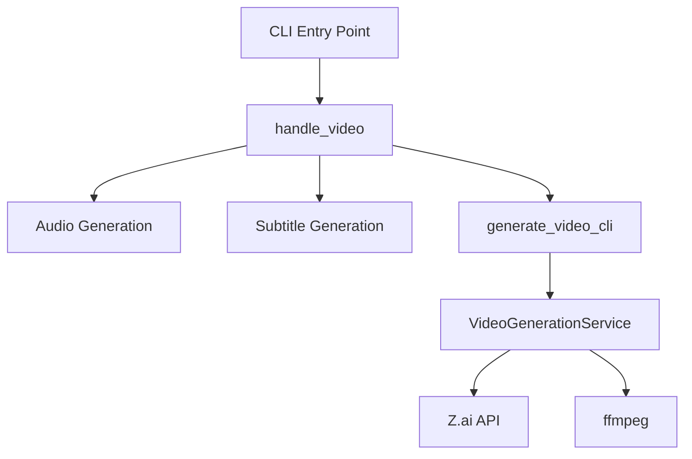

# Video Command

<cite>
**Referenced Files in This Document**   
- [main.rs](file://src/main.rs)
- [video.rs](file://src/video.rs)
- [CLI_VIDEO_GENERATION.md](file://CLI_VIDEO_GENERATION.md)
- [VIDEO_CLI_IMPLEMENTATION.md](file://VIDEO_CLI_IMPLEMENTATION.md)
</cite>

## Table of Contents
1. [Introduction](#introduction)
2. [Command Options](#command-options)
3. [Workflow Phases](#workflow-phases)
4. [Async Implementation](#async-implementation)
5. [Prerequisites and Dependencies](#prerequisites-and-dependencies)
6. [Usage Examples](#usage-examples)
7. [Error Handling](#error-handling)
8. [Architecture Overview](#architecture-overview)

## Introduction
The `video` subcommand in the VoxWeave CLI enables end-to-end video generation from text input by orchestrating audio synthesis, subtitle creation, and AI-powered video generation through the Z.ai API. This command integrates seamlessly with the existing text-to-speech pipeline and supports customizable visual styles, resolutions, and formats. The implementation is designed for automation, batch processing, and CI/CD integration, making it ideal for scripted content creation workflows.

**Section sources**
- [main.rs](file://src/main.rs#L1-L417)
- [CLI_VIDEO_GENERATION.md](file://CLI_VIDEO_GENERATION.md#L0-L323)

## Command Options
The `voxweave video` command provides several configurable options to tailor the output:

- **`--style`**: Specifies the visual style of the generated video. Supported values include `realistic`, `anime`, `3d`, `cinematic`, `biotech`, `cyberpunk` (default), and `educational`.
- **`--resolution`**: Sets the video resolution with options `720p`, `1080p` (default), and `4k`.
- **`--format`**: Determines the output format: `mp4` (default), `mov`, or `webm`.
- **`--prompt`**: Allows a custom visual prompt to guide the AI video generation.
- **`--voice`**: Selects the TTS voice profile to use for audio generation.

These options are implemented in the `VideoArgs` struct in `src/main.rs` and processed during command execution to configure the video generation pipeline.

**Section sources**
- [main.rs](file://src/main.rs#L100-L140)
- [CLI_VIDEO_GENERATION.md](file://CLI_VIDEO_GENERATION.md#L60-L100)

## Workflow Phases
The video generation process follows a three-phase workflow:

1. **Audio Generation**: Reuses the existing `convert` logic to synthesize speech from text using the selected voice profile. This phase produces a `.wav` audio file and corresponding `.srt` subtitle file.
2. **Subtitle Generation**: Automatically creates subtitle files with sentence-level timing based on the audio generation process.
3. **Video Creation**: Utilizes the `VideoGenerationService` in `src/video.rs` to generate AI visuals via the Z.ai API. The service uploads the audio file, creates a video generation job with the specified style and resolution, polls for completion, downloads the generated video, and optionally embeds subtitles.

This pipeline ensures synchronized audio, subtitles, and visuals in the final output.

```mermaid
flowchart TD
A[Text Input] --> B[Audio Generation]
B --> C[Subtitle Generation]
C --> D[Video Generation via Z.ai API]
D --> E[Subtitle Embedding (if ffmpeg available)]
E --> F[Final Video Output]
```

**Diagram sources**
- [main.rs](file://src/main.rs#L300-L350)
- [video.rs](file://src/video.rs#L100-L200)

## Async Implementation
The video generation process is implemented asynchronously using the `tokio` runtime. The `generate_video_cli` function in `src/main.rs` runs within a `tokio::runtime::Runtime` to handle the asynchronous operations required for HTTP requests and file I/O. The implementation includes:

- **Progress Reporting**: A callback function updates the CLI with real-time progress (0-100%) during video generation.
- **Logging**: A log callback provides stage-specific messages (e.g., "Uploading audio", "Polling for completion") with appropriate severity levels.
- **Timeout Handling**: The polling mechanism for video generation status includes a maximum of 300 attempts (5-minute timeout) to prevent indefinite waiting.

This async design ensures responsive CLI feedback while handling potentially long-running API operations.

**Section sources**
- [main.rs](file://src/main.rs#L350-L400)
- [video.rs](file://src/video.rs#L200-L300)

## Prerequisites and Dependencies
To use the `video` subcommand, the following prerequisites must be met:

- **ZAI_API_KEY Environment Variable**: The Z.ai API key must be set in the environment. The `VideoGenerationService::from_env()` function checks for this variable and returns an error if not found.
- **Build Feature Flag**: The CLI must be built with the `video-generation` feature: `cargo build --features video-generation --release`.
- **Optional ffmpeg**: For embedding subtitles directly into the video file. If not available, subtitles are provided as a separate `.srt` file.

The implementation gracefully handles missing ffmpeg by falling back to external subtitle files while continuing video generation.

**Section sources**
- [video.rs](file://src/video.rs#L45-L60)
- [CLI_VIDEO_GENERATION.md](file://CLI_VIDEO_GENERATION.md#L10-L30)

## Usage Examples
The following examples demonstrate common use cases:

### Basic Video Generation
```bash
voxweave video samples/example.txt
```
Generates a cyberpunk-style 1080p MP4 video using default settings.

### Custom Style and Resolution
```bash
voxweave video presentation.md --style educational --resolution 4k
```
Creates an educational-style 4K video for professional presentations.

### Batch Processing
```bash
for file in content/*.txt; do
  voxweave video "$file" --style cinematic --resolution 1080p
done
```
Processes multiple files in sequence with consistent settings.

### CI/CD Integration
```yaml
- name: Generate Video
  env:
    ZAI_API_KEY: ${{ secrets.ZAI_API_KEY }}
  run: |
    cargo build --release --features video-generation
    ./target/release/voxweave video content.txt --style educational
```
Integrates video generation into a GitHub Actions workflow.

**Section sources**
- [VIDEO_CLI_IMPLEMENTATION.md](file://VIDEO_CLI_IMPLEMENTATION.md#L200-L250)
- [CLI_VIDEO_GENERATION.md](file://CLI_VIDEO_GENERATION.md#L120-L180)

## Error Handling
The implementation includes comprehensive error handling for common issues:

- **Missing API Key**: Returns a clear error message if `ZAI_API_KEY` is not set.
- **API Errors**: Propagates HTTP status codes and error messages from the Z.ai API.
- **Timeout**: Fails with a "Video generation timeout" message after 5 minutes of polling.
- **File I/O Errors**: Provides detailed context for file operation failures.
- **Voice Not Found**: Validates voice identifiers against available profiles.

Errors are reported through the CLI with appropriate formatting (e.g., "✗ Video generation failed") to distinguish from success messages.

**Section sources**
- [video.rs](file://src/video.rs#L300-L400)
- [VIDEO_CLI_IMPLEMENTATION.md](file://VIDEO_CLI_IMPLEMENTATION.md#L150-L180)

## Architecture Overview
The video generation architecture follows a modular design with clear separation of concerns:



The `VideoGenerationService` in `src/video.rs` encapsulates all Z.ai API interactions, making it reusable by both CLI and UI components. The service handles authentication, file upload, job creation, status polling, video download, and subtitle embedding, providing a clean interface for video generation.

**Diagram sources**
- [main.rs](file://src/main.rs#L300-L350)
- [video.rs](file://src/video.rs#L1-L50)