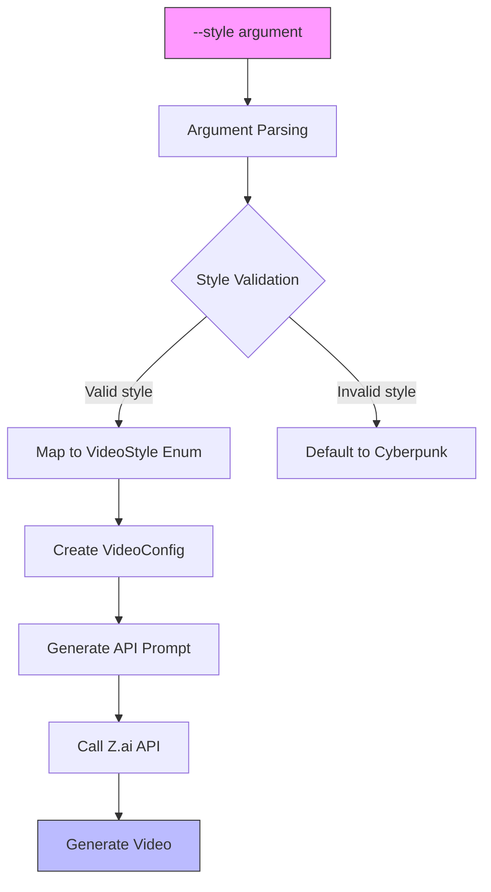

# Video Styles

<cite>
**Referenced Files in This Document**   
- [video.rs](file://src/video.rs)
- [main.rs](file://src/main.rs)
- [queue.rs](file://src/queue.rs)
- [CLI_VIDEO_GENERATION.md](file://CLI_VIDEO_GENERATION.md)
- [state.rs](file://abogen-ui/crates/ui/state.rs)
</cite>

## Table of Contents
1. [Introduction](#introduction)
2. [Video Style Options](#video-style-options)
3. [Style Implementation](#style-implementation)
4. [Usage Examples](#usage-examples)
5. [Style Selection Guidance](#style-selection-guidance)
6. [Common Issues and Limitations](#common-issues-and-limitations)
7. [Technical Architecture](#technical-architecture)

## Introduction
The VoxWeave CLI video command provides a powerful feature for generating AI-powered videos from text content with various visual styles. This document explains the available video styles, their implementation, and practical usage guidance. The feature transforms text input into narrated videos with AI-generated visuals that match the selected style, enabling users to create engaging content for different purposes and audiences.

## Video Style Options
VoxWeave offers seven distinct video styles, each with unique visual characteristics suitable for different content types:

- **`realistic`**: Photorealistic visuals that resemble real-world footage, ideal for documentaries, news segments, and content requiring authenticity
- **`anime`**: Anime and manga-inspired art style with vibrant colors and stylized characters, perfect for storytelling and creative narratives
- **`3d`**: Three-dimensional rendered graphics with depth and spatial awareness, suitable for product demonstrations and technical visualizations
- **`cinematic`**: Movie-like cinematography with dramatic lighting, camera movements, and filmic quality, excellent for dramatic presentations
- **`biotech`**: Scientific and biotechnology-themed visuals with molecular structures, laboratory settings, and futuristic medical imagery
- **`cyberpunk`**: Futuristic neon aesthetics with urban landscapes, advanced technology, and dystopian elements (default style)
- **`educational`**: Clean, professional visuals with clear graphics, charts, and diagrams optimized for instructional content

**Section sources**
- [CLI_VIDEO_GENERATION.md](file://CLI_VIDEO_GENERATION.md#L213-L283)

## Style Implementation
The video styles are implemented through a well-defined architecture that maps command-line arguments to internal enum values and API parameters.

### VideoStyle Enum
The `VideoStyle` enum in `src/queue.rs` defines all available styles as distinct variants:

```rust
pub enum VideoStyle {
    Realistic,
    Anime,
    ThreeD,
    Cinematic,
    Biotech,
    Cyberpunk,
    Educational,
}
```

Each style variant includes an `as_str()` method that returns the corresponding lowercase string representation used in the CLI interface.

**Section sources**
- [queue.rs](file://src/queue.rs#L3-L24)

### Command-Line Argument Parsing
In `src/main.rs`, the `generate_video_cli` function parses the `--style` command-line argument and maps it to the appropriate `VideoStyle` enum variant:

```rust
let video_style = match style.to_lowercase().as_str() {
    "realistic" => VideoStyle::Realistic,
    "anime" => VideoStyle::Anime,
    "3d" => VideoStyle::ThreeD,
    "cinematic" => VideoStyle::Cinematic,
    "biotech" => VideoStyle::Biotech,
    "cyberpunk" => VideoStyle::Cyberpunk,
    "educational" => VideoStyle::Educational,
    _ => VideoStyle::Cyberpunk,
};
```

The parsing is case-insensitive and defaults to `cyberpunk` for invalid style names. This implementation ensures robust handling of user input while maintaining flexibility for future style additions.

**Section sources**
- [main.rs](file://src/main.rs#L337-L375)

### Configuration and API Integration
The parsed style is incorporated into the `VideoConfig` struct and used to generate appropriate prompts for the video generation API. In `src/video.rs`, the style information is included in the API request body:

```rust
"prompt": config.prompt.as_deref().unwrap_or(&format!("Generate a {} style video", config.style.as_str())),
```

This approach allows for both automatic prompt generation based on the selected style and custom prompt override through the `--prompt` argument.

**Section sources**
- [video.rs](file://src/video.rs#L128-L132)

## Usage Examples
The CLI_VIDEO_GENERATION.md file provides practical examples demonstrating the use of different styles for various content types:

### Educational Content
For presentations and instructional materials, the educational style creates professional visuals with clean graphics:

```bash
voxweave video presentation.md \
  --style educational \
  --prompt "Professional presentation with clean graphics and charts"
```

### Creative Storytelling
For narratives and creative content, the anime style produces vibrant, stylized visuals:

```bash
voxweave video story.txt \
  --style anime \
  --resolution 1080p \
  --output ./videos \
  --voice af
```

### Technical Content
For technology-focused content, the cyberpunk style generates futuristic visuals with neon aesthetics:

```bash
voxweave video tech_review.txt \
  --style cyberpunk \
  --resolution 4k
```

### Documentary-Style Content
For factual content requiring authenticity, the realistic style produces photorealistic visuals:

```bash
voxweave video documentary_script.txt \
  --style realistic \
  --resolution 1080p
```

**Section sources**
- [CLI_VIDEO_GENERATION.md](file://CLI_VIDEO_GENERATION.md#L88-L138)

## Style Selection Guidance
Selecting the appropriate video style depends on both content type and target audience. The following guidelines help users make effective style choices:

### Content-Type Recommendations
- **Educational materials**: Use `educational` style for clear, professional visuals with charts and diagrams
- **Technical documentation**: Choose `biotech` or `3d` for scientific and technical visualizations
- **Creative storytelling**: Select `anime` or `cinematic` for dramatic narratives and character-driven content
- **Product demonstrations**: Use `3d` or `realistic` for showcasing products with depth and realism
- **Technology content**: Apply `cyberpunk` for futuristic tech reviews and innovation showcases
- **General content**: The default `cyberpunk` style provides visually engaging results for diverse content

### Audience Considerations
- **Professional audiences**: `educational`, `realistic`, and `cinematic` styles convey seriousness and credibility
- **Younger audiences**: `anime` and `cyberpunk` styles offer visually dynamic content that appeals to younger viewers
- **Technical audiences**: `biotech` and `3d` styles effectively communicate complex concepts through detailed visualizations
- **General audiences**: `cinematic` and `realistic` styles provide accessible, high-quality visuals for broad appeal

### Performance and Quality Trade-offs
Higher resolutions (4K) require longer processing times (4-5 minutes) compared to 720p (1-2 minutes). Users should balance quality requirements with processing time constraints, especially when generating multiple videos.

**Section sources**
- [CLI_VIDEO_GENERATION.md](file://CLI_VIDEO_GENERATION.md#L213-L283)

## Common Issues and Limitations
Users may encounter several common issues when working with video styles, along with important limitations to consider.

### Invalid Style Handling
When an invalid style name is provided, the system defaults to `cyberpunk` without raising an error:

```rust
_ => VideoStyle::Cyberpunk,
```

This behavior ensures that video generation proceeds even with incorrect input, but users should verify their style selection to achieve desired results.

### API Limitations
Certain styles may have specific API limitations:
- The Z.ai API has a 5-minute timeout for video generation
- Longer input texts may exceed processing limits
- Complex prompts may not be fully interpreted by the AI model
- Resolution options are limited to 720p, 1080p, and 4K

### Environment Requirements
Video generation requires:
- Valid ZAI_API_KEY environment variable
- Sufficient API quota on the Z.ai account
- Optional ffmpeg installation for subtitle embedding
- Adequate disk space for generated files

Users should ensure these requirements are met before initiating video generation.

**Section sources**
- [CLI_VIDEO_GENERATION.md](file://CLI_VIDEO_GENERATION.md#L213-L283)
- [main.rs](file://src/main.rs#L337-L375)

## Technical Architecture
The video style system follows a clean architectural pattern that separates concerns between CLI interface, configuration, and API integration.



**Diagram sources**
- [main.rs](file://src/main.rs#L337-L375)
- [queue.rs](file://src/queue.rs#L3-L24)
- [video.rs](file://src/video.rs#L128-L132)

The architecture demonstrates a clear separation of concerns:
1. **Input Processing**: CLI arguments are parsed and validated
2. **Configuration**: Validated inputs are mapped to configuration objects
3. **API Integration**: Configuration is translated into API requests
4. **Result Generation**: API responses are processed into final video files

This modular design allows for easy extension of new styles and integration with different video generation APIs while maintaining a consistent user interface.

**Section sources**
- [video.rs](file://src/video.rs)
- [main.rs](file://src/main.rs)
- [queue.rs](file://src/queue.rs)