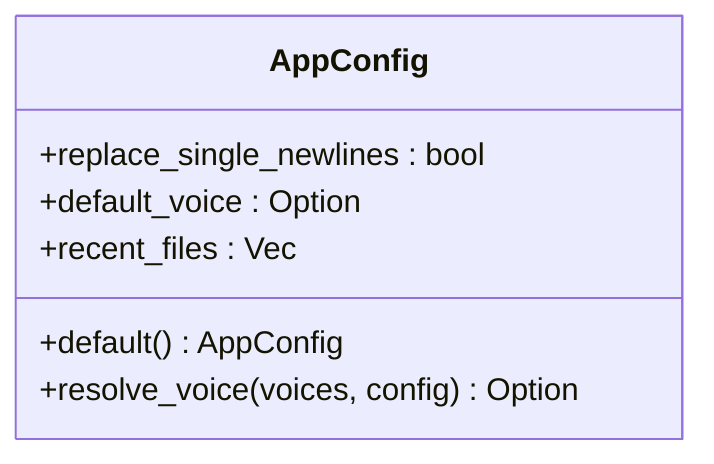
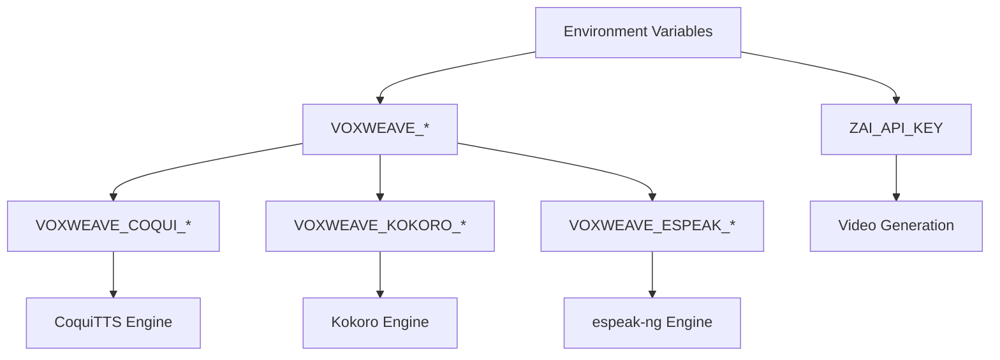
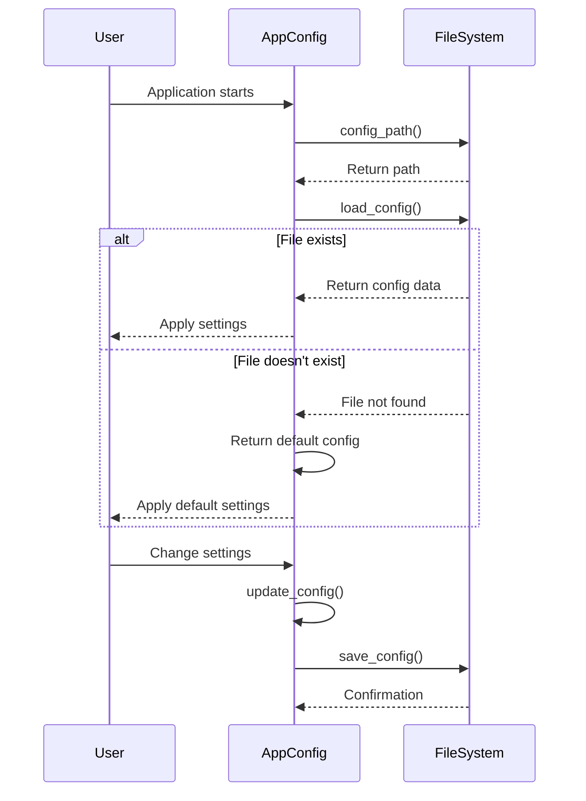
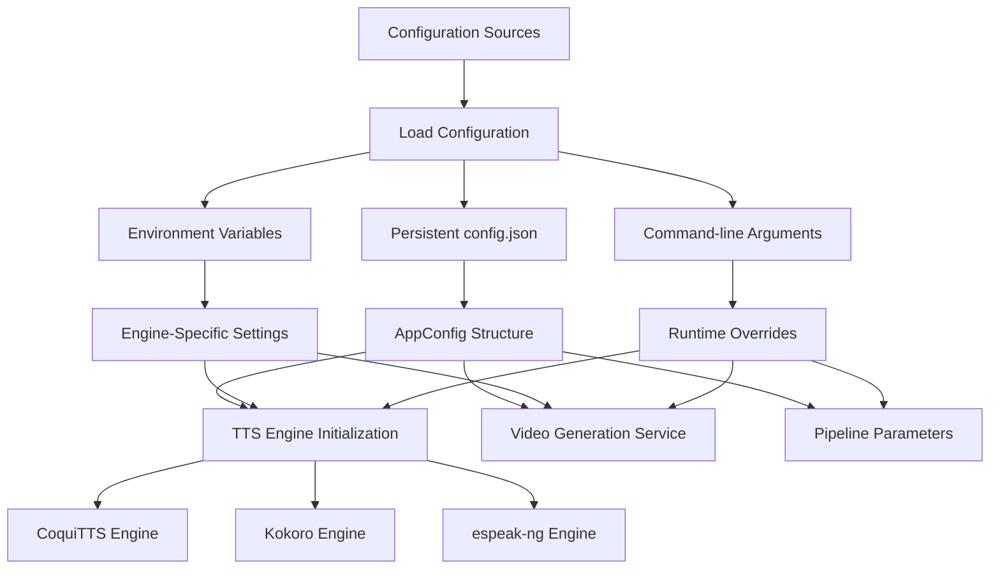

# Configuration Management

<cite>
**Referenced Files in This Document**   
- [config.rs](file://src/config.rs)
- [README.md](file://README.md)
- [CLI_VIDEO_GENERATION.md](file://CLI_VIDEO_GENERATION.md)
- [COQUI_USAGE_GUIDE.md](file://COQUI_USAGE_GUIDE.md)
- [VIDEO_CLI_IMPLEMENTATION.md](file://VIDEO_CLI_IMPLEMENTATION.md)
- [Cargo.toml](file://Cargo.toml)
- [main.rs](file://src/main.rs)
</cite>

## Table of Contents
1. [Introduction](#introduction)
2. [Configuration Sources and Hierarchy](#configuration-sources-and-hierarchy)
3. [Core Configuration Structure](#core-configuration-structure)
4. [Environment Variables](#environment-variables)
5. [Configuration Persistence](#configuration-persistence)
6. [Configuration Flow Through System](#configuration-flow-through-system)
7. [Security Considerations](#security-considerations)
8. [Deployment Configuration Best Practices](#deployment-configuration-best-practices)
9. [Troubleshooting Guide](#troubleshooting-guide)
10. [Examples and Usage Scenarios](#examples-and-usage-scenarios)

## Introduction
VoxWeave's configuration system provides a flexible and hierarchical approach to managing application settings across different environments and use cases. The system combines persistent user preferences with environment variables and command-line options to control various aspects of the application's behavior, including text-to-speech engines, video generation parameters, and pipeline processing options. This document details the configuration architecture, focusing on the config.rs module that orchestrates the parsing and resolution of configuration values from multiple sources.

## Configuration Sources and Hierarchy
VoxWeave implements a multi-layered configuration system with a clear precedence hierarchy that determines which settings take priority when multiple sources define the same parameter. The configuration sources are evaluated in the following order, with later sources overriding earlier ones:

1. **Default values**: Hardcoded defaults defined in the AppConfig struct implementation
2. **Persistent configuration file**: User preferences saved in config.json
3. **Environment variables**: Runtime settings from the environment
4. **Command-line arguments**: Explicit options passed to the CLI

This hierarchy ensures that users can establish sensible defaults through the configuration file while allowing temporary overrides via environment variables or command-line options for specific use cases. The system is designed to be both user-friendly for interactive use and scriptable for automation scenarios.

**Section sources**
- [config.rs](file://src/config.rs#L1-L117)
- [main.rs](file://src/main.rs#L0-L417)

## Core Configuration Structure
The configuration system is centered around the AppConfig struct defined in config.rs, which represents the persistent user preferences for the application. This structure contains three primary fields that control key aspects of VoxWeave's behavior:



**Diagram sources**
- [config.rs](file://src/config.rs#L10-L24)

The AppConfig struct implements the Default trait, providing sensible initial values for new users. The replace_single_newlines field controls text processing behavior, determining whether single line breaks in input text should be converted to spaces during processing. The default_voice field stores the user's preferred voice identifier, which is automatically selected when no specific voice is requested. The recent_files field maintains a history of recently processed files, enabling quick access to frequently used content.

**Section sources**
- [config.rs](file://src/config.rs#L10-L24)

## Environment Variables
VoxWeave supports a comprehensive set of environment variables that allow users to customize the behavior of various subsystems without modifying configuration files or command-line arguments. These variables follow a consistent naming convention using the VOXWEAVE_ prefix, with specialized prefixes for third-party service integration.

### Video Generation Variables
The ZAI_API_KEY environment variable is required for video generation functionality, providing authentication to the Z.ai API service that powers the video creation pipeline. This key must be set before executing any video generation commands.

### CoquiTTS Configuration Variables
For the CoquiTTS engine, VoxWeave supports several configuration variables that control the speech synthesis process:
- VOXWEAVE_COQUI_PYTHON: Specifies the Python interpreter to use
- VOXWEAVE_COQUI_MODEL: Determines the TTS model to load
- VOXWEAVE_COQUI_DEVICE: Sets the computation device (cpu, cuda, mps)
- VOXWEAVE_COQUI_SAMPLE_RATE: Controls the audio output sample rate
- VOXWEAVE_COQUI_LANGUAGE: Sets the default language for synthesis

### Other Environment Variables
Additional environment variables configure other subsystems:
- VOXWEAVE_ESPEAK_COMMAND: Overrides the espeak-ng executable
- VOXWEAVE_KOKORO_PYTHON: Specifies Python interpreter for Kokoro
- VOXWEAVE_KOKORO_DEVICE: Sets device for Kokoro inference
- VOXWEAVE_CONFIG_DIR: Overrides the configuration directory location



**Diagram sources**
- [README.md](file://README.md#L100-L150)
- [COQUI_USAGE_GUIDE.md](file://COQUI_USAGE_GUIDE.md#L150-L200)

**Section sources**
- [README.md](file://README.md#L100-L150)
- [COQUI_USAGE_GUIDE.md](file://COQUI_USAGE_GUIDE.md#L150-L200)

## Configuration Persistence
VoxWeave implements a robust configuration persistence mechanism that stores user preferences across sessions. The system uses the directories crate to determine the appropriate platform-specific configuration directory, following standard conventions for each operating system.

The config_path function calculates the location of the configuration file, first checking for a VOXWEAVE_CONFIG_DIR environment variable override, then falling back to the standard application configuration directory. On most systems, this resolves to:
- macOS: ~/Library/Preferences/com.voxweave.voxweave/config.json
- Linux: ~/.config/voxweave/config.json
- Windows: C:\Users\{username}\AppData\Roaming\voxweave\config.json

The load_config and save_config functions handle reading from and writing to this file in JSON format, with automatic directory creation if necessary. When the configuration file doesn't exist, load_config returns the default configuration, allowing new users to start immediately without manual setup.



**Diagram sources**
- [config.rs](file://src/config.rs#L26-L49)

**Section sources**
- [config.rs](file://src/config.rs#L26-L49)

## Configuration Flow Through System
Configuration values flow through the VoxWeave system in a well-defined sequence, starting from source resolution and ending with component initialization. When the application starts, configuration is loaded from the persistent store and combined with environment variables and command-line arguments to create the final runtime configuration.

For TTS engine initialization, the system first determines which engine to use based on the voice profile and available features. Each engine then reads its specific configuration from environment variables, with defaults applied when variables are not set. The CoquiTTS engine, for example, reads VOXWEAVE_COQUI_DEVICE to determine whether to use CPU, CUDA, or MPS acceleration.

Video generation services initialize by checking for the ZAI_API_KEY environment variable, which is mandatory for API authentication. The video generation parameters from the command line are combined with defaults to create the VideoConfig structure used by the VideoGenerationService.

The pipeline parameters are configured through a combination of the persistent AppConfig settings and command-line overrides. The replace_single_newlines setting from the configuration file controls text preprocessing, while command-line arguments can temporarily override this behavior for specific processing tasks.



**Diagram sources**
- [main.rs](file://src/main.rs#L0-L417)
- [config.rs](file://src/config.rs#L1-L117)

**Section sources**
- [main.rs](file://src/main.rs#L0-L417)

## Security Considerations
The configuration system incorporates several security considerations, particularly regarding API key management. The ZAI_API_KEY environment variable should never be hardcoded in scripts or configuration files that might be committed to version control. Instead, users should set this variable in their shell profile or use environment management tools.

For production deployments, API keys should be managed through secure secret management systems rather than direct environment variable assignment. The application does not log or display API keys in any output, preventing accidental exposure through logs or error messages.

When using environment variables for configuration, users should be aware of potential security risks in shared environments where process environments might be inspectable by other users. For highly sensitive deployments, consider using configuration files with restricted permissions instead of environment variables.

Best practices for API key security include:
- Setting keys in shell profiles rather than in version-controlled scripts
- Using temporary key assignments for testing: `ZAI_API_KEY=tempkey voxweave video input.txt`
- Rotating keys regularly through the Z.ai dashboard
- Monitoring API usage to detect unauthorized access
- Using different keys for development, staging, and production environments

**Section sources**
- [CLI_VIDEO_GENERATION.md](file://CLI_VIDEO_GENERATION.md#L10-L50)
- [VIDEO_CLI_IMPLEMENTATION.md](file://VIDEO_CLI_IMPLEMENTATION.md#L10-L50)

## Deployment Configuration Best Practices
Different deployment scenarios require tailored configuration approaches to balance security, convenience, and automation needs.

### Development Environment
In development, users should set environment variables in their shell profile for convenience:
```bash
export VOXWEAVE_COQUI_DEVICE="cpu"
export VOXWEAVE_CONFIG_DIR="./config-dev"
```
This allows rapid iteration without modifying code. For testing, temporary variable assignments are recommended.

### Production Environment
Production deployments should use secure secret management:
```bash
# Use systemd environment files or similar
Environment=ZAI_API_KEY=production_key_here
Environment=VOXWEAVE_COQUI_DEVICE="cuda"
```
Configuration files with restricted permissions (600) can store non-sensitive settings.

### CI/CD Pipelines
For automated workflows, set variables in the pipeline configuration:
```yaml
env:
  ZAI_API_KEY: ${{ secrets.ZAI_API_KEY }}
  VOXWEAVE_COQUI_DEVICE: "cpu"
```
Use minimal required permissions and temporary credentials when possible.

### Containerized Deployments
When using containers, pass sensitive variables through secure mechanisms:
```dockerfile
# Use Docker secrets or environment files
ENV VOXWEAVE_COQUI_DEVICE=cpu
# Mount API key as a file or use secret management
```

**Section sources**
- [README.md](file://README.md#L100-L150)
- [CLI_VIDEO_GENERATION.md](file://CLI_VIDEO_GENERATION.md#L250-L300)

## Troubleshooting Guide
Common configuration-related issues and their solutions:

### Missing Configuration File
**Issue**: Application starts with defaults but doesn't save preferences
**Solution**: Verify write permissions in the configuration directory. Check VOXWEAVE_CONFIG_DIR if set.

### Environment Variables Not Recognized
**Issue**: Custom settings don't take effect
**Solution**: Ensure variables are exported: `export VOXWEAVE_COQUI_DEVICE="cuda"`

### ZAI_API_KEY Errors
**Issue**: "ZAI_API_KEY environment variable not set"
**Solution**: Set the key before running: `export ZAI_API_KEY=your_key_here`

### CoquiTTS Device Errors
**Issue**: "CUDA out of memory" or device not found
**Solution**: Switch to CPU mode: `export VOXWEAVE_COQUI_DEVICE="cpu"`

### Voice Not Found
**Issue**: Requested voice is unavailable
**Solution**: List available voices: `voxweave list-voices`

### Configuration Directory Permissions
**Issue**: Cannot save configuration
**Solution**: Verify directory permissions or set VOXWEAVE_CONFIG_DIR to a writable location.

**Section sources**
- [CLI_VIDEO_GENERATION.md](file://CLI_VIDEO_GENERATION.md#L160-L200)
- [COQUI_USAGE_GUIDE.md](file://COQUI_USAGE_GUIDE.md#L400-L450)

## Examples and Usage Scenarios
### Basic Configuration
```bash
# Set API key for video generation
export ZAI_API_KEY=your_api_key_here

# Configure CoquiTTS for Apple Silicon
export VOXWEAVE_COQUI_DEVICE="mps"
export VOXWEAVE_COQUI_LANGUAGE="en"

# Generate video with custom settings
voxweave video input.txt --style cinematic --resolution 1080p
```

### Batch Processing Configuration
```bash
#!/bin/bash
# Configure for batch processing
export VOXWEAVE_COQUI_DEVICE="cpu"
export VOXWEAVE_COQUI_SAMPLE_RATE="22050"

for file in *.txt; do
  voxweave video "$file" --style educational --output ./videos
done
```

### Development Testing
```bash
# Test with temporary configuration
VOXWEAVE_CONFIG_DIR=./test-config \
VOXWEAVE_COQUI_DEVICE=cpu \
voxweave convert sample.txt --mock
```

### CI/CD Integration
```yaml
# GitHub Actions configuration
env:
  ZAI_API_KEY: ${{ secrets.ZAI_API_KEY }}
  VOXWEAVE_COQUI_DEVICE: cpu
steps:
  - name: Generate Video
    run: voxweave video content.txt --style cyberpunk
```

**Section sources**
- [CLI_VIDEO_GENERATION.md](file://CLI_VIDEO_GENERATION.md#L200-L250)
- [VIDEO_CLI_IMPLEMENTATION.md](file://VIDEO_CLI_IMPLEMENTATION.md#L200-L250)