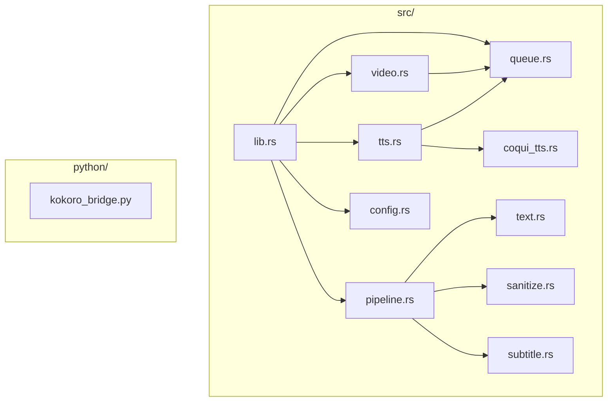
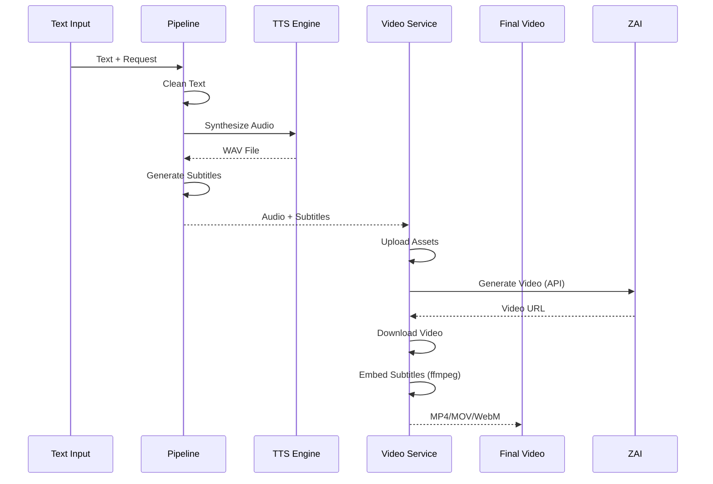
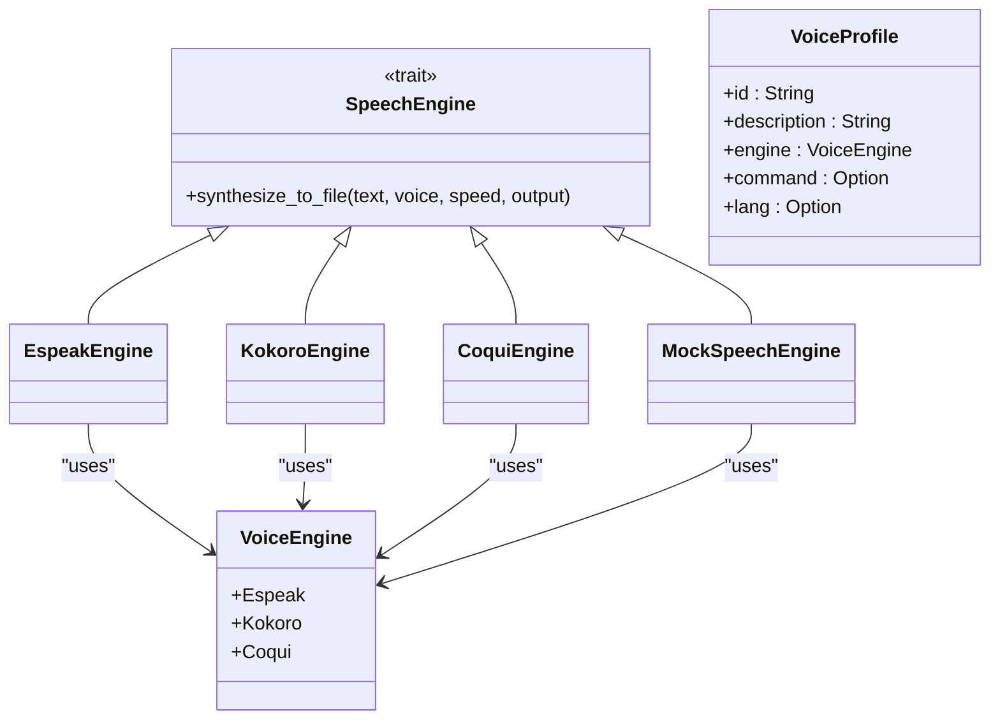
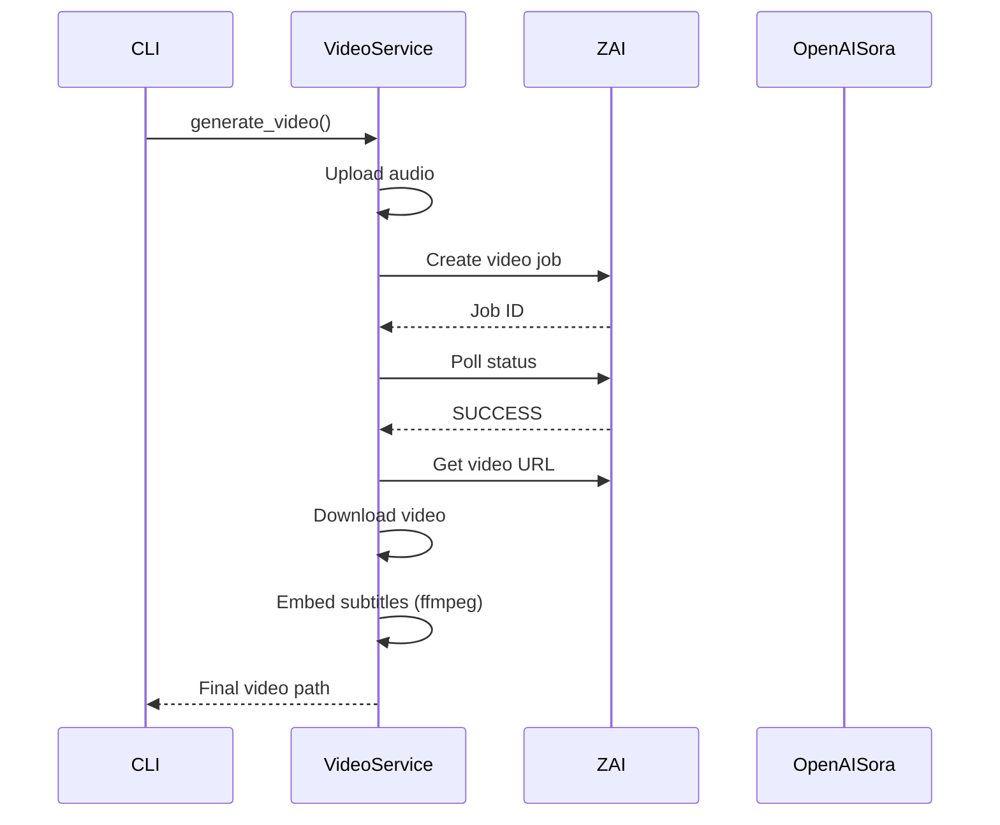
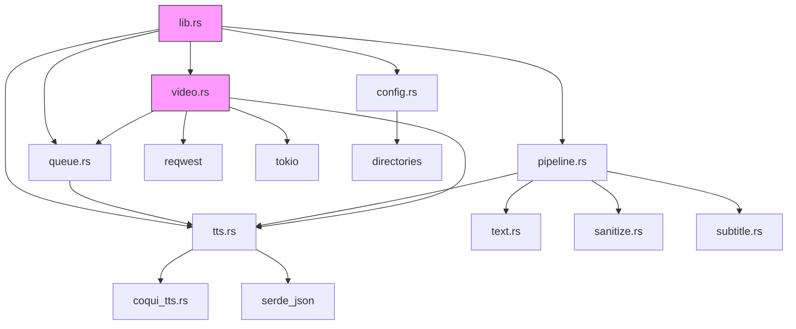

# Backend Architecture

<cite>
**Referenced Files in This Document**   
- [lib.rs](file://src/lib.rs)
- [pipeline.rs](file://src/pipeline.rs)
- [tts.rs](file://src/tts.rs)
- [video.rs](file://src/video.rs)
- [config.rs](file://src/config.rs)
- [queue.rs](file://src/queue.rs)
- [coqui_tts.rs](file://src/coqui_tts.rs)
- [main.rs](file://src/main.rs)
- [Cargo.toml](file://Cargo.toml)
- [kokoro_bridge.py](file://python/kokoro_bridge.py)
</cite>

## Table of Contents
1. [Introduction](#introduction)
2. [Project Structure](#project-structure)
3. [Core Components](#core-components)
4. [Architecture Overview](#architecture-overview)
5. [Detailed Component Analysis](#detailed-component-analysis)
6. [Dependency Analysis](#dependency-analysis)
7. [Performance Considerations](#performance-considerations)
8. [Troubleshooting Guide](#troubleshooting-guide)
9. [Conclusion](#conclusion)

## Introduction
The VoxWeave backend architecture is a modular Rust-based system designed for text-to-speech (TTS) and video generation workflows. It provides a clean separation of concerns through well-defined components that handle text processing, audio synthesis, subtitle generation, and video assembly. The system supports multiple TTS engines including espeak-ng, Kokoro, and CoquiTTS, with extensible trait-based abstractions. It also integrates with external video generation APIs such as Z.AI and OpenAI Sora through an asynchronous service layer. Configuration is managed through environment variables and JSON configuration files, while batch processing is handled via an in-memory queue system.

## Project Structure

**Diagram sources**
- [lib.rs](file://src/lib.rs#L1-L13)
- [pipeline.rs](file://src/pipeline.rs#L1-L139)
- [tts.rs](file://src/tts.rs#L1-L522)
- [video.rs](file://src/video.rs#L1-L462)
- [config.rs](file://src/config.rs#L1-L117)
- [queue.rs](file://src/queue.rs#L1-L154)
- [coqui_tts.rs](file://src/coqui_tts.rs#L1-L115)
- [python/kokoro_bridge.py](file://python/kokoro_bridge.py#L1-L89)

**Section sources**
- [src/lib.rs](file://src/lib.rs#L1-L13)
- [src/pipeline.rs](file://src/pipeline.rs#L1-L139)
- [src/tts.rs](file://src/tts.rs#L1-L522)
- [src/video.rs](file://src/video.rs#L1-L462)
- [src/config.rs](file://src/config.rs#L1-L117)
- [src/queue.rs](file://src/queue.rs#L1-L154)
- [src/coqui_tts.rs](file://src/coqui_tts.rs#L1-L115)
- [python/kokoro_bridge.py](file://python/kokoro_bridge.py#L1-L89)

## Core Components

The VoxWeave core library is structured around several key components that work together to transform text input into synchronized audio and video output. The `lib.rs` file serves as the public API entry point, exposing the pipeline functionality while encapsulating internal modules. The system follows a modular design where each component has a single responsibility and communicates through well-defined interfaces. This architecture enables easy extension and replacement of individual components without affecting the overall system stability.

**Section sources**
- [lib.rs](file://src/lib.rs#L1-L13)
- [pipeline.rs](file://src/pipeline.rs#L1-L139)
- [tts.rs](file://src/tts.rs#L1-L522)
- [video.rs](file://src/video.rs#L1-L462)

## Architecture Overview

**Diagram sources**
- [pipeline.rs](file://src/pipeline.rs#L1-L139)
- [tts.rs](file://src/tts.rs#L1-L522)
- [video.rs](file://src/video.rs#L1-L462)

## Detailed Component Analysis

### Pipeline Orchestration

The `pipeline.rs` module orchestrates the entire text-to-video workflow by coordinating text processing, audio synthesis, and subtitle generation. It defines the `ConvertRequest` struct that encapsulates all parameters needed for conversion, including source path, output directory, voice profile, speed, and subtitle settings. The `convert_path` function serves as the main entry point, handling file I/O, text cleaning, speech synthesis, and subtitle creation in a sequential workflow. For batch processing, the `convert_queue` function processes multiple items from a FIFO queue, enabling efficient batch operations.

**Section sources**
- [pipeline.rs](file://src/pipeline.rs#L1-L139)

### TTS Engine Abstraction

**Diagram sources**
- [tts.rs](file://src/tts.rs#L1-L522)
- [coqui_tts.rs](file://src/coqui_tts.rs#L1-L115)

The TTS system is built around a trait-based abstraction defined by the `SpeechEngine` trait, which provides a uniform interface for different speech synthesis backends. This design allows for easy integration of new TTS engines by implementing the trait. The system supports three primary engines: espeak-ng for lightweight synthesis, Kokoro for neural voice generation, and CoquiTTS for advanced voice cloning capabilities. Each engine implementation handles its specific configuration and execution details while presenting a consistent API to the rest of the system. Voice profiles are managed through the `VoiceProfile` struct, which contains metadata and configuration for each available voice.

### Video Generation Service

**Diagram sources**
- [video.rs](file://src/video.rs#L1-L462)
- [main.rs](file://src/main.rs#L1-L417)

The asynchronous video generation service in `video.rs` provides integration with external video generation APIs such as Z.AI and OpenAI Sora. It uses the `tokio` runtime for asynchronous operations, enabling non-blocking API calls and efficient resource utilization. The service handles the complete video generation lifecycle: uploading audio assets, creating generation jobs, polling for completion, downloading results, and optionally embedding subtitles using ffmpeg. The `VideoGenerationService` struct abstracts the differences between providers through a common interface, allowing seamless switching between Z.AI and Sora backends based on available API keys.

### Configuration Management

The configuration system in `config.rs` manages application settings through a combination of environment variables and persistent JSON configuration files. The `AppConfig` struct defines the schema for user preferences including default voice selection, newline handling behavior, and recent file history. Configuration files are stored in platform-appropriate locations using the `directories` crate, with fallback to environment variable overrides. The system provides functions for loading, saving, and resolving configuration values, ensuring consistent behavior across different deployment scenarios.

**Section sources**
- [config.rs](file://src/config.rs#L1-L117)

### Queue System

The queue system in `queue.rs` implements a simple in-memory FIFO queue for managing batch processing of conversion tasks. The `ConversionQueue` struct provides basic operations for enqueueing, dequeueing, and iterating over queue items. Each `QueueItem` contains all necessary information for a single conversion task, including source path, output directory, voice profile, and processing options. This system enables efficient batch processing of multiple files without requiring changes to the core conversion logic.

**Section sources**
- [queue.rs](file://src/queue.rs#L1-L154)

## Dependency Analysis

**Diagram sources**
- [Cargo.toml](file://Cargo.toml#L1-L26)
- [lib.rs](file://src/lib.rs#L1-L13)
- [pipeline.rs](file://src/pipeline.rs#L1-L139)
- [tts.rs](file://src/tts.rs#L1-L522)
- [video.rs](file://src/video.rs#L1-L462)
- [config.rs](file://src/config.rs#L1-L117)
- [queue.rs](file://src/queue.rs#L1-L154)
- [coqui_tts.rs](file://src/coqui_tts.rs#L1-L115)

## Performance Considerations

The VoxWeave architecture incorporates several performance optimizations for CPU-intensive operations. The TTS engines are designed to minimize memory allocation and maximize throughput, with special consideration for voice cloning operations in CoquiTTS which require significant computational resources. The video generation service uses asynchronous I/O to avoid blocking the main thread during network operations and file transfers. For large-scale processing, the queue system enables batch operations that can be parallelized across multiple CPU cores. The system also includes optimizations for text cleaning and subtitle generation to reduce processing latency. When using voice cloning features, performance can be improved by pre-loading models and reusing inference sessions.

## Troubleshooting Guide

Common issues in the VoxWeave system typically relate to missing dependencies, configuration errors, or API connectivity problems. For TTS issues, verify that the required speech engines are installed and accessible in the system PATH. Voice cloning requires both the CoquiTTS Python package and compatible audio files in the correct format. Video generation failures are often caused by missing or invalid API keys; ensure that either `ZAI_API_KEY` or `OPENAI_API_KEY` environment variables are set. Configuration problems can be diagnosed by checking the JSON configuration file location and permissions. Network-related issues may require adjusting timeout settings or verifying internet connectivity to the video generation APIs.

**Section sources**
- [main.rs](file://src/main.rs#L1-L417)
- [video.rs](file://src/video.rs#L1-L462)
- [tts.rs](file://src/tts.rs#L1-L522)
- [config.rs](file://src/config.rs#L1-L117)

## Conclusion

The VoxWeave backend architecture demonstrates a well-structured, modular design that effectively separates concerns while maintaining flexibility and extensibility. The trait-based TTS engine abstraction allows for easy integration of new speech synthesis technologies, while the asynchronous video generation service provides robust integration with external AI video platforms. The system's configuration management and queue processing capabilities make it suitable for both interactive and batch processing workflows. By leveraging Rust's safety and performance characteristics, the architecture delivers reliable text-to-video conversion with minimal resource overhead. Future enhancements could include distributed queue processing, caching mechanisms, and additional video generation providers.