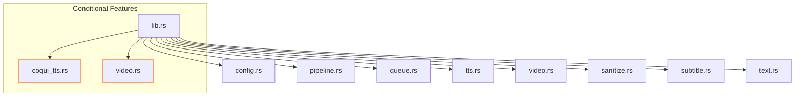
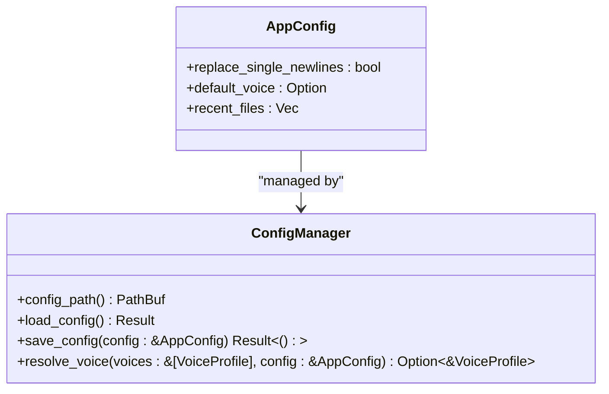
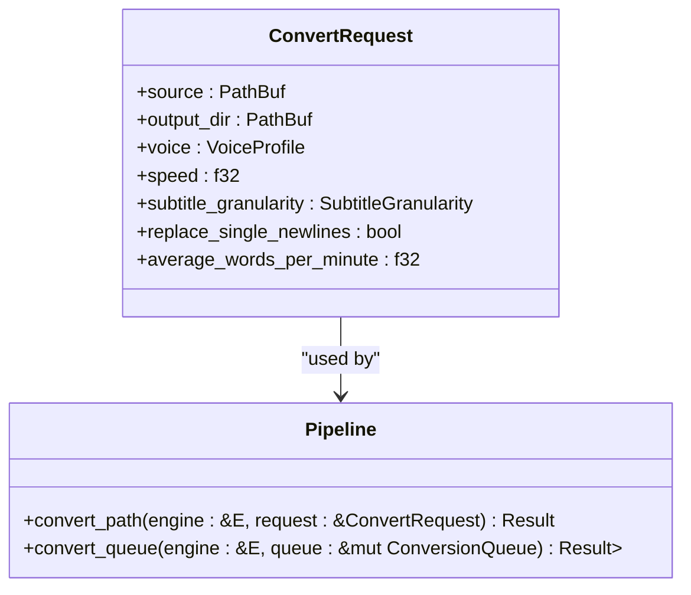
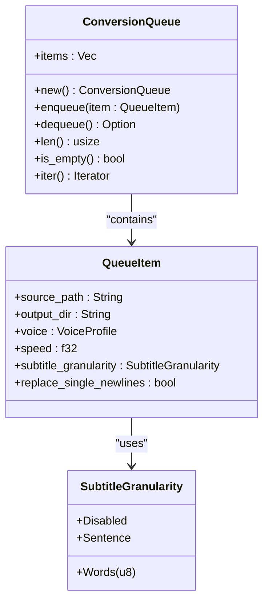
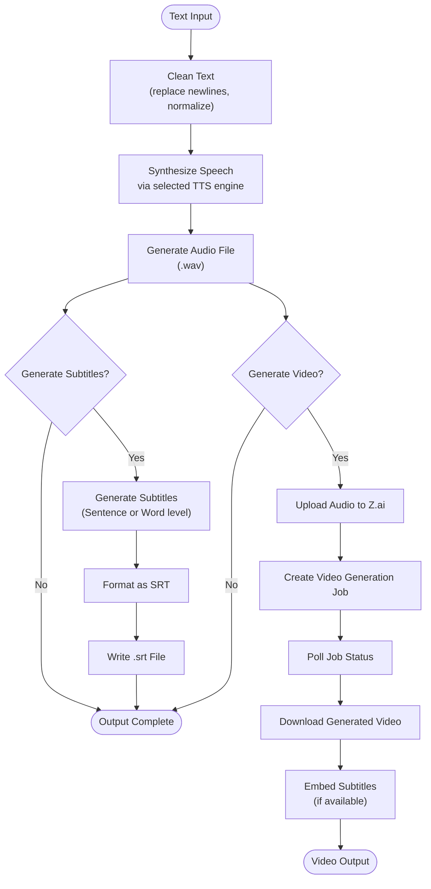
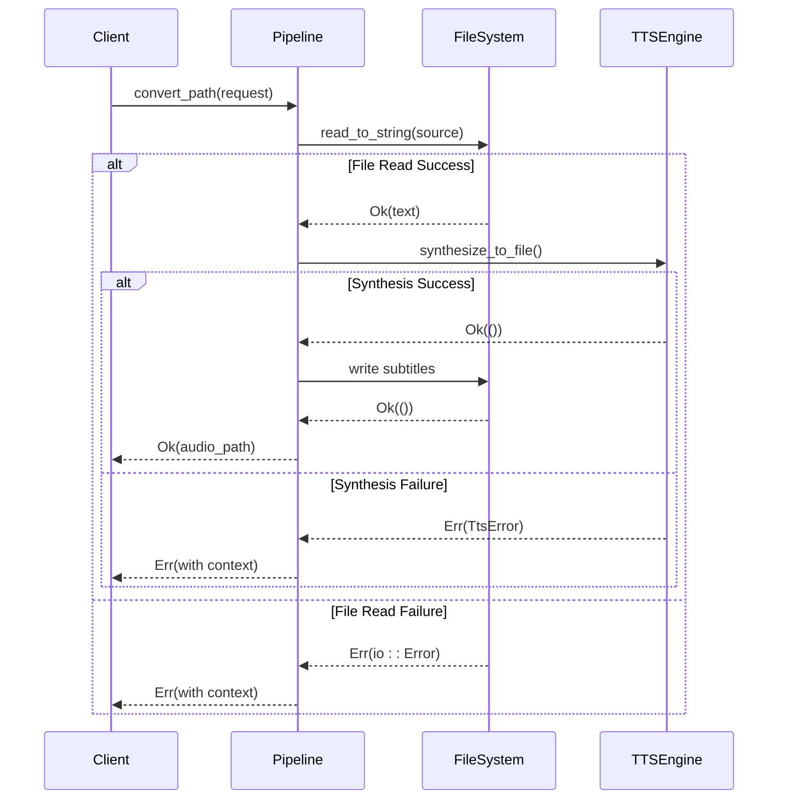

# Core Library

<cite>
**Referenced Files in This Document**   
- [lib.rs](file://src/lib.rs)
- [config.rs](file://src/config.rs)
- [pipeline.rs](file://src/pipeline.rs)
- [queue.rs](file://src/queue.rs)
- [tts.rs](file://src/tts.rs)
- [video.rs](file://src/video.rs)
</cite>

## Table of Contents
1. [Introduction](#introduction)
2. [Library Facade and Module Structure](#library-facade-and-module-structure)
3. [Configuration Management](#configuration-management)
4. [Conversion Pipeline](#conversion-pipeline)
5. [Queue System](#queue-system)
6. [Data Flow and Processing](#data-flow-and-processing)
7. [Error Handling](#error-handling)
8. [Code Examples](#code-examples)

## Introduction
The VoxWeave core library provides a public API for text-to-speech conversion and video generation through its main facade in `src/lib.rs`. This document explains how the library is structured, how configuration is managed, and how text conversion requests are processed through the pipeline. The library supports multiple TTS engines and conditional compilation for advanced features like Coqui TTS and video generation.

## Library Facade and Module Structure

The `src/lib.rs` file serves as the primary entry point and facade for the VoxWeave library, re-exporting critical modules and public functions. It organizes the system into distinct components while providing conditional compilation for optional features.



**Diagram sources**
- [lib.rs](file://src/lib.rs#L1-L14)

**Section sources**
- [lib.rs](file://src/lib.rs#L1-L14)

## Configuration Management

The configuration system in `src/config.rs` manages application settings through a combination of environment variables and persistent JSON configuration. The `AppConfig` struct defines the core configuration options including text processing preferences and default voice selection.

Environment variables provide runtime overrides for key system components:
- `VOXWEAVE_ESPEAK_COMMAND`: Specifies the espeak command path
- `VOXWEAVE_KOKORO_PYTHON`: Sets the Python interpreter for Kokoro TTS
- `VOXWEAVE_CONFIG_DIR`: Overrides the configuration directory location
- `ZAI_API_KEY` or `OPENAI_API_KEY`: Provides API keys for video generation



**Diagram sources**
- [config.rs](file://src/config.rs#L8-L13)
- [config.rs](file://src/config.rs#L50-L99)

**Section sources**
- [config.rs](file://src/config.rs#L8-L116)

## Conversion Pipeline

The conversion pipeline, defined in `src/pipeline.rs`, orchestrates the text-to-speech process from input text to audio and subtitle output. The public API exposes two key components: the `ConvertRequest` struct for specifying conversion parameters and the `convert_path` function for executing conversions.

The `ConvertRequest` struct encapsulates all parameters needed for a conversion:
- Source text file path
- Output directory
- Voice profile and speech speed
- Subtitle granularity settings
- Text processing options



**Diagram sources**
- [pipeline.rs](file://src/pipeline.rs#L10-L19)
- [pipeline.rs](file://src/pipeline.rs#L21-L55)

**Section sources**
- [pipeline.rs](file://src/pipeline.rs#L10-L55)

## Queue System

The queue system in `src/queue.rs` manages batch processing of conversion requests with support for various subtitle granularities and voice profiles. The `ConversionQueue` implements a FIFO (First-In-First-Out) structure for processing multiple items sequentially.

Key components of the queue system include:
- `QueueItem`: Represents a single conversion task with all necessary parameters
- `SubtitleGranularity`: Enum defining subtitle segmentation options (Disabled, Sentence, Words)
- `ConversionQueue`: Manages the collection of pending conversion tasks



**Diagram sources**
- [queue.rs](file://src/queue.rs#L94-L97)
- [queue.rs](file://src/queue.rs#L63-L132)

**Section sources**
- [queue.rs](file://src/queue.rs#L63-L132)

## Data Flow and Processing

The data flow begins with text input and progresses through several processing stages to produce audio and subtitle outputs. The pipeline first cleans the input text using `clean_text`, then synthesizes speech through the selected TTS engine, and optionally generates subtitles based on the specified granularity.

For video generation, when the `video-generation` feature is enabled, the system can create videos from audio files using the Z.ai API. The `VideoGenerationService` handles API authentication, job creation, status polling, and video download.



**Diagram sources**
- [pipeline.rs](file://src/pipeline.rs#L21-L55)
- [video.rs](file://src/video.rs#L50-L64)

**Section sources**
- [pipeline.rs](file://src/pipeline.rs#L21-L55)
- [video.rs](file://src/video.rs#L50-L64)

## Error Handling

The library uses the `anyhow` crate for comprehensive error handling throughout the codebase. Errors are propagated with context to provide meaningful error messages while maintaining type safety. The error handling strategy follows Rust's Result pattern with appropriate context addition at each layer.

Key error handling patterns include:
- Contextual error wrapping using `with_context()`
- Early returns for file system operations
- Comprehensive error propagation from dependencies
- Test coverage for error conditions



**Diagram sources**
- [pipeline.rs](file://src/pipeline.rs#L21-L55)
- [tts.rs](file://src/tts.rs#L500-L522)

**Section sources**
- [pipeline.rs](file://src/pipeline.rs#L21-L55)
- [tts.rs](file://src/tts.rs#L500-L522)

## Code Examples

### Initializing Configuration
```rust
use voxweave::config::{load_config, save_config, AppConfig};

// Load existing configuration or create default
let mut config = load_config().expect("Failed to load config");

// Modify configuration
config.replace_single_newlines = true;
config.default_voice = Some("af_heart".to_string());

// Save configuration
save_config(&config).expect("Failed to save config");
```

### Creating and Processing Conversion Requests
```rust
use voxweave::{ConvertRequest, convert_path};
use voxweave::tts::{default_voice_profiles, find_voice, MockSpeechEngine};

// Setup
let voices = default_voice_profiles();
let voice = find_voice(&voices, "af_heart").unwrap();
let engine = MockSpeechEngine::default();

// Create conversion request
let request = ConvertRequest {
    source: "input.txt".into(),
    output_dir: "output/".into(),
    voice: voice.clone(),
    speed: 1.0,
    subtitle_granularity: voxweave::queue::SubtitleGranularity::Sentence,
    replace_single_newlines: false,
    average_words_per_minute: 150.0,
};

// Execute conversion
let audio_path = convert_path(&engine, &request)
    .expect("Conversion failed");
println!("Audio generated at: {}", audio_path.display());
```

### Using the Queue System
```rust
use voxweave::{convert_queue, ConversionQueue, QueueItem};
use voxweave::tts::{default_voice_profiles, find_voice, MockSpeechEngine};

let mut queue = ConversionQueue::new();
let voices = default_voice_profiles();
let voice = find_voice(&voices, "af_heart").unwrap();

// Add items to queue
queue.enqueue(QueueItem {
    source_path: "chapter1.txt".to_string(),
    output_dir: "audio/".to_string(),
    voice: voice.clone(),
    speed: 1.0,
    subtitle_granularity: voxweave::queue::SubtitleGranularity::Sentence,
    replace_single_newlines: false,
});

let engine = MockSpeechEngine::default();
let outputs = convert_queue(&engine, &mut queue)
    .expect("Queue processing failed");
```

**Section sources**
- [config.rs](file://src/config.rs#L50-L99)
- [pipeline.rs](file://src/pipeline.rs#L90-L138)
- [queue.rs](file://src/queue.rs#L129-L155)