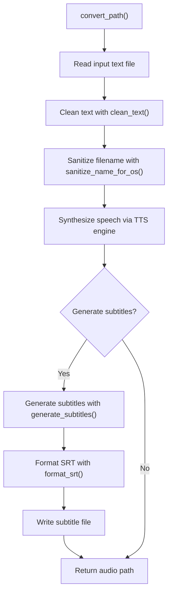
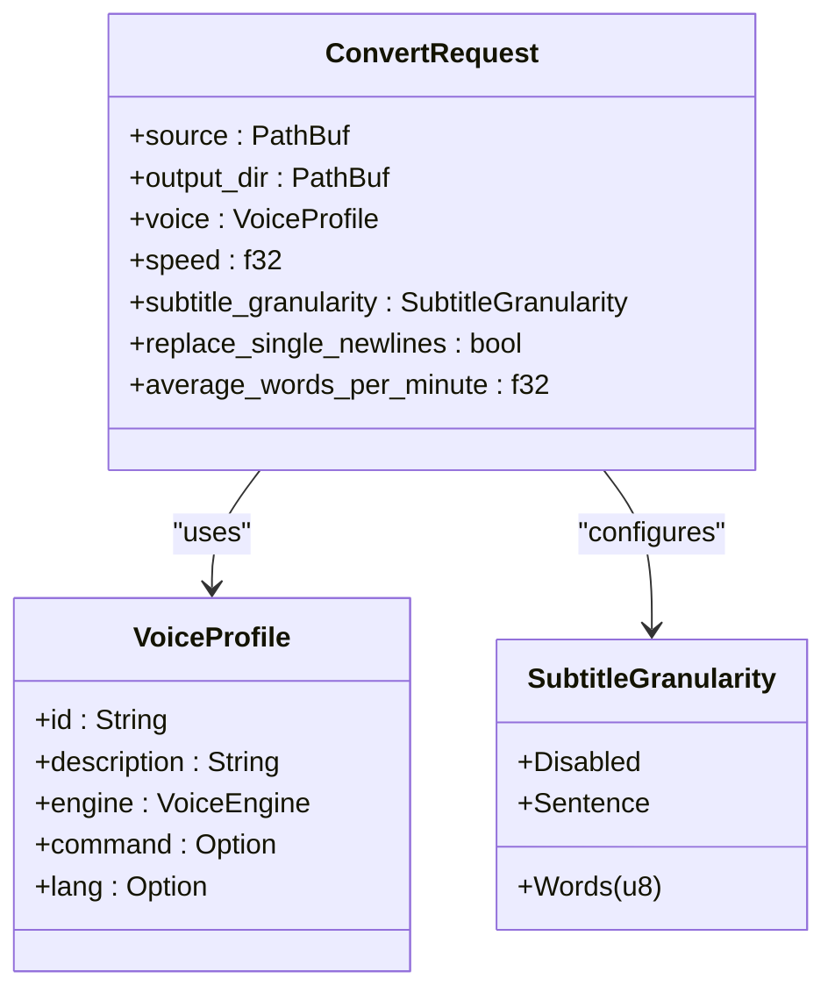
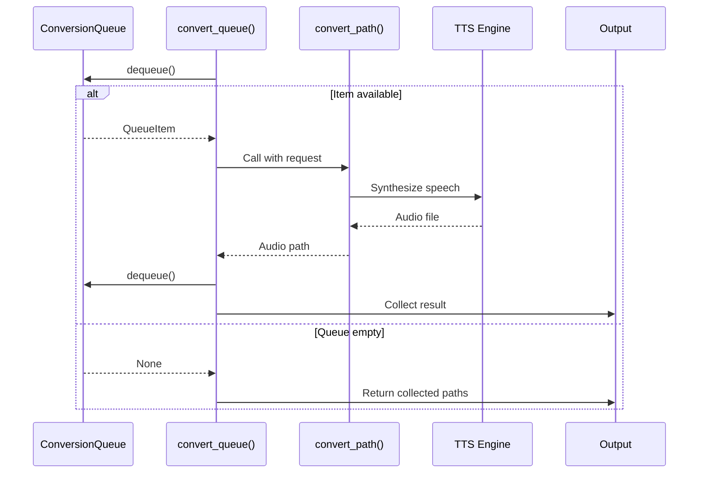
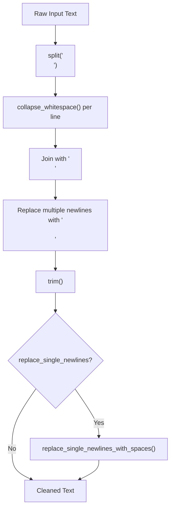
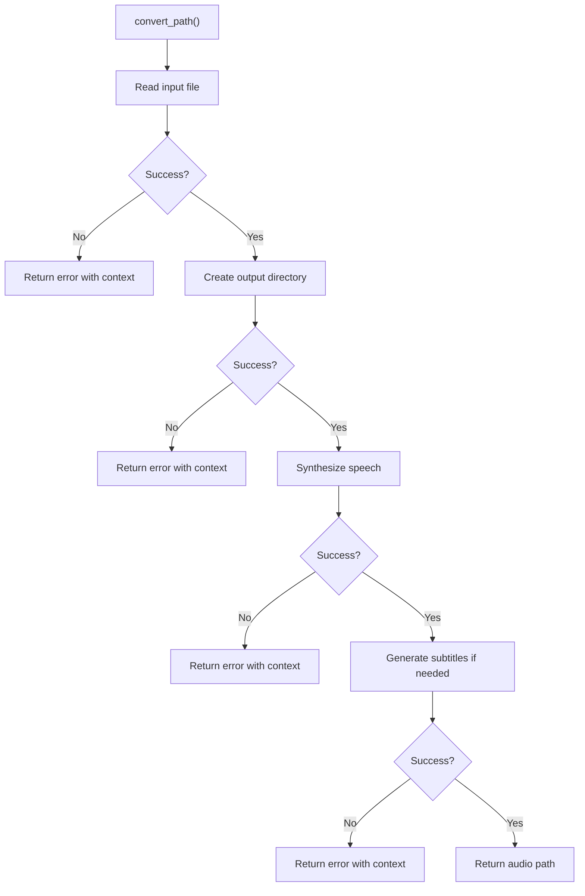
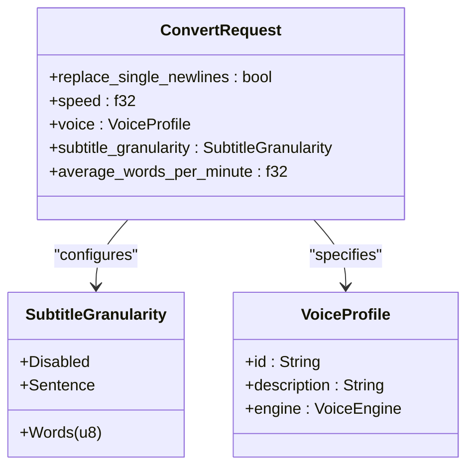

# Pipeline Orchestration

<cite>
**Referenced Files in This Document**   
- [pipeline.rs](file://src/pipeline.rs)
- [text.rs](file://src/text.rs)
- [sanitize.rs](file://src/sanitize.rs)
- [subtitle.rs](file://src/subtitle.rs)
- [queue.rs](file://src/queue.rs)
- [tts.rs](file://src/tts.rs)
- [lib.rs](file://src/lib.rs)
</cite>

## Table of Contents
1. [Introduction](#introduction)
2. [Core Components](#core-components)
3. [Pipeline Execution Flow](#pipeline-execution-flow)
4. [ConvertRequest Structure](#convertrequest-structure)
5. [Batch Processing with convert_queue](#batch-processing-with-convert_queue)
6. [Text Processing Pipeline](#text-processing-pipeline)
7. [Subtitle Generation and Timing](#subtitle-generation-and-timing)
8. [Error Handling and Robustness](#error-handling-and-robustness)
9. [Customization and Configuration](#customization-and-configuration)
10. [Example Walkthrough](#example-walkthrough)

## Introduction
The pipeline orchestration system in VoxWeave coordinates the end-to-end transformation of raw text into synchronized audio and subtitle files. This document details the core functionality implemented in `src/pipeline.rs`, focusing on the `convert_path` function that serves as the central coordinator for text-to-speech conversion and subtitle generation. The system integrates multiple specialized modules to clean text, sanitize filenames, synthesize speech, and generate timed subtitles, providing a robust foundation for batch audio content creation.

## Core Components

The pipeline orchestration system consists of several interconnected components that handle specific aspects of the text-to-audio conversion process. The `convert_path` function acts as the primary orchestrator, coordinating calls to text processing, TTS synthesis, and subtitle generation modules.

**Section sources**
- [pipeline.rs](file://src/pipeline.rs#L0-L140)
- [lib.rs](file://src/lib.rs#L0-L14)

## Pipeline Execution Flow



**Diagram sources**
- [pipeline.rs](file://src/pipeline.rs#L39-L83)

**Section sources**
- [pipeline.rs](file://src/pipeline.rs#L39-L83)

## ConvertRequest Structure

The `ConvertRequest` structure encapsulates all parameters needed for a text-to-speech conversion operation. It contains the source file path, output directory, voice profile, speech speed, subtitle configuration, newline handling preferences, and average words per minute for timing calculations.



**Diagram sources**
- [pipeline.rs](file://src/pipeline.rs#L0-L38)
- [queue.rs](file://src/queue.rs#L63-L79)
- [tts.rs](file://src/tts.rs#L0-L523)

**Section sources**
- [pipeline.rs](file://src/pipeline.rs#L0-L38)

## Batch Processing with convert_queue

The `convert_queue` function enables batch processing by dequeuing items from a `ConversionQueue` and applying the `convert_path` function to each. This allows for sequential processing of multiple text-to-speech conversion requests, with each item in the queue containing its own configuration parameters.



**Diagram sources**
- [pipeline.rs](file://src/pipeline.rs#L83-L109)

**Section sources**
- [pipeline.rs](file://src/pipeline.rs#L83-L109)
- [queue.rs](file://src/queue.rs#L100-L132)

## Text Processing Pipeline

The text processing pipeline begins with reading the raw input text and proceeds through cleaning and normalization steps. The `clean_text` function removes extra whitespace, collapses multiple blank lines, and optionally replaces single newlines with spaces based on the `replace_single_newlines` flag.



**Diagram sources**
- [text.rs](file://src/text.rs#L0-L71)

**Section sources**
- [text.rs](file://src/text.rs#L0-L71)
- [pipeline.rs](file://src/pipeline.rs#L45-L46)

## Subtitle Generation and Timing

Subtitle generation is controlled by the `subtitle_granularity` parameter and uses the `average_words_per_minute` value to calculate timing. The system can generate subtitles at sentence or word-group levels, with timing based on word count and the specified words-per-minute rate.

```mermaid
flowchart TD
A["generate_subtitles()"] --> B{"Granularity"}
B --> |Disabled| C["Return empty"]
B --> |Sentence| D["split_sentences()"]
B --> |Words(n)| E["split_words(chunk_size=n)"]
D --> F["build_entries()"]
E --> F
F --> G["Calculate duration per chunk"]
G --> H["ms_per_word = 60,000 / average_wpm"]
H --> I["duration = word_count * ms_per_word"]
I --> J["Ensure minimum 500ms duration"]
J --> K["Set start/end timestamps"]
K --> L["Return SubtitleEntry array"]
```

**Diagram sources**
- [subtitle.rs](file://src/subtitle.rs#L0-L157)

**Section sources**
- [subtitle.rs](file://src/subtitle.rs#L0-L157)
- [pipeline.rs](file://src/pipeline.rs#L64-L70)

## Error Handling and Robustness

The pipeline implements comprehensive error handling for various failure scenarios, including file I/O operations, text processing, and speech synthesis. Errors are propagated using the `anyhow` crate, providing contextual information about the source of failures.



**Diagram sources**
- [pipeline.rs](file://src/pipeline.rs#L40-L83)

**Section sources**
- [pipeline.rs](file://src/pipeline.rs#L40-L83)

## Customization and Configuration

The pipeline offers several customization points that allow users to tailor the conversion process to their specific needs. These include controlling newline behavior, adjusting speech speed, selecting different voice profiles, and configuring subtitle granularity and timing.



**Diagram sources**
- [pipeline.rs](file://src/pipeline.rs#L0-L38)
- [queue.rs](file://src/queue.rs#L75-L79)
- [tts.rs](file://src/tts.rs#L0-L523)

**Section sources**
- [pipeline.rs](file://src/pipeline.rs#L0-L38)
- [queue.rs](file://src/queue.rs#L75-L79)

## Example Walkthrough

Consider a conversion request with the following parameters:
- Source: `samples/example.txt`
- Output directory: `output/`
- Voice: "en-us" (English US)
- Speed: 1.2x
- Subtitle granularity: Sentence
- Replace single newlines: false
- Average words per minute: 160

The pipeline would execute as follows:
1. Read the content of `samples/example.txt`
2. Clean the text by removing extra whitespace and blank lines
3. Extract the base filename "example" and sanitize it for the current OS
4. Create the output directory if it doesn't exist
5. Synthesize speech using the specified voice and speed, saving to `output/example.wav`
6. Generate sentence-level subtitles using 160 words per minute for timing calculations
7. Format the subtitles in SRT format and save to `output/example.srt`
8. Return the path to the generated audio file

This end-to-end process transforms raw text into synchronized audio and subtitle files, ready for use in video production or other applications.

**Section sources**
- [pipeline.rs](file://src/pipeline.rs#L39-L83)
- [text.rs](file://src/text.rs#L0-L71)
- [sanitize.rs](file://src/sanitize.rs#L0-L162)
- [subtitle.rs](file://src/subtitle.rs#L0-L157)