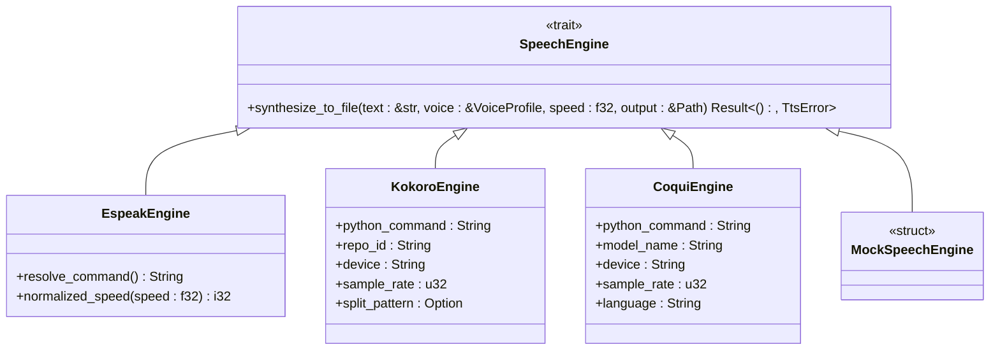
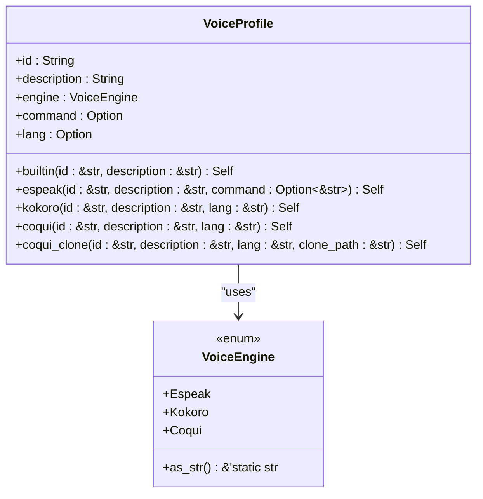
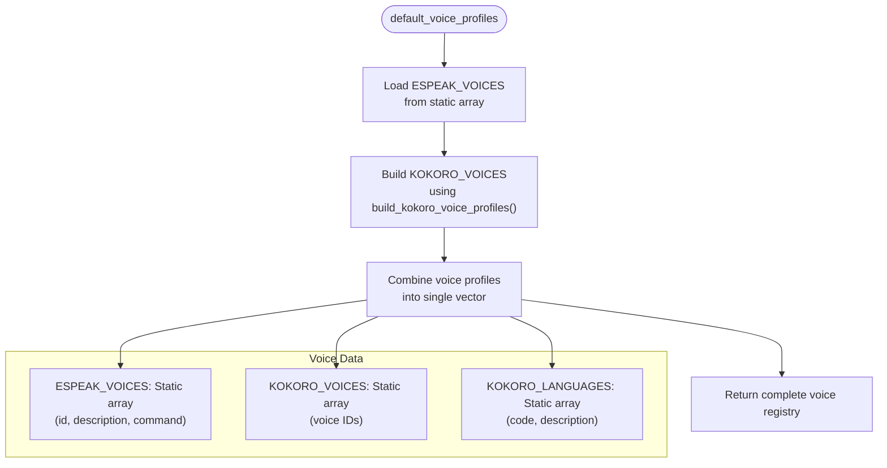
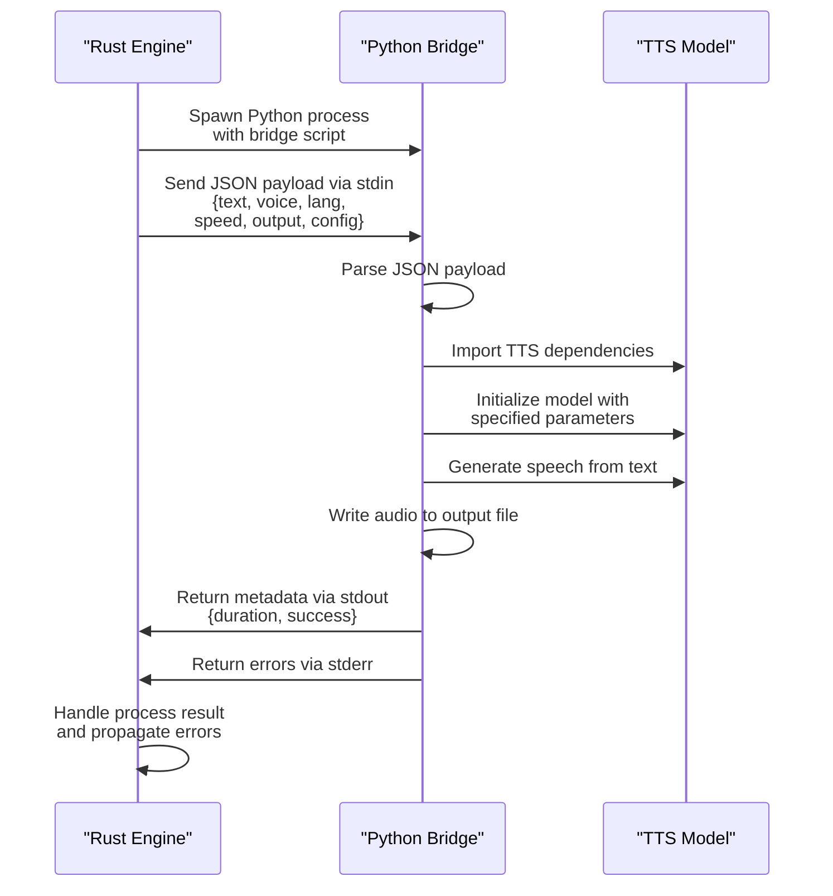

# TTS Engine Abstraction

<cite>
**Referenced Files in This Document**   
- [tts.rs](file://src/tts.rs)
- [coqui_tts.rs](file://src/coqui_tts.rs)
- [kokoro_bridge.py](file://python/kokoro_bridge.py)
</cite>

## Table of Contents
1. [Introduction](#introduction)
2. [Core Components](#core-components)
3. [SpeechEngine Trait Design](#speechengine-trait-design)
4. [VoiceProfile Structure](#voiceprofile-structure)
5. [Backend Implementations](#backend-implementations)
6. [Voice Registry System](#voice-registry-system)
7. [Environment Configuration](#environment-configuration)
8. [Python Bridge Integration](#python-bridge-integration)
9. [Code Examples](#code-examples)
10. [Error Handling](#error-handling)

## Introduction
The TTS engine abstraction layer in VoxWeave provides a unified interface for multiple text-to-speech backends through a trait-based architecture. This design enables pluggable TTS engines while maintaining consistent configuration and error handling across different implementations. The system supports three primary backends: EspeakEngine for lightweight synthesis, KokoroEngine for neural voice generation, and CoquiTTS for advanced voice cloning capabilities. The abstraction layer handles engine-specific configurations through the VoiceProfile structure and provides a global voice registry for easy voice management.

## Core Components

The TTS abstraction layer consists of several key components that work together to provide a flexible and extensible text-to-speech system. The core is built around the SpeechEngine trait, which defines a common interface for all TTS backends. VoiceProfile structures encapsulate engine-specific configuration parameters, while environment variables allow runtime customization of engine behavior. The system uses Python bridge scripts for neural TTS engines, enabling integration with external machine learning models.

**Section sources**
- [tts.rs](file://src/tts.rs#L0-L522)
- [coqui_tts.rs](file://src/coqui_tts.rs#L0-L115)

## SpeechEngine Trait Design



**Diagram sources**
- [tts.rs](file://src/tts.rs#L101-L150)
- [tts.rs](file://src/tts.rs#L152-L192)
- [coqui_tts.rs](file://src/coqui_tts.rs#L19-L85)

The SpeechEngine trait defines a common interface for all TTS backends, enabling polymorphic behavior and pluggable engine architecture. Each implementation must provide a synthesize_to_file method that converts text to audio using the specified voice profile and speed parameter. The trait-based design allows the system to route synthesis requests to the appropriate backend based on the voice profile configuration. The MockSpeechEngine provides a testing implementation that writes text directly to files without actual speech synthesis.

## VoiceProfile Structure



**Diagram sources**
- [tts.rs](file://src/tts.rs#L28-L78)

The VoiceProfile structure encapsulates all configuration parameters for a specific voice across different TTS engines. It includes the voice ID, descriptive text, engine type, and optional command override or language specification. The structure provides constructor methods for each engine type, including specialized methods for voice cloning with CoquiTTS. The command field serves multiple purposes: storing espeak command overrides, holding reference audio paths for voice cloning, or remaining unused for standard voices. The engine field determines which backend processes the synthesis request.

## Backend Implementations

### EspeakEngine Implementation
The EspeakEngine provides a lightweight TTS solution using the espeak command-line tool. It supports voice selection through the command field override and adjusts speech rate based on the speed parameter. The engine handles empty text input by creating silent audio files and validates that the assigned voice profile matches the Espeak engine type.

**Section sources**
- [tts.rs](file://src/tts.rs#L116-L150)

### KokoroEngine Implementation
The KokoroEngine integrates with the Kokoro neural TTS system through a Python bridge script. It configures the synthesis process with parameters like repository ID, device selection, sample rate, and text splitting patterns. The engine passes JSON payloads containing text, voice, language, and output path information to the Python script, which handles the actual neural synthesis.

**Section sources**
- [tts.rs](file://src/tts.rs#L194-L284)

### CoquiTTS Implementation
The CoquiEngine provides advanced voice cloning capabilities through the CoquiTTS XTTS model. It supports both standard voice synthesis and voice cloning using reference audio files. The engine passes detailed configuration to the Python bridge, including model name, device selection, and speaker reference paths. Voice cloning is enabled when the voice profile's command field contains a valid path to reference audio.

**Section sources**
- [coqui_tts.rs](file://src/coqui_tts.rs#L19-L85)

## Voice Registry System



**Diagram sources**
- [tts.rs](file://src/tts.rs#L286-L294)

The default_voice_profiles function builds a global registry of available voices by combining voices from multiple sources. It first loads the built-in espeak voices from the ESPEAK_VOICES static array, then generates Kokoro voice profiles using the build_kokoro_voice_profiles helper function. The function returns a complete vector of VoiceProfile instances that can be used throughout the application for voice selection and validation. The find_voice utility function enables lookup of voice profiles by ID from any collection.

## Environment Configuration

The TTS system uses environment variables to configure engine behavior at runtime without requiring code changes. These variables allow users to customize command paths, device selection, and synthesis parameters:

- **VOXWEAVE_ESPEAK_COMMAND**: Overrides the espeak executable path
- **VOXWEAVE_KOKORO_PYTHON**: Specifies the Python interpreter for Kokoro bridge
- **VOXWEAVE_KOKORO_REPO_ID**: Sets the model repository for Kokoro synthesis
- **VOXWEAVE_KOKORO_DEVICE**: Selects processing device (cpu, cuda, mps)
- **VOXWEAVE_KOKORO_SAMPLE_RATE**: Configures audio output sample rate
- **VOXWEAVE_KOKORO_SPLIT_PATTERN**: Defines text splitting pattern for long inputs
- **VOXWEAVE_COQUI_PYTHON**: Python interpreter for CoquiTTS bridge
- **VOXWEAVE_COQUI_MODEL**: TTS model identifier for Coqui engine
- **VOXWEAVE_COQUI_DEVICE**: Processing device for CoquiTTS
- **VOXWEAVE_COQUI_SAMPLE_RATE**: Audio sample rate for Coqui output
- **VOXWEAVE_COQUI_LANGUAGE**: Default language for Coqui synthesis

**Section sources**
- [tts.rs](file://src/tts.rs#L121-L121)
- [tts.rs](file://src/tts.rs#L197-L206)
- [coqui_tts.rs](file://src/coqui_tts.rs#L19-L29)

## Python Bridge Integration



**Diagram sources**
- [tts.rs](file://src/tts.rs#L250-L284)
- [kokoro_bridge.py](file://python/kokoro_bridge.py#L0-L89)
- [tts.rs](file://src/tts.rs#L385-L485)

The Python bridge integration enables communication between the Rust-based TTS abstraction layer and Python-based neural TTS models. The system spawns a Python process with an inline bridge script that reads JSON payloads from stdin, processes the text-to-speech request, and writes audio to the specified output file. The bridge returns metadata about the generated audio via stdout and error messages via stderr. This architecture isolates the machine learning components from the main application while providing a reliable inter-process communication channel.

## Code Examples

### Instantiating and Using EspeakEngine
```rust
let engine = EspeakEngine::default();
let voice = VoiceProfile::espeak("en-us", "English (US)", Some("espeak"));
engine.synthesize_to_file("Hello world", &voice, 1.0, &output_path)?;
```

### Using KokoroEngine with Custom Configuration
```rust
let engine = KokoroEngine {
    python_command: "python3".to_string(),
    repo_id: "hexgrad/Kokoro-82M".to_string(),
    device: "cpu".to_string(),
    sample_rate: 24_000,
    split_pattern: None,
};
let voice = VoiceProfile::kokoro("af_alloy", "Alloy Voice", "a");
engine.synthesize_to_file("Hello from Kokoro", &voice, 1.0, &output_path)?;
```

### CoquiTTS Voice Cloning
```rust
let engine = CoquiEngine::default();
let voice = VoiceProfile::coqui_clone(
    "my-voice",
    "My Cloned Voice",
    "en",
    "/path/to/reference/audio.wav"
);
engine.synthesize_to_file("This sounds like me!", &voice, 1.0, &output_path)?;
```

**Section sources**
- [tts.rs](file://src/tts.rs#L116-L150)
- [tts.rs](file://src/tts.rs#L194-L284)
- [coqui_tts.rs](file://src/coqui_tts.rs#L19-L85)

## Error Handling

The TTS system implements comprehensive error handling through the TtsError enum, which categorizes failures into three main types:

- **UnsupportedVoice**: Triggered when a voice profile is used with an incompatible engine
- **CommandFailed**: Indicates process execution failures or non-zero exit codes
- **Backend**: Covers internal errors such as I/O failures or JSON serialization issues

Each engine implementation validates the voice profile's engine type before processing and propagates underlying system errors with descriptive messages. The Python bridge scripts include try-catch blocks to capture dependency import failures and synthesis exceptions, returning appropriate error messages through stderr. The system handles edge cases like empty text input by generating silent audio files rather than failing.

**Section sources**
- [tts.rs](file://src/tts.rs#L3-L18)
- [tts.rs](file://src/tts.rs#L140-L150)
- [tts.rs](file://src/tts.rs#L240-L284)
- [coqui_tts.rs](file://src/coqui_tts.rs#L60-L85)