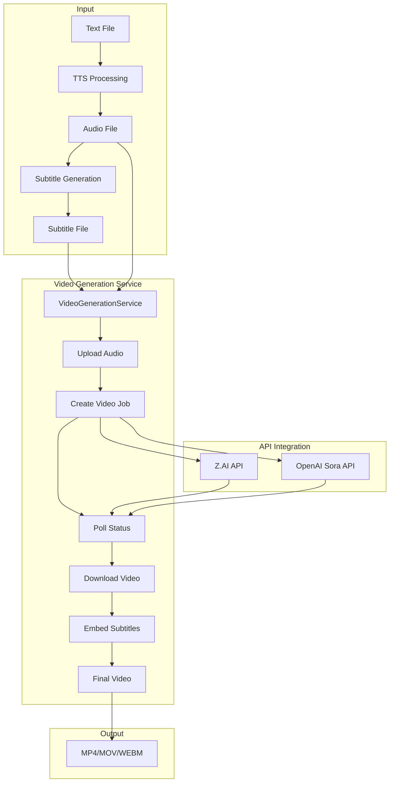
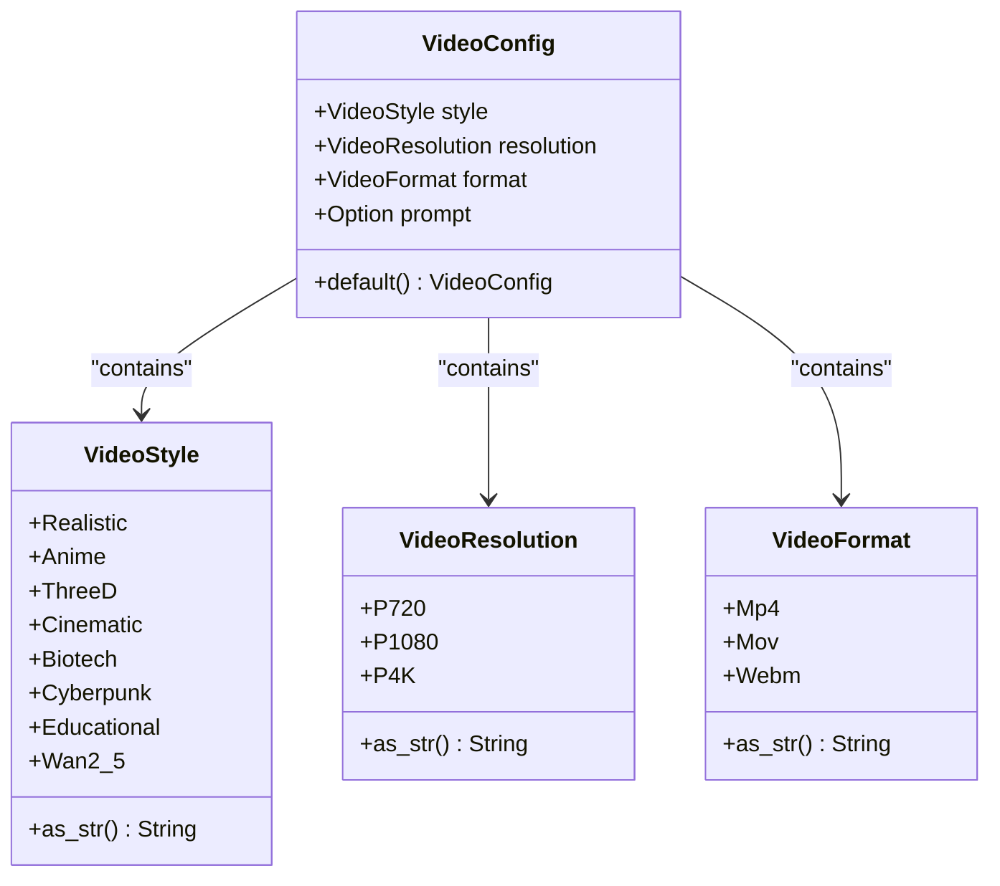
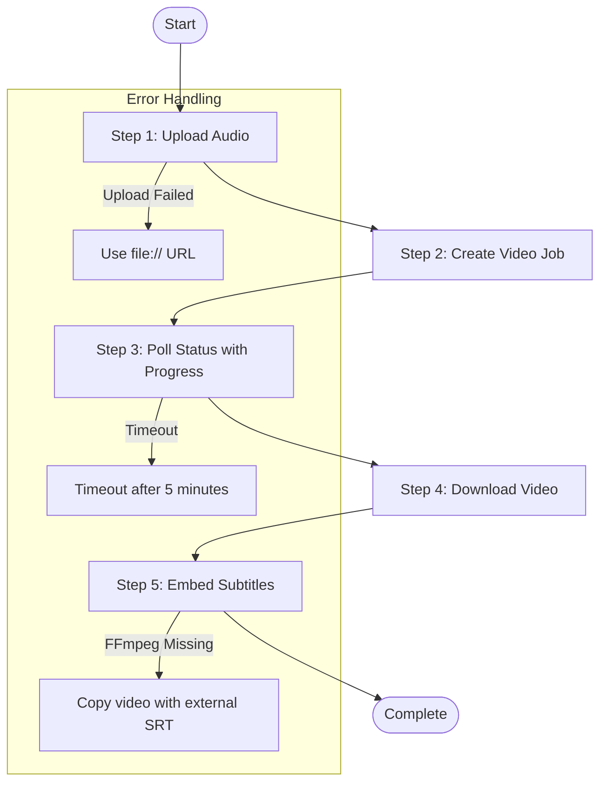
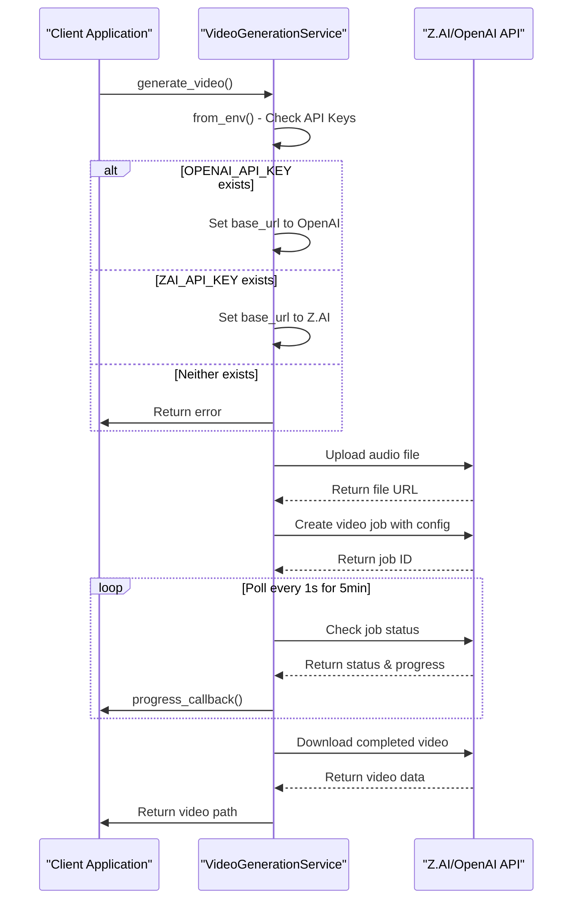
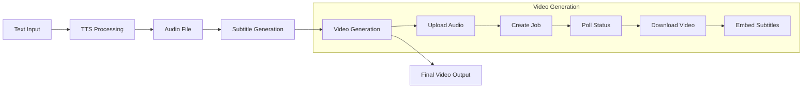

# Video Generation Service

<cite>
**Referenced Files in This Document**   
- [video.rs](file://src/video.rs)
- [queue.rs](file://src/queue.rs)
- [VIDEO_INTEGRATION_PLAN.md](file://abogen-ui/VIDEO_INTEGRATION_PLAN.md)
- [ZAI_VIDEO_FEATURE.md](file://abogen-ui/ZAI_VIDEO_FEATURE.md)
- [CLI_VIDEO_GENERATION.md](file://CLI_VIDEO_GENERATION.md)
- [VIDEO_CLI_IMPLEMENTATION.md](file://VIDEO_CLI_IMPLEMENTATION.md)
- [VIDEO_CLI_QUICKREF.md](file://VIDEO_CLI_QUICKREF.md)
</cite>

## Table of Contents
1. [Introduction](#introduction)
2. [Video Generation Service Architecture](#video-generation-service-architecture)
3. [Core Components](#core-components)
4. [VideoConfig Structure](#videoconfig-structure)
5. [Video Generation Process](#video-generation-process)
6. [API Integration and Authentication](#api-integration-and-authentication)
7. [Error Handling and Fallback Mechanisms](#error-handling-and-fallback-mechanisms)
8. [Configuration Examples](#configuration-examples)
9. [Performance and Rate Limiting](#performance-and-rate-limiting)
10. [Integration with Processing Pipeline](#integration-with-processing-pipeline)

## Introduction
The Video Generation Service in VoxWeave provides a comprehensive solution for creating narrated videos with AI-generated visuals using either Z.AI or OpenAI Sora APIs. This service integrates seamlessly with the existing text-to-speech pipeline to transform text content into complete video productions with synchronized audio, visuals, and subtitles. The service is designed to be used by both the CLI and GUI applications, offering a consistent interface across different usage scenarios.

**Section sources**
- [video.rs](file://src/video.rs#L1-L20)
- [VIDEO_INTEGRATION_PLAN.md](file://abogen-ui/VIDEO_INTEGRATION_PLAN.md#L1-L20)

## Video Generation Service Architecture



**Diagram sources**
- [video.rs](file://src/video.rs#L99-L137)
- [VIDEO_INTEGRATION_PLAN.md](file://abogen-ui/VIDEO_INTEGRATION_PLAN.md#L3-L15)

## Core Components

The Video Generation Service consists of several key components that work together to create the final video output. The main component is the `VideoGenerationService` struct, which handles the entire video generation pipeline from audio upload to final video delivery. This service supports both Z.AI and OpenAI Sora APIs through the internal API routing mechanism, automatically selecting the appropriate base URL based on the available API key.

The service is built on asynchronous Rust using tokio for concurrency and reqwest for HTTP communication, ensuring efficient resource utilization during the potentially long-running video generation process. The architecture follows a five-step process: uploading audio, creating a job, polling status, downloading video, and embedding subtitles via ffmpeg when available.

**Section sources**
- [video.rs](file://src/video.rs#L50-L98)
- [queue.rs](file://src/queue.rs#L2-L51)

## VideoConfig Structure



**Diagram sources**
- [video.rs](file://src/video.rs#L6-L35)
- [queue.rs](file://src/queue.rs#L2-L51)

The `VideoConfig` structure defines the parameters for video generation, including style, resolution, format, and an optional custom prompt. By default, the configuration uses cyberpunk style, 1080p resolution, and MP4 format. The structure provides a default implementation that can be customized based on user preferences.

The `VideoStyle` enum offers multiple visual styles including realistic, anime, 3D, cinematic, biotech, cyberpunk, educational, and wan2.5-t2v-preview. Each style produces distinct visual aesthetics, from photorealistic to stylized animations. The `VideoResolution` enum supports 720p, 1080p, and 4K resolutions, allowing users to balance quality and processing time. The `VideoFormat` enum supports MP4, MOV, and WebM formats for compatibility with different platforms and use cases.

**Section sources**
- [video.rs](file://src/video.rs#L6-L45)
- [queue.rs](file://src/queue.rs#L2-L51)

## Video Generation Process



**Diagram sources**
- [video.rs](file://src/video.rs#L99-L137)
- [VIDEO_INTEGRATION_PLAN.md](file://abogen-ui/VIDEO_INTEGRATION_PLAN.md#L3-L15)

The video generation process follows a five-step workflow that ensures reliable video creation even in the face of potential failures. The process begins with uploading the audio file to the API provider's storage system. If the upload fails, the service implements a fallback mechanism by using a file:// URL for large audio files, allowing the API to access the file directly from the local filesystem.

After successful upload, the service creates a video generation job with the specified configuration. The job creation includes the audio URL, selected style, resolution, and any custom prompt. The service then enters a polling phase, checking the job status every second for up to 5 minutes (300 attempts). During polling, progress updates are provided through the progress callback, allowing real-time feedback to the user interface.

Once the video is generated, it is downloaded to the local filesystem with a filename derived from the original audio file. Finally, if a subtitle file is provided, the service attempts to embed the subtitles into the video using ffmpeg. If ffmpeg is not available, it falls back to copying the video and providing the subtitle file as a separate external file.

**Section sources**
- [video.rs](file://src/video.rs#L99-L137)
- [VIDEO_INTEGRATION_PLAN.md](file://abogen-ui/VIDEO_INTEGRATION_PLAN.md#L3-L15)

## API Integration and Authentication



**Diagram sources**
- [video.rs](file://src/video.rs#L50-L62)
- [ZAI_VIDEO_FEATURE.md](file://abogen-ui/ZAI_VIDEO_FEATURE.md#L1-L20)

The Video Generation Service supports authentication through environment variables, specifically `OPENAI_API_KEY` or `ZAI_API_KEY`. The service first checks for the presence of `OPENAI_API_KEY`, and if found, configures itself to use the OpenAI API endpoints. If `OPENAI_API_KEY` is not set, it falls back to checking for `ZAI_API_KEY` and configures the service for Z.AI API usage. If neither environment variable is set, the service returns an error indicating that authentication credentials are missing.

This dual-API support allows users to choose between different video generation providers based on availability, cost, or quality preferences. The service abstracts the differences between the APIs, providing a consistent interface regardless of the underlying provider. The authentication mechanism is implemented in the `from_env()` method, which is the recommended way to instantiate the service in production environments.

**Section sources**
- [video.rs](file://src/video.rs#L50-L62)
- [ZAI_VIDEO_FEATURE.md](file://abogen-ui/ZAI_VIDEO_FEATURE.md#L1-L20)

## Error Handling and Fallback Mechanisms

The Video Generation Service implements comprehensive error handling and fallback mechanisms to ensure robust operation in various scenarios. The service uses Rust's `anyhow` crate for rich error context, providing detailed error messages that help diagnose issues.

For upload failures, the service implements a fallback mechanism that uses file:// URLs for large audio files. This allows the API provider to access the file directly from the local filesystem when upload fails, particularly useful for large files that might exceed temporary storage limits or encounter network issues during upload.

The polling mechanism includes a 5-minute timeout (300 attempts at 1-second intervals) to prevent indefinite waiting for video generation. If the timeout is reached, the service returns a timeout error, allowing the client application to handle the situation appropriately, such as by retrying with a shorter input or different settings.

For subtitle embedding, the service attempts to use ffmpeg to burn subtitles directly into the video. If ffmpeg is not available on the system, it falls back to copying the video file and providing the subtitle file as a separate external file. This ensures that subtitles are always available, even if they cannot be embedded directly into the video container.

Network errors and API failures are handled with appropriate error messages that include HTTP status codes and response text from the API, helping users understand the nature of the failure. The service also continues processing even if subtitle embedding fails, ensuring that the video is still delivered without subtitles rather than failing the entire operation.

**Section sources**
- [video.rs](file://src/video.rs#L175-L192)
- [video.rs](file://src/video.rs#L405-L431)
- [video.rs](file://src/video.rs#L239-L283)

## Configuration Examples

### 720p Cyberpunk Style Video
```rust
let config = VideoConfig {
    style: VideoStyle::Cyberpunk,
    resolution: VideoResolution::P720,
    format: VideoFormat::Mp4,
    prompt: None,
};
```

### 1080p Cinematic Style Video with Custom Prompt
```rust
let config = VideoConfig {
    style: VideoStyle::Cinematic,
    resolution: VideoResolution::P1080,
    format: VideoFormat::Mp4,
    prompt: Some("A dramatic cinematic scene with orchestral music and sweeping camera movements".to_string()),
};
```

### 4K Educational Video
```rust
let config = VideoConfig {
    style: VideoStyle::Educational,
    resolution: VideoResolution::P4K,
    format: VideoFormat::Mov,
    prompt: Some("Professional educational content with clean graphics and clear typography".to_string()),
};
```

These configuration examples demonstrate how to create videos with different resolutions, styles, and formats. The 720p cyberpunk configuration is ideal for quick tests and social media content, offering fast generation times with a distinctive futuristic aesthetic. The 1080p cinematic configuration with a custom prompt is suitable for professional presentations and storytelling, producing high-quality videos with specific visual directions. The 4K educational configuration with MOV format is designed for high-end production, providing the highest resolution for detailed content and professional distribution.

**Section sources**
- [video.rs](file://src/video.rs#L453-L485)
- [VIDEO_CLI_QUICKREF.md](file://VIDEO_CLI_QUICKREF.md#L1-L20)

## Performance and Rate Limiting

The Video Generation Service implements several performance considerations and rate limiting mechanisms to ensure reliable operation. The most significant constraint is the 5-minute timeout for video generation, which prevents indefinite waiting for API responses. This timeout is implemented in the polling loop, which makes up to 300 attempts at 1-second intervals before returning a timeout error.

Rate limiting is primarily governed by the API provider's policies, but the service design encourages responsible usage through sequential processing rather than parallel requests. For batch processing, it's recommended to add delays between requests to avoid hitting rate limits. The generation time varies significantly based on resolution: 720p videos typically take 1-2 minutes, 1080p videos take 2-4 minutes, and 4K videos take 4-5 minutes under normal conditions.

The service uses asynchronous operations throughout, allowing it to handle other tasks while waiting for API responses. This non-blocking design ensures that the application remains responsive during the video generation process. The use of tokio for async operations and reqwest for HTTP communication provides efficient resource utilization and connection pooling.

For optimal performance, users should consider the trade-offs between resolution, generation time, and file size. Starting with 720p for testing and using 4K only for final production outputs is recommended to minimize API costs and processing time.

**Section sources**
- [video.rs](file://src/video.rs#L239-L283)
- [VIDEO_CLI_IMPLEMENTATION.md](file://VIDEO_CLI_IMPLEMENTATION.md#L1-L20)

## Integration with Processing Pipeline



**Diagram sources**
- [VIDEO_INTEGRATION_PLAN.md](file://abogen-ui/VIDEO_INTEGRATION_PLAN.md#L3-L15)
- [ZAI_VIDEO_FEATURE.md](file://abogen-ui/ZAI_VIDEO_FEATURE.md#L1-L20)

The Video Generation Service integrates seamlessly with the broader VoxWeave processing pipeline, forming the final stage in the text-to-video transformation process. After text processing and TTS audio generation, the pipeline passes the audio file to the video generation service along with an optional subtitle file and configuration parameters.

The integration is designed to be modular, allowing the video generation step to be optionally enabled based on user preferences. When video generation is enabled, the service is invoked with the audio path, subtitle path (if available), configuration, and callback functions for progress and logging. The callbacks enable real-time feedback in both CLI and GUI interfaces, showing the current status and progress percentage.

The service returns the path to the generated video file, which can then be used for further processing or delivered directly to the user. In the desktop UI, this enables features like automatic queue processing where multiple files can be converted to videos sequentially. The CLI implementation provides similar functionality through batch processing scripts.

This integration transforms VoxWeave from a text-to-speech tool into a complete text-to-video content creation platform, significantly expanding its capabilities and use cases for content creators, educators, and developers.

**Section sources**
- [VIDEO_INTEGRATION_PLAN.md](file://abogen-ui/VIDEO_INTEGRATION_PLAN.md#L79-L110)
- [ZAI_VIDEO_FEATURE.md](file://abogen-ui/ZAI_VIDEO_FEATURE.md#L1-L20)