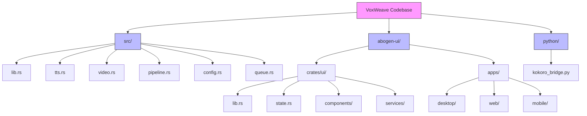
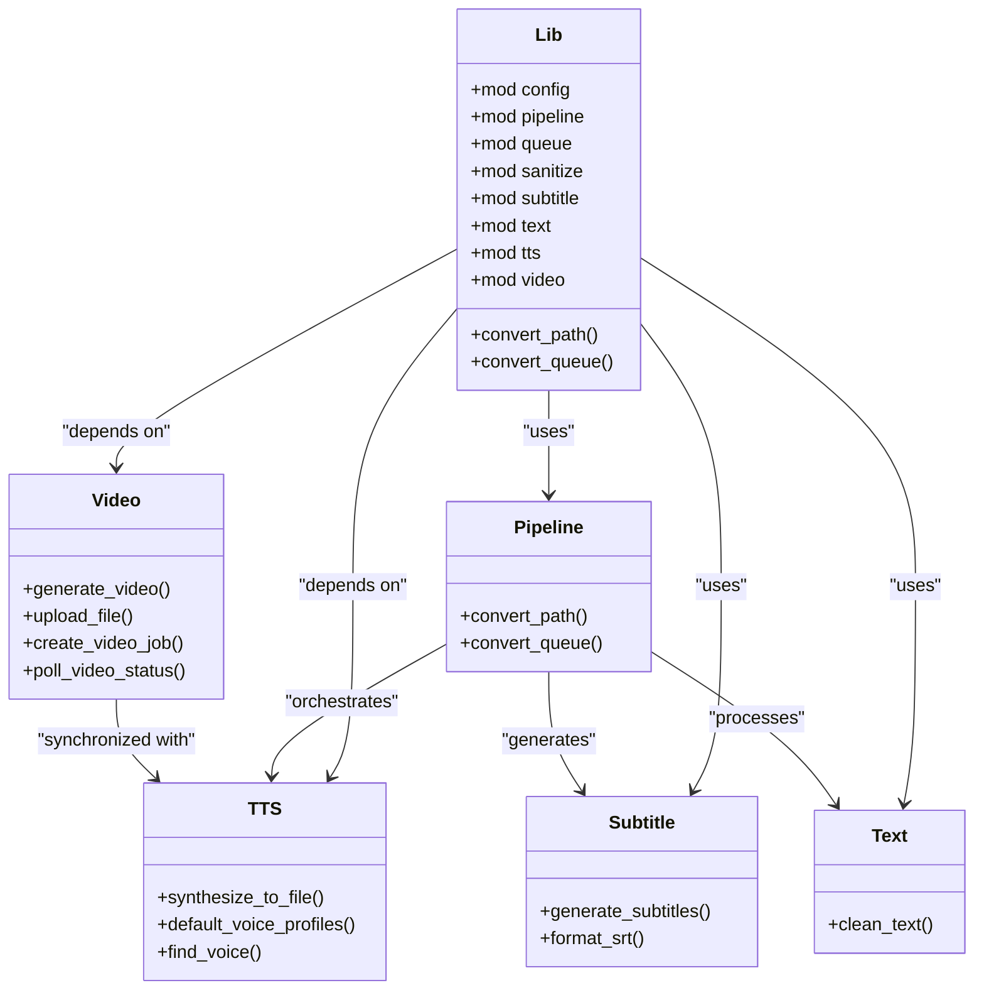
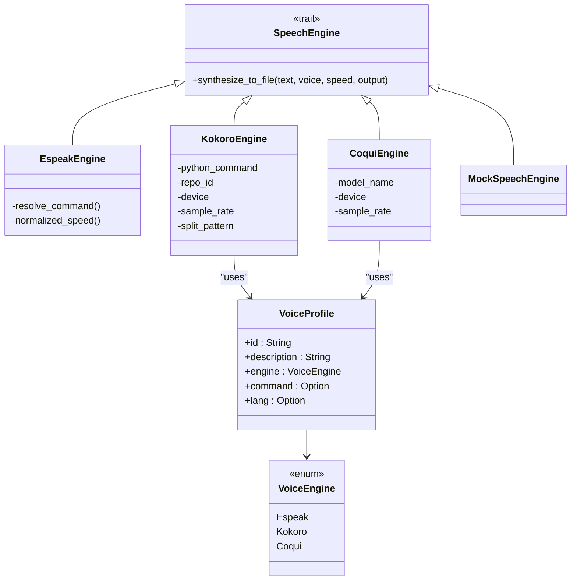
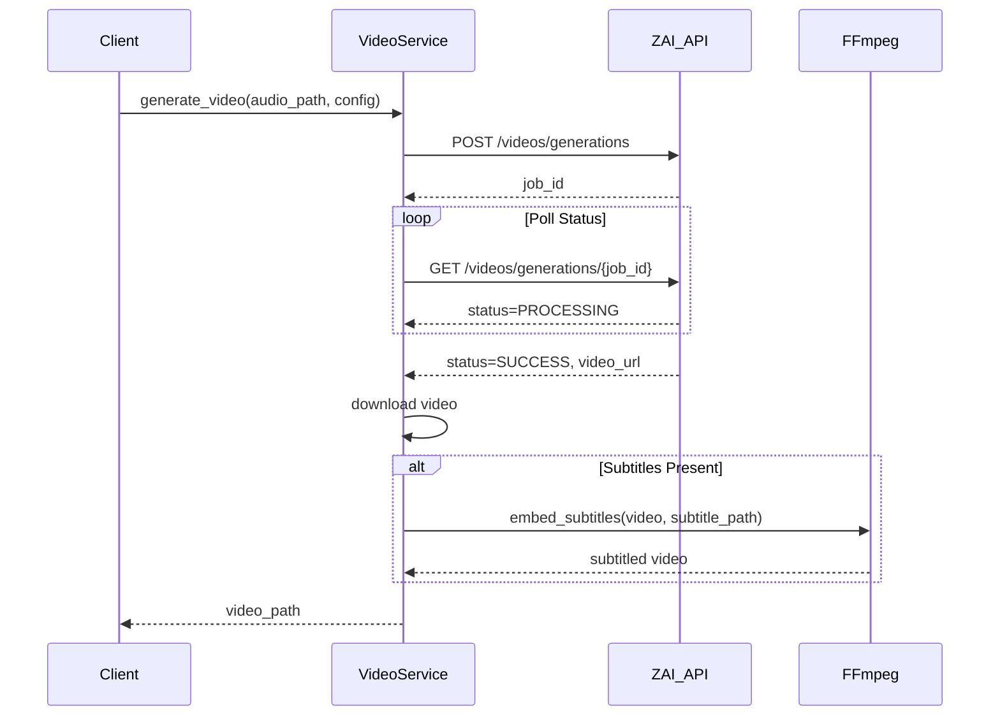
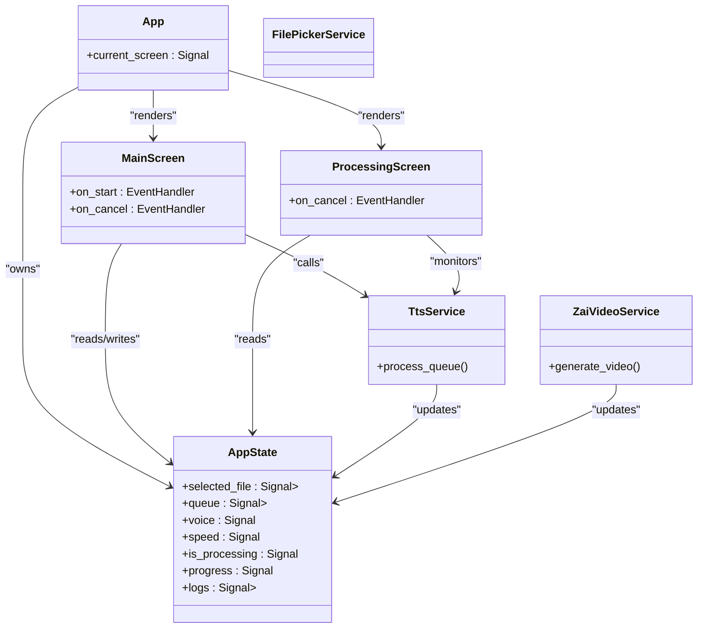
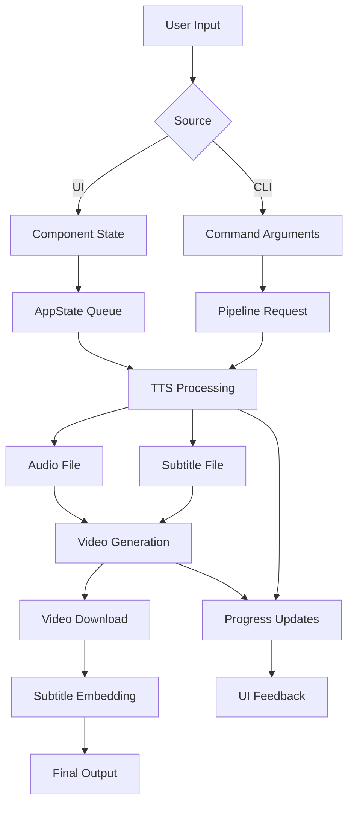
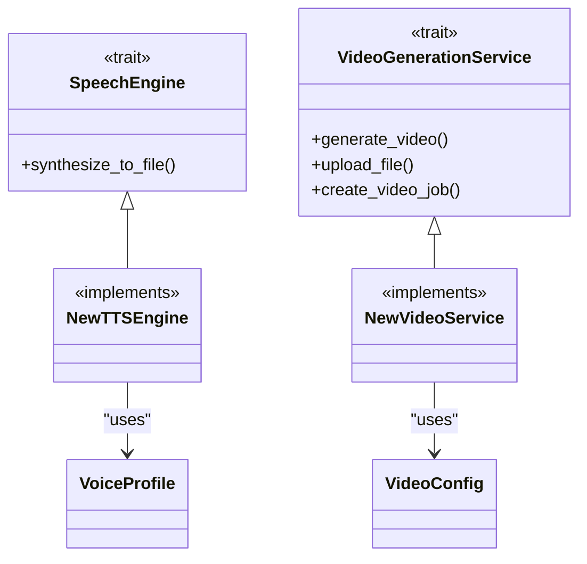
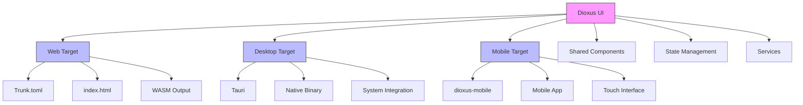

# Code Structure

<cite>
**Referenced Files in This Document**   
- [src/lib.rs](file://src/lib.rs)
- [src/tts.rs](file://src/tts.rs)
- [src/video.rs](file://src/video.rs)
- [src/pipeline.rs](file://src/pipeline.rs)
- [abogen-ui/crates/ui/lib.rs](file://abogen-ui/crates/ui/lib.rs)
- [abogen-ui/crates/ui/state.rs](file://abogen-ui/crates/ui/state.rs)
- [abogen-ui/crates/ui/services/tts_service.rs](file://abogen-ui/crates/ui/services/tts_service.rs)
- [abogen-ui/crates/ui/services/zai_video.rs](file://abogen-ui/crates/ui/services/zai_video.rs)
- [abogen-ui/apps/desktop/Cargo.toml](file://abogen-ui/apps/desktop/Cargo.toml)
- [abogen-ui/apps/web/Cargo.toml](file://abogen-ui/apps/web/Cargo.toml)
- [abogen-ui/apps/mobile/Cargo.toml](file://abogen-ui/apps/mobile/Cargo.toml)
- [python/kokoro_bridge.py](file://python/kokoro_bridge.py)
</cite>

## Table of Contents
1. [Project Structure Overview](#project-structure-overview)
2. [Core Library Architecture](#core-library-architecture)
3. [TTS Engine Abstraction](#tts-engine-abstraction)
4. [Video Generation Integration](#video-generation-integration)
5. [UI Architecture and State Management](#ui-architecture-and-state-management)
6. [Data Flow and Pipeline Orchestration](#data-flow-and-pipeline-orchestration)
7. [Extensibility Examples](#extensibility-examples)
8. [Cross-Platform UI Build System](#cross-platform-ui-build-system)

## Project Structure Overview

The VoxWeave codebase follows a modular multi-repository structure with three primary components: the core Rust library in `src/`, the multi-platform Dioxus UI in `abogen-ui/`, and Python integration bridges in `python/`. The `src/` directory contains the core logic for text-to-speech synthesis, video generation, and pipeline orchestration, organized as a Rust library with modular components for configuration, text processing, subtitle generation, and queue management. The `abogen-ui/` directory houses a Dioxus-based application with a shared UI component library in `crates/ui/` that supports desktop, web, and mobile targets through separate application entries in the `apps/` subdirectory. The `python/` directory contains bridge scripts that enable integration between Rust and Python-based TTS engines, with `kokoro_bridge.py` facilitating communication with the Kokoro TTS model.

**Diagram sources**
- [src/lib.rs](file://src/lib.rs#L1-L13)
- [abogen-ui/crates/ui/lib.rs](file://abogen-ui/crates/ui/lib.rs#L1-L10)
- [python/kokoro_bridge.py](file://python/kokoro_bridge.py#L1-L5)

**Section sources**
- [src/lib.rs](file://src/lib.rs#L1-L13)
- [abogen-ui/crates/ui/lib.rs](file://abogen-ui/crates/ui/lib.rs#L1-L10)
- [python/kokoro_bridge.py](file://python/kokoro_bridge.py#L1-L5)

## Core Library Architecture

The core library in the `src/` directory is designed as a modular Rust crate with a clear separation of concerns. The architecture follows a layered approach where `lib.rs` serves as the public API entry point, re-exporting key modules and functions for external consumption. The `tts.rs` module provides the primary text-to-speech functionality through a trait-based abstraction that supports multiple TTS engines, while `video.rs` handles video generation through external API integration. The `pipeline.rs` module orchestrates the end-to-end processing workflow, coordinating text cleaning, TTS synthesis, and subtitle generation. Supporting modules like `config.rs`, `sanitize.rs`, `subtitle.rs`, and `text.rs` provide specialized utilities for configuration management, text sanitization, subtitle formatting, and text processing respectively. The `queue.rs` module manages processing queues and state, enabling batch operations and progress tracking.

**Diagram sources**
- [src/lib.rs](file://src/lib.rs#L1-L13)
- [src/pipeline.rs](file://src/pipeline.rs#L1-L139)
- [src/tts.rs](file://src/tts.rs#L1-L522)
- [src/video.rs](file://src/video.rs#L1-L462)
- [src/subtitle.rs](file://src/subtitle.rs#L1-L50)
- [src/text.rs](file://src/text.rs#L1-L25)

**Section sources**
- [src/lib.rs](file://src/lib.rs#L1-L13)
- [src/pipeline.rs](file://src/pipeline.rs#L1-L139)

## TTS Engine Abstraction

The TTS engine abstraction in `src/tts.rs` implements a flexible trait-based architecture that supports multiple text-to-speech engines through a common interface. The `SpeechEngine` trait defines the core `synthesize_to_file` method that all TTS engines must implement, enabling polymorphic behavior across different synthesis backends. Currently, the system supports three primary engines: `EspeakEngine` for lightweight local synthesis, `KokoroEngine` for high-quality neural TTS, and `CoquiEngine` for advanced voice cloning capabilities. Each engine is encapsulated as a separate struct that implements the `SpeechEngine` trait, allowing for consistent interaction patterns regardless of the underlying technology. Voice profiles are managed through the `VoiceProfile` struct, which contains metadata about each available voice including its ID, description, engine type, and language information. The system uses environment variables to configure engine-specific parameters such as Python interpreter paths, model repository IDs, and device preferences (CPU/GPU).

**Diagram sources**
- [src/tts.rs](file://src/tts.rs#L1-L522)

**Section sources**
- [src/tts.rs](file://src/tts.rs#L1-L522)

## Video Generation Integration

The video generation system in `src/video.rs` provides integration with external video generation APIs, currently supporting both Z.AI and OpenAI Sora services. The `VideoGenerationService` struct encapsulates the API client functionality, handling authentication, request construction, and response processing. Video generation follows a multi-step workflow: audio file upload, job creation, status polling, video download, and optional subtitle embedding. The service uses environment variables to determine which API provider to use, falling back from OpenAI to Z.AI if the appropriate API keys are not available. Configuration is managed through the `VideoConfig` struct, which specifies video style, resolution, format, and custom prompts. The system implements robust error handling and retry logic, with progress callbacks allowing real-time monitoring of the generation process. Subtitle embedding is performed using FFmpeg, which merges the generated video with subtitle files in various formats (SRT, ASS, VTT).

**Diagram sources**
- [src/video.rs](file://src/video.rs#L1-L462)

**Section sources**
- [src/video.rs](file://src/video.rs#L1-L462)

## UI Architecture and State Management

The UI architecture in `abogen-ui/crates/ui/` follows a component-based design pattern with strict separation between presentation and business logic. The application state is managed through the `AppState` struct in `state.rs`, which uses Dioxus signals for reactive state updates across the component hierarchy. The UI is organized into reusable components such as `NeonButton`, `Slider`, `Combo`, and `ProgressBar`, which are defined in the `components/` directory and styled with a consistent cyberpunk aesthetic. Service modules in the `services/` directory handle business logic operations like TTS processing, file operations, and video generation, maintaining a clean separation from UI concerns. The main application flow is controlled by the `App` component, which manages navigation between the main screen and processing screen based on the current state. State mutations follow Dioxus conventions, with signals being cloned before modification to ensure proper reactivity.

**Diagram sources**
- [abogen-ui/crates/ui/state.rs](file://abogen-ui/crates/ui/state.rs#L1-L255)
- [abogen-ui/crates/ui/lib.rs](file://abogen-ui/crates/ui/lib.rs#L1-L639)
- [abogen-ui/crates/ui/services/tts_service.rs](file://abogen-ui/crates/ui/services/tts_service.rs#L1-L540)
- [abogen-ui/crates/ui/services/zai_video.rs](file://abogen-ui/crates/ui/services/zai_video.rs#L1-L336)

**Section sources**
- [abogen-ui/crates/ui/state.rs](file://abogen-ui/crates/ui/state.rs#L1-L255)
- [abogen-ui/crates/ui/lib.rs](file://abogen-ui/crates/ui/lib.rs#L1-L639)

## Data Flow and Pipeline Orchestration

The data flow in VoxWeave follows a sequential pipeline that begins with user input from either the CLI or UI and progresses through text processing, TTS synthesis, subtitle generation, and video creation. In the UI, input flows from component-level state (e.g., voice selection, speed slider) to the centralized `AppState`, which coordinates the processing queue. When the user initiates processing, the `tts_service` module orchestrates the workflow by iterating through queued items, generating audio files using the selected TTS engine, creating subtitle files, and optionally triggering video generation. The CLI follows a similar pattern but operates on individual files rather than queues. For video generation, the system first generates TTS audio and subtitles, then uploads these assets to the video generation API, polls for completion, downloads the resulting video, and optionally composes the final output with embedded subtitles. Progress and log information are propagated back to the UI through shared state signals, enabling real-time feedback.

**Diagram sources**
- [src/pipeline.rs](file://src/pipeline.rs#L1-L139)
- [abogen-ui/crates/ui/services/tts_service.rs](file://abogen-ui/crates/ui/services/tts_service.rs#L1-L540)
- [abogen-ui/crates/ui/services/zai_video.rs](file://abogen-ui/crates/ui/services/zai_video.rs#L1-L336)

**Section sources**
- [src/pipeline.rs](file://src/pipeline.rs#L1-L139)
- [abogen-ui/crates/ui/services/tts_service.rs](file://abogen-ui/crates/ui/services/tts_service.rs#L1-L540)

## Extensibility Examples

The VoxWeave architecture is designed for extensibility, allowing new TTS engines and video APIs to be integrated with minimal changes to the core codebase. To add a new TTS engine, developers implement the `SpeechEngine` trait for their specific backend, define voice profiles in the `VoiceProfile` enum, and update the engine selection logic in `tts_service.rs`. For example, adding a new engine called "VoxEngine" would require creating a `VoxEngine` struct that implements `synthesize_to_file`, registering supported voices in `default_voice_profiles`, and adding configuration options to the UI. Similarly, integrating an additional video API involves creating a new service struct that implements the same interface as `VideoGenerationService`, handling authentication, request formatting, and response parsing according to the new API's specifications. The modular design ensures that these extensions can be developed and tested independently, with feature flags controlling their inclusion in different build configurations.

**Diagram sources**
- [src/tts.rs](file://src/tts.rs#L1-L522)
- [src/video.rs](file://src/video.rs#L1-L462)

**Section sources**
- [src/tts.rs](file://src/tts.rs#L1-L522)
- [src/video.rs](file://src/video.rs#L1-L462)

## Cross-Platform UI Build System

The cross-platform UI build system leverages Dioxus with platform-specific configurations in the `apps/` directory to support web, desktop, and mobile targets. Each platform has its own Cargo.toml file that specifies the appropriate Dioxus features and dependencies. The web application uses Trunk for bundling and serves the UI through a WASM target, with `Trunk.toml` configuring the build process and `index.html` providing the entry point. The desktop application uses Tauri for native window management and system integration, enabling access to local file systems and hardware resources. The mobile application utilizes dioxus-mobile for iOS and Android deployment, with platform-specific configurations for touch interfaces and mobile performance considerations. Feature flags in Cargo.toml control the inclusion of optional components like GPU acceleration, real TTS processing, and video generation, allowing for tailored builds that optimize performance and resource usage for each target platform.

**Diagram sources**
- [abogen-ui/apps/web/Cargo.toml](file://abogen-ui/apps/web/Cargo.toml#L1-L15)
- [abogen-ui/apps/desktop/Cargo.toml](file://abogen-ui/apps/desktop/Cargo.toml#L1-L13)
- [abogen-ui/apps/mobile/Cargo.toml](file://abogen-ui/apps/mobile/Cargo.toml#L1-L13)

**Section sources**
- [abogen-ui/apps/web/Cargo.toml](file://abogen-ui/apps/web/Cargo.toml#L1-L15)
- [abogen-ui/apps/desktop/Cargo.toml](file://abogen-ui/apps/desktop/Cargo.toml#L1-L13)
- [abogen-ui/apps/mobile/Cargo.toml](file://abogen-ui/apps/mobile/Cargo.toml#L1-L13)