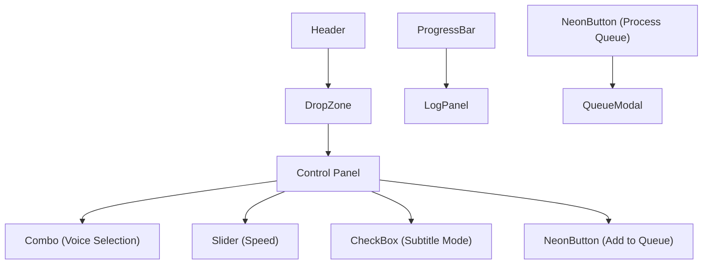

# Component Library

<cite>
**Referenced Files in This Document**   
- [header.rs](file://abogen-ui/crates/ui/components/header.rs)
- [drop_zone.rs](file://abogen-ui/crates/ui/components/drop_zone.rs)
- [queue_modal.rs](file://abogen-ui/crates/ui/components/queue_modal.rs)
- [audio_recorder.rs](file://abogen-ui/crates/ui/components/audio_recorder.rs)
- [neon_button.rs](file://abogen-ui/crates/ui/components/neon_button.rs)
- [progress_bar.rs](file://abogen-ui/crates/ui/components/progress_bar.rs)
- [slider.rs](file://abogen-ui/crates/ui/components/slider.rs)
- [checkbox.rs](file://abogen-ui/crates/ui/components/checkbox.rs)
- [combo.rs](file://abogen-ui/crates/ui/components/combo.rs)
- [log_panel.rs](file://abogen-ui/crates/ui/components/log_panel.rs)
- [state.rs](file://abogen-ui/crates/ui/state.rs)
- [theme.rs](file://abogen-ui/crates/ui/theme.rs)
</cite>

## Table of Contents
1. [Introduction](#introduction)
2. [Core Components](#core-components)
3. [Component Props and Events](#component-props-and-events)
4. [UI Composition Examples](#ui-composition-examples)
5. [Theming and Styling](#theming-and-styling)
6. [Accessibility and Responsiveness](#accessibility-and-responsiveness)
7. [Animation and Interaction Patterns](#animation-and-interaction-patterns)
8. [Creating New Components](#creating-new-components)
9. [Conclusion](#conclusion)

## Introduction
The UI component library provides a collection of reusable Dioxus components designed for the abogen application. These components follow a consistent cyberpunk aesthetic and are built to integrate seamlessly with the application's state management system. Each component is designed to be composable, accessible, and responsive, enabling developers to build complex interfaces from simple, well-defined building blocks.

## Core Components

This section details the purpose and functionality of each component in the components/ directory, focusing on their role in the application and integration with AppState signals.

### Header Component
The Header component displays the application logo, version information, and navigation controls. It uses inline styles with CSS variables for theming and maintains a consistent visual identity across all application views.

**Section sources**
- [header.rs](file://abogen-ui/crates/ui/components/header.rs#L1-L29)

### Drop Zone Component
The DropZone component enables users to select or drag-and-drop text files (.txt, .epub, .pdf) into the application. It handles both desktop and web platforms differently, using native file system APIs on desktop and web File APIs on browsers. The component updates the AppState.selected_file signal when a file is selected or dropped.

**Section sources**
- [drop_zone.rs](file://abogen-ui/crates/ui/components/drop_zone.rs#L1-L235)
- [state.rs](file://abogen-ui/crates/ui/state.rs#L1-L20)

### Queue Modal Component
The QueueModal component displays and manages the processing queue, allowing users to view, reorder, and remove queued items. It receives an AppState and an is_open signal to control visibility. The component renders each queued item with its processing parameters and provides controls for reordering and removal.

**Section sources**
- [queue_modal.rs](file://abogen-ui/crates/ui/components/queue_modal.rs#L1-L195)
- [state.rs](file://abogen-ui/crates/ui/state.rs#L22-L50)

### Audio Recorder Component
The AudioRecorder component captures audio from the microphone for voice cloning purposes. It conditionally compiles with cpal and hound crates when the coqui-tts feature is enabled, providing desktop recording capabilities. The component manages recording state through a RecordingState enum and updates the parent component via an on_audio_captured event handler.

**Section sources**
- [audio_recorder.rs](file://abogen-ui/crates/ui/components/audio_recorder.rs#L1-L328)
- [state.rs](file://abogen-ui/crates/ui/state.rs#L240-L258)

### Neon Button Component
The NeonButton component provides a styled button with primary and secondary variants. It accepts an onclick handler, optional primary flag, and disabled state. The component prevents click propagation when disabled and applies appropriate styling based on its properties.

**Section sources**
- [neon_button.rs](file://abogen-ui/crates/ui/components/neon_button.rs#L1-L28)

### Progress Bar Component
The ProgressBar component visualizes task completion percentage. It receives a Signal<u8> representing progress from 0-100 and displays a filled bar with percentage text. The component uses CSS transitions for smooth progress updates.

**Section sources**
- [progress_bar.rs](file://abogen-ui/crates/ui/components/progress_bar.rs#L1-L24)

### Slider Component
The Slider component provides a continuous value input with visual feedback. It displays a gradient-styled range input with a numeric readout showing the current value with two decimal places. The component is used for adjusting parameters like speech speed.

**Section sources**
- [slider.rs](file://abogen-ui/crates/ui/components/slider.rs#L1-L53)

### Checkbox Component
The CheckBox component implements a boolean toggle with a label. It receives a Signal<bool> for its state and a static label string. The component updates the signal when the checkbox state changes.

**Section sources**
- [checkbox.rs](file://abogen-ui/crates/ui/components/checkbox.rs#L1-L28)

### Combo Component
The Combo component provides a searchable dropdown for voice selection. It integrates with the voice service to display voice metadata including display name, language, and ID. The component supports filtering by search text and displays selected values with additional context.

**Section sources**
- [combo.rs](file://abogen-ui/crates/ui/components/combo.rs#L1-L146)
- [state.rs](file://abogen-ui/crates/ui/state.rs#L240-L258)

### Log Panel Component
The LogPanel component displays real-time processing logs with color-coded entries based on log level. It receives a Signal<Vec<LogEntry>> and renders each entry with appropriate styling for info, notice, and error levels.

**Section sources**
- [log_panel.rs](file://abogen-ui/crates/ui/components/log_panel.rs#L1-L44)
- [state.rs](file://abogen-ui/crates/ui/state.rs#L240-L258)

## Component Props and Events

The following table summarizes the props and events for each component:

| Component | Props | Events | State Integration |
|---------|-------|--------|------------------|
| **Header** | None | None | None |
| **DropZone** | `state: AppState` | File selection/drop | Updates `selected_file` signal |
| **QueueModal** | `state: AppState`, `is_open: Signal<bool>` | Close, Move, Remove | Manages `queue` signal |
| **AudioRecorder** | `on_audio_captured: EventHandler<String>`, `recording_state: Signal<RecordingState>` | Audio captured | Updates recording state |
| **NeonButton** | `onclick`, `children`, `primary: Option<bool>`, `disabled: Option<bool>` | Click | None |
| **ProgressBar** | `progress: Signal<u8>` | None | Reads progress signal |
| **Slider** | `value: Signal<f64>`, `min`, `max`, `step` | Value change | Updates value signal |
| **CheckBox** | `checked: Signal<bool>`, `label` | State change | Updates checked signal |
| **Combo** | `value: Signal<String>`, `options`, `placeholder` | Selection change | Updates value signal |
| **LogPanel** | `logs: Signal<Vec<LogEntry>>` | None | Reads logs signal |

## UI Composition Examples

Components can be composed to create larger UI sections. For example, a processing control panel might combine multiple components:

**Diagram sources**
- [header.rs](file://abogen-ui/crates/ui/components/header.rs#L1-L29)
- [drop_zone.rs](file://abogen-ui/crates/ui/components/drop_zone.rs#L1-L235)
- [combo.rs](file://abogen-ui/crates/ui/components/combo.rs#L1-L146)
- [slider.rs](file://abogen-ui/crates/ui/components/slider.rs#L1-L53)
- [checkbox.rs](file://abogen-ui/crates/ui/components/checkbox.rs#L1-L28)
- [neon_button.rs](file://abogen-ui/crates/ui/components/neon_button.rs#L1-L28)
- [progress_bar.rs](file://abogen-ui/crates/ui/components/progress_bar.rs#L1-L24)
- [log_panel.rs](file://abogen-ui/crates/ui/components/log_panel.rs#L1-L44)
- [queue_modal.rs](file://abogen-ui/crates/ui/components/queue_modal.rs#L1-L195)

## Theming and Styling

The application implements a cyberpunk theme through CSS variables and custom styling defined in theme.rs. The theme uses a dark color scheme with neon accents in cyan, magenta, and amber. Key styling features include:

- **CSS Variables**: Theme colors and dimensions are defined in :root for consistent application
- **Neon Effects**: Box shadows and gradients create glowing effects on buttons and panels
- **Typography**: Rajdhani font provides a futuristic aesthetic
- **Background**: Radial gradient creates depth and visual interest
- **Responsive Design**: Media queries adjust padding and font sizes on smaller screens

The theme is applied globally and can be extended by adding new CSS classes that reference the defined variables.

**Section sources**
- [theme.rs](file://abogen-ui/crates/ui/theme.rs#L1-L209)

## Accessibility and Responsiveness

All components consider accessibility and responsive behavior:

- **Keyboard Navigation**: Buttons and interactive elements are focusable and have visible focus states
- **Color Contrast**: Text and background colors meet WCAG contrast requirements
- **Screen Reader Support**: Semantic HTML elements and ARIA attributes are used where appropriate
- **Responsive Layouts**: Components adapt to different screen sizes using relative units and media queries
- **Touch Targets**: Interactive elements have sufficient size for touch interaction

The container class limits maximum width while maintaining padding on smaller screens, ensuring usability across devices.

**Section sources**
- [theme.rs](file://abogen-ui/crates/ui/theme.rs#L1-L209)
- [neon_button.rs](file://abogen-ui/crates/ui/components/neon_button.rs#L1-L28)

## Animation and Interaction Patterns

The component library employs subtle animations to enhance user experience:

- **Button Feedback**: NeonButton has hover and active state transitions
- **Progress Visualization**: ProgressBar uses CSS transitions for smooth updates
- **Drag State**: DropZone changes border color and shadow when dragging
- **Recording Indicator**: AudioRecorder uses CSS animation during recording
- **Dropdown Transitions**: Combo component has smooth appearance/disappearance

These animations are implemented using CSS transitions and keyframes rather than JavaScript, ensuring performance and consistency.

**Section sources**
- [theme.rs](file://abogen-ui/crates/ui/theme.rs#L1-L209)
- [audio_recorder.rs](file://abogen-ui/crates/ui/components/audio_recorder.rs#L1-L328)
- [drop_zone.rs](file://abogen-ui/crates/ui/components/drop_zone.rs#L1-L235)

## Creating New Components

When creating new components, follow these conventions:

1. **File Structure**: Place new components in the components/ directory with .rs extension
2. **Component Definition**: Use the #[component] macro and follow naming conventions
3. **Props**: Define props as function parameters with appropriate types
4. **Styling**: Use theme CSS variables and existing classes when possible
5. **State Integration**: Accept AppState or specific signals as needed
6. **Documentation**: Include doc comments describing purpose and usage
7. **Testing**: Add tests in the tests/ directory when applicable

New components should compose existing components when possible rather than duplicating functionality.

**Section sources**
- [mod.rs](file://abogen-ui/crates/ui/components/mod.rs)
- [lib.rs](file://abogen-ui/crates/ui/lib.rs)

## Conclusion
The component library provides a comprehensive set of reusable UI elements for the abogen application. Each component is designed with consistency, accessibility, and composability in mind, following the cyberpunk aesthetic established in the theme. By leveraging Dioxus signals and the AppState pattern, components maintain predictable state management while remaining flexible for various use cases. Developers can combine these components to create rich interfaces while adhering to established design principles and user experience patterns.