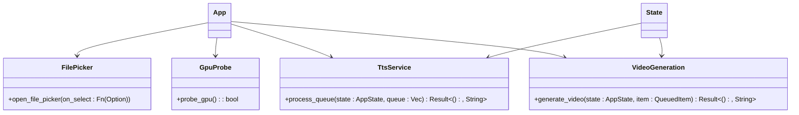

# Frontend Architecture

<cite>
**Referenced Files in This Document**   
- [abogen-ui/crates/ui/state.rs](file://abogen-ui/crates/ui/state.rs)
- [abogen-ui/crates/ui/lib.rs](file://abogen-ui/crates/ui/lib.rs)
- [abogen-ui/crates/ui/theme.rs](file://abogen-ui/crates/ui/theme.rs)
- [abogen-ui/apps/web/Trunk.toml](file://abogen-ui/apps/web/Trunk.toml)
- [abogen-ui/Cargo.toml](file://abogen-ui/Cargo.toml)
- [abogen-ui/crates/ui/components/header.rs](file://abogen-ui/crates/ui/components/header.rs)
- [abogen-ui/crates/ui/components/drop_zone.rs](file://abogen-ui/crates/ui/components/drop_zone.rs)
- [abogen-ui/crates/ui/components/queue_modal.rs](file://abogen-ui/crates/ui/components/queue_modal.rs)
- [abogen-ui/crates/ui/services/file_picker.rs](file://abogen-ui/crates/ui/services/file_picker.rs)
- [abogen-ui/crates/ui/services/gpu_probe.rs](file://abogen-ui/crates/ui/services/gpu_probe.rs)
- [abogen-ui/apps/desktop/Cargo.toml](file://abogen-ui/apps/desktop/Cargo.toml)
- [abogen-ui/apps/web/Cargo.toml](file://abogen-ui/apps/web/Cargo.toml)
- [abogen-ui/apps/mobile/Cargo.toml](file://abogen-ui/apps/mobile/Cargo.toml)
</cite>

## Table of Contents
1. [Introduction](#introduction)
2. [Project Structure](#project-structure)
3. [Core Components](#core-components)
4. [Architecture Overview](#architecture-overview)
5. [Detailed Component Analysis](#detailed-component-analysis)
6. [Dependency Analysis](#dependency-analysis)
7. [Performance Considerations](#performance-considerations)
8. [Troubleshooting Guide](#troubleshooting-guide)
9. [Conclusion](#conclusion)

## Introduction
The abogen-ui application implements a multi-platform frontend architecture using the Dioxus framework. This document details the structure, state management, component library, and cross-platform integration strategies that enable a unified UI experience across desktop, web, and mobile platforms. The architecture leverages shared components in the `crates/ui/` directory while maintaining platform-specific entry points in the `apps/` directory. The system features a cyberpunk-themed interface with neon styling and implements unidirectional data flow for predictable state updates.

## Project Structure


**Diagram sources**
- [abogen-ui/Cargo.toml](file://abogen-ui/Cargo.toml)
- [abogen-ui/apps/desktop/Cargo.toml](file://abogen-ui/apps/desktop/Cargo.toml)
- [abogen-ui/apps/web/Cargo.toml](file://abogen-ui/apps/web/Cargo.toml)
- [abogen-ui/apps/mobile/Cargo.toml](file://abogen-ui/apps/mobile/Cargo.toml)

**Section sources**
- [abogen-ui/Cargo.toml](file://abogen-ui/Cargo.toml)

## Core Components

The abogen-ui application is structured around several core components that manage state, UI rendering, and platform integration. The shared UI components in `crates/ui/` are designed to be reusable across all platforms, while the platform-specific applications in `apps/` handle initialization and platform-specific configurations. The state management system in `state.rs` maintains application state across components, and the theme system in `theme.rs` provides a consistent cyberpunk aesthetic.

**Section sources**
- [abogen-ui/crates/ui/lib.rs](file://abogen-ui/crates/ui/lib.rs)
- [abogen-ui/crates/ui/state.rs](file://abogen-ui/crates/ui/state.rs)
- [abogen-ui/crates/ui/theme.rs](file://abogen-ui/crates/ui/theme.rs)

## Architecture Overview


**Diagram sources**
- [abogen-ui/apps/desktop/Cargo.toml](file://abogen-ui/apps/desktop/Cargo.toml)
- [abogen-ui/apps/web/Cargo.toml](file://abogen-ui/apps/web/Cargo.toml)
- [abogen-ui/apps/mobile/Cargo.toml](file://abogen-ui/apps/mobile/Cargo.toml)
- [abogen-ui/apps/web/Trunk.toml](file://abogen-ui/apps/web/Trunk.toml)

## Detailed Component Analysis

### State Management System

The state management system in `state.rs` provides a centralized store for application data using Dioxus signals. The `AppState` struct contains signals for file inputs, processing queue, configuration settings, and processing state. This enables reactive updates across UI components when state changes occur.

```mermaid
classDiagram
class AppState {
+selected_file : Signal<Option<FileInfo>>
+queue : Signal<Vec<QueuedItem>>
+voice : Signal<String>
+speed : Signal<f64>
+subtitle_mode : Signal<SubtitleMode>
+voice_format : Signal<VoiceFormat>
+subtitle_format : Signal<SubtitleFormat>
+replace_newlines : Signal<bool>
+save_location : Signal<SaveLocation>
+use_gpu : Signal<bool>
+generate_video : Signal<bool>
+video_style : Signal<VideoStyle>
+video_resolution : Signal<VideoResolution>
+video_format : Signal<VideoFormat>
+video_prompt : Signal<Option<String>>
+is_processing : Signal<bool>
+progress : Signal<u8>
+logs : Signal<Vec<LogEntry>>
+cancel_token : Signal<Option<()>>
+new() : Self
}
class FileInfo {
+name : String
+path : String
+size : u64
}
class QueuedItem {
+file : FileInfo
+voice : String
+speed : f64
+subtitle_mode : SubtitleMode
+voice_format : VoiceFormat
+subtitle_format : SubtitleFormat
+replace_newlines : bool
+use_gpu : bool
+generate_video : bool
+video_style : VideoStyle
+video_resolution : VideoResolution
+video_format : VideoFormat
+video_prompt : Option<String>
+save_location : SaveLocation
}
class LogEntry {
+message : String
+level : LogLevel
}
AppState --> FileInfo : "contains"
AppState --> QueuedItem : "manages"
AppState --> LogEntry : "stores"
```

**Diagram sources**
- [abogen-ui/crates/ui/state.rs](file://abogen-ui/crates/ui/state.rs)

**Section sources**
- [abogen-ui/crates/ui/state.rs](file://abogen-ui/crates/ui/state.rs)

### Component Library Structure

The component library in `crates/ui/components/` provides reusable UI elements with a consistent cyberpunk theme. Components are designed to be composable and maintainable, with each component handling specific UI functionality.

```mermaid
classDiagram
class Header {
+Header() : Element
}
class DropZone {
+DropZone(state : AppState) : Element
}
class QueueModal {
+QueueModal(state : AppState, is_open : Signal<bool>) : Element
}
class NeonButton {
+NeonButton(primary : bool, disabled : Option<bool>, onclick : EventHandler, children : Element) : Element
}
class ProgressBar {
+ProgressBar(progress : Signal<u8>) : Element
}
class LogPanel {
+LogPanel(logs : Signal<Vec<LogEntry>>) : Element
}
class Slider {
+Slider(value : Signal<f64>, min : f64, max : f64, step : f64) : Element
}
class CheckBox {
+CheckBox(checked : Signal<bool>, label : String) : Element
}
App --> Header
App --> DropZone
App --> QueueModal
App --> NeonButton
App --> ProgressBar
App --> LogPanel
App --> Slider
App --> CheckBox
```



**Diagram sources**
- [abogen-ui/crates/ui/components/header.rs](file://abogen-ui/crates/ui/components/header.rs)
- [abogen-ui/crates/ui/components/drop_zone.rs](file://abogen-ui/crates/ui/components/drop_zone.rs)
- [abogen-ui/crates/ui/components/queue_modal.rs](file://abogen-ui/crates/ui/components/queue_modal.rs)

**Section sources**
- [abogen-ui/crates/ui/components/header.rs](file://abogen-ui/crates/ui/components/header.rs)
- [abogen-ui/crates/ui/components/drop_zone.rs](file://abogen-ui/crates/ui/components/drop_zone.rs)
- [abogen-ui/crates/ui/components/queue_modal.rs](file://abogen-ui/crates/ui/components/queue_modal.rs)

### Unidirectional Data Flow

The application implements a unidirectional data flow pattern where user interactions trigger state updates, which then cause UI re-rendering. This pattern ensures predictable state changes and simplifies debugging.


**Diagram sources**
- [abogen-ui/crates/ui/lib.rs](file://abogen-ui/crates/ui/lib.rs)
- [abogen-ui/crates/ui/state.rs](file://abogen-ui/crates/ui/state.rs)

**Section sources**
- [abogen-ui/crates/ui/lib.rs](file://abogen-ui/crates/ui/lib.rs)

### UI Services Integration

UI services in `crates/ui/services/` provide platform-agnostic interfaces for file operations, GPU detection, and backend integration. These services abstract platform-specific details and provide a consistent API for the UI components.



**Diagram sources**
- [abogen-ui/crates/ui/services/file_picker.rs](file://abogen-ui/crates/ui/services/file_picker.rs)
- [abogen-ui/crates/ui/services/gpu_probe.rs](file://abogen-ui/crates/ui/services/gpu_probe.rs)

**Section sources**
- [abogen-ui/crates/ui/services/file_picker.rs](file://abogen-ui/crates/ui/services/file_picker.rs)
- [abogen-ui/crates/ui/services/gpu_probe.rs](file://abogen-ui/crates/ui/services/gpu_probe.rs)

### Theme System

The theme system in `theme.rs` implements a cyberpunk aesthetic with neon colors, futuristic fonts, and glowing effects. The theme is injected globally via CSS and can be modified to change the application's visual appearance.


**Diagram sources**
- [abogen-ui/crates/ui/theme.rs](file://abogen-ui/crates/ui/theme.rs)

**Section sources**
- [abogen-ui/crates/ui/theme.rs](file://abogen-ui/crates/ui/theme.rs)

## Dependency Analysis


**Diagram sources**
- [abogen-ui/Cargo.toml](file://abogen-ui/Cargo.toml)
- [abogen-ui/apps/desktop/Cargo.toml](file://abogen-ui/apps/desktop/Cargo.toml)
- [abogen-ui/apps/web/Cargo.toml](file://abogen-ui/apps/web/Cargo.toml)
- [abogen-ui/apps/mobile/Cargo.toml](file://abogen-ui/apps/mobile/Cargo.toml)
- [abogen-ui/apps/web/Trunk.toml](file://abogen-ui/apps/web/Trunk.toml)

**Section sources**
- [abogen-ui/Cargo.toml](file://abogen-ui/Cargo.toml)

## Performance Considerations

The application architecture is designed with performance in mind, leveraging Dioxus's reactive system for efficient UI updates. The state management system minimizes unnecessary re-renders by using granular signals for different state properties. The component library promotes reusability and reduces code duplication. For GPU-intensive operations, the application can leverage GPU acceleration when available, as determined by the gpu_probe service. The build configuration in Trunk.toml and Cargo.toml files includes optimization settings for release builds.

## Troubleshooting Guide

When encountering issues with the abogen-ui application, consider the following common problems and solutions:

1. **UI not updating after state change**: Ensure that state updates are performed through the Signal API and that components are properly subscribed to state changes.

2. **File selection not working**: Verify that the file picker service is properly implemented for the target platform and that appropriate permissions are granted.

3. **GPU acceleration not detected**: Check that the "gpu" feature flag is enabled in the build configuration and that compatible hardware is available.

4. **Cross-platform build failures**: Ensure that platform-specific dependencies are correctly configured in the respective Cargo.toml files and that build tools (Trunk, Tauri, dioxus-mobile) are properly installed.

5. **Theming issues**: Verify that the theme CSS is being properly injected and that CSS variable names match those used in the component styles.

**Section sources**
- [abogen-ui/crates/ui/state.rs](file://abogen-ui/crates/ui/state.rs)
- [abogen-ui/crates/ui/lib.rs](file://abogen-ui/crates/ui/lib.rs)
- [abogen-ui/apps/web/Trunk.toml](file://abogen-ui/apps/web/Trunk.toml)

## Conclusion

The abogen-ui application demonstrates a robust multi-platform frontend architecture using Dioxus. By separating shared UI components from platform-specific entry points, the architecture enables code reuse while accommodating platform differences. The state management system provides a centralized store for application data, enabling predictable state updates and reactive UI rendering. The component library offers reusable elements with a consistent cyberpunk theme, and the service layer abstracts platform-specific functionality. The build configuration supports multiple targets through Trunk for web, Tauri for desktop, and dioxus-mobile for mobile platforms, making abogen-ui a versatile and maintainable frontend solution.