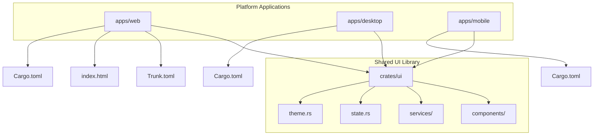
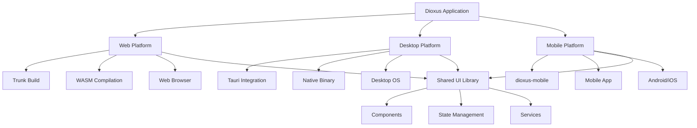
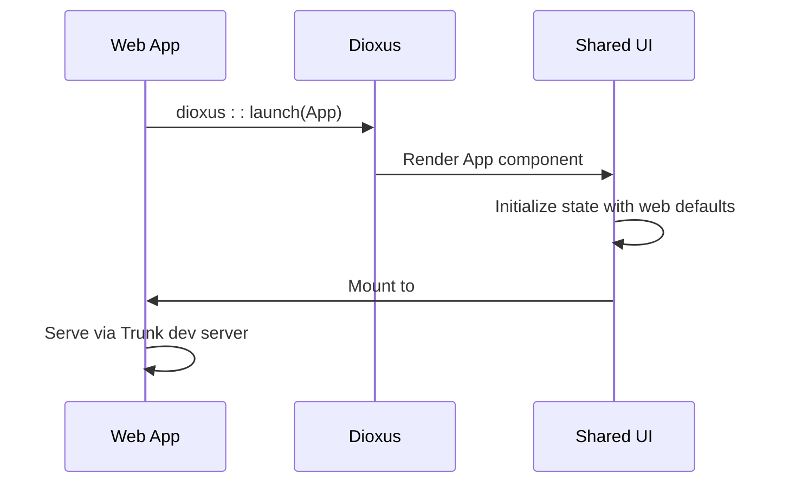
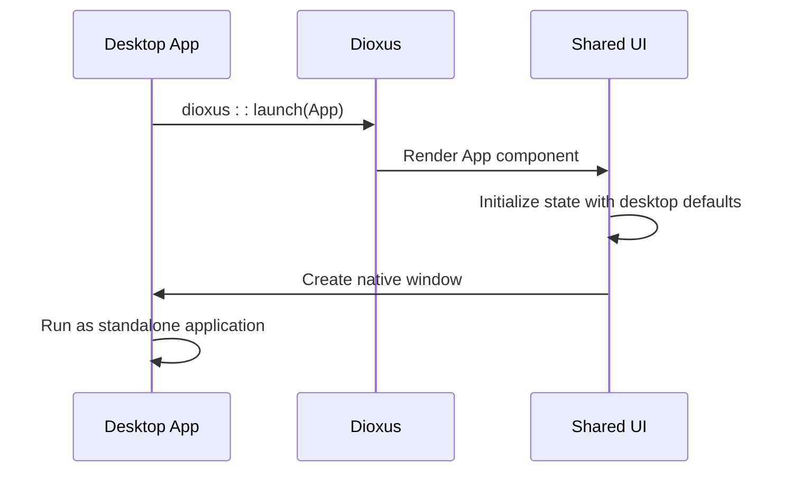
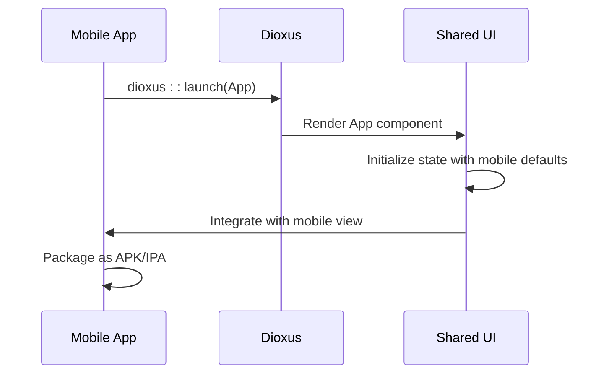
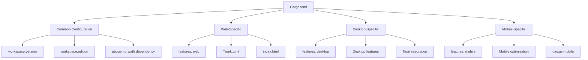
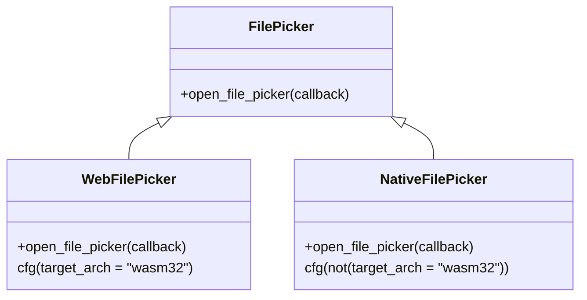
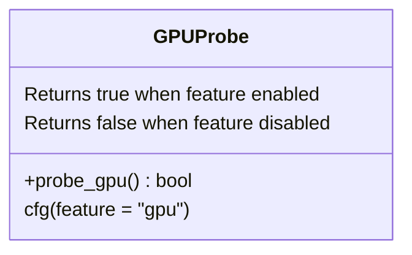
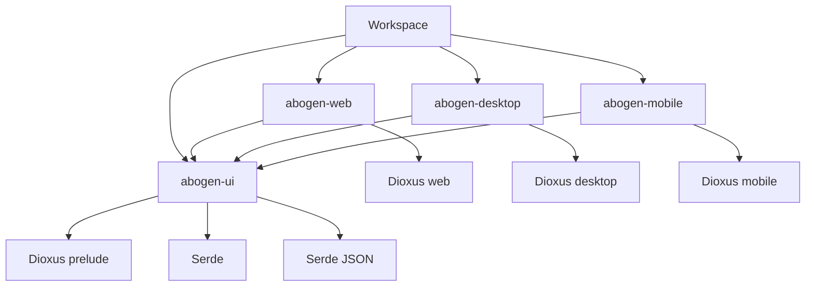

# Platform-Specific Implementations

<cite>
**Referenced Files in This Document**   
- [main.rs](file://abogen-ui/apps/desktop/src/main.rs)
- [main.rs](file://abogen-ui/apps/mobile/src/main.rs)
- [main.rs](file://abogen-ui/apps/web/src/main.rs)
- [Cargo.toml](file://abogen-ui/apps/desktop/Cargo.toml)
- [Cargo.toml](file://abogen-ui/apps/mobile/Cargo.toml)
- [Cargo.toml](file://abogen-ui/apps/web/Cargo.toml)
- [Trunk.toml](file://abogen-ui/apps/web/Trunk.toml)
- [index.html](file://abogen-ui/apps/web/index.html)
- [lib.rs](file://abogen-ui/crates/ui/lib.rs)
- [state.rs](file://abogen-ui/crates/ui/state.rs)
- [file_picker.rs](file://abogen-ui/crates/ui/services/file_picker.rs)
- [gpu_probe.rs](file://abogen-ui/crates/ui/services/gpu_probe.rs)
</cite>

## Table of Contents
1. [Introduction](#introduction)
2. [Project Structure](#project-structure)
3. [Core Components](#core-components)
4. [Architecture Overview](#architecture-overview)
5. [Detailed Component Analysis](#detailed-component-analysis)
6. [Dependency Analysis](#dependency-analysis)
7. [Performance Considerations](#performance-considerations)
8. [Troubleshooting Guide](#troubleshooting-guide)
9. [Conclusion](#conclusion)

## Introduction
The abogen-ui platform demonstrates a cross-platform Rust application architecture using Dioxus for unified UI development across web, desktop, and mobile targets. This documentation details how the shared UI library is bootstrapped differently for each platform using Dioxus with Trunk for web, Tauri for desktop, and dioxus-mobile for mobile applications. The implementation leverages a single codebase in the `crates/ui` directory while providing platform-specific entry points and configuration through the `apps/` directory. Each platform maintains its own build configuration and deployment workflow while sharing core application state, components, and services.

## Project Structure
The project follows a workspace structure with shared UI components and platform-specific applications. The architecture separates concerns between the shared UI library and platform-specific launchers, enabling code reuse while accommodating platform-specific requirements.

**Diagram sources**
- [Cargo.toml](file://abogen-ui/Cargo.toml#L1-L25)

**Section sources**
- [Cargo.toml](file://abogen-ui/Cargo.toml#L1-L25)

## Core Components
The core components of the application are defined in the shared UI library (`crates/ui`), which provides a consistent user interface across all platforms. The root `App` component manages application state and navigation between main and processing screens. The state management system uses Dioxus signals to track file selection, queue items, processing progress, and user preferences. Key components include the main screen with file drop zone, processing screen with progress tracking, and various UI controls like neon buttons, sliders, and combo boxes. The architecture separates UI components from platform-specific services, allowing for consistent presentation while enabling platform-optimized implementations.

**Section sources**
- [lib.rs](file://abogen-ui/crates/ui/lib.rs#L1-L640)
- [state.rs](file://abogen-ui/crates/ui/state.rs#L1-L259)

## Architecture Overview
The application architecture follows a multi-platform approach with a shared UI library and platform-specific entry points. Each platform initializes the Dioxus application with platform-specific features while rendering the same root component. The web platform uses WebAssembly compilation through Trunk, the desktop platform leverages Tauri for native application integration, and the mobile platform uses dioxus-mobile for Android and iOS deployment. The shared UI library exports components and services that adapt to platform capabilities through feature flags and conditional compilation.

**Diagram sources**
- [lib.rs](file://abogen-ui/crates/ui/lib.rs#L1-L640)
- [main.rs](file://abogen-ui/apps/web/src/main.rs#L1-L7)
- [main.rs](file://abogen-ui/apps/desktop/src/main.rs#L1-L7)
- [main.rs](file://abogen-ui/apps/mobile/src/main.rs#L1-L7)

## Detailed Component Analysis

### Application Initialization
Each platform-specific application initializes the Dioxus framework with platform-specific features while mounting the same root component from the shared UI library. The initialization process is nearly identical across platforms, differing only in the Dioxus feature flags used during compilation.

#### Web Platform Initialization

**Diagram sources**
- [main.rs](file://abogen-ui/apps/web/src/main.rs#L1-L7)
- [Trunk.toml](file://abogen-ui/apps/web/Trunk.toml#L1-L13)
- [index.html](file://abogen-ui/apps/web/index.html#L1-L20)

#### Desktop Platform Initialization

**Diagram sources**
- [main.rs](file://abogen-ui/apps/desktop/src/main.rs#L1-L7)
- [Cargo.toml](file://abogen-ui/apps/desktop/Cargo.toml#L1-L14)

#### Mobile Platform Initialization

**Diagram sources**
- [main.rs](file://abogen-ui/apps/mobile/src/main.rs#L1-L7)
- [Cargo.toml](file://abogen-ui/apps/mobile/Cargo.toml#L1-L14)

**Section sources**
- [main.rs](file://abogen-ui/apps/web/src/main.rs#L1-L7)
- [main.rs](file://abogen-ui/apps/desktop/src/main.rs#L1-L7)
- [main.rs](file://abogen-ui/apps/mobile/src/main.rs#L1-L7)

### Configuration Comparison
The configuration files for each platform differ primarily in their Dioxus feature selection and build tooling, while maintaining consistent versioning through workspace inheritance.

**Diagram sources**
- [Cargo.toml](file://abogen-ui/apps/web/Cargo.toml#L1-L16)
- [Cargo.toml](file://abogen-ui/apps/desktop/Cargo.toml#L1-L14)
- [Cargo.toml](file://abogen-ui/apps/mobile/Cargo.toml#L1-L14)
- [Trunk.toml](file://abogen-ui/apps/web/Trunk.toml#L1-L13)

**Section sources**
- [Cargo.toml](file://abogen-ui/apps/web/Cargo.toml#L1-L16)
- [Cargo.toml](file://abogen-ui/apps/desktop/Cargo.toml#L1-L14)
- [Cargo.toml](file://abogen-ui/apps/mobile/Cargo.toml#L1-L14)
- [Trunk.toml](file://abogen-ui/apps/web/Trunk.toml#L1-L13)

### Platform-Specific Services
The application implements platform-agnostic services that adapt to platform capabilities through conditional compilation. This approach allows for consistent API usage while optimizing for platform-specific features.

#### File Picker Service

**Diagram sources**
- [file_picker.rs](file://abogen-ui/crates/ui/services/file_picker.rs#L1-L37)

#### GPU Probe Service

**Diagram sources**
- [gpu_probe.rs](file://abogen-ui/crates/ui/services/gpu_probe.rs#L1-L27)

**Section sources**
- [file_picker.rs](file://abogen-ui/crates/ui/services/file_picker.rs#L1-L37)
- [gpu_probe.rs](file://abogen-ui/crates/ui/services/gpu_probe.rs#L1-L27)

## Dependency Analysis
The dependency structure reveals a clean separation between platform-specific applications and the shared UI library. Each application depends on the shared UI crate while specifying platform-specific Dioxus features. The workspace configuration ensures consistent versioning across all components.

**Diagram sources**
- [Cargo.toml](file://abogen-ui/Cargo.toml#L1-L25)
- [Cargo.toml](file://abogen-ui/apps/web/Cargo.toml#L1-L16)
- [Cargo.toml](file://abogen-ui/apps/desktop/Cargo.toml#L1-L14)
- [Cargo.toml](file://abogen-ui/apps/mobile/Cargo.toml#L1-L14)

**Section sources**
- [Cargo.toml](file://abogen-ui/Cargo.toml#L1-L25)

## Performance Considerations
The application architecture incorporates several performance optimizations specific to each platform. The web build leverages WebAssembly compilation for near-native performance in browsers, while the desktop and mobile builds produce native binaries for optimal execution speed. The shared UI library uses Dioxus signals for efficient state management, minimizing unnecessary re-renders. Platform-specific feature flags enable or disable functionality based on target capabilities, such as GPU acceleration detection. The build process for web applications includes tree-shaking and minification through Trunk, while desktop and mobile builds benefit from Rust's native optimization capabilities.

## Troubleshooting Guide
Common issues in multi-platform Dioxus applications typically relate to build configuration, platform-specific dependencies, and feature flag management. For web builds, ensure Trunk is properly installed and configured in Trunk.toml. Desktop applications require proper Tauri setup with native dependencies. Mobile builds need the dioxus-mobile toolchain correctly configured. When encountering compilation errors, verify that the correct Dioxus features are enabled for the target platform. For runtime issues, check that platform-specific services are properly implemented and that conditional compilation directives are correctly applied. Debugging can be facilitated by enabling logging in the application and using platform-specific developer tools.

**Section sources**
- [README.md](file://abogen-ui/README.md#L1-L229)

## Conclusion
The abogen-ui platform demonstrates an effective approach to cross-platform UI development using Dioxus with a shared component library and platform-specific entry points. By leveraging Rust's conditional compilation and Cargo features, the architecture maintains a single codebase while adapting to the requirements of web, desktop, and mobile platforms. The separation of concerns between UI components and platform services enables consistent user experience across targets while allowing for platform-optimized implementations. This approach reduces development and maintenance overhead while providing native-like performance on each platform through WebAssembly compilation, Tauri integration, and dioxus-mobile packaging.