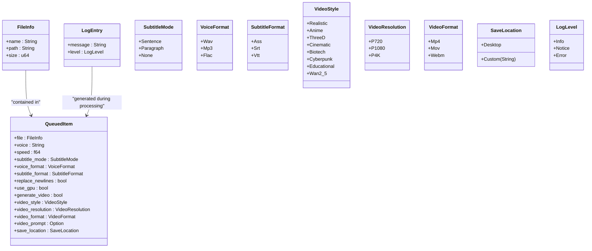
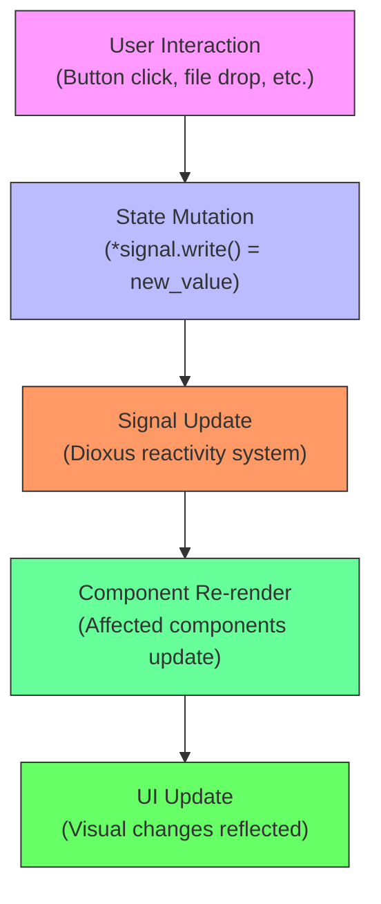
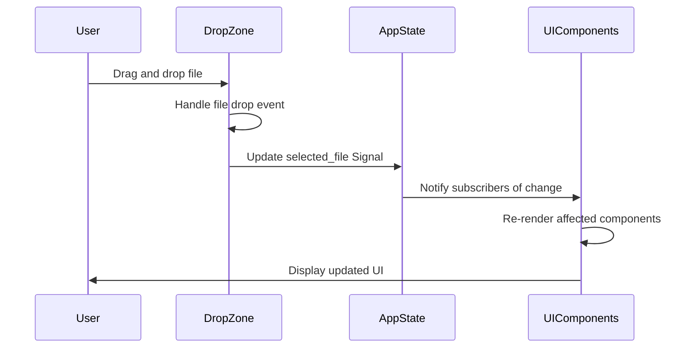

# State Management

<cite>
**Referenced Files in This Document**   
- [state.rs](file://abogen-ui/crates/ui/state.rs)
- [lib.rs](file://abogen-ui/crates/ui/lib.rs)
- [drop_zone.rs](file://abogen-ui/crates/ui/components/drop_zone.rs)
- [tts_service.rs](file://abogen-ui/crates/ui/services/tts_service.rs)
- [log_panel.rs](file://abogen-ui/crates/ui/components/log_panel.rs)
- [progress_bar.rs](file://abogen-ui/crates/ui/components/progress_bar.rs)
- [queue_modal.rs](file://abogen-ui/crates/ui/components/queue_modal.rs)
</cite>

## Table of Contents
1. [Introduction](#introduction)
2. [Core Data Structures](#core-data-structures)
3. [AppState and Reactive State Management](#appstate-and-reactive-state-management)
4. [Signal Usage and Unidirectional Data Flow](#signal-usage-and-unidirectional-data-flow)
5. [State Initialization and Feature Flags](#state-initialization-and-feature-flags)
6. [Component Interaction with State](#component-interaction-with-state)
7. [Processing State and Progress Tracking](#processing-state-and-progress-tracking)
8. [Common Patterns and Best Practices](#common-patterns-and-best-practices)
9. [Performance Considerations](#performance-considerations)

## Introduction
The state management system in the Voxweave application is built around Dioxus Signals to provide a reactive, consistent, and efficient way to manage UI state. The core of this system is the `AppState` struct, which encapsulates all application state in a centralized manner while leveraging Dioxus's reactivity model. This document details how state is structured, updated, and consumed across components, focusing on file selection, processing queue management, configuration settings, and real-time progress tracking.

## Core Data Structures

The state system revolves around three primary data structures: `FileInfo`, `QueuedItem`, and `LogEntry`. These structures encapsulate the essential data needed for text-to-speech and video generation workflows.



**Diagram sources**
- [state.rs](file://abogen-ui/crates/ui/state.rs#L7-L258)

**Section sources**
- [state.rs](file://abogen-ui/crates/ui/state.rs#L7-L258)

## AppState and Reactive State Management

The `AppState` struct serves as the single source of truth for the application's UI state. It contains Signal wrappers around various configuration options, processing states, and user selections. Each field in `AppState` is a Dioxus Signal, enabling reactive updates that automatically trigger UI re-renders when state changes.

The state management follows a unidirectional data flow pattern where user interactions trigger state mutations, which then propagate to dependent components through the reactive system. This ensures consistency across the UI and eliminates race conditions or state desynchronization issues.



**Diagram sources**
- [state.rs](file://abogen-ui/crates/ui/state.rs#L148-L258)
- [lib.rs](file://abogen-ui/crates/ui/lib.rs#L100-L639)

**Section sources**
- [state.rs](file://abogen-ui/crates/ui/state.rs#L148-L258)

## Signal Usage and Unidirectional Data Flow

Signals are used throughout the application to maintain reactive state. When a user interacts with the UI, such as selecting a file or adjusting settings, the corresponding Signal is updated, triggering re-renders in all components that depend on that state.

For example, when a user drops a file on the drop zone component, the `selected_file` Signal is updated:



Each Signal in `AppState` serves a specific purpose:
- `selected_file`: Tracks the currently selected input file
- `queue`: Maintains the list of items to be processed
- `voice`, `speed`, `subtitle_mode`: Store user preferences for TTS generation
- `generate_video`, `video_style`, `video_resolution`: Control video generation options
- `is_processing`, `progress`, `logs`: Track processing state and provide feedback

**Diagram sources**
- [drop_zone.rs](file://abogen-ui/crates/ui/components/drop_zone.rs#L0-L234)
- [state.rs](file://abogen-ui/crates/ui/state.rs#L148-L258)

**Section sources**
- [drop_zone.rs](file://abogen-ui/crates/ui/components/drop_zone.rs#L0-L234)
- [tts_service.rs](file://abogen-ui/crates/ui/services/tts_service.rs#L0-L540)

## State Initialization and Feature Flags

The `AppState::new()` method initializes all Signals with default values, including feature-flag-dependent settings. The `use_gpu` setting is particularly noteworthy as its default value is determined by the presence of the 'gpu' feature flag:

```rust
let use_gpu_default = cfg!(feature = "gpu");
```

This pattern allows the application to adapt its default behavior based on compilation features, enabling GPU acceleration by default when the appropriate feature is enabled. Other default values include:
- Default voice: "af_heart"
- Default speed: 1.0x
- Default subtitle mode: Sentence
- Default video style: Realistic
- Default resolution: 1080p

The initialization pattern ensures that all state is properly set up before the application becomes interactive, preventing undefined behavior or null state issues.

**Section sources**
- [state.rs](file://abogen-ui/crates/ui/state.rs#L230-L258)

## Component Interaction with State

Components interact with `AppState` by receiving it as a parameter and reading from or writing to its Signals. The pattern typically involves:
1. Reading Signal values with `.read()`
2. Writing new values with `.write()` 
3. Cloning Signals when needed for closures or child components

For example, the `DropZone` component updates the `selected_file` Signal when a file is selected, while the `QueueModal` component manipulates the `queue` Signal to add, remove, or reorder items. The `LogPanel` component reads from the `logs` Signal to display processing messages, and the `ProgressBar` component reads from the `progress` Signal to visualize completion percentage.

Signal cloning is handled appropriately to avoid unnecessary copies while ensuring that components have access to the reactive state they need. The Dioxus framework's `Copy` implementation for Signals makes this process efficient and straightforward.

**Section sources**
- [drop_zone.rs](file://abogen-ui/crates/ui/components/drop_zone.rs#L0-L234)
- [queue_modal.rs](file://abogen-ui/crates/ui/crates/ui/components/queue_modal.rs#L0-L194)
- [log_panel.rs](file://abogen-ui/crates/ui/components/log_panel.rs#L0-L43)
- [progress_bar.rs](file://abogen-ui/crates/ui/components/progress_bar.rs#L0-L23)

## Processing State and Progress Tracking

The state system includes comprehensive support for tracking processing state through several key Signals:
- `is_processing`: Boolean flag indicating whether processing is active
- `progress`: Unsigned 8-bit integer representing percentage complete (0-100)
- `logs`: Vector of `LogEntry` objects providing detailed processing feedback
- `cancel_token`: Optional unit type that serves as a cancellation signal

During processing, the `tts_service::process_queue` function updates these Signals to reflect the current state of operations. The progress Signal is updated at key milestones (reading files, generating audio, creating subtitles, etc.), while the logs Signal accumulates messages with different severity levels (Info, Notice, Error).

The cancellation mechanism uses the `cancel_token` Signal, which when set to `Some(())`, signals to processing tasks that they should terminate gracefully. This approach provides a clean, reactive way to handle user-initiated cancellations without relying on external state or complex coordination.

**Section sources**
- [tts_service.rs](file://abogen-ui/crates/ui/services/tts_service.rs#L0-L540)
- [state.rs](file://abogen-ui/crates/ui/state.rs#L148-L258)

## Common Patterns and Best Practices

Several patterns emerge from the state management implementation:

1. **Signal Mutation Pattern**: All signal mutations follow the established pattern:
```rust
let mut signal_copy = original_signal;
*signal_copy.write() = new_value;
```

2. **Component Composition**: Complex UIs are built by composing smaller components that each interact with specific parts of the state.

3. **Event Handling**: User interactions trigger state changes rather than directly manipulating the UI, maintaining the unidirectional data flow.

4. **Error Handling**: The system gracefully handles errors (missing files, failed processing) by updating the logs and progress state appropriately.

5. **Platform Adaptation**: Components adapt their behavior based on the target platform (web vs. desktop) while maintaining consistent state interfaces.

These patterns ensure that the state management system remains predictable, maintainable, and scalable as the application grows.

**Section sources**
- [STATUS.md](file://abogen-ui/STATUS.md#L196-L206)
- [lib.rs](file://abogen-ui/crates/ui/lib.rs#L100-L639)

## Performance Considerations

The state management system is designed with performance in mind:

1. **Efficient Re-rendering**: Dioxus Signals ensure that only components dependent on changed state are re-rendered, minimizing unnecessary updates.

2. **Large Queue Handling**: The queue system efficiently handles multiple items by processing them sequentially and updating progress incrementally.

3. **Memory Management**: State is stored in a centralized structure, reducing duplication and making memory usage predictable.

4. **Async Operations**: Long-running operations like TTS generation and video processing are handled asynchronously, preventing UI blocking.

5. **Signal Cloning**: The system leverages Dioxus's efficient Signal cloning mechanism to provide state access to components without excessive memory overhead.

For applications with very large queues or complex processing pipelines, additional optimizations could include pagination of queue items, more granular progress reporting, or background processing with persistent storage.

**Section sources**
- [tts_service.rs](file://abogen-ui/crates/ui/services/tts_service.rs#L0-L540)
- [state.rs](file://abogen-ui/crates/ui/state.rs#L148-L258)