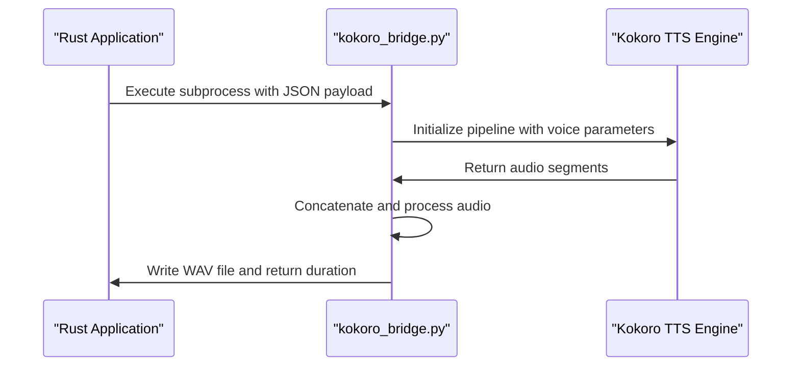
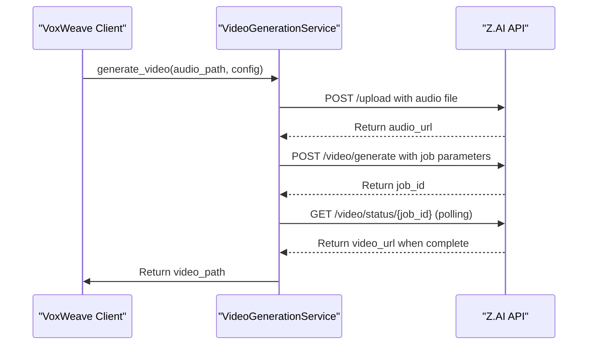
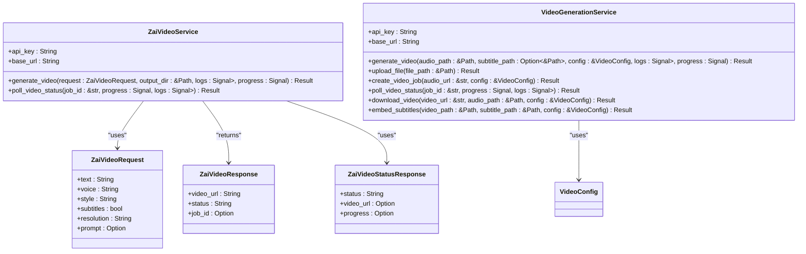
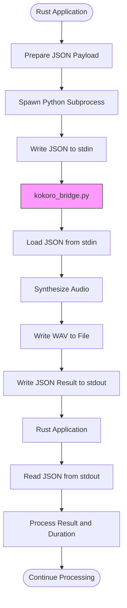
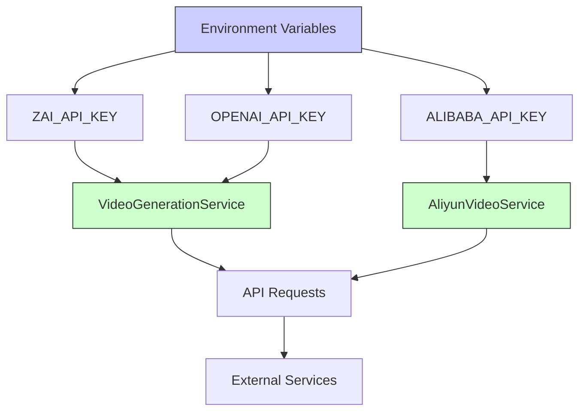
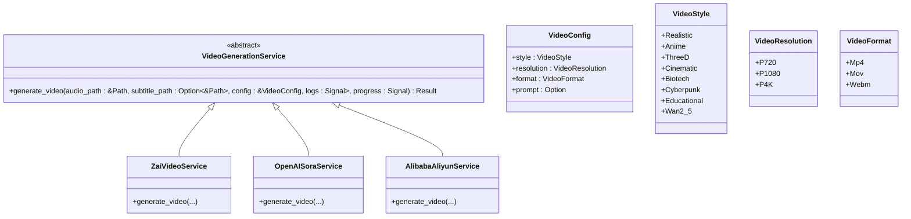

# Integration Points

<cite>
**Referenced Files in This Document**   
- [kokoro_bridge.py](file://python/kokoro_bridge.py)
- [video.rs](file://src/video.rs)
- [zai_video.rs](file://abogen-ui/crates/ui/services/zai_video.rs)
- [tts_service.rs](file://abogen-ui/crates/ui/services/tts_service.rs)
- [video_generation.rs](file://abogen-ui/crates/ui/services/video_generation.rs)
- [tts.rs](file://src/tts.rs)
- [coqui_tts.rs](file://src/coqui_tts.rs)
- [state.rs](file://abogen-ui/crates/ui/state.rs)
</cite>

## Table of Contents
1. [Introduction](#introduction)
2. [Python Bridge Architecture](#python-bridge-architecture)
3. API Client Implementation
4. Service Layer Abstraction
5. Data Exchange Patterns
6. Security Considerations
7. Troubleshooting Guide
8. Extending the Integration Layer
9. Conclusion

## Introduction
VoxWeave integrates with external systems through multiple integration points that enable advanced text-to-speech and video generation capabilities. The system connects to Python-based TTS engines like CoquiTTS via a Python bridge architecture and interfaces with cloud video generation services such as Z.AI and OpenAI Sora through REST APIs. This documentation details the integration architecture, implementation patterns, and operational considerations for these external connections. The integration layer is designed to be extensible, allowing for the addition of new services through configurable adapters while maintaining a consistent interface for the application's core functionality.

## Python Bridge Architecture
The Python bridge architecture in VoxWeave enables interoperability between the Rust-based core application and Python-based TTS engines through subprocess communication and JSON-based data serialization. The `kokoro_bridge.py` script serves as the interface between the Rust application and the Kokoro TTS engine, receiving configuration and text input via stdin and returning audio file paths and metadata via stdout.

**Diagram sources**
- [kokoro_bridge.py](file://python/kokoro_bridge.py#L0-L89)
- [tts.rs](file://src/tts.rs#L250-L300)

**Section sources**
- [kokoro_bridge.py](file://python/kokoro_bridge.py#L0-L89)
- [tts.rs](file://src/tts.rs#L250-L300)

The bridge architecture follows a standardized pattern where the Rust application spawns a Python subprocess using the command specified in the `VOXWEAVE_KOKORO_PYTHON` environment variable (defaulting to `python3`). The communication occurs through stdin/stdout with JSON-formatted payloads that include the text to synthesize, output file path, sample rate, voice parameters, and device configuration. Error handling is implemented through stderr output and process exit codes, with the bridge script providing detailed error messages when dependencies cannot be imported or synthesis fails.

For CoquiTTS integration, a similar bridge pattern is implemented with additional support for voice cloning. The `COQUI_BRIDGE_SCRIPT` embedded in `tts.rs` handles both standard TTS synthesis and voice cloning scenarios, accepting a `speaker_wav` parameter that points to a reference audio file for cloning. This inline Python script approach eliminates the need for external script files while maintaining the same subprocess communication pattern.

## API Client Implementation
The API client implementation in `src/video.rs` provides integration with Z.AI and OpenAI Sora for video generation capabilities. The `VideoGenerationService` struct encapsulates the API client functionality, handling authentication, request formatting, and response processing for the video generation workflow.

**Diagram sources**
- [video.rs](file://src/video.rs#L100-L400)
- [video_generation.rs](file://abogen-ui/crates/ui/services/video_generation.rs#L50-L300)

**Section sources**
- [video.rs](file://src/video.rs#L100-L400)
- [video_generation.rs](file://abogen-ui/crates/ui/services/video_generation.rs#L50-L300)

Authentication is handled through API keys stored in environment variables, with the service attempting to use `OPENAI_API_KEY` first and falling back to `ZAI_API_KEY` if not found. The client uses the `reqwest` library to make HTTP requests with appropriate headers, including the Authorization header with Bearer token authentication. Request formatting follows the specific requirements of each API, with the Z.AI integration supporting parameters such as video style, resolution, format, and custom prompts.

The implementation includes robust error handling and retry logic, with the `retry_api_call` method providing exponential backoff for failed requests. Response handling is implemented through serde deserialization of JSON responses into strongly-typed structs, with appropriate error propagation using the `anyhow` crate. The client also handles the complete video generation workflow, including uploading the audio file, creating the generation job, polling for completion with progress updates, downloading the generated video, and optionally embedding subtitles using ffmpeg.

## Service Layer Abstraction
The service layer in `abogen-ui/crates/ui/services/` abstracts the external API calls for the UI, providing a consistent interface regardless of the underlying implementation. The `zai_video.rs` and `video_generation.rs` modules implement service structs that encapsulate the complexity of the external integrations while exposing simple, asynchronous methods for the UI components to consume.

**Diagram sources**
- [zai_video.rs](file://abogen-ui/crates/ui/services/zai_video.rs#L10-L100)
- [video_generation.rs](file://abogen-ui/crates/ui/services/video_generation.rs#L10-L100)

**Section sources**
- [zai_video.rs](file://abogen-ui/crates/ui/services/zai_video.rs#L10-L100)
- [video_generation.rs](file://abogen-ui/crates/ui/services/video_generation.rs#L10-L100)

The service layer provides several key abstractions that simplify UI integration:
- **Unified Error Handling**: All service methods return `Result<T, String>` with descriptive error messages suitable for display in the UI.
- **Progress Tracking**: Services accept progress signals that are updated during long-running operations, enabling real-time progress indicators in the UI.
- **Logging Integration**: Services accept log signals that are updated with status messages, providing a consistent logging experience across different operations.
- **Configuration Abstraction**: Video generation parameters are encapsulated in the `VideoConfig` struct, which maps to the UI state and provides default values.

The `generate_zai_video_with_composition` function in `zai_video.rs` demonstrates the service layer's role in orchestrating complex workflows, coordinating between video generation, audio processing, and subtitle embedding to produce a final composed video. This function also handles fallback scenarios, automatically switching to alternative video generation services when necessary.

## Data Exchange Patterns
The data exchange patterns between Rust and Python in VoxWeave follow a standardized approach that ensures reliable communication and data integrity. For TTS engine integration, the system uses JSON serialization for configuration and control data, while audio files are exchanged through the filesystem.

**Diagram sources**
- [kokoro_bridge.py](file://python/kokoro_bridge.py#L0-L89)
- [tts.rs](file://src/tts.rs#L250-L300)

**Section sources**
- [kokoro_bridge.py](file://python/kokoro_bridge.py#L0-L89)
- [tts.rs](file://src/tts.rs#L250-L300)

The JSON payload structure includes all necessary parameters for TTS synthesis:
- **Text**: The input text to be synthesized
- **Output**: The file path where the audio should be written
- **Sample Rate**: The desired audio sample rate (default: 24000)
- **Voice**: The voice identifier to use for synthesis
- **Language Code**: The language code for the voice
- **Speed**: The playback speed multiplier
- **Device**: The compute device (cpu, cuda, mps)
- **Repository ID**: The model repository ID for custom models

For video generation, the data exchange pattern shifts to HTTP-based communication with external APIs. The system uploads audio files to the Z.AI service and receives video URLs in response. The `VideoConfig` struct in `state.rs` defines the configuration parameters that are serialized to JSON for API requests, including video style, resolution, format, and custom prompts.

The integration also handles subtitle exchange, where SRT, ASS, or VTT subtitle files are either embedded in the video or provided as separate files. The `format_subtitles` function in `tts_service.rs` converts subtitle entries to the requested format, ensuring compatibility with different video generation services and playback environments.

## Security Considerations
Security considerations for API key management and rate limiting are implemented throughout the integration layer to protect sensitive credentials and ensure responsible API usage. API keys are never stored in code or version control, but are instead retrieved from environment variables using `std::env::var()`.

**Diagram sources**
- [video.rs](file://src/video.rs#L50-L100)
- [zai_video.rs](file://abogen-ui/crates/ui/services/zai_video.rs#L50-L60)
- [aliyun_video.rs](file://abogen-ui/crates/ui/services/aliyun_video.rs#L65-L70)

**Section sources**
- [video.rs](file://src/video.rs#L50-L100)
- [zai_video.rs](file://abogen-ui/crates/ui/services/zai_video.rs#L50-L60)

The system implements several security measures:
- **Environment Variable Isolation**: API keys are accessed directly from the environment without intermediate storage
- **Fallback Authentication**: Multiple API key options are supported with clear precedence (OpenAI first, then Z.AI)
- **Error Message Sanitization**: Authentication failures provide generic error messages without exposing key details
- **Rate Limiting**: The `retry_api_call` method implements exponential backoff to prevent API abuse
- **Secure Transmission**: All API requests use HTTPS with Bearer token authentication

Rate limiting is handled through both client-side and server-side mechanisms. The client implements exponential backoff with the `retry_api_call` method, which retries failed requests with increasing delays (1s, 2s, 4s, etc.) up to a maximum number of attempts. This prevents the application from overwhelming the external APIs with rapid-fire requests during transient failures.

For production deployments, additional security measures are recommended:
- Using a secrets management service instead of environment variables
- Implementing API key rotation
- Adding request signing for enhanced authentication
- Monitoring API usage patterns for anomalies
- Implementing circuit breakers for degraded service conditions

## Troubleshooting Guide
This troubleshooting guide addresses common integration issues such as Python environment mismatches, API timeouts, and authentication failures. Each issue includes diagnostic steps and resolution strategies to help users resolve problems efficiently.

### Python Environment Mismatches
**Symptoms**:
- "failed to import kokoro dependencies" errors
- ModuleNotFoundError for TTS packages
- Subprocess execution failures

**Diagnostic Steps**:
1. Verify Python installation: `python3 --version`
2. Check package installation: `pip list | grep TTS`
3. Test Python bridge script: `python3 python/kokoro_bridge.py < test_payload.json`

**Resolution**:
- Install required packages: `pip install TTS torch numpy`
- Verify Python path matches `VOXWEAVE_KOKORO_PYTHON` environment variable
- Ensure compatible Python version (3.8+ recommended)
- Check for conflicting package versions

### API Timeouts
**Symptoms**:
- "Video generation timeout" errors
- Long delays in video generation
- Intermittent connection failures

**Diagnostic Steps**:
1. Check network connectivity to API endpoints
2. Verify API service status
3. Monitor request/response times
4. Check for large input files causing extended processing

**Resolution**:
- Reduce input text length for testing
- Increase timeout thresholds in service configuration
- Implement retry logic with exponential backoff
- Use lower resolution settings (720p instead of 4K)
- Check for network throttling or firewall restrictions

### Authentication Failures
**Symptoms**:
- "ZAI_API_KEY not found" errors
- 401 Unauthorized HTTP responses
- API requests rejected without processing

**Diagnostic Steps**:
1. Verify environment variable is set: `echo $ZAI_API_KEY`
2. Check for whitespace in API key
3. Test API key with curl command
4. Verify key has appropriate permissions

**Resolution**:
- Set environment variable: `export ZAI_API_KEY=your_key_here`
- Add to shell profile for persistence
- Regenerate API key if compromised
- Verify key format and length requirements
- Check for account-specific restrictions

### General Debugging Tips
- Enable verbose logging to capture detailed error messages
- Test components in isolation (TTS first, then video generation)
- Use small input files for initial testing
- Monitor system resources (CPU, memory, disk space)
- Check file permissions for read/write access
- Verify all required dependencies are installed

**Section sources**
- [kokoro_bridge.py](file://python/kokoro_bridge.py#L0-L89)
- [video.rs](file://src/video.rs#L100-L400)
- [tts_service.rs](file://abogen-ui/crates/ui/services/tts_service.rs#L200-L500)

## Extending the Integration Layer
The integration layer in VoxWeave is designed to be extensible, allowing for the addition of new external services through configurable adapters. The architecture follows a plugin pattern where new services can be added by implementing standardized interfaces and registering them in the application's feature configuration.

**Diagram sources**
- [video_generation.rs](file://abogen-ui/crates/ui/services/video_generation.rs#L10-L100)
- [state.rs](file://abogen-ui/crates/ui/state.rs#L100-L200)

**Section sources**
- [video_generation.rs](file://abogen-ui/crates/ui/services/video_generation.rs#L10-L100)
- [state.rs](file://abogen-ui/crates/ui/state.rs#L100-L200)

To add a new video generation service, developers should:
1. Create a new service module in `abogen-ui/crates/ui/services/`
2. Implement the `VideoGenerationService` interface with the new API
3. Add feature flag configuration in `Cargo.toml`
4. Register the service in the application's service registry
5. Add UI controls for service-specific parameters
6. Update documentation with usage instructions

The system already demonstrates this extensibility pattern with the conditional implementation of the `Wan2_5` video style, which routes to an Alibaba Aliyun service when selected. This approach allows for multiple backend services to coexist while presenting a unified interface to the user.

For TTS engine integration, the `VoiceEngine` enum in `tts.rs` provides a similar extension point, with `Espeak`, `Kokoro`, and `Coqui` implementations following the same `SpeechEngine` trait. New TTS engines can be added by implementing this trait and updating the voice profile system to support the new engine type.

Configuration-driven adapters allow services to be customized without code changes. The system uses environment variables to configure service behavior, such as `VOXWEAVE_KOKORO_REPO_ID` for custom model repositories and `VOXWEAVE_COQUI_DEVICE` for compute device selection. This pattern can be extended to support additional configuration options for new services.

## Conclusion
The integration points in VoxWeave provide a robust and extensible architecture for connecting with external systems, enabling advanced text-to-speech and video generation capabilities. The Python bridge architecture facilitates interoperability with Python-based TTS engines through subprocess communication and JSON serialization, while the API client implementation provides reliable integration with cloud video generation services. The service layer abstraction simplifies UI integration by encapsulating the complexity of external calls and providing consistent interfaces for progress tracking and error handling. Security considerations are addressed through proper API key management and rate limiting, while comprehensive troubleshooting guidance helps users resolve common issues. The extensible design allows for the addition of new services through configurable adapters, ensuring the system can evolve to support emerging technologies and user requirements.