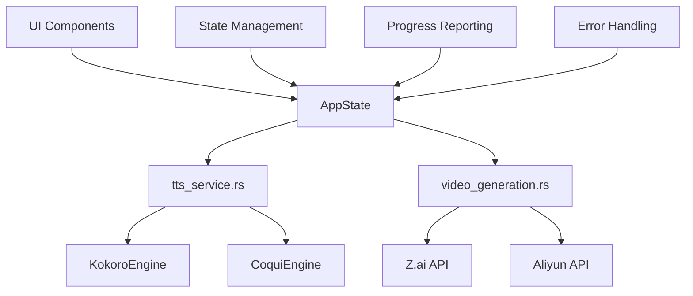
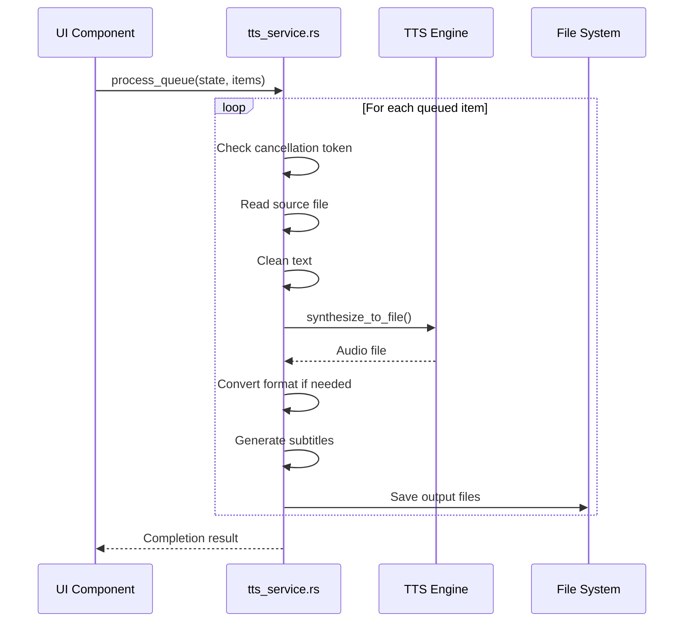
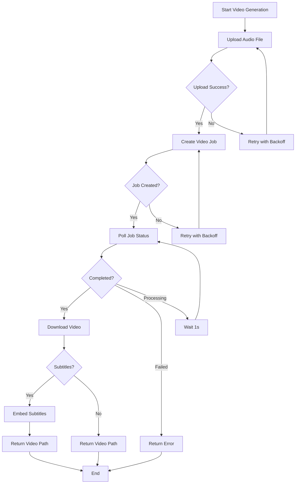
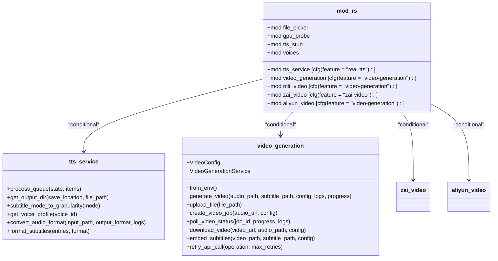
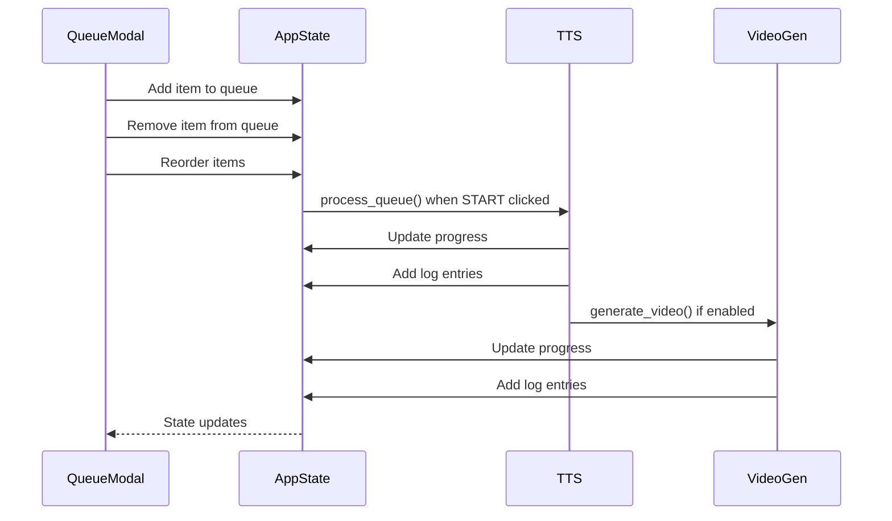
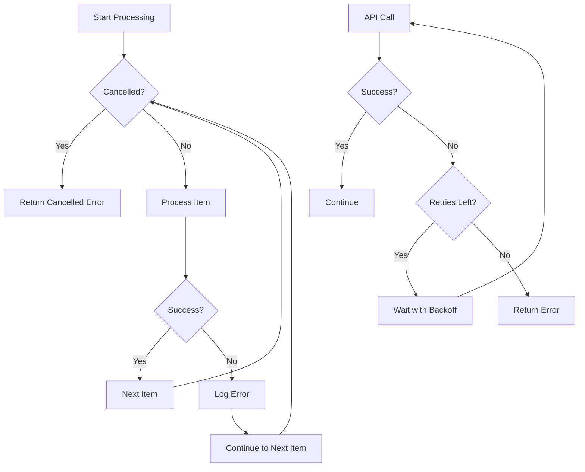
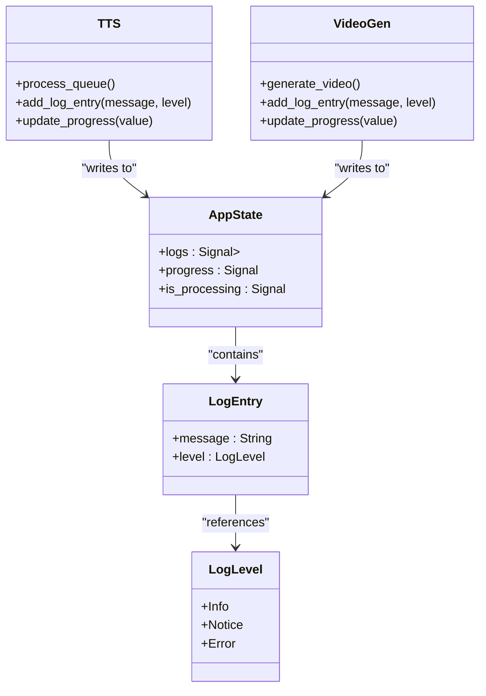

# Service Abstraction Layer

<cite>
**Referenced Files in This Document**  
- [tts_service.rs](file://abogen-ui/crates/ui/services/tts_service.rs)
- [video_generation.rs](file://abogen-ui/crates/ui/services/video_generation.rs)
- [mod.rs](file://abogen-ui/crates/ui/services/mod.rs)
- [queue_modal.rs](file://abogen-ui/crates/ui/components/queue_modal.rs)
- [audio_recorder.rs](file://abogen-ui/crates/ui/components/audio_recorder.rs)
- [state.rs](file://abogen-ui/crates/ui/state.rs)
- [lib.rs](file://abogen-ui/crates/ui/lib.rs)
</cite>

## Table of Contents
1. [Introduction](#introduction)
2. [Service Abstraction Architecture](#service-abstraction-architecture)
3. [TTS Service Implementation](#tts-service-implementation)
4. [Video Generation Service](#video-generation-service)
5. [Service Module Structure](#service-module-structure)
6. [UI Integration and Message Passing](#ui-integration-and-message-passing)
7. [Error Handling and Cancellation](#error-handling-and-cancellation)
8. [Logging and Progress Reporting](#logging-and-progress-reporting)
9. [Extending the Service Layer](#extending-the-service-layer)
10. [Conclusion](#conclusion)

## Introduction

The service abstraction layer in the abogen-ui crate provides a clean separation between UI components and backend processing logic. This architecture enables the decoupling of user interface elements from external APIs and backend processes, allowing for maintainable, testable, and extensible code. The layer consists of specialized services that handle text-to-speech synthesis, video generation, and other processing tasks, while exposing a unified interface to the UI components. This document details the implementation of key services, their integration with the application state, and patterns for extending the service layer with new functionality.

## Service Abstraction Architecture

The service abstraction layer follows a dependency injection pattern where services are consumed by UI components through shared application state. The architecture is designed to handle both local processing (espeak-ng) and remote API calls (CoquiTTS via Python bridge) through a unified interface. Services operate asynchronously to maintain UI responsiveness and use message passing patterns to communicate state changes back to the UI components.

**Diagram sources**
- [tts_service.rs](file://abogen-ui/crates/ui/services/tts_service.rs)
- [video_generation.rs](file://abogen-ui/crates/ui/services/video_generation.rs)
- [state.rs](file://abogen-ui/crates/ui/state.rs)

**Section sources**
- [tts_service.rs](file://abogen-ui/crates/ui/services/tts_service.rs)
- [video_generation.rs](file://abogen-ui/crates/ui/services/video_generation.rs)

## TTS Service Implementation

The tts_service.rs module provides a unified interface for all text-to-speech engines in the application. It abstracts the differences between local (Kokoro) and remote (Coqui) TTS implementations, allowing UI components to interact with a consistent API regardless of the underlying engine.

The service handles the complete TTS pipeline including text cleaning, audio synthesis, format conversion, and subtitle generation. It supports multiple voice profiles and audio formats, with automatic conversion between formats using ffmpeg when available. The service is designed to work with both desktop and web platforms, with appropriate fallbacks for platform-specific limitations.

**Diagram sources**
- [tts_service.rs](file://abogen-ui/crates/ui/services/tts_service.rs#L211-L540)
- [state.rs](file://abogen-ui/crates/ui/state.rs)

**Section sources**
- [tts_service.rs](file://abogen-ui/crates/ui/services/tts_service.rs)
- [state.rs](file://abogen-ui/crates/ui/state.rs)

## Video Generation Service

The video_generation.rs module manages the complete video creation workflow, including API call delegation, progress tracking, and result retrieval. The service coordinates between audio processing, subtitle embedding, and remote video generation APIs to produce final video outputs.

The VideoGenerationService struct provides a high-level interface for video creation, handling the multi-step process of uploading audio, creating video generation jobs, polling for completion, downloading results, and embedding subtitles. The service implements robust error handling and retry logic for API calls, with exponential backoff to handle transient failures.

**Diagram sources**
- [video_generation.rs](file://abogen-ui/crates/ui/services/video_generation.rs#L170-L486)
- [state.rs](file://abogen-ui/crates/ui/state.rs)

**Section sources**
- [video_generation.rs](file://abogen-ui/crates/ui/services/video_generation.rs)
- [state.rs](file://abogen-ui/crates/ui/state.rs)

## Service Module Structure

The mod.rs file in the services directory organizes the service exports and enables dependency injection into Dioxus components. The module uses conditional compilation features to include or exclude specific services based on build configuration, allowing for flexible deployment scenarios.

The module structure follows a feature-flag pattern where services are only compiled when their corresponding features are enabled. This reduces binary size and dependencies for deployments that don't require certain functionality. The services are exposed through a consistent interface that abstracts implementation details from the UI layer.

**Diagram sources**
- [mod.rs](file://abogen-ui/crates/ui/services/mod.rs)
- [tts_service.rs](file://abogen-ui/crates/ui/services/tts_service.rs)
- [video_generation.rs](file://abogen-ui/crates/ui/services/video_generation.rs)

**Section sources**
- [mod.rs](file://abogen-ui/crates/ui/services/mod.rs)
- [tts_service.rs](file://abogen-ui/crates/ui/services/tts_service.rs)
- [video_generation.rs](file://abogen-ui/crates/ui/services/video_generation.rs)

## UI Integration and Message Passing

UI components consume the services through the AppState structure, which provides shared access to application state and services. Components like queue_modal.rs and audio_recorder.rs use message passing patterns to trigger service operations and receive state updates.

The queue_modal.rs component allows users to manage the processing queue, providing controls to add, remove, and reorder items. It communicates with the TTS service through the AppState, which coordinates the processing of queued items. The audio_recorder.rs component captures audio for voice cloning and integrates with the Coqui TTS service when enabled.

**Diagram sources**
- [queue_modal.rs](file://abogen-ui/crates/ui/components/queue_modal.rs)
- [audio_recorder.rs](file://abogen-ui/crates/ui/components/audio_recorder.rs)
- [state.rs](file://abogen-ui/crates/ui/state.rs)
- [lib.rs](file://abogen-ui/crates/ui/lib.rs)

**Section sources**
- [queue_modal.rs](file://abogen-ui/crates/ui/components/queue_modal.rs)
- [audio_recorder.rs](file://abogen-ui/crates/ui/components/audio_recorder.rs)
- [state.rs](file://abogen-ui/crates/ui/state.rs)
- [lib.rs](file://abogen-ui/crates/ui/lib.rs)

## Error Handling and Cancellation

The service layer implements comprehensive error handling and cancellation mechanisms to provide a robust user experience. Services use Result types to propagate errors, with detailed error messages that help diagnose issues. The cancellation mechanism uses a token pattern where UI components can signal cancellation, and services periodically check for this signal during long-running operations.

The process_queue function in tts_service.rs checks for cancellation at the beginning of each item processing cycle, allowing users to stop processing without waiting for the current item to complete. The video generation service implements retry logic with exponential backoff for API calls, handling transient network issues gracefully.

**Diagram sources**
- [tts_service.rs](file://abogen-ui/crates/ui/services/tts_service.rs#L230-L240)
- [video_generation.rs](file://abogen-ui/crates/ui/services/video_generation.rs#L457-L486)
- [state.rs](file://abogen-ui/crates/ui/state.rs)

**Section sources**
- [tts_service.rs](file://abogen-ui/crates/ui/services/tts_service.rs)
- [video_generation.rs](file://abogen-ui/crates/ui/services/video_generation.rs)
- [state.rs](file://abogen-ui/crates/ui/state.rs)

## Logging and Progress Reporting

The service layer integrates comprehensive logging and progress reporting to keep users informed about processing status. Services write log entries to the shared AppState, which are displayed in the UI's log panel. Progress is reported as a percentage value that updates throughout the processing pipeline.

The logging system uses structured log entries with message content and log level (Info, Notice, Error) to provide visual feedback in the UI. Progress reporting is designed to be smooth and responsive, with updates occurring at key stages of processing to give users a realistic indication of completion time.

**Diagram sources**
- [state.rs](file://abogen-ui/crates/ui/state.rs#L230-L258)
- [tts_service.rs](file://abogen-ui/crates/ui/services/tts_service.rs)
- [video_generation.rs](file://abogen-ui/crates/ui/services/video_generation.rs)

**Section sources**
- [state.rs](file://abogen-ui/crates/ui/state.rs)
- [tts_service.rs](file://abogen-ui/crates/ui/services/tts_service.rs)
- [video_generation.rs](file://abogen-ui/crates/ui/services/video_generation.rs)

## Extending the Service Layer

Adding new service wrappers for external tools follows a consistent pattern that maintains type safety and async compatibility. New services should implement the same interface patterns as existing services, using Result types for error handling and async/await for non-blocking operations.

When creating a new service, define a configuration struct for input parameters, a service struct for state and API credentials, and methods that operate on shared application state. The service should integrate with the existing logging and progress reporting system, and handle errors in a way that provides meaningful feedback to users.

The modular structure with conditional compilation allows new services to be added without affecting existing functionality. Services for different video generation APIs (Z.ai, Aliyun) demonstrate this pattern, where multiple implementations can coexist and be selected at compile time based on feature flags.

**Section sources**
- [mod.rs](file://abogen-ui/crates/ui/services/mod.rs)
- [tts_service.rs](file://abogen-ui/crates/ui/services/tts_service.rs)
- [video_generation.rs](file://abogen-ui/crates/ui/services/video_generation.rs)

## Conclusion

The service abstraction layer in the abogen-ui crate provides a robust foundation for decoupling UI components from backend processing logic. By implementing a consistent interface for TTS and video generation services, the architecture enables maintainable, testable, and extensible code. The layer handles complex workflows including state management, progress reporting, error handling, and cancellation, while providing a clean API for UI integration. This design allows for the addition of new service wrappers while maintaining type safety and async compatibility, ensuring the application can evolve to support new features and external tools.