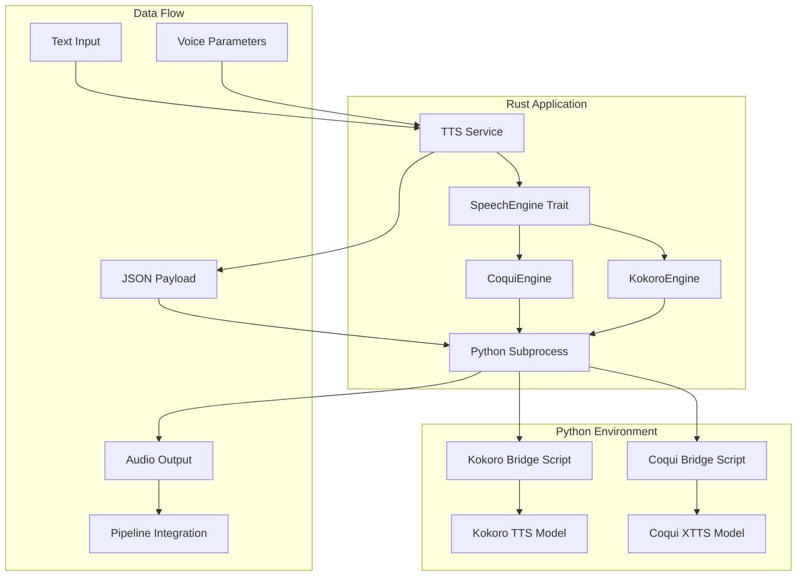
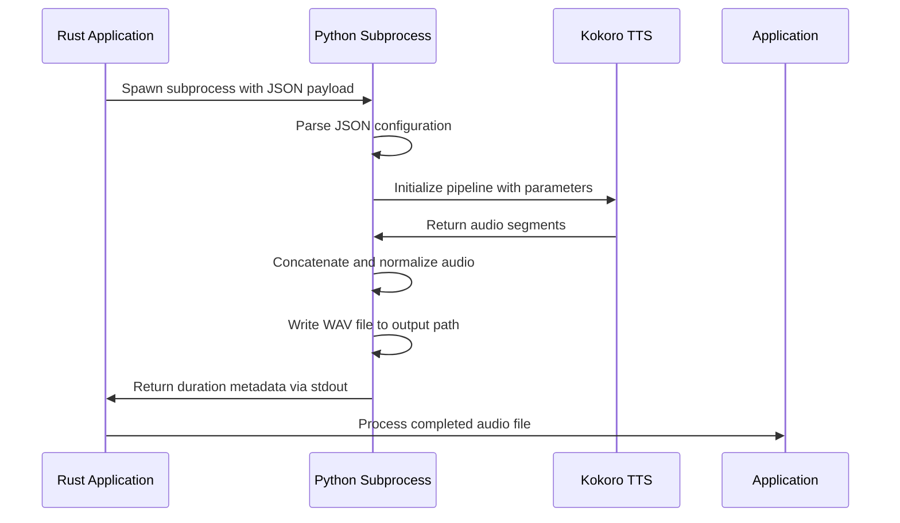
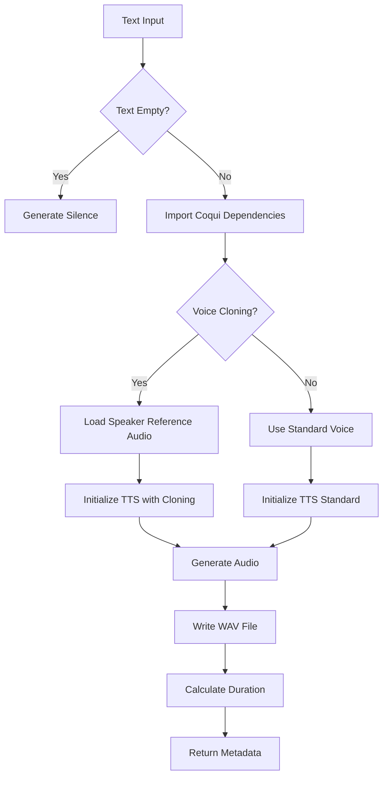
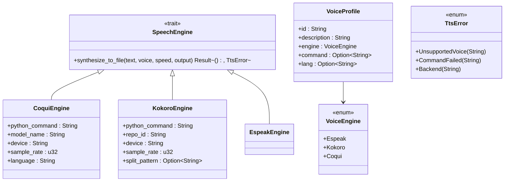
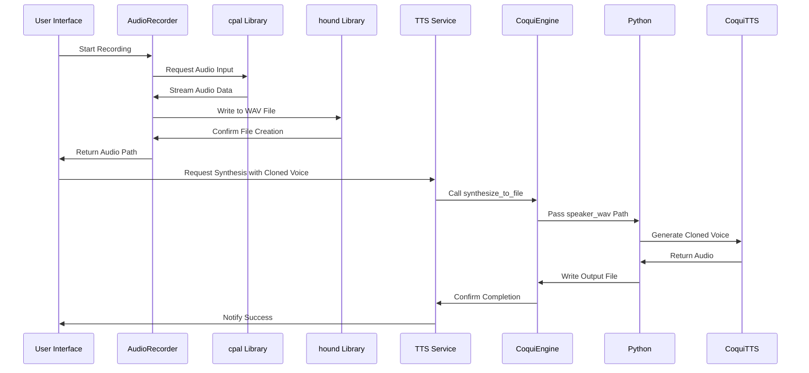

# TTS Engine Bridges

<cite>
**Referenced Files in This Document**   
- [kokoro_bridge.py](file://python/kokoro_bridge.py)
- [coqui_tts.rs](file://src/coqui_tts.rs)
- [tts.rs](file://src/tts.rs)
- [lib.rs](file://src/lib.rs)
- [Cargo.toml](file://Cargo.toml)
- [tts_service.rs](file://abogen-ui/crates/ui/services/tts_service.rs)
- [audio_recorder.rs](file://abogen-ui/crates/ui/components/audio_recorder.rs)
- [test_coqui.py](file://test_coqui.py)
</cite>

## Table of Contents
1. [Introduction](#introduction)
2. [Architecture Overview](#architecture-overview)
3. [Kokoro Bridge Implementation](#kokoro-bridge-implementation)
4. [Coqui TTS Integration](#coqui-tts-integration)
5. [Trait-Based Abstraction System](#trait-based-abstraction-system)
6. [Voice Cloning Workflow](#voice-cloning-workflow)
7. [Configuration and Environment Variables](#configuration-and-environment-variables)
8. [Error Handling and Diagnostics](#error-handling-and-diagnostics)
9. [Extending the TTS System](#extending-the-tts-system)
10. [Troubleshooting Common Issues](#troubleshooting-common-issues)

## Introduction

The TTS engine bridge system in VoxWeave enables seamless integration between Rust-based core components and external Python-based text-to-speech engines such as CoquiTTS and Kokoro. This architecture facilitates high-quality voice synthesis with support for voice cloning, multi-language processing, and flexible audio output formats. The system is designed to abstract the complexities of inter-process communication, Python dependency management, and audio processing while providing a unified interface for various TTS backends.

**Section sources**
- [tts.rs](file://src/tts.rs#L1-L50)
- [Cargo.toml](file://Cargo.toml#L1-L10)

## Architecture Overview

The TTS bridge system follows a modular architecture that separates concerns between the Rust frontend, Python backend execution, and configuration management. The core components include:

1. **Rust TTS Abstraction Layer**: Provides a trait-based interface for all TTS engines
2. **Python Subprocess Bridge**: Executes Python scripts via subprocess with JSON payloads
3. **Configuration System**: Manages engine parameters through environment variables
4. **Audio Exchange Mechanism**: Uses temporary files for audio input/output
5. **Error Propagation System**: Translates Python exceptions to Rust error types

The system supports two primary Python-based TTS engines: CoquiTTS for advanced voice cloning capabilities and Kokoro for lightweight text-to-speech synthesis. Both engines are accessed through the same unified interface, allowing for easy switching between backends based on application requirements.

**Diagram sources **
- [tts.rs](file://src/tts.rs#L1-L50)
- [coqui_tts.rs](file://src/coqui_tts.rs#L1-L20)

**Section sources**
- [tts.rs](file://src/tts.rs#L1-L100)
- [Cargo.toml](file://Cargo.toml#L1-L20)

## Kokoro Bridge Implementation

The kokoro_bridge.py script serves as the Python-side interface for the Kokoro TTS engine, handling JSON-based configuration payloads and managing audio output serialization. The bridge operates by reading configuration data from stdin, processing text through the Kokoro pipeline, and writing synthesized audio to a specified output path.

Key implementation details include:
- **JSON Configuration**: Accepts text, output path, sample rate, language code, voice selection, and speed parameters
- **Subprocess Communication**: Uses stdin for input configuration and stdout for metadata output
- **Audio Serialization**: Writes WAV format audio with configurable sample rates
- **Error Handling**: Propagates Python exceptions to stderr for Rust-side processing
- **Silence Handling**: Generates silent audio files for empty text inputs

The bridge script is embedded directly in the Rust codebase as a constant string (KOKORO_BRIDGE_SCRIPT) in tts.rs, ensuring that the Python code is always available without external file dependencies. This approach simplifies deployment and ensures version compatibility between the Rust frontend and Python backend.

**Diagram sources **
- [kokoro_bridge.py](file://python/kokoro_bridge.py#L1-L90)
- [tts.rs](file://src/tts.rs#L500-L520)

**Section sources**
- [kokoro_bridge.py](file://python/kokoro_bridge.py#L1-L90)
- [tts.rs](file://src/tts.rs#L450-L520)

## Coqui TTS Integration

The Coqui TTS integration in VoxWeave provides advanced voice synthesis capabilities through the CoquiTTS XTTS v2 model, with special emphasis on voice cloning functionality. The integration is implemented in coqui_tts.rs, which defines the CoquiEngine struct that implements the SpeechEngine trait.

Key features of the Coqui integration include:
- **Voice Cloning Support**: Enables custom voice creation using reference audio files
- **Flexible Configuration**: Supports model selection, device targeting (CPU/GPU), and sample rate customization
- **Environment Variable Configuration**: Allows runtime configuration through VOXWEAVE_COQUI_* environment variables
- **Robust Error Handling**: Captures and propagates Python exceptions to the Rust application

The CoquiEngine uses a similar subprocess model to the Kokoro bridge, passing configuration parameters through a JSON payload. However, it includes additional parameters specific to voice cloning, such as the speaker_wav path. The engine automatically detects the availability of CUDA or MPS devices for GPU acceleration when configured to use non-CPU devices.

**Diagram sources **
- [coqui_tts.rs](file://src/coqui_tts.rs#L1-L115)
- [tts.rs](file://src/tts.rs#L400-L450)

**Section sources**
- [coqui_tts.rs](file://src/coqui_tts.rs#L1-L115)
- [tts.rs](file://src/tts.rs#L400-L450)

## Trait-Based Abstraction System

The TTS system in VoxWeave employs a trait-based abstraction system defined in tts.rs that standardizes communication across different TTS backends. This approach enables a consistent interface regardless of the underlying engine implementation.

The core components of the abstraction system include:

- **SpeechEngine Trait**: Defines the synthesize_to_file method that all TTS engines must implement
- **VoiceEngine Enum**: Enumerates available TTS engines (Espeak, Kokoro, Coqui)
- **VoiceProfile Struct**: Contains voice configuration including ID, description, engine type, and optional command parameters
- **TtsError Enum**: Standardizes error reporting across all engine implementations

This abstraction allows the application to switch between different TTS engines without modifying the core application logic. The system automatically routes requests to the appropriate engine based on the VoiceEngine specified in the VoiceProfile. This design promotes code reuse, simplifies testing, and enables easy addition of new TTS backends.

**Diagram sources **
- [tts.rs](file://src/tts.rs#L1-L200)
- [coqui_tts.rs](file://src/coqui_tts.rs#L1-L50)

**Section sources**
- [tts.rs](file://src/tts.rs#L1-L200)
- [lib.rs](file://src/lib.rs#L1-L10)

## Voice Cloning Workflow

The voice cloning workflow in VoxWeave enables users to create personalized voices using reference audio recordings. This process involves several coordinated components working together to capture, process, and utilize voice samples.

The workflow begins with the AudioRecorder component in audio_recorder.rs, which captures audio from the user's microphone and saves it as a WAV file on the desktop. This component uses the cpal library for audio input and hound for WAV file writing, providing real-time feedback during recording.

Once a reference audio file is captured, it is used to create a cloned voice profile through the VoiceProfile::coqui_clone method. This method stores the path to the reference audio in the command field of the VoiceProfile struct. When this voice profile is used for synthesis, the CoquiEngine extracts the reference audio path and passes it to the Python bridge script, which uses it for voice cloning in the TTS generation process.

The integration between the UI and backend is managed by tts_service.rs, which routes TTS requests to the appropriate engine based on the voice profile. For cloned voices, it ensures that the reference audio path is properly passed through the configuration pipeline.

**Diagram sources **
- [audio_recorder.rs](file://abogen-ui/crates/ui/components/audio_recorder.rs#L1-L327)
- [tts_service.rs](file://abogen-ui/crates/ui/services/tts_service.rs#L1-L540)

**Section sources**
- [audio_recorder.rs](file://abogen-ui/crates/ui/components/audio_recorder.rs#L1-L327)
- [tts_service.rs](file://abogen-ui/crates/ui/services/tts_service.rs#L1-L540)

## Configuration and Environment Variables

The TTS engine bridges support extensive configuration through environment variables, allowing users to customize engine behavior without modifying code. These variables provide flexibility in deployment scenarios and enable optimization for different hardware configurations.

For the Coqui TTS engine, the following environment variables are supported:
- **VOXWEAVE_COQUI_PYTHON**: Specifies the Python command to use (default: python3)
- **VOXWEAVE_COQUI_MODEL**: Sets the TTS model name (default: tts_models/multilingual/multi-dataset/xtts_v2)
- **VOXWEAVE_COQUI_DEVICE**: Determines the execution device (cpu, cuda, mps, etc.)
- **VOXWEAVE_COQUI_SAMPLE_RATE**: Configures the audio sample rate (default: 24000)
- **VOXWEAVE_COQUI_LANGUAGE**: Sets the default language for synthesis (default: en)

The Kokoro engine uses a similar configuration scheme:
- **VOXWEAVE_KOKORO_PYTHON**: Python command (default: python3)
- **VOXWEAVE_KOKORO_REPO_ID**: Model repository ID (default: hexgrad/Kokoro-82M)
- **VOXWEAVE_KOKORO_DEVICE**: Execution device (default: cpu)
- **VOXWEAVE_KOKORO_SAMPLE_RATE**: Audio sample rate (default: 24000)
- **VOXWEAVE_KOKORO_SPLIT_PATTERN**: Text splitting pattern for long inputs

These environment variables are read during the Default implementation of their respective engine structs, providing sensible defaults while allowing override for specialized use cases. This configuration system enables users to optimize performance based on their hardware capabilities, such as using GPU acceleration when available.

**Section sources**
- [coqui_tts.rs](file://src/coqui_tts.rs#L10-L50)
- [tts.rs](file://src/tts.rs#L200-L250)

## Error Handling and Diagnostics

The TTS bridge system implements comprehensive error handling to ensure robust operation and provide meaningful diagnostics when issues occur. Errors are categorized and propagated from the Python subprocess to the Rust application through standardized error types.

The TtsError enum defines three primary error categories:
- **UnsupportedVoice**: Triggered when a voice profile is used with an incompatible engine
- **CommandFailed**: Indicates subprocess execution failures, including Python exceptions
- **Backend**: Covers internal audio processing and configuration errors

When a Python subprocess encounters an error, it writes the exception details to stderr, which is captured by the Rust application and converted to a CommandFailed error. This approach preserves the original error context while maintaining the unified error handling interface. For example, if Python dependencies are missing, the bridge script writes an import error to stderr, which is then propagated as a CommandFailed error in Rust.

The system also includes diagnostic tools such as test_coqui.py, which verifies the CoquiTTS installation and basic functionality. This script tests package imports and model initialization, helping users identify configuration issues before attempting synthesis.

**Section sources**
- [tts.rs](file://src/tts.rs#L10-L50)
- [test_coqui.py](file://test_coqui.py#L1-L140)
- [coqui_tts.rs](file://src/coqui_tts.rs#L80-L115)

## Extending the TTS System

The trait-based architecture of the TTS system makes it straightforward to extend with additional Python TTS models. New engines can be integrated by implementing the SpeechEngine trait and registering them in the system.

To add a new TTS engine:
1. Create a new struct that will hold engine-specific configuration
2. Implement the Default trait to provide sensible configuration defaults
3. Implement the SpeechEngine trait's synthesize_to_file method
4. Add the new engine variant to the VoiceEngine enum
5. Register the engine in the feature configuration in Cargo.toml

The implementation should follow the established pattern of using a Python subprocess with JSON configuration, similar to the existing Coqui and Kokoro integrations. The bridge script can be either embedded as a constant string (like the current implementations) or loaded from an external file, depending on maintenance preferences.

When designing new engine integrations, consider the following best practices:
- Use consistent parameter naming across engines
- Provide comprehensive error messages
- Support the same audio format (WAV) for output
- Implement proper resource cleanup
- Include thorough documentation

This extensible design ensures that VoxWeave can adapt to new TTS technologies as they emerge, maintaining its position as a versatile text-to-speech platform.

**Section sources**
- [tts.rs](file://src/tts.rs#L1-L50)
- [Cargo.toml](file://Cargo.toml#L1-L20)
- [coqui_tts.rs](file://src/coqui_tts.rs#L1-L20)

## Troubleshooting Common Issues

Several common issues may arise when using the TTS engine bridges, primarily related to Python dependency management, environment configuration, and hardware compatibility.

**Python Dependency Conflicts**: Ensure that the required packages (TTS, torch, numpy) are installed in the Python environment accessible by the specified Python command. Use virtual environments to isolate dependencies when necessary.

**Virtual Environment Activation**: When using virtual environments, ensure they are activated before running the application, or specify the full path to the Python interpreter in the virtual environment using VOXWEAVE_COQUI_PYTHON.

**Path Resolution Issues**: Verify that all file paths (input text, output audio, reference audio for cloning) are correctly resolved and accessible. Use absolute paths when encountering permission or access issues.

**Device Configuration Problems**: For GPU acceleration, ensure that the appropriate drivers and libraries are installed. On Apple Silicon Macs, use "mps" as the device; for NVIDIA GPUs, use "cuda".

**Model Download Failures**: The first use of CoquiTTS may require downloading large model files (~1.8GB). Ensure sufficient disk space and stable internet connectivity during initial setup.

**Microphone Access**: On macOS and other systems with strict privacy controls, ensure that the application has permission to access the microphone for voice cloning.

Following the installation guide in COQUI_USAGE_GUIDE.md and using the test_coqui.py diagnostic script can help resolve most common issues.

**Section sources**
- [COQUI_USAGE_GUIDE.md](file://COQUI_USAGE_GUIDE.md#L1-L50)
- [test_coqui.py](file://test_coqui.py#L1-L140)
- [tts.rs](file://src/tts.rs#L1-L50)