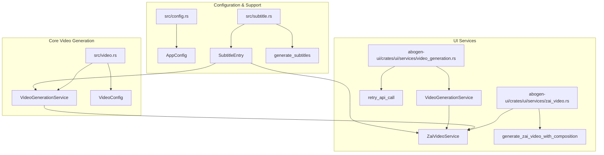
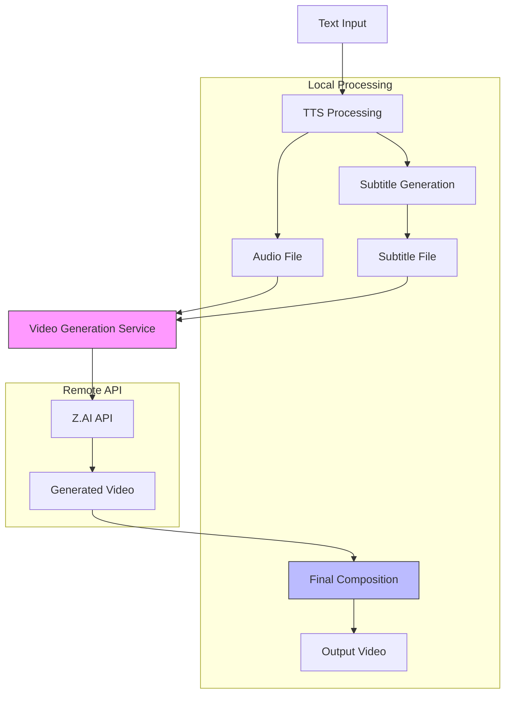
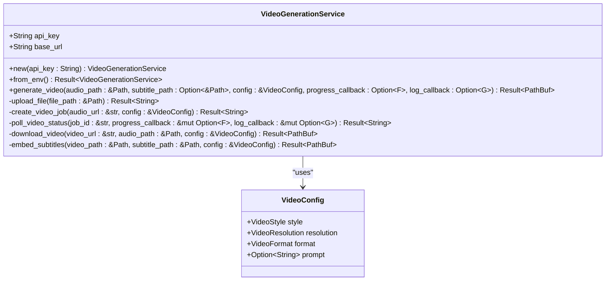
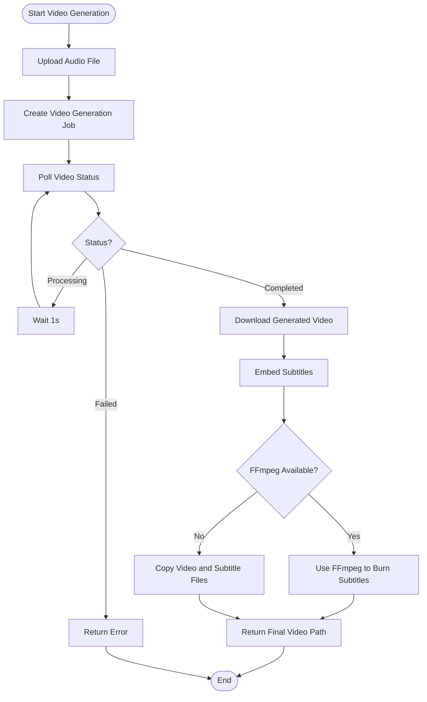
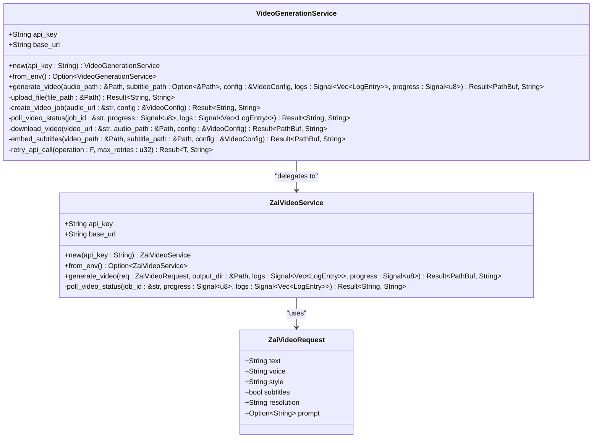
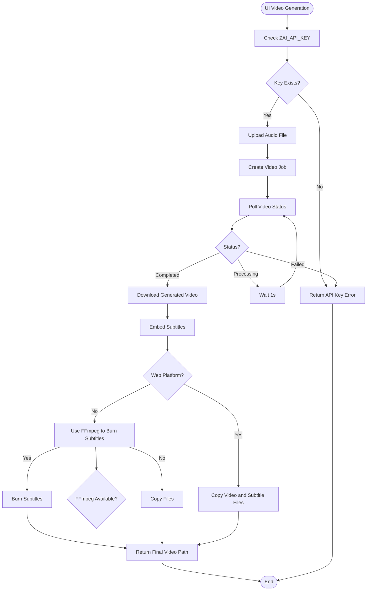
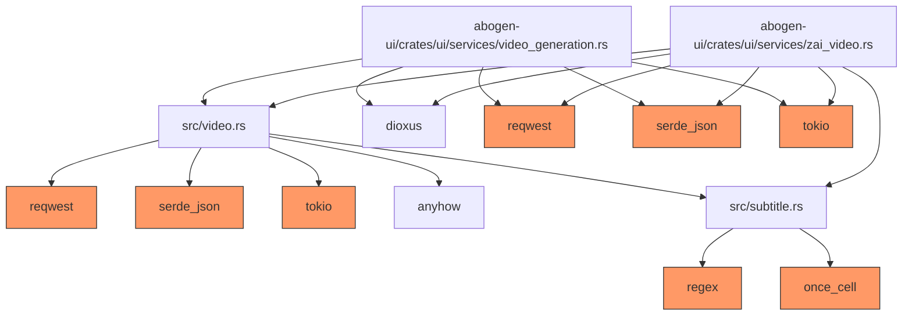

# Video API Integrations

<cite>
**Referenced Files in This Document**   
- [src/video.rs](file://src/video.rs)
- [abogen-ui/crates/ui/services/video_generation.rs](file://abogen-ui/crates/ui/services/video_generation.rs)
- [abogen-ui/crates/ui/services/zai_video.rs](file://abogen-ui/crates/ui/services/zai_video.rs)
- [abogen-ui/VIDEO_INTEGRATION_PLAN.md](file://abogen-ui/VIDEO_INTEGRATION_PLAN.md)
- [abogen-ui/ZAI_VIDEO_FEATURE.md](file://abogen-ui/ZAI_VIDEO_FEATURE.md)
- [VIDEO_CLI_IMPLEMENTATION.md](file://VIDEO_CLI_IMPLEMENTATION.md)
</cite>

## Table of Contents
1. [Introduction](#introduction)
2. [Project Structure](#project-structure)
3. [Core Components](#core-components)
4. [Architecture Overview](#architecture-overview)
5. [Detailed Component Analysis](#detailed-component-analysis)
6. [Dependency Analysis](#dependency-analysis)
7. [Performance Considerations](#performance-considerations)
8. [Troubleshooting Guide](#troubleshooting-guide)
9. [Conclusion](#conclusion)

## Introduction
This document provides comprehensive documentation for the video generation API integrations with Z.AI and OpenAI Sora within the VoxWeave application. The system enables AI-powered video creation from text and audio inputs through a sophisticated pipeline that combines TTS (Text-to-Speech) technology with advanced video generation models. The implementation supports both CLI and GUI interfaces, allowing users to generate videos with synchronized audio, subtitles, and AI-generated visuals in various styles including cyberpunk, biotech, educational, and cinematic. The architecture leverages asynchronous processing, progress tracking, and robust error handling to provide a reliable video generation experience.

## Project Structure
The video generation functionality is organized across multiple components in the VoxWeave codebase, with distinct implementations for different interfaces and use cases. The core video generation logic is shared between the CLI and UI applications, while UI-specific components handle progress updates and user interaction.



**Diagram sources**
- [src/video.rs](file://src/video.rs)
- [abogen-ui/crates/ui/services/video_generation.rs](file://abogen-ui/crates/ui/services/video_generation.rs)
- [abogen-ui/crates/ui/services/zai_video.rs](file://abogen-ui/crates/ui/services/zai_video.rs)
- [src/subtitle.rs](file://src/subtitle.rs)

**Section sources**
- [src/video.rs](file://src/video.rs)
- [abogen-ui/crates/ui/services/video_generation.rs](file://abogen-ui/crates/ui/services/video_generation.rs)
- [abogen-ui/crates/ui/services/zai_video.rs](file://abogen-ui/crates/ui/services/zai_video.rs)

## Core Components
The video generation system consists of several core components that work together to transform text input into fully synchronized video output. The primary component is the `VideoGenerationService` in `src/video.rs`, which handles the complete workflow from audio upload to final video delivery. This service uses the reqwest HTTP client to communicate with the Z.AI API, managing authentication, request construction, and response handling. The service supports configurable parameters including video style, resolution, format, and custom prompts, allowing users to tailor the output to their specific needs. For UI integration, the `video_generation.rs` and `zai_video.rs` services in the abogen-ui crate provide additional functionality for progress tracking and user feedback.

**Section sources**
- [src/video.rs](file://src/video.rs#L1-L461)
- [abogen-ui/crates/ui/services/video_generation.rs](file://abogen-ui/crates/ui/services/video_generation.rs#L1-L488)
- [abogen-ui/crates/ui/services/zai_video.rs](file://abogen-ui/crates/ui/services/zai_video.rs#L1-L357)

## Architecture Overview
The video generation architecture follows a multi-stage pipeline that coordinates between local processing and remote API calls. The system begins with text input that is converted to speech using TTS technology, followed by subtitle generation to ensure synchronization. The audio and subtitle files are then used as inputs for video generation through the Z.AI API, which creates AI-generated visuals synchronized with the narration. The final stage combines the generated video with the original audio and subtitles to produce a complete multimedia output. This architecture supports both the CLI and web/desktop UI interfaces, with shared core functionality and interface-specific adaptations for user experience.



**Diagram sources**
- [src/video.rs](file://src/video.rs)
- [abogen-ui/VIDEO_INTEGRATION_PLAN.md](file://abogen-ui/VIDEO_INTEGRATION_PLAN.md)
- [abogen-ui/ZAI_VIDEO_FEATURE.md](file://abogen-ui/ZAI_VIDEO_FEATURE.md)

## Detailed Component Analysis
The video generation system comprises several interconnected components that handle specific aspects of the video creation pipeline. Each component is designed to be modular and reusable across different interfaces while maintaining a consistent API and behavior.

### Video Generation Service Analysis
The `VideoGenerationService` in `src/video.rs` implements the core functionality for interacting with the Z.AI video generation API. This service handles the complete workflow from file upload to video download, with built-in error handling and progress tracking.

#### For Object-Oriented Components:


**Diagram sources**
- [src/video.rs](file://src/video.rs#L60-L461)

#### For API/Service Components:
```mermaid
sequenceDiagram
participant Client as "Client Application"
participant Service as "VideoGenerationService"
participant API as "Z.AI API"
Client->>Service : generate_video()
Service->>Service : upload_file()
Service->>API : POST /upload
API-->>Service : File URL
Service->>Service : create_video_job()
Service->>API : POST /video/generate
API-->>Service : Job ID
Service->>Service : poll_video_status()
loop Poll every 1s
Service->>API : GET /video/status/{job_id}
API-->>Service : Status & Progress
alt Processing
Service->>Client : Update Progress
else Completed
break
end
end
Service->>Service : download_video()
Service->>API : GET video_url
API-->>Service : Video Data
Service->>Service : embed_subtitles()
Service-->>Client : Final Video Path
```

**Diagram sources**
- [src/video.rs](file://src/video.rs#L100-L300)

#### For Complex Logic Components:


**Diagram sources**
- [src/video.rs](file://src/video.rs#L239-L283)
- [src/video.rs](file://src/video.rs#L345-L380)

**Section sources**
- [src/video.rs](file://src/video.rs#L60-L461)

### UI Service Integration Analysis
The `video_generation.rs` and `zai_video.rs` services in the abogen-ui crate provide the bridge between the core video generation functionality and the user interface. These services handle UI-specific concerns such as progress updates, logging, and error presentation.

#### For Object-Oriented Components:


**Diagram sources**
- [abogen-ui/crates/ui/services/video_generation.rs](file://abogen-ui/crates/ui/services/video_generation.rs#L1-L488)
- [abogen-ui/crates/ui/services/zai_video.rs](file://abogen-ui/crates/ui/services/zai_video.rs#L1-L357)

#### For API/Service Components:
```mermaid
sequenceDiagram
participant UI as "UI Component"
participant Service as "VideoGenerationService"
participant ZaiService as "ZaiVideoService"
participant API as "Z.AI API"
UI->>Service : generate_video()
Service->>Service : upload_file()
Service->>API : POST /upload
API-->>Service : File URL
Service->>ZaiService : generate_video()
ZaiService->>API : POST /video/generate
API-->>ZaiService : Job ID
ZaiService->>ZaiService : poll_video_status()
loop Poll every 5s
ZaiService->>API : GET /video/status/{job_id}
API-->>ZaiService : Status & Progress
ZaiService->>UI : Update Progress (30% → 80%)
alt Processing
ZaiService->>ZaiService : Continue Polling
else Completed
break
end
end
ZaiService->>ZaiService : download_video()
ZaiService->>API : GET video_url
API-->>ZaiService : Video Data
ZaiService->>Service : Return Video Path
Service->>Service : embed_subtitles()
Service->>UI : Update Progress (90%)
Service-->>UI : Final Video Path
```

**Diagram sources**
- [abogen-ui/crates/ui/services/video_generation.rs](file://abogen-ui/crates/ui/services/video_generation.rs#L170-L248)
- [abogen-ui/crates/ui/services/zai_video.rs](file://abogen-ui/crates/ui/services/zai_video.rs#L150-L250)

#### For Complex Logic Components:


**Diagram sources**
- [abogen-ui/crates/ui/services/video_generation.rs](file://abogen-ui/crates/ui/services/video_generation.rs#L247-L277)
- [abogen-ui/crates/ui/services/zai_video.rs](file://abogen-ui/crates/ui/services/zai_video.rs#L200-L250)

**Section sources**
- [abogen-ui/crates/ui/services/video_generation.rs](file://abogen-ui/crates/ui/services/video_generation.rs#L1-L488)
- [abogen-ui/crates/ui/services/zai_video.rs](file://abogen-ui/crates/ui/services/zai_video.rs#L1-L357)

## Dependency Analysis
The video generation system has a well-defined dependency structure that separates concerns between core functionality, UI integration, and external services. The primary dependencies include the reqwest HTTP client for API communication, serde for JSON serialization, and tokio for asynchronous operations. The system also depends on external tools like FFmpeg for subtitle embedding when available. The architecture follows a layered approach where higher-level components depend on lower-level services, but not vice versa, ensuring maintainability and testability.



**Diagram sources**
- [Cargo.toml](file://Cargo.toml)
- [src/video.rs](file://src/video.rs)
- [abogen-ui/crates/ui/services/video_generation.rs](file://abogen-ui/crates/ui/services/video_generation.rs)
- [abogen-ui/crates/ui/services/zai_video.rs](file://abogen-ui/crates/ui/services/zai_video.rs)

## Performance Considerations
The video generation system is designed with performance and reliability in mind, incorporating several optimizations to handle the inherent latency of remote API calls. The system uses asynchronous processing throughout, allowing non-blocking operations and efficient resource utilization. For API communication, the implementation includes retry logic with exponential backoff to handle transient failures and rate limiting. The polling mechanism for video generation status is optimized with a 1-second interval, balancing responsiveness with API call frequency. For large video outputs, the system streams data directly to disk rather than loading it entirely into memory, reducing memory pressure. The timeout for video generation is set to 5 minutes, providing sufficient time for most generation tasks while preventing indefinite waits.

## Troubleshooting Guide
This section provides guidance for diagnosing and resolving common issues encountered when using the video generation API integrations.

**Section sources**
- [VIDEO_CLI_IMPLEMENTATION.md](file://VIDEO_CLI_IMPLEMENTATION.md)
- [abogen-ui/ZAI_VIDEO_FEATURE.md](file://abogen-ui/ZAI_VIDEO_FEATURE.md)

### Common Issues and Solutions

#### Invalid API Keys
**Symptom**: "ZAI_API_KEY environment variable not set" or "OPENAI_API_KEY environment variable not set"
**Solution**: 
1. Set the appropriate environment variable:
   ```bash
   export ZAI_API_KEY=your_api_key_here
   ```
   or
   ```bash
   export OPENAI_API_KEY=your_api_key_here
   ```
2. Verify the key is set:
   ```bash
   echo $ZAI_API_KEY
   ```
3. Ensure the key has the necessary permissions for video generation.

#### Unsupported Resolutions
**Symptom**: API returns error indicating unsupported resolution
**Solution**:
1. Use one of the supported resolutions: 720p, 1080p, or 4k
2. Verify the resolution parameter format (lowercase, no spaces)
3. Check the API documentation for any changes to supported resolutions

#### Network Timeouts
**Symptom**: "Video generation timeout (5 minutes exceeded)" or connection errors
**Solution**:
1. Check internet connectivity
2. Verify API endpoint is reachable:
   ```bash
   curl -v https://api.z.ai/v1
   ```
3. If behind a firewall or proxy, configure appropriate network settings
4. For slow connections, consider using lower resolution videos

#### FFmpeg Not Available
**Symptom**: Subtitle embedding fails with "ffmpeg failed" message
**Solution**:
1. Install FFmpeg:
   - macOS: `brew install ffmpeg`
   - Ubuntu: `sudo apt-get install ffmpeg`
   - Windows: Download from https://ffmpeg.org/
2. Verify installation:
   ```bash
   ffmpeg -version
   ```
3. If FFmpeg cannot be installed, the system will fall back to providing subtitles as a separate .srt file

#### Rate Limiting
**Symptom**: API returns 429 Too Many Requests error
**Solution**:
1. Implement appropriate delays between requests
2. Use exponential backoff in automated scripts
3. Check your API usage quota in the Z.AI dashboard
4. Consider batching requests when possible

#### Invalid Prompts
**Symptom**: API returns error about invalid or inappropriate content
**Solution**:
1. Review the prompt for any prohibited content
2. Simplify complex prompts
3. Check for proper formatting and encoding
4. Refer to the API documentation for prompt guidelines

## Conclusion
The video generation API integrations with Z.AI and OpenAI Sora in VoxWeave provide a powerful and flexible system for creating AI-generated videos from text and audio inputs. The architecture successfully combines local processing with remote API calls to deliver a seamless user experience across both CLI and UI interfaces. The implementation demonstrates robust error handling, progress tracking, and configuration options that allow users to customize their video output. By leveraging asynchronous processing and efficient resource management, the system handles the inherent latency of video generation while maintaining responsiveness. The modular design enables easy maintenance and future enhancements, such as support for additional video generation APIs or local video generation capabilities. Overall, this integration transforms VoxWeave from a text-to-speech tool into a comprehensive text-to-video content creation platform.