# Contributing Process

<cite>
**Referenced Files in This Document**   
- [build.sh](file://build.sh)
- [verify.sh](file://verify.sh)
- [Cargo.toml](file://Cargo.toml)
- [src/coqui_tts.rs](file://src/coqui_tts.rs)
- [src/tts.rs](file://src/tts.rs)
- [abogen-ui/Cargo.toml](file://abogen-ui/Cargo.toml)
- [abogen-ui/crates/ui/lib.rs](file://abogen-ui/crates/ui/lib.rs)
- [abogen-ui/crates/ui/state.rs](file://abogen-ui/crates/ui/state.rs)
- [abogen-ui/crates/ui/services/tts_service.rs](file://abogen-ui/crates/ui/services/tts_service.rs)
- [abogen-ui/crates/ui/components/combo.rs](file://abogen-ui/crates/ui/components/combo.rs)
- [abogen-ui/crates/ui/services/gpu_probe.rs](file://abogen-ui/crates/ui/services/gpu_probe.rs)
- [abogen-ui/README.md](file://abogen-ui/README.md)
- [COQUI_USAGE_GUIDE.md](file://COQUI_USAGE_GUIDE.md)
- [FIXES_APPLIED.md](file://FIXES_APPLIED.md)
- [IMPLEMENTATION_SUMMARY.md](file://IMPLEMENTATION_SUMMARY.md)
</cite>

## Table of Contents
1. [Contribution Workflow](#contribution-workflow)
2. [Development Environment Setup](#development-environment-setup)
3. [Build and Verification Process](#build-and-verification-process)
4. [Feature Flag System](#feature-flag-system)
5. [Debugging Techniques](#debugging-techniques)
6. [Release Procedures](#release-procedures)
7. [Common Contribution Scenarios](#common-contribution-scenarios)
8. [Cross-Platform Development Challenges](#cross-platform-development-challenges)

## Contribution Workflow

The contribution workflow for the VoxWeave project follows a standard open-source process from forking to pull request. Contributors should begin by forking the repository on GitHub, creating a new branch for their feature or bug fix, and submitting changes through a pull request for review.

Branch naming conventions follow the pattern `feature/descriptive-name` for new features and `fix/descriptive-name` for bug fixes. This ensures clear identification of the branch purpose and maintains consistency across the codebase. Commit messages should follow conventional commit format: `type(scope): description` where type is one of `feat`, `fix`, `docs`, `style`, `refactor`, `test`, or `chore`, and scope describes the affected component.

Code review expectations include comprehensive testing, adherence to coding standards, and documentation of significant changes. All pull requests must pass the continuous integration pipeline, which includes build verification, unit tests, and quality checks. Reviewers will evaluate code quality, performance implications, and alignment with project architecture before approving changes.

**Section sources**
- [abogen-ui/README.md](file://abogen-ui/README.md#L56-L84)
- [FIXES_APPLIED.md](file://FIXES_APPLIED.md#L533-L546)

## Development Environment Setup

Setting up the development environment for VoxWeave requires installing the Rust toolchain, Python dependencies, and system libraries. The project uses Rust 2021 edition with Cargo for package management. Install the latest stable Rust toolchain using rustup:

```bash
curl --proto '=https' --tlsv1.2 -sSf https://sh.rustup.rs | sh
```

Python 3.9+ is required for neural TTS functionality, particularly for the Kokoro and Coqui-TTS engines. Install the required Python packages:

```bash
pip install TTS torch
```

System libraries vary by platform. On Linux, ensure espeak-ng is installed for basic TTS functionality. The abogen-ui component requires Dioxus 0.7 and its dependencies for the multi-target UI application. Install Node.js and Trunk for web target development:

```bash
cargo install trunk
```

The project structure is organized into multiple components: the core Rust library in the root directory, the abogen-ui workspace for the user interface, and supporting scripts in the python directory. The abogen-ui workspace contains shared UI components and platform-specific launchers for desktop, web, and mobile targets.

**Section sources**
- [abogen-ui/README.md](file://abogen-ui/README.md#L56-L84)
- [FIXES_APPLIED.md](file://FIXES_APPLIED.md#L533-L546)
- [COQUI_USAGE_GUIDE.md](file://COQUI_USAGE_GUIDE.md#L433-L487)

## Build and Verification Process

The build and verification process for VoxWeave is automated through shell scripts that handle compilation and quality checks. The `build.sh` script compiles the project in release mode and runs unit tests to ensure code integrity:

```bash
#!/bin/bash
set -e

echo "Building voxweave project..."
cargo build --release

echo "Build complete! Testing..."
cargo test

echo "All tests passed!"
```

The `verify.sh` script performs comprehensive verification including build compilation, unit tests, CLI interface validation, voice listing, and text conversion in mock mode. This script serves as the final verification test before deployment:

```mermaid
flowchart TD
Start([Start Verification]) --> BuildTest["Test 1: Build project"]
BuildTest --> BuildSuccess{Build Success?}
BuildSuccess --> |Yes| UnitTest["Test 2: Run unit tests"]
BuildSuccess --> |No| ExitFail1[Exit: Build Failed]
UnitTest --> TestSuccess{Tests Passed?}
TestSuccess --> |Yes| CLITest["Test 3: CLI help command"]
TestSuccess --> |No| ExitFail2[Exit: Tests Failed]
CLITest --> CLIResult{CLI Available?}
CLIResult --> |Yes| VoicesTest["Test 4: List voices command"]
CLIResult --> |No| ExitFail3[Exit: CLI Failed]
VoicesTest --> VoicesResult{Voices Found?}
VoicesResult --> |Yes| ConvertTest["Test 5: Convert command (mock mode)"]
VoicesResult --> |No| ExitFail4[Exit: Voices Failed]
ConvertTest --> ConvertResult{Conversion Success?}
ConvertResult --> |Yes| EndSuccess[🎉 ALL TESTS PASSED!]
ConvertResult --> |No| ExitFail5[Exit: Conversion Failed]
```



**Diagram sources**
- [build.sh](file://build.sh#L0-L19)
- [verify.sh](file://verify.sh#L0-L140)

**Section sources**
- [build.sh](file://build.sh#L0-L19)
- [verify.sh](file://verify.sh#L0-L140)

## Feature Flag System

The feature flag system in Cargo.toml enables optional functionality like coqui-tts and video-generation, allowing contributors to add new features without breaking existing functionality. The core Cargo.toml defines features that can be selectively enabled:

```toml
[features]
default = []
coqui-tts = []
video-generation = ["tokio", "reqwest"]
```

The `coqui-tts` feature enables neural text-to-speech capabilities using the Coqui-TTS engine, while `video-generation` enables video creation functionality with dependencies on tokio and reqwest for asynchronous operations and HTTP requests. These features are conditionally compiled using Rust's cfg attributes, ensuring that code is only included when the corresponding feature is enabled.

In the abogen-ui workspace, additional features are defined for platform-specific functionality. The gpu feature enables GPU acceleration detection, while real-tts enables actual TTS processing instead of mock mode. This modular approach allows the application to adapt to different deployment scenarios and hardware capabilities.

When adding new features, contributors should follow these guidelines:
1. Define the feature in Cargo.toml with appropriate dependencies
2. Use cfg attributes to conditionally compile code
3. Provide fallback behavior when the feature is disabled
4. Document the feature in the README and usage guides
5. Add tests that verify both enabled and disabled states

**Section sources**
- [Cargo.toml](file://Cargo.toml#L20-L26)
- [abogen-ui/crates/ui/services/gpu_probe.rs](file://abogen-ui/crates/ui/services/gpu_probe.rs#L0-L24)
- [abogen-ui/crates/ui/services/tts_service.rs](file://abogen-ui/crates/ui/services/tts_service.rs#L0-L540)

## Debugging Techniques

Debugging techniques for VoxWeave include logging, breakpoints, and runtime inspection. The application uses structured logging through the log crate, with log entries categorized by severity level (Info, Notice, Error). The LogPanel component displays processing logs with color-coded entries based on log level:

```rust
impl LogLevel {
    fn class_name(&self) -> &'static str {
        match self {
            LogLevel::Info => "info",
            LogLevel::Notice => "notice",
            LogLevel::Error => "error",
        }
    }
}
```

Breakpoints can be set in both Rust and Python code. For Rust code, use the debugger in your IDE or cargo debug with a compatible debugger. For Python code, particularly in the kokoro_bridge.py script, use standard Python debugging techniques.

Runtime inspection is facilitated through the application state management system. The AppState struct contains signals for all UI state, allowing developers to inspect and modify state during runtime. The processing pipeline includes progress tracking and detailed logging of each processing step, making it easier to identify bottlenecks or failures.

For TTS engine debugging, environment variables can be used to configure behavior:
- VOXWEAVE_COQUI_DEVICE: Set to "cpu", "cuda", or "mps" for device selection
- VOXWEAVE_COQUI_PYTHON: Specify the Python command to use
- VOXWEAVE_COQUI_MODEL: Override the default TTS model

**Section sources**
- [abogen-ui/crates/ui/components/log_panel.rs](file://abogen-ui/crates/ui/components/log_panel.rs#L0-L41)
- [abogen-ui/crates/ui/state.rs](file://abogen-ui/crates/ui/state.rs#L230-L255)
- [src/coqui_tts.rs](file://src/coqui_tts.rs#L0-L40)

## Release Procedures

Release procedures for VoxWeave include versioning, changelog updates, and cargo publish workflows. The project follows semantic versioning with MAJOR.MINOR.PATCH format, where MAJOR versions indicate breaking changes, MINOR versions add functionality in a backward-compatible manner, and PATCH versions contain backward-compatible bug fixes.

Before releasing, update the changelog with a summary of changes, including new features, bug fixes, and breaking changes. The changelog should reference relevant pull requests and issues. Update the version in Cargo.toml and any other configuration files that contain version information.

The release workflow involves several steps:
1. Create a release branch from main
2. Update version and changelog
3. Run the verification script to ensure all tests pass
4. Create a release tag in Git
5. Publish to crates.io using cargo publish
6. Create a GitHub release with release notes

For the abogen-ui component, additional steps include building the web target with Trunk and packaging desktop and mobile applications. The release should include binaries for supported platforms when applicable.

**Section sources**
- [Cargo.toml](file://Cargo.toml#L2-L7)
- [verify.sh](file://verify.sh#L0-L140)
- [IMPLEMENTATION_SUMMARY.md](file://IMPLEMENTATION_SUMMARY.md#L615-L626)

## Common Contribution Scenarios

### Adding a New Voice Style
To add a new voice style, modify the voice profile definitions in the TTS system. For Kokoro voices, add the voice ID to the KOKORO_VOICES array in src/tts.rs and ensure the corresponding voice data is available. For Coqui-TTS voices, no code changes are needed as it supports dynamic voice loading. Update the UI voice selection component to include the new voice:

```rust
const VOICE_OPTIONS: &[&str] = &[
    // Existing voices...
    "new_voice_id",
];
```

### Implementing a TTS Engine
To implement a new TTS engine, create a struct that implements the SpeechEngine trait. The implementation must provide a synthesize_to_file method that converts text to audio. Add a new VoiceEngine enum variant and update the voice profile system to support the new engine. Register the engine in the default_voice_profiles function and ensure it can be selected through the UI.

### Enhancing the UI with a New Component
To enhance the UI with a new component, create a new file in the abogen-ui/crates/ui/components directory. Use the Dioxus component macro to define the component, following the existing patterns for styling and state management. Import the component in lib.rs and use it in the appropriate screen. Ensure the component follows the cyberpunk styling theme and is responsive across all target platforms.

**Section sources**
- [src/tts.rs](file://src/tts.rs#L0-L522)
- [abogen-ui/crates/ui/lib.rs](file://abogen-ui/crates/ui/lib.rs#L154-L200)
- [abogen-ui/crates/ui/components/combo.rs](file://abogen-ui/crates/ui/components/combo.rs#L0-L32)

## Cross-Platform Development Challenges

Cross-platform development for the multi-target UI application presents several challenges. The abogen-ui component targets desktop, web, and mobile platforms using Dioxus, which requires careful consideration of platform-specific differences.

One challenge is file system access, which varies significantly between platforms. The web platform has limited file system access compared to desktop and mobile. The file_picker service handles this by providing different implementations for web and native platforms:

```rust
#[cfg(target_arch = "wasm32")]
pub mod web {
    pub fn open_file_picker(_on_select: impl Fn(Option<FileInfo>) + 'static) {
        log::warn!("Web file picker not yet implemented");
    }
}

#[cfg(not(target_arch = "wasm32"))]
pub mod native {
    pub fn open_file_picker(_on_select: impl Fn(Option<FileInfo>) + 'static) {
        log::warn!("Native file picker not yet implemented");
    }
}
```

Another challenge is GPU acceleration detection, which must be handled differently on each platform. The gpu_probe service uses feature flags to enable or disable GPU detection based on the target platform.

Differences in threading models and asynchronous operations also present challenges. The application uses tokio for asynchronous operations, but the web platform has limitations on certain operations. The codebase uses conditional compilation to handle these differences, ensuring that the application runs correctly on all target platforms.

**Section sources**
- [abogen-ui/crates/ui/services/file_picker.rs](file://abogen-ui/crates/ui/services/file_picker.rs#L0-L34)
- [abogen-ui/crates/ui/services/gpu_probe.rs](file://abogen-ui/crates/ui/services/gpu_probe.rs#L0-L24)
- [abogen-ui/crates/ui/services/tts_service.rs](file://abogen-ui/crates/ui/services/tts_service.rs#L0-L540)