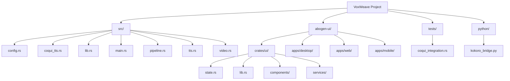
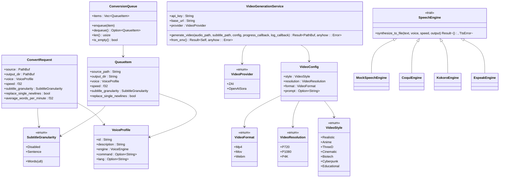
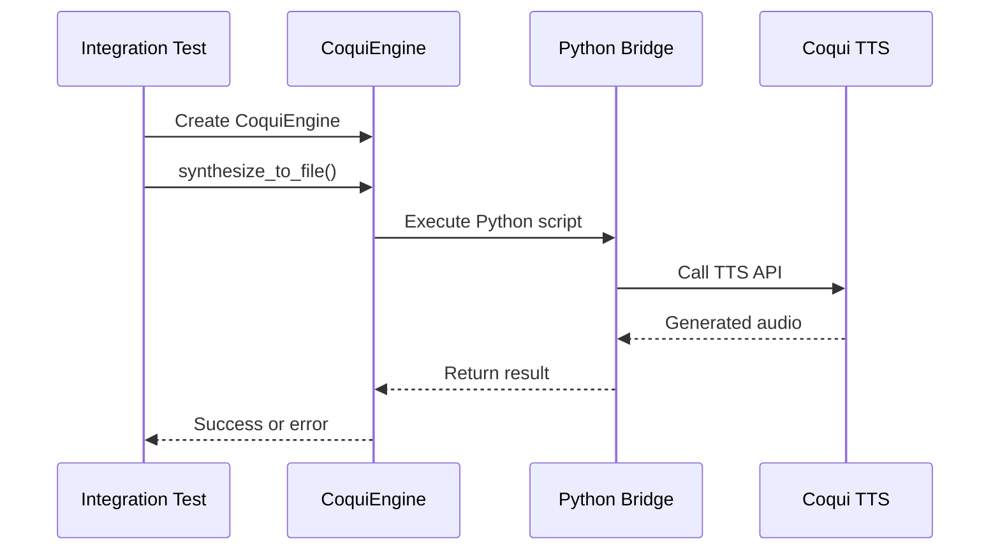
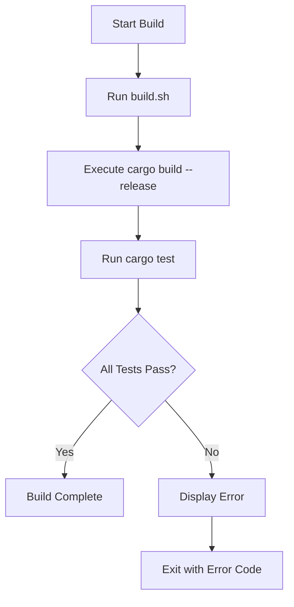
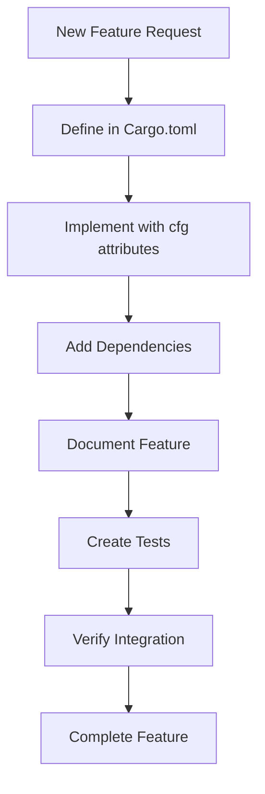
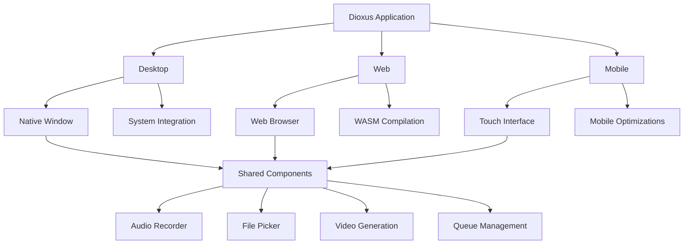

# Development Guide

<cite>
**Referenced Files in This Document**   
- [src/lib.rs](file://src/lib.rs)
- [src/main.rs](file://src/main.rs)
- [src/coqui_tts.rs](file://src/coqui_tts.rs)
- [src/tts.rs](file://src/tts.rs)
- [src/video.rs](file://src/video.rs)
- [src/pipeline.rs](file://src/pipeline.rs)
- [src/queue.rs](file://src/queue.rs)
- [abogen-ui/crates/ui/state.rs](file://abogen-ui/crates/ui/state.rs)
- [abogen-ui/crates/ui/lib.rs](file://abogen-ui/crates/ui/lib.rs)
- [tests/coqui_integration.rs](file://tests/coqui_integration.rs)
- [Cargo.toml](file://Cargo.toml)
- [build.sh](file://build.sh)
</cite>

## Table of Contents
1. [Project Structure](#project-structure)
2. [Core Components](#core-components)
3. [Testing Strategy](#testing-strategy)
4. [Contribution Guidelines](#contribution-guidelines)
5. [Build and Release Process](#build-and-release-process)
6. [Feature Flag System](#feature-flag-system)
7. [Development Environment Setup](#development-environment-setup)
8. [Debugging Techniques](#debugging-techniques)
9. [Cross-Platform Development](#cross-platform-development)
10. [Common Development Tasks](#common-development-tasks)

## Project Structure

The VoxWeave repository follows a modular structure with three main directories: `src/` for core logic, `abogen-ui/` for the Dioxus application, and `tests/` for verification. The project uses a Cargo workspace for managing multiple applications and libraries.

**Diagram sources**
- [src/lib.rs](file://src/lib.rs#L1-L14)
- [abogen-ui/Cargo.toml](file://abogen-ui/Cargo.toml#L1-L25)
- [Cargo.toml](file://Cargo.toml#L1-L27)

**Section sources**
- [src/lib.rs](file://src/lib.rs#L1-L14)
- [abogen-ui/Cargo.toml](file://abogen-ui/Cargo.toml#L1-L25)

## Core Components

The VoxWeave codebase consists of several core components that work together to provide text-to-speech and video generation functionality. The architecture is modular, with clear separation between different concerns.

**Diagram sources**
- [src/tts.rs](file://src/tts.rs#L1-L523)
- [src/pipeline.rs](file://src/pipeline.rs#L1-L140)
- [src/video.rs](file://src/video.rs#L1-L463)
- [src/queue.rs](file://src/queue.rs#L1-L155)

**Section sources**
- [src/lib.rs](file://src/lib.rs#L1-L14)
- [src/main.rs](file://src/main.rs#L1-L418)

## Testing Strategy

VoxWeave employs a comprehensive testing strategy with both unit tests and integration tests. The testing framework uses Rust's built-in test system with additional tools for integration testing.

### Unit Tests

Unit tests are located in the `state.rs` file within the abogen-ui crate. These tests focus on the state management of the Dioxus application, ensuring that the UI state behaves correctly under various conditions.

### Integration Tests

Integration tests are located in `coqui_integration.rs` within the tests directory. These tests verify the integration between VoxWeave and the Coqui TTS system, ensuring that the text-to-speech functionality works correctly when all components are connected.

**Diagram sources**
- [tests/coqui_integration.rs](file://tests/coqui_integration.rs#L1-L197)
- [src/coqui_tts.rs](file://src/coqui_tts.rs#L1-L116)

**Section sources**
- [tests/coqui_integration.rs](file://tests/coqui_integration.rs#L1-L197)
- [src/coqui_tts.rs](file://src/coqui_tts.rs#L1-L116)

## Contribution Guidelines

Contributors to the VoxWeave project should follow these guidelines to ensure consistency and maintainability of the codebase.

### Code Style

- Follow Rust's official style guide (rustfmt)
- Use descriptive variable and function names
- Keep functions focused and small
- Add documentation comments for public APIs
- Use meaningful test names

### Commit Conventions

- Use imperative mood in commit messages ("Fix bug" not "Fixed bug")
- Limit commit message subject line to 50 characters
- Use body of commit message to explain what and why
- Reference issues with #issue-number
- Group related changes in a single commit

### Pull Request Procedures

1. Fork the repository
2. Create a feature branch from main
3. Implement your changes with appropriate tests
4. Ensure all tests pass
5. Push your branch and create a pull request
6. Address any feedback from reviewers
7. Merge after approval

**Section sources**
- [src/lib.rs](file://src/lib.rs#L1-L14)
- [src/main.rs](file://src/main.rs#L1-L418)
- [abogen-ui/crates/ui/lib.rs](file://abogen-ui/crates/ui/lib.rs#L1-L640)

## Build and Release Process

The build and release process for VoxWeave is automated through scripts and Cargo workflows.

### Building the Project

The project can be built using the provided `build.sh` script or directly with Cargo commands. The build process compiles the project in release mode and runs all tests.

### Release Workflows

The release process uses Cargo's release features with appropriate feature flags. Releases are versioned using semantic versioning and published to crates.io.

**Section sources**
- [build.sh](file://build.sh#L1-L21)
- [Cargo.toml](file://Cargo.toml#L1-L27)

## Feature Flag System

VoxWeave uses Cargo feature flags to enable optional functionality without affecting the core codebase. This allows users to build only the components they need.

### Available Features

- `coqui-tts`: Enables Coqui TTS integration
- `video-generation`: Enables video generation capabilities with async support
- `default`: Empty feature that can be used to disable default features

### Adding New Features

When adding new features, follow these steps:

1. Define the feature in Cargo.toml
2. Use #[cfg(feature = "feature-name")] attributes to conditionally compile code
3. Ensure the feature has appropriate dependencies
4. Add documentation for the feature
5. Create tests that verify the feature works correctly

**Diagram sources**
- [Cargo.toml](file://Cargo.toml#L1-L27)
- [src/lib.rs](file://src/lib.rs#L1-L14)
- [src/main.rs](file://src/main.rs#L1-L418)

**Section sources**
- [Cargo.toml](file://Cargo.toml#L1-L27)
- [src/lib.rs](file://src/lib.rs#L1-L14)

## Development Environment Setup

To set up a development environment for VoxWeave, follow these steps:

1. Install Rust and Cargo
2. Install Python 3.7+ for Coqui TTS integration
3. Install espeak for basic TTS functionality
4. Set up environment variables for API keys
5. Install Node.js and Trunk for the web UI

Required environment variables:
- `ZAI_API_KEY`: For Z.AI video generation
- `OPENAI_API_KEY`: For OpenAI Sora video generation
- `VOXWEAVE_COQUI_PYTHON`: Python command for Coqui TTS
- `VOXWEAVE_KOKORO_PYTHON`: Python command for Kokoro TTS

**Section sources**
- [Cargo.toml](file://Cargo.toml#L1-L27)
- [src/coqui_tts.rs](file://src/coqui_tts.rs#L1-L116)
- [src/tts.rs](file://src/tts.rs#L1-L523)

## Debugging Techniques

Effective debugging in VoxWeave involves several techniques and tools:

### Logging

The application uses structured logging with different log levels (Info, Notice, Warning, Error). Logs are displayed in the UI and can be accessed programmatically.

### Error Handling

VoxWeave uses the `anyhow` and `thiserror` crates for comprehensive error handling. Errors are propagated through the call stack and presented to users in a user-friendly format.

### Debugging Tools

- Use `RUST_BACKTRACE=1` for detailed error traces
- Use `cargo test -- --nocapture` to see test output
- Use browser developer tools for the web UI
- Use `tokio-console` for async debugging

**Section sources**
- [src/video.rs](file://src/video.rs#L1-L463)
- [src/tts.rs](file://src/tts.rs#L1-L523)
- [abogen-ui/crates/ui/state.rs](file://abogen-ui/crates/ui/state.rs#L1-L256)

## Cross-Platform Development

The abogen-ui application is built with Dioxus, enabling cross-platform development for desktop, web, and mobile platforms.

### Platform-Specific Considerations

- **Desktop**: Uses native file dialogs and system tray integration
- **Web**: Limited file system access, uses WebAssembly
- **Mobile**: Touch interface optimization, battery efficiency

### UI Components

The UI components are designed to be responsive and adapt to different screen sizes and input methods.

**Diagram sources**
- [abogen-ui/Cargo.toml](file://abogen-ui/Cargo.toml#L1-L25)
- [abogen-ui/crates/ui/lib.rs](file://abogen-ui/crates/ui/lib.rs#L1-L640)

**Section sources**
- [abogen-ui/Cargo.toml](file://abogen-ui/Cargo.toml#L1-L25)
- [abogen-ui/crates/ui/lib.rs](file://abogen-ui/crates/ui/lib.rs#L1-L640)

## Common Development Tasks

### Adding a New TTS Engine

To add a new TTS engine:

1. Implement the `SpeechEngine` trait
2. Add the engine to the `VoiceEngine` enum
3. Create voice profiles for the new engine
4. Update the main application to support the new engine
5. Add tests for the new engine

### Adding a New Video Style

To add a new video style:

1. Add the style to the `VideoStyle` enum
2. Update the UI to include the new style option
3. Modify the video generation service to handle the new style
4. Add documentation for the new style
5. Test the new style with various inputs

**Section sources**
- [src/tts.rs](file://src/tts.rs#L1-L523)
- [src/video.rs](file://src/video.rs#L1-L463)
- [abogen-ui/crates/ui/state.rs](file://abogen-ui/crates/ui/state.rs#L1-L256)
- [abogen-ui/crates/ui/lib.rs](file://abogen-ui/crates/ui/lib.rs#L1-L640)