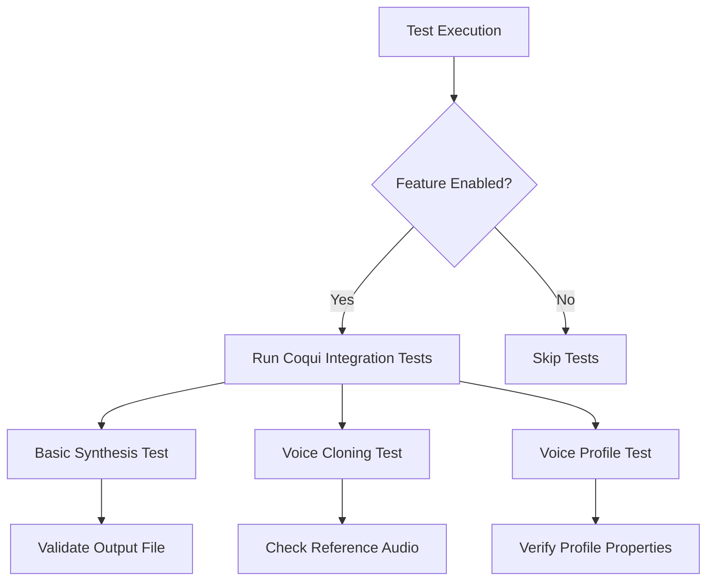
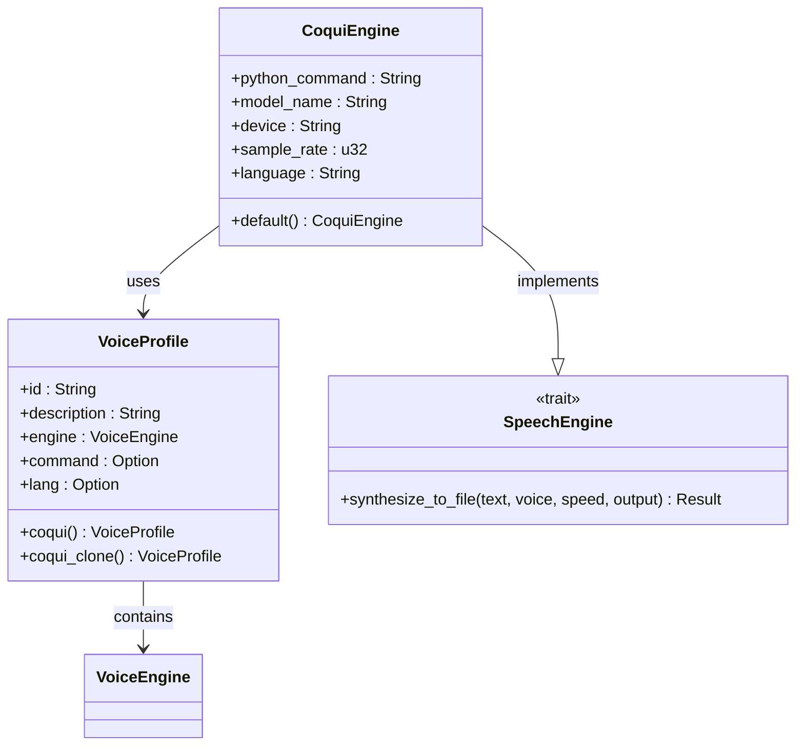
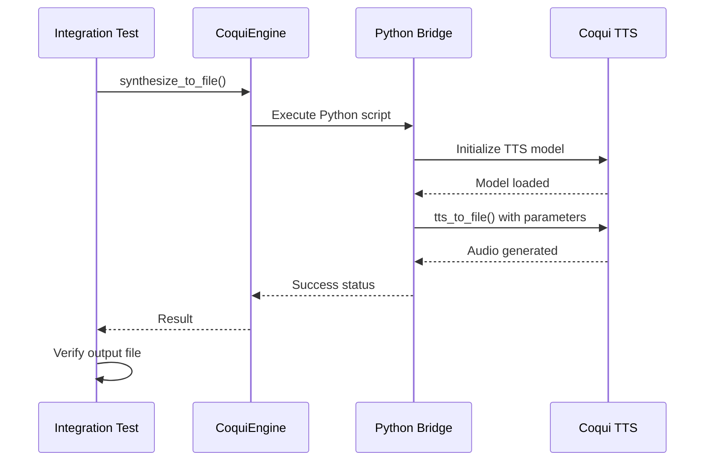
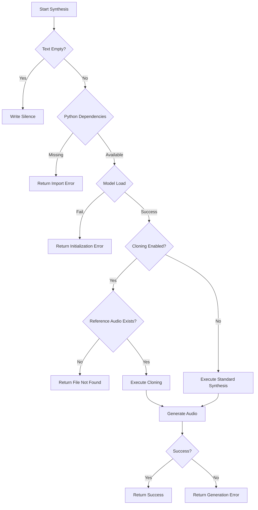

# Integration Testing

<cite>
**Referenced Files in This Document**   
- [coqui_integration.rs](file://tests/coqui_integration.rs)
- [coqui_tts.rs](file://src/coqui_tts.rs)
- [tts.rs](file://src/tts.rs)
- [pipeline.rs](file://src/pipeline.rs)
- [COQUI_TTS_IMPLEMENTATION.md](file://COQUI_TTS_IMPLEMENTATION.md)
- [COQUI_USAGE_GUIDE.md](file://COQUI_USAGE_GUIDE.md)
</cite>

## Table of Contents
1. [Introduction](#introduction)
2. [Test Implementation Overview](#test-implementation-overview)
3. [Core Test Components](#core-test-components)
4. [Test Fixture Setup](#test-fixture-setup)
5. [End-to-End Workflow Validation](#end-to-end-workflow-validation)
6. [Error Handling and Edge Cases](#error-handling-and-edge-cases)
7. [Extending the Test Suite](#extending-the-test-suite)
8. [Performance Benchmarking](#performance-benchmarking)
9. [Conclusion](#conclusion)

## Introduction
This document provides comprehensive documentation for the integration testing framework in VoxWeave, focusing on end-to-end validation of the CoquiTTS pipeline. The integration tests verify the complete text-to-speech workflow from text input through audio generation, ensuring proper interaction between core components such as text preprocessing, voice cloning, and audio output generation. The tests are designed to validate functionality when the CoquiTTS feature is enabled via the `--features coqui-tts` flag.

## Test Implementation Overview

The integration testing framework for CoquiTTS is implemented in the `tests/coqui_integration.rs` file and follows Rust's standard testing conventions with feature gating. The tests are conditionally compiled only when both the test configuration and the `coqui-tts` feature are enabled, ensuring that tests only run when the necessary dependencies are available.

**Diagram sources**
- [coqui_integration.rs](file://tests/coqui_integration.rs#L1-L196)

**Section sources**
- [coqui_integration.rs](file://tests/coqui_integration.rs#L1-L196)

## Core Test Components

The integration test suite consists of three primary test functions that validate different aspects of the CoquiTTS pipeline. These tests verify the basic synthesis functionality, voice cloning capabilities, and proper creation of voice profiles.

### Basic Synthesis Test
The `test_coqui_basic_synthesis` function validates the fundamental text-to-speech conversion process. It creates a CoquiEngine instance, configures a voice profile, and synthesizes a test phrase to a WAV file in a temporary directory. The test verifies that the output file exists and contains data.

### Voice Cloning Test
The `test_coqui_voice_cloning` function tests the voice cloning functionality by creating a voice profile with a reference audio file. The test checks for the existence of the reference audio before proceeding, allowing it to gracefully skip when test assets are unavailable.

### Voice Profile Validation
The `test_voice_profile_creation` function verifies that voice profiles are correctly instantiated with appropriate properties, including engine type, language settings, and command parameters.

**Diagram sources**
- [coqui_tts.rs](file://src/coqui_tts.rs#L1-L115)
- [tts.rs](file://src/tts.rs#L1-L522)

**Section sources**
- [coqui_integration.rs](file://tests/coqui_integration.rs#L1-L196)
- [coqui_tts.rs](file://src/coqui_tts.rs#L1-L115)
- [tts.rs](file://src/tts.rs#L1-L522)

## Test Fixture Setup

The integration tests employ proper fixture management using Rust's `tempfile` crate to create temporary directories for generated assets. This approach ensures test isolation and automatic cleanup of test artifacts.

### Temporary Directory Management
Each test creates a temporary directory using `tempdir().unwrap()` to store generated audio files. This prevents file system pollution and allows parallel test execution without conflicts.

### Test Data Configuration
The tests use predefined text inputs and voice configurations to validate the synthesis pipeline. The basic synthesis test uses a simple English phrase, while voice cloning tests are configured with placeholder paths that can be replaced with actual reference audio.

### Environment Configuration
The CoquiEngine respects several environment variables for configuration, which can be set before test execution:
- `VOXWEAVE_COQUI_PYTHON`: Python command (default: python3)
- `VOXWEAVE_COQUI_MODEL`: TTS model identifier
- `VOXWEAVE_COQUI_DEVICE`: Execution device (cpu, cuda, mps)
- `VOXWEAVE_COQUI_SAMPLE_RATE`: Audio sample rate
- `VOXWEAVE_COQUI_LANGUAGE`: Default language

**Section sources**
- [coqui_integration.rs](file://tests/coqui_integration.rs#L1-L196)
- [coqui_tts.rs](file://src/coqui_tts.rs#L1-L115)

## End-to-End Workflow Validation

The integration tests validate the complete TTS pipeline by verifying each stage of audio generation, from text input to file output. The tests ensure proper interaction between the CoquiEngine, voice profiles, and the underlying Python TTS system.

### Pipeline Execution Flow

**Diagram sources**
- [coqui_tts.rs](file://src/coqui_tts.rs#L1-L115)
- [tts.rs](file://src/tts.rs#L453-L471)

### Output Verification
The tests implement comprehensive output verification by checking:
- File existence using `output_path.exists()`
- Non-empty file size through metadata inspection
- Proper file format (WAV) through the file extension

The verification process includes error handling that provides diagnostic information when tests fail, including instructions for installing required Python dependencies.

**Section sources**
- [coqui_integration.rs](file://tests/coqui_integration.rs#L1-L196)
- [pipeline.rs](file://src/pipeline.rs#L1-L139)

## Error Handling and Edge Cases

The integration test suite includes robust error handling to manage various edge cases and failure scenarios that may occur during TTS pipeline execution.

### Dependency Management
The tests are marked with `#[ignore]` by default since they require external Python dependencies (TTS, torch, numpy). When these dependencies are missing, the tests provide clear installation instructions through error messages.

### Graceful Degradation
The voice cloning test implements graceful degradation by checking for the existence of reference audio before attempting synthesis. If the reference audio is not found, the test skips rather than failing, allowing the test suite to run in environments without test assets.

### Error Recovery
The CoquiEngine implementation includes comprehensive error handling that captures and reports failures at multiple levels:
- Python dependency import failures
- Command execution errors
- Model initialization issues
- Audio file generation problems

**Diagram sources**
- [coqui_tts.rs](file://src/coqui_tts.rs#L1-L115)
- [tts.rs](file://src/tts.rs#L453-L471)

**Section sources**
- [coqui_integration.rs](file://tests/coqui_integration.rs#L1-L196)
- [coqui_tts.rs](file://src/coqui_tts.rs#L1-L115)

## Extending the Test Suite

The integration test framework is designed to be extensible, allowing for the addition of new test scenarios to cover additional functionality and edge cases.

### Batch Processing Tests
New tests can be added to validate batch processing capabilities by creating multiple conversion requests and verifying that all outputs are generated correctly. This would involve extending the test suite to use the `convert_queue` function from the pipeline module.

### Custom Voice Cloning Workflows
Additional test cases can be implemented to validate custom voice cloning workflows, including:
- Testing with various audio formats and sample rates
- Validating different voice characteristics and emotional tones
- Testing with varying lengths of reference audio

### Configuration Variations
The test suite can be extended to validate different configuration scenarios by setting environment variables before test execution and verifying that the engine respects these settings.

**Section sources**
- [coqui_integration.rs](file://tests/coqui_integration.rs#L1-L196)
- [COQUI_USAGE_GUIDE.md](file://COQUI_USAGE_GUIDE.md#L1-L672)
- [COQUI_TTS_IMPLEMENTATION.md](file://COQUI_TTS_IMPLEMENTATION.md#L1-L152)

## Performance Benchmarking

While the current integration tests focus on functional validation, the framework can be extended to include performance benchmarking of the audio generation pipeline.

### Memory Usage Monitoring
Long-running tests can incorporate memory usage monitoring to identify potential memory leaks or excessive memory consumption during extended TTS operations. This would involve tracking memory allocation before and after synthesis operations.

### Generation Time Measurement
The test suite can be enhanced to measure audio generation times for different text lengths and configurations, providing insights into performance characteristics and potential bottlenecks.

### Resource Utilization
Future extensions could include monitoring of CPU, GPU, and disk I/O utilization during synthesis operations, particularly when testing with different device configurations (CPU, CUDA, MPS).

**Section sources**
- [coqui_integration.rs](file://tests/coqui_integration.rs#L1-L196)
- [coqui_tts.rs](file://src/coqui_tts.rs#L1-L115)

## Conclusion
The integration testing framework for VoxWeave's CoquiTTS implementation provides comprehensive validation of the end-to-end text-to-speech pipeline. By leveraging temporary directories for asset management, implementing robust error handling, and verifying output files, the tests ensure reliable functionality of the TTS system. The framework is designed to be extensible, allowing for the addition of new test scenarios and performance benchmarking capabilities. With proper feature flag management and dependency handling, the integration tests provide a solid foundation for maintaining the quality and reliability of the CoquiTTS implementation in VoxWeave.