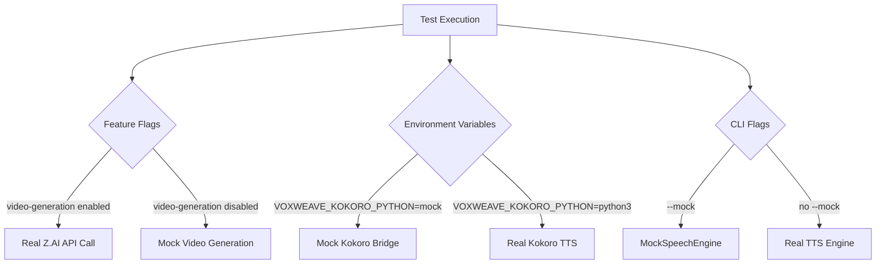
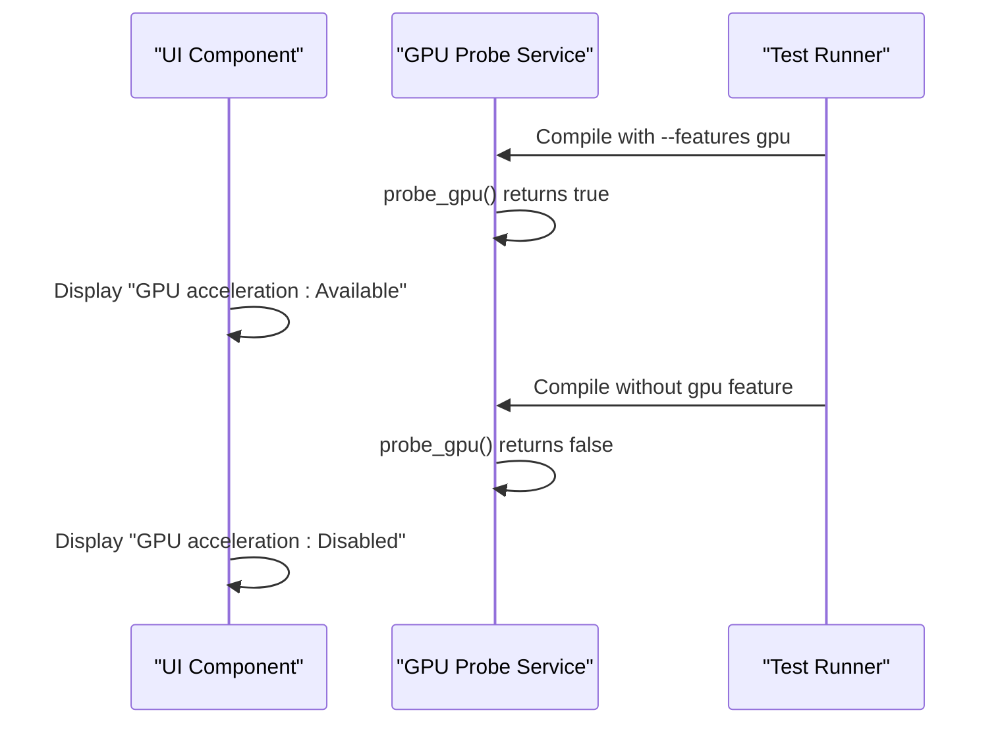
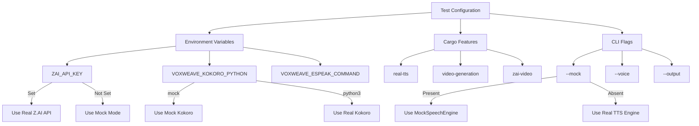
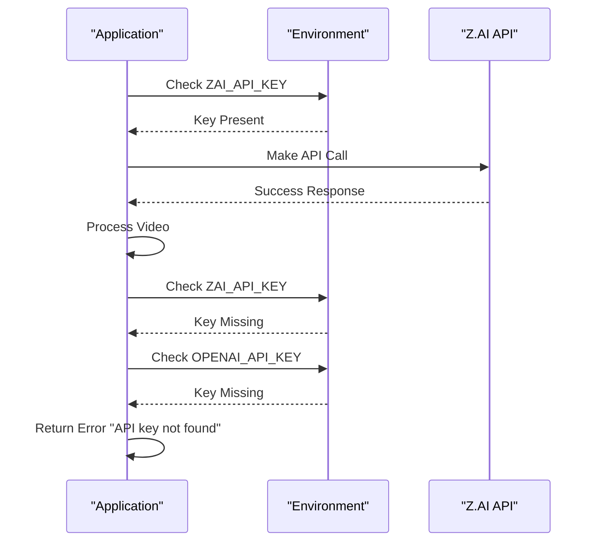
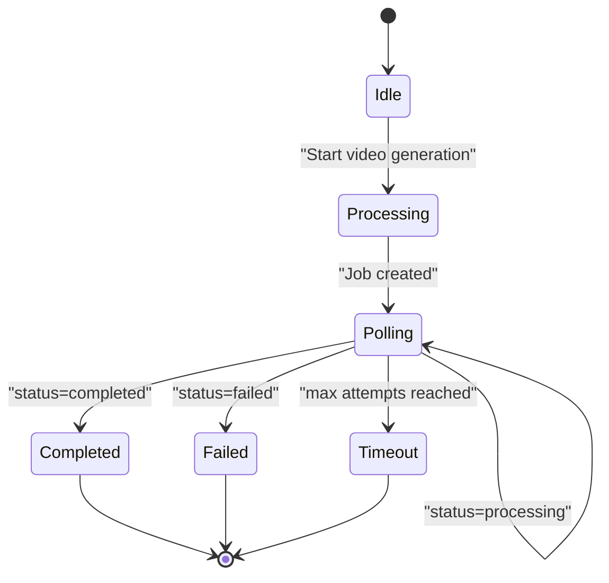

# Testing with External Services

<cite>
**Referenced Files in This Document**   
- [src/tts.rs](file://src/tts.rs)
- [src/video.rs](file://src/video.rs)
- [abogen-ui/crates/ui/services/tts_stub.rs](file://abogen-ui/crates/ui/services/tts_stub.rs)
- [abogen-ui/crates/ui/services/gpu_probe.rs](file://abogen-ui/crates/ui/services/gpu_probe.rs)
- [abogen-ui/crates/ui/services/zai_video.rs](file://abogen-ui/crates/ui/services/zai_video.rs)
- [python/kokoro_bridge.py](file://python/kokoro_bridge.py)
- [Cargo.toml](file://Cargo.toml)
- [FIXES_APPLIED.md](file://FIXES_APPLIED.md)
- [verify.sh](file://verify.sh)
</cite>

## Table of Contents
1. [Introduction](#introduction)
2. [Mocking External Service Dependencies](#mocking-external-service-dependencies)
3. [Testing GPU Detection Logic](#testing-gpu-detection-logic)
4. [Environment-Based Test Configuration](#environment-based-test-configuration)
5. [Authentication and API Key Validation Testing](#authentication-and-api-key-validation-testing)
6. [Contract Testing for External APIs](#contract-testing-for-external-apis)
7. [Best Practices for Reliable Integration Testing](#best-practices-for-reliable-integration-testing)

## Introduction
This document provides comprehensive guidance on testing components in the VoxWeave application that depend on external services such as the Z.AI API for video generation and Python-based TTS engines like Kokoro. The focus is on isolating tests from network dependencies, API rate limits, and hardware requirements through effective mocking strategies, mock servers, and environment-based configuration. The testing approach ensures reliability, reproducibility, and maintainability across different execution environments.

## Mocking External Service Dependencies

VoxWeave employs multiple strategies to mock external service dependencies, ensuring tests remain fast, reliable, and independent of network conditions or API availability.

The application uses a `MockSpeechEngine` implementation that writes cleaned text directly to output files instead of making actual TTS calls. This is particularly useful for unit testing text processing and subtitle generation logic without requiring external Python processes.

For Python subprocess calls to the Kokoro TTS engine, the system relies on environment variables to control behavior. The `KokoroEngine` struct reads configuration from environment variables such as `VOXWEAVE_KOKORO_PYTHON`, `VOXWEAVE_KOKORO_DEVICE`, and `VOXWEAVE_KOKORO_REPO_ID`, allowing tests to redirect calls to mock scripts or controlled environments.

The Z.AI video generation service is mocked through conditional compilation features. When the `video-generation` feature is disabled, the application falls back to stub implementations that simulate the video generation workflow without making actual HTTP requests. The `tts_stub.rs` module provides a complete mock implementation of the TTS pipeline that simulates processing with async delays and log streaming, closely mirroring real-world behavior.

**Diagram sources**
- [src/tts.rs](file://src/tts.rs#L267-L298)
- [abogen-ui/crates/ui/services/tts_stub.rs](file://abogen-ui/crates/ui/services/tts_stub.rs#L31-L67)
- [abogen-ui/crates/ui/services/zai_video.rs](file://abogen-ui/crates/ui/services/zai_video.rs#L170-L209)

**Section sources**
- [src/tts.rs](file://src/tts.rs#L60-L102)
- [python/kokoro_bridge.py](file://python/kokoro_bridge.py#L0-L89)
- [abogen-ui/crates/ui/services/tts_stub.rs](file://abogen-ui/crates/ui/services/tts_stub.rs#L0-L216)

## Testing GPU Detection Logic

The GPU detection logic in `gpu_probe.rs` is designed to be testable without requiring physical GPU hardware. The implementation uses conditional compilation based on the `gpu` feature flag, returning `true` when the feature is enabled and `false` otherwise.

This approach allows tests to verify both GPU-accelerated and CPU-only code paths by simply toggling the feature flag during compilation. The test suite can validate that the application correctly handles both scenarios, updating UI elements and logging appropriate messages based on GPU availability.

The stub implementation in `tts_stub.rs` simulates GPU checks by logging messages about GPU acceleration status based on the `use_gpu` flag in the processing queue. This allows end-to-end testing of the GPU detection workflow, including the associated UI updates and logging, without requiring actual GPU hardware.

**Diagram sources**
- [abogen-ui/crates/ui/services/gpu_probe.rs](file://abogen-ui/crates/ui/services/gpu_probe.rs#L0-L26)
- [abogen-ui/crates/ui/services/tts_stub.rs](file://abogen-ui/crates/ui/services/tts_stub.rs#L31-L67)

**Section sources**
- [abogen-ui/crates/ui/services/gpu_probe.rs](file://abogen-ui/crates/ui/services/gpu_probe.rs#L0-L26)

## Environment-Based Test Configuration

VoxWeave uses environment variables extensively to control test behavior and switch between real and mocked services. This approach enables flexible test configuration without code changes.

The test suite leverages environment variables such as `ZAI_API_KEY`, `OPENAI_API_KEY`, `VOXWEAVE_KOKORO_PYTHON`, and `VOXWEAVE_ESPEAK_COMMAND` to control which services are used during test execution. When these variables are not set, the application automatically falls back to mock modes, making tests portable across different environments.

The `verify.sh` script demonstrates this approach by running tests in mock mode without requiring any API keys. The script verifies that the application can build, run unit tests, display help, list voices, and perform text conversion using the mock engine.

The Cargo feature system complements environment variables by allowing conditional compilation of service implementations. Features like `real-tts`, `video-generation`, and `zai-video` can be enabled or disabled to control which external services are available during testing.

**Diagram sources**
- [src/video.rs](file://src/video.rs#L50-L64)
- [src/tts.rs](file://src/tts.rs#L60-L102)
- [verify.sh](file://verify.sh#L46-L95)

**Section sources**
- [Cargo.toml](file://Cargo.toml#L0-L26)
- [FIXES_APPLIED.md](file://FIXES_APPLIED.md#L533-L546)
- [verify.sh](file://verify.sh#L0-L95)

## Authentication and API Key Validation Testing

The authentication flow for external services is designed to be testable through multiple mechanisms. The Z.AI and OpenAI API key validation is implemented in the `from_env()` method of the video generation service, which attempts to read API keys from environment variables in a specific order.

The testing strategy involves verifying that the application correctly handles both valid and invalid authentication scenarios. When API keys are present, the service should attempt to make real API calls. When keys are missing, the application should either fall back to mock mode or provide appropriate error messages.

The retry mechanism for API calls is also tested to ensure resilience against transient network failures. The `retry_api_call` function in the video generation service implements exponential backoff, which is verified through tests that simulate temporary API failures.

**Diagram sources**
- [src/video.rs](file://src/video.rs#L50-L64)
- [abogen-ui/crates/ui/services/video_generation.rs](file://abogen-ui/crates/ui/services/video_generation.rs#L457-L486)

**Section sources**
- [src/video.rs](file://src/video.rs#L50-L64)

## Contract Testing for External APIs

To ensure reliability when external service contracts change, VoxWeave implements contract testing through several mechanisms. The application defines clear interfaces for external services, such as the `SpeechEngine` trait for TTS engines and the `VideoGenerationService` for video APIs.

The Z.AI API integration includes comprehensive error handling for various response scenarios, including success, errors, and timeouts. The `poll_video_status` method in the video generation service handles different status responses and provides appropriate feedback to the user.

The application also includes retry logic with exponential backoff to handle transient failures. This is particularly important for video generation, which can take several minutes to complete and may experience temporary network issues.

Contract testing is performed by verifying that the application correctly handles mocked API responses with different status codes, response formats, and timing characteristics. This ensures that the application remains robust even when the external service behavior changes.

**Diagram sources**
- [abogen-ui/crates/ui/services/zai_video.rs](file://abogen-ui/crates/ui/services/zai_video.rs#L170-L209)
- [src/video.rs](file://src/video.rs#L50-L64)

**Section sources**
- [abogen-ui/crates/ui/services/zai_video.rs](file://abogen-ui/crates/ui/services/zai_video.rs#L170-L209)
- [src/video.rs](file://src/video.rs#L50-L64)

## Best Practices for Reliable Integration Testing

VoxWeave follows several best practices to ensure reliable integration testing:

1. **Mock by default**: The application uses mock mode by default for testing, as documented in `FIXES_APPLIED.md`. This ensures tests are fast and don't depend on external services.

2. **Feature flags for service control**: Cargo features like `real-tts` and `video-generation` allow fine-grained control over which external services are enabled during testing.

3. **Environment variable configuration**: All external service connections are configurable through environment variables, making tests portable across different environments.

4. **Comprehensive verification script**: The `verify.sh` script provides a complete test suite that verifies build, unit tests, CLI interface, voice listing, and text conversion in mock mode.

5. **Stub implementations for UI testing**: The `tts_stub.rs` module provides realistic simulations of TTS processing with async delays and log streaming, enabling thorough UI testing without external dependencies.

6. **Conditional compilation for hardware features**: The GPU detection logic uses conditional compilation to return appropriate values based on feature flags, enabling testing of GPU-related functionality without physical hardware.

These practices ensure that the test suite remains reliable, fast, and maintainable, even as external service contracts evolve over time.

**Section sources**
- [FIXES_APPLIED.md](file://FIXES_APPLIED.md#L407-L442)
- [verify.sh](file://verify.sh#L0-L95)
- [abogen-ui/crates/ui/services/tts_stub.rs](file://abogen-ui/crates/ui/services/tts_stub.rs#L0-L216)
- [abogen-ui/crates/ui/services/gpu_probe.rs](file://abogen-ui/crates/ui/services/gpu_probe.rs#L0-L26)