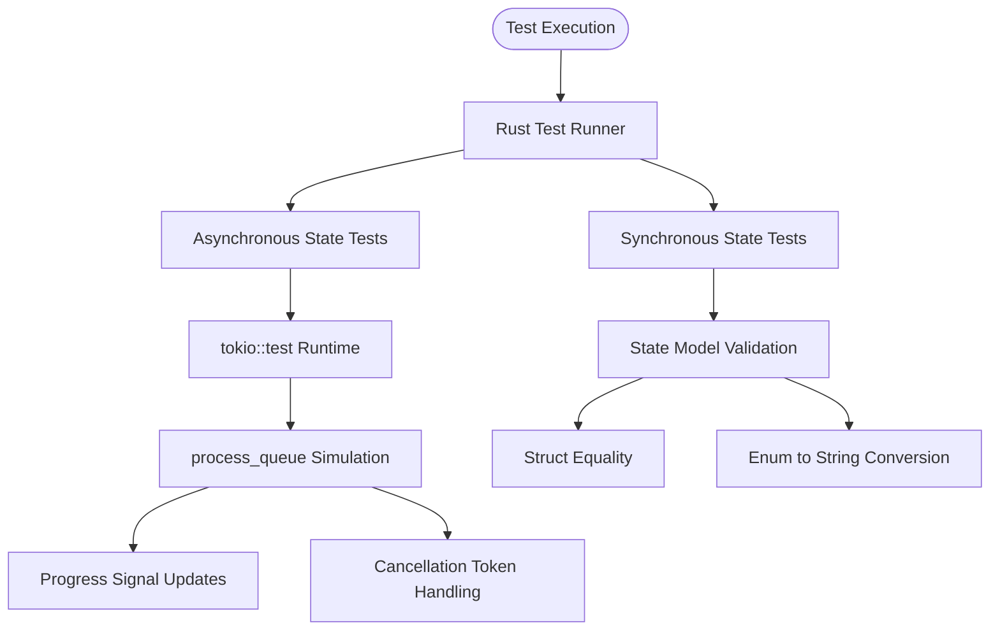
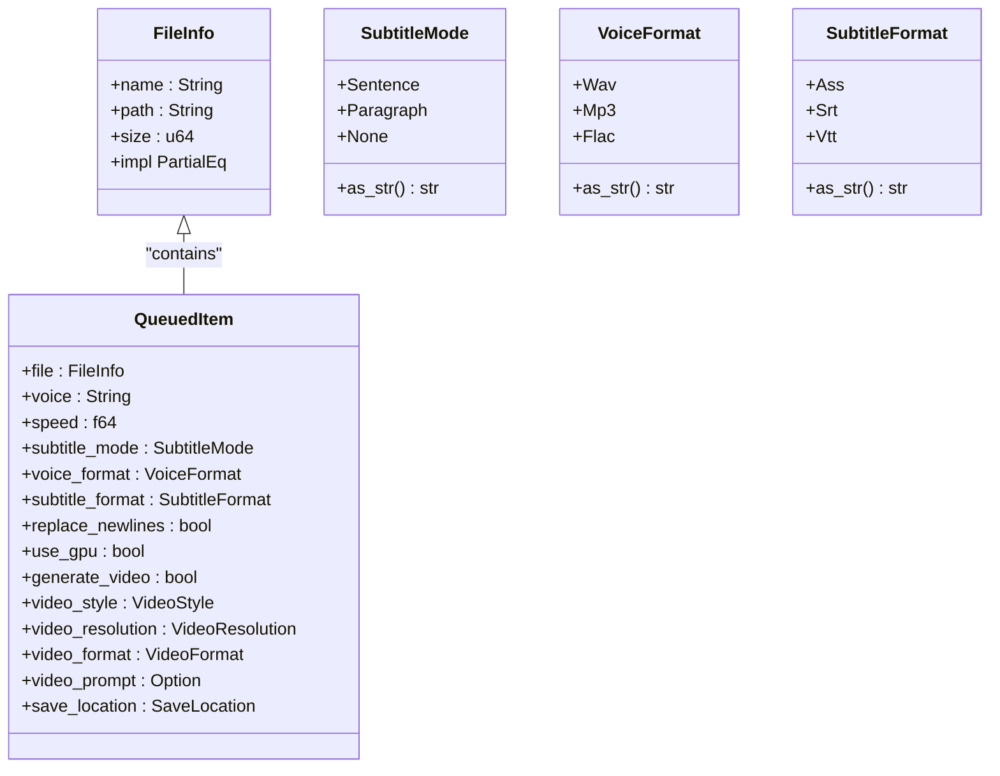
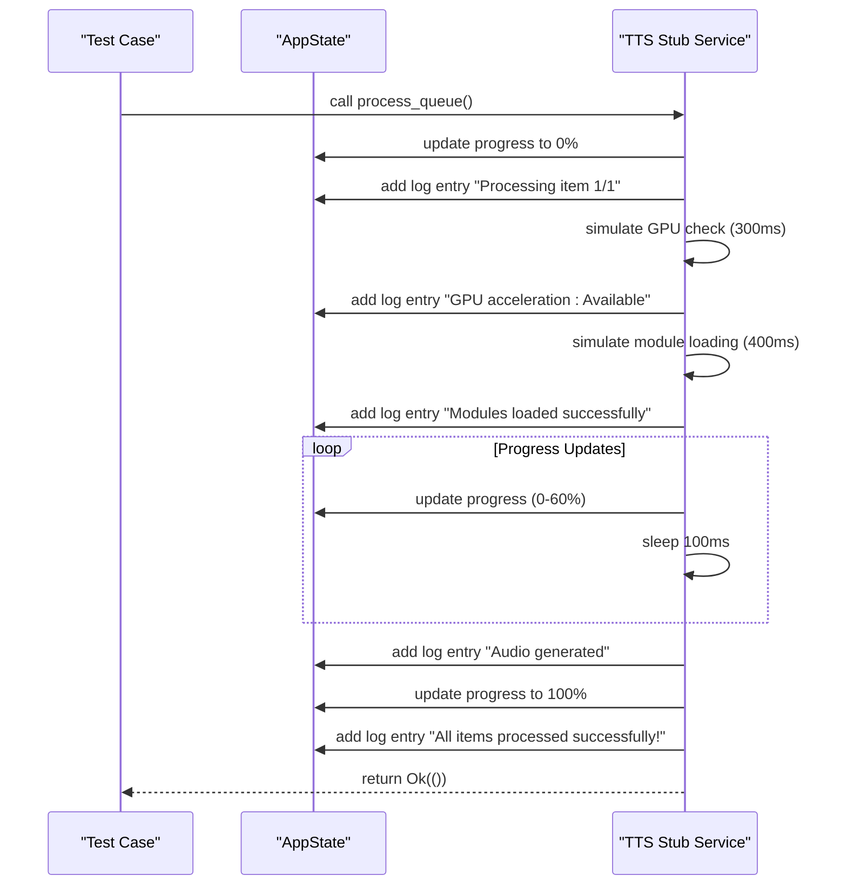

# Unit Testing

<cite>
**Referenced Files in This Document**   
- [state_tests.rs](file://abogen-ui/crates/ui/tests/state_tests.rs)
- [state.rs](file://abogen-ui/crates/ui/state.rs)
- [tts_stub.rs](file://abogen-ui/crates/ui/services/tts_stub.rs)
- [lib.rs](file://abogen-ui/crates/ui/lib.rs)
</cite>

## Table of Contents
1. [Introduction](#introduction)
2. [Test Setup and Execution Patterns](#test-setup-and-execution-patterns)
3. [Core Data Model Testing](#core-data-model-testing)
4. [State Management Validation](#state-management-validation)
5. [Async State Update Testing](#async-state-update-testing)
6. [Mock Store Implementation](#mock-store-implementation)
7. [Assertion Strategies](#assertion-strategies)
8. [Best Practices for Component Isolation](#best-practices-for-component-isolation)
9. [Performance Considerations](#performance-considerations)
10. [Conclusion](#conclusion)

## Introduction
This document details the unit testing strategy for VoxWeave's UI state management system, focusing on the validation of reactive state logic implemented with Dioxus. The testing framework ensures correctness of core data models, state transitions, and asynchronous processing flows within the abogen-ui crate. The primary test file `state_tests.rs` validates fundamental state management logic, while supporting infrastructure in `tts_stub.rs` enables comprehensive testing of async operations.

**Section sources**
- [state_tests.rs](file://abogen-ui/crates/ui/tests/state_tests.rs#L1-L44)

## Test Setup and Execution Patterns
The unit testing framework in VoxWeave follows Rust's standard testing conventions with specialized patterns for Dioxus signal handling. Tests are defined within the `#[cfg(test)] mod state_tests` module and executed using Rust's built-in test runner. The Cargo.toml configuration explicitly defines the test target, ensuring proper compilation and execution environment.

For asynchronous testing scenarios, the framework leverages `tokio::test` runtime to handle async/await patterns in state management operations. This is particularly important for testing the `process_queue` function in `tts_stub.rs`, which simulates asynchronous TTS processing with progress updates and cancellation handling.

**Diagram sources**
- [state_tests.rs](file://abogen-ui/crates/ui/tests/state_tests.rs#L1-L44)
- [tts_stub.rs](file://abogen-ui/crates/ui/services/tts_stub.rs#L184-L216)
- [Cargo.toml](file://abogen-ui/crates/ui/Cargo.toml#L30-L34)

**Section sources**
- [state_tests.rs](file://abogen-ui/crates/ui/tests/state_tests.rs#L1-L44)
- [tts_stub.rs](file://abogen-ui/crates/ui/services/tts_stub.rs#L184-L216)
- [Cargo.toml](file://abogen-ui/crates/ui/Cargo.toml#L30-L34)

## Core Data Model Testing
The unit tests validate the correctness of core data structures defined in `state.rs` that represent the application's state model. These include value types like `FileInfo` and enumerated types such as `SubtitleMode`, `VoiceFormat`, and `SubtitleFormat`. The tests ensure proper implementation of equality, string conversion, and other essential traits.

The `FileInfo` struct is tested for equality semantics, verifying that two instances with identical properties are considered equal. This is crucial for state comparison in the reactive system. Enumeration types are tested for their `as_str()` method implementations, ensuring consistent string representations used in UI rendering and configuration.

**Diagram sources**
- [state.rs](file://abogen-ui/crates/ui/state.rs#L4-L256)
- [state_tests.rs](file://abogen-ui/crates/ui/tests/state_tests.rs#L10-L24)

**Section sources**
- [state.rs](file://abogen-ui/crates/ui/state.rs#L4-L256)
- [state_tests.rs](file://abogen-ui/crates/ui/tests/state_tests.rs#L10-L24)

## State Management Validation
The state management system in VoxWeave uses Dioxus signals to manage reactive state across the application. The `AppState` struct encapsulates all mutable state as `Signal` types, enabling fine-grained reactivity. Unit tests validate that state mutations occur correctly and that derived state updates as expected.

Tests verify basic state operations such as equality checks and enum conversions, which are fundamental to the state management system. The `test_file_info_equality` function confirms that value semantics are properly implemented, while enumeration tests ensure consistent string representations used in UI controls and configuration persistence.

The state validation approach follows the principle of testing individual units of state logic in isolation. Each test focuses on a specific aspect of state behavior without dependencies on external systems or complex UI rendering. This isolation enables fast, deterministic testing of state logic.

**Section sources**
- [state.rs](file://abogen-ui/crates/ui/state.rs#L4-L256)
- [state_tests.rs](file://abogen-ui/crates/ui/tests/state_tests.rs#L10-L44)

## Async State Update Testing
Testing asynchronous state updates presents unique challenges in a reactive UI framework. The `tts_stub.rs` module provides a mock implementation of the TTS processing pipeline that simulates async operations with controlled delays and progress updates. This enables comprehensive testing of state transitions during long-running operations.

The `process_queue` function in `tts_stub.rs` demonstrates the testing pattern for async state updates. It simulates processing with `tokio::time::sleep` calls while updating progress signals and logging state. Tests can verify that progress updates occur at expected intervals and that cancellation is handled properly through the cancel token mechanism.

The async testing strategy uses the `#[tokio::test]` attribute to run tests in the Tokio runtime, allowing the use of async/await syntax. This enables testing of complex state flows that involve multiple asynchronous operations and intermediate state updates.

**Diagram sources**
- [tts_stub.rs](file://abogen-ui/crates/ui/services/tts_stub.rs#L1-L216)
- [state.rs](file://abogen-ui/crates/ui/state.rs#L100-L150)

**Section sources**
- [tts_stub.rs](file://abogen-ui/crates/ui/services/tts_stub.rs#L1-L216)

## Mock Store Implementation
The testing framework employs mock implementations to isolate state management logic from external dependencies. The `tts_stub.rs` module serves as a mock store for TTS processing operations, simulating the behavior of the real service without requiring network calls or external resources.

The mock store follows the same interface as the production implementation, allowing it to be substituted seamlessly in tests. It simulates realistic processing times, progress updates, and error conditions, providing a comprehensive testing environment for state management logic.

Mock stores are particularly valuable for testing edge cases and error conditions that may be difficult to reproduce with real services. The stub implementation can simulate failures, timeouts, and other exceptional conditions to verify proper error handling and state recovery.

**Section sources**
- [tts_stub.rs](file://abogen-ui/crates/ui/services/tts_stub.rs#L1-L216)

## Assertion Strategies
The unit tests employ a variety of assertion strategies to validate state correctness. For value types, direct equality assertions are used to verify that state mutations produce expected results. For enumerated types, assertions validate the string representations returned by `as_str()` methods.

In async tests, assertions focus on the sequence and timing of state updates. The framework verifies that progress signals update at expected intervals and that log entries are generated in the correct order. Cancellation scenarios are tested by verifying that the system returns to a known state when processing is interrupted.

The assertion strategy emphasizes testing observable state changes rather than internal implementation details. This approach ensures that tests remain valid even as internal implementations evolve, as long as the external behavior remains consistent.

**Section sources**
- [state_tests.rs](file://abogen-ui/crates/ui/tests/state_tests.rs#L10-L44)
- [tts_stub.rs](file://abogen-ui/crates/ui/services/tts_stub.rs#L184-L216)

## Best Practices for Component Isolation
The testing framework follows best practices for isolating units of logic to ensure reliable and maintainable tests. Each test focuses on a single aspect of state management, minimizing dependencies and external interactions.

Key isolation practices include:
- Testing value types independently of reactive signals
- Using mock implementations for external services
- Avoiding UI rendering in unit tests
- Testing state logic separately from presentation logic
- Minimizing test setup complexity

The separation of concerns between `state.rs` (state definitions), `tts_stub.rs` (mock service), and `state_tests.rs` (test cases) exemplifies effective component isolation. This architecture enables testing state management logic without the complexity of full UI rendering or external service dependencies.

**Section sources**
- [state_tests.rs](file://abogen-ui/crates/ui/tests/state_tests.rs#L1-L44)
- [state.rs](file://abogen-ui/crates/ui/state.rs#L4-L256)
- [tts_stub.rs](file://abogen-ui/crates/ui/services/tts_stub.rs#L1-L216)

## Performance Considerations
The unit testing framework considers performance implications, particularly when running large test suites. The use of mock implementations rather than real services ensures fast test execution by eliminating network delays and external dependencies.

Async tests are designed with controlled timing to balance realism with execution speed. Simulated delays are kept to a minimum while still providing meaningful testing of timing-dependent state transitions. The framework avoids unnecessary delays in test scenarios where timing is not a critical factor.

Test parallelization is supported by Rust's test runner, allowing multiple test cases to execute concurrently. This is particularly beneficial for the state tests, which are largely independent and can be safely parallelized.

**Section sources**
- [state_tests.rs](file://abogen-ui/crates/ui/tests/state_tests.rs#L1-L44)
- [tts_stub.rs](file://abogen-ui/crates/ui/services/tts_stub.rs#L1-L216)

## Conclusion
The unit testing framework for VoxWeave's UI state management provides comprehensive validation of reactive state logic using Dioxus signals. By combining synchronous tests for core data models with asynchronous tests for complex state transitions, the framework ensures reliability across the entire state management system.

The use of mock stores, isolated test cases, and targeted assertion strategies enables efficient and maintainable testing. The framework effectively validates state correctness, handles async operations, and ensures proper error recovery, providing confidence in the stability and reliability of the UI state management system.