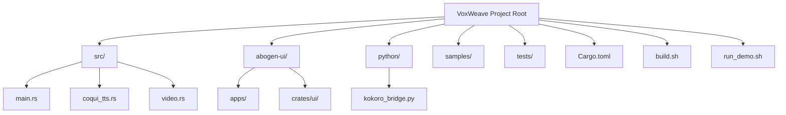
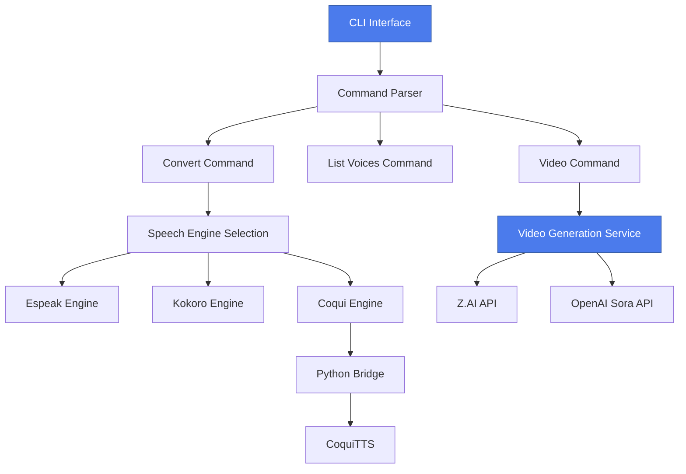
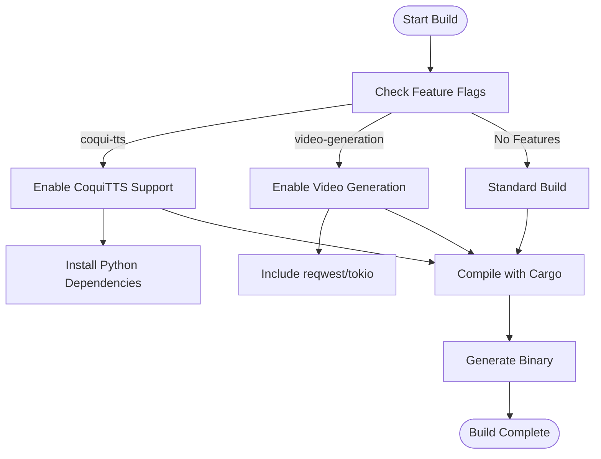
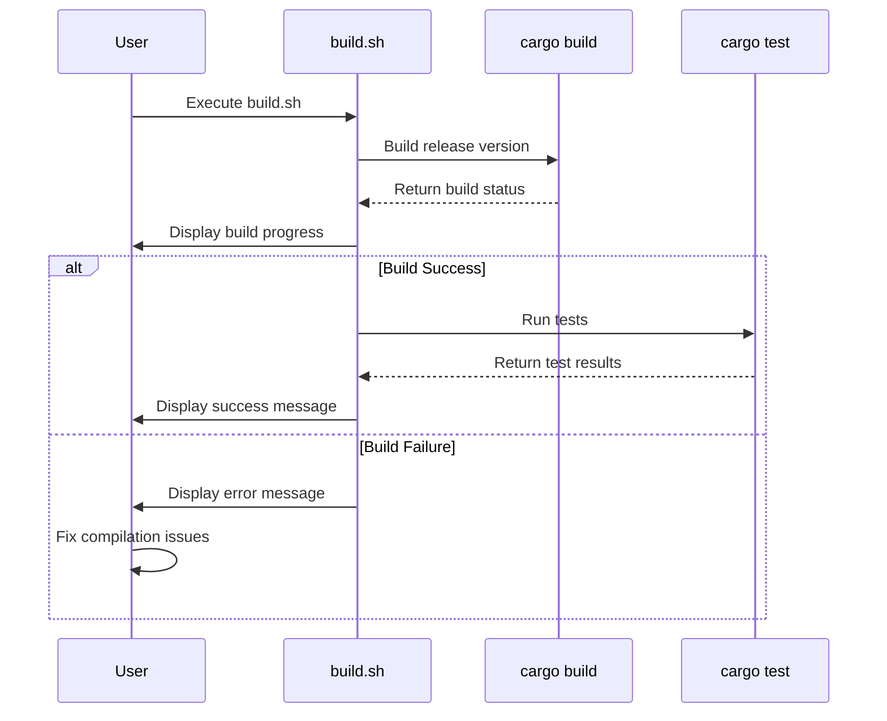

# Building the CLI Application

<cite>
**Referenced Files in This Document**   
- [Cargo.toml](file://Cargo.toml)
- [build.sh](file://build.sh)
- [run_demo.sh](file://run_demo.sh)
- [src/coqui_tts.rs](file://src/coqui_tts.rs)
- [src/video.rs](file://src/video.rs)
- [src/main.rs](file://src/main.rs)
- [src/tts.rs](file://src/tts.rs)
- [python/kokoro_bridge.py](file://python/kokoro_bridge.py)
- [README.md](file://README.md)
</cite>

## Table of Contents
1. [Introduction](#introduction)
2. [Project Structure](#project-structure)
3. [Core Components](#core-components)
4. [Architecture Overview](#architecture-overview)
5. [Detailed Component Analysis](#detailed-component-analysis)
6. [Dependency Analysis](#dependency-analysis)
7. [Performance Considerations](#performance-considerations)
8. [Troubleshooting Guide](#troubleshooting-guide)
9. [Conclusion](#conclusion)

## Introduction
This document provides comprehensive guidance for building the VoxWeave CLI application from source. It covers compilation procedures using Cargo, feature flag management, build automation scripts, and troubleshooting common issues. The VoxWeave application is a Rust-based text-to-speech pipeline that supports advanced features like voice cloning and AI video generation through optional feature flags.

## Project Structure
The VoxWeave project follows a standard Rust project structure with additional components for multi-platform UI and Python integration. The core CLI functionality resides in the root directory, while UI components are organized in the abogen-ui subdirectory.



**Diagram sources**
- [Cargo.toml](file://Cargo.toml#L1-L27)
- [src/main.rs](file://src/main.rs#L1-L418)

**Section sources**
- [Cargo.toml](file://Cargo.toml#L1-L27)
- [src/main.rs](file://src/main.rs#L1-L418)

## Core Components
The VoxWeave CLI application consists of several core components that enable text-to-speech conversion, voice cloning, and video generation. The application is built using Rust with optional Python integration for advanced TTS models. Key components include the main CLI interface, CoquiTTS integration for voice cloning, and video generation capabilities.

**Section sources**
- [src/main.rs](file://src/main.rs#L1-L418)
- [src/coqui_tts.rs](file://src/coqui_tts.rs#L1-L116)
- [src/video.rs](file://src/video.rs#L1-L463)

## Architecture Overview
The VoxWeave application follows a modular architecture with clear separation between the CLI interface, speech engines, and video generation components. The system is designed to be extensible through feature flags that enable optional functionality.



**Diagram sources**
- [src/main.rs](file://src/main.rs#L1-L418)
- [src/coqui_tts.rs](file://src/coqui_tts.rs#L1-L116)
- [src/video.rs](file://src/video.rs#L1-L463)

## Detailed Component Analysis

### Build System and Compilation
The VoxWeave application uses Cargo as its build system, with support for optional features that can be enabled during compilation. The build process is controlled through feature flags defined in the Cargo.toml file.



**Diagram sources**
- [Cargo.toml](file://Cargo.toml#L1-L27)
- [build.sh](file://build.sh#L1-L21)

**Section sources**
- [Cargo.toml](file://Cargo.toml#L1-L27)
- [build.sh](file://build.sh#L1-L21)

### Feature Flag Management
VoxWeave implements a feature-based architecture that allows optional components to be compiled into the application. The two primary optional features are `coqui-tts` for voice cloning and `video-generation` for AI video creation.

```mermaid
classDiagram
class CargoFeatures {
+default : []
+coqui-tts : []
+video-generation : ["tokio", "reqwest"]
}
class CoquiEngine {
+python_command : String
+model_name : String
+device : String
+sample_rate : u32
+language : String
+synthesize_to_file()
}
class VideoGenerationService {
+api_key : String
+base_url : String
+provider : VideoProvider
+generate_video()
}
CargoFeatures --> CoquiEngine : "enables"
CargoFeatures --> VideoGenerationService : "enables"
note right of CargoFeatures
Feature flags control optional
components in the build process.
coqui-tts enables voice cloning.
video-generation enables AI video.
end note
```

**Diagram sources**
- [Cargo.toml](file://Cargo.toml#L1-L27)
- [src/coqui_tts.rs](file://src/coqui_tts.rs#L1-L116)
- [src/video.rs](file://src/video.rs#L1-L463)

**Section sources**
- [Cargo.toml](file://Cargo.toml#L1-L27)
- [src/coqui_tts.rs](file://src/coqui_tts.rs#L1-L116)
- [src/video.rs](file://src/video.rs#L1-L463)

### Build Automation Scripts
The project includes several shell scripts to automate the build and testing process. The build.sh script handles compilation and testing, while run_demo.sh demonstrates a complete build-and-execution workflow.



**Diagram sources**
- [build.sh](file://build.sh#L1-L21)
- [run_demo.sh](file://run_demo.sh#L1-L81)

**Section sources**
- [build.sh](file://build.sh#L1-L21)
- [run_demo.sh](file://run_demo.sh#L1-L81)

## Dependency Analysis
The VoxWeave application has a complex dependency structure that includes both Rust crates and Python packages. The dependencies vary based on the feature flags enabled during compilation.

```mermaid
graph TD
A[Rust Dependencies] --> B[clap]
A --> C[anyhow]
A --> D[serde]
A --> E[tokio]
A --> F[reqwest]
G[Optional Features] --> H[coqui-tts]
G --> I[video-generation]
H --> J[Python Dependencies]
J --> K[TTS]
J --> L[torch]
J --> M[numpy]
I --> N[tokio]
I --> O[reqwest]
style H fill:#FFD700,stroke:#CCAA00
style I fill:#FFD700,stroke:#CCAA00
style J fill:#98FB98,stroke:#6B8E6B
note right of G
Feature flags determine
which dependencies are
included in the build.
end note
```

**Diagram sources**
- [Cargo.toml](file://Cargo.toml#L1-L27)
- [README.md](file://README.md#L1-L133)

**Section sources**
- [Cargo.toml](file://Cargo.toml#L1-L27)
- [README.md](file://README.md#L1-L133)

## Performance Considerations
The build process for VoxWeave can be optimized through incremental compilation and proper management of build artifacts. Cargo provides several commands to manage the build cache and improve compilation speed.

```mermaid
flowchart LR
A[Development Cycle] --> B[cargo build]
B --> C[Code Changes]
C --> D[cargo build --release]
D --> E[Testing]
E --> F[cargo clean]
F --> G[Full Rebuild]
G --> A
style B fill:#98FB98,stroke:#6B8E6B
style D fill:#98FB98,stroke:#6B8E6B
style F fill:#FFA07A,stroke:#CC704B
note right of F
Use cargo clean only when
necessary, as it removes
all build artifacts and
forces a full rebuild.
end note
```

**Diagram sources**
- [Cargo.toml](file://Cargo.toml#L1-L27)
- [build.sh](file://build.sh#L1-L21)

## Troubleshooting Guide
Common issues during the build process include missing feature flags, Python dependency problems, and toolchain incompatibilities. This section provides solutions for the most frequent build problems.

**Section sources**
- [README.md](file://README.md#L1-L133)
- [COQUI_USAGE_GUIDE.md](file://COQUI_USAGE_GUIDE.md#L1-L673)
- [CLI_VIDEO_GENERATION.md](file://CLI_VIDEO_GENERATION.md#L1-L335)

## Conclusion
The VoxWeave CLI application can be successfully built from source using Cargo with optional features for voice cloning and video generation. The build process is automated through shell scripts that handle compilation and testing. Feature flags allow selective inclusion of optional components, while external dependencies are managed through both Rust and Python package managers. Proper configuration of environment variables and dependencies is essential for successful compilation and execution.