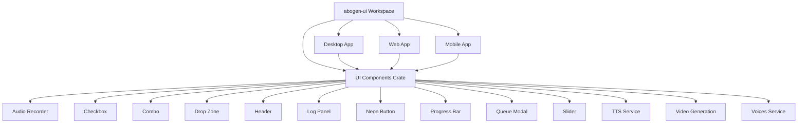
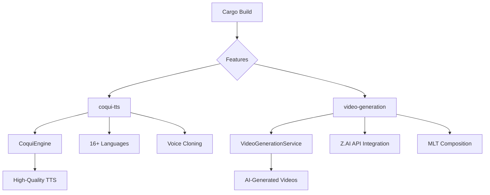

# Building the Project

<cite>
**Referenced Files in This Document**   
- [Cargo.toml](file://Cargo.toml)
- [build.sh](file://build.sh)
- [run_demo.sh](file://run_demo.sh)
- [abogen-ui/Cargo.toml](file://abogen-ui/Cargo.toml)
- [abogen-ui/apps/web/Trunk.toml](file://abogen-ui/apps/web/Trunk.toml)
- [src/coqui_tts.rs](file://src/coqui_tts.rs)
- [src/tts.rs](file://src/tts.rs)
- [src/main.rs](file://src/main.rs)
- [abogen-ui/crates/ui/services/voices.rs](file://abogen-ui/crates/ui/services/voices.rs)
- [abogen-ui/crates/ui/services/tts_service.rs](file://abogen-ui/crates/ui/services/tts_service.rs)
- [abogen-ui/crates/ui/services/video_generation.rs](file://abogen-ui/crates/ui/services/video_generation.rs)
- [abogen-ui/crates/ui/state.rs](file://abogen-ui/crates/ui/state.rs)
- [abogen-ui/crates/ui/lib.rs](file://abogen-ui/crates/ui/lib.rs)
</cite>

## Table of Contents
1. [Building the CLI Tool](#building-the-cli-tool)
2. [Building abogen-ui for Multiple Platforms](#building-abogen-ui-for-multiple-platforms)
3. [Using the build.sh Script](#using-the-buildsh-script)
4. [Running the Demo](#running-the-demo)
5. [Common Build Commands](#common-build-commands)
6. [Troubleshooting Build Issues](#troubleshooting-build-issues)
7. [Incremental Builds and Cleaning Artifacts](#incremental-builds-and-cleaning-artifacts)

## Building the CLI Tool

The VoxWeave CLI tool is built using Cargo, Rust's package manager and build system. The core functionality is defined in the root `Cargo.toml` file, which specifies the project's dependencies and optional features.

The CLI supports two key optional features:
- `coqui-tts`: Enables integration with Coqui TTS for high-quality, multilingual speech synthesis
- `video-generation`: Enables video generation capabilities using Z.AI API and MLT composition

To build the CLI tool with default features (Kokoro TTS only):
```bash
cargo build
```

To build in release mode for optimized performance:
```bash
cargo build --release
```

**Section sources**
- [Cargo.toml](file://Cargo.toml)
- [src/main.rs](file://src/main.rs)
- [src/tts.rs](file://src/tts.rs)

## Building abogen-ui for Multiple Platforms

The abogen-ui component is a Dioxus-based application that can be built for desktop, web, and mobile platforms. It is structured as a workspace with multiple members defined in `abogen-ui/Cargo.toml`.

### Desktop Build
To build the desktop application:
```bash
cd abogen-ui
dx serve --release --platform desktop
```

### Web Build
The web application uses Trunk as its build tool. The build configuration is defined in `abogen-ui/apps/web/Trunk.toml`, which specifies:
- Target HTML file: `index.html`
- Distribution directory: `dist`
- Development server settings (port 8080, auto-open browser)
- Watch directories for hot reloading

To build the web application:
```bash
cd abogen-ui/apps/web
trunk build --release
```

To serve the web application during development:
```bash
cd abogen-ui/apps/web
trunk serve
```

### Mobile Build
To build the mobile application:
```bash
cd abogen-ui
dx serve --release --platform mobile
```

The UI components and services are shared across all platforms through the `crates/ui` library crate, ensuring consistent functionality and appearance.



**Diagram sources**
- [abogen-ui/Cargo.toml](file://abogen-ui/Cargo.toml)
- [abogen-ui/apps/web/Trunk.toml](file://abogen-ui/apps/web/Trunk.toml)
- [abogen-ui/crates/ui/lib.rs](file://abogen-ui/crates/ui/lib.rs)

**Section sources**
- [abogen-ui/Cargo.toml](file://abogen-ui/Cargo.toml)
- [abogen-ui/apps/web/Trunk.toml](file://abogen-ui/apps/web/Trunk.toml)
- [abogen-ui/crates/ui/lib.rs](file://abogen-ui/crates/ui/lib.rs)

## Using the build.sh Script

The `build.sh` script provides an automated build process that compiles the project and runs tests. It is designed to ensure code quality by verifying that all tests pass after compilation.

The script performs the following steps:
1. Builds the project in release mode using `cargo build --release`
2. Runs all tests using `cargo test`
3. Exits with an error if any step fails

The script uses `set -e` to ensure it stops immediately if any command fails, preventing the continuation of the build process when errors occur.

Example usage:
```bash
./build.sh
```

This script is particularly useful for continuous integration (CI) pipelines and release preparation, as it ensures that only tested and verified code is deployed.

**Section sources**
- [build.sh](file://build.sh)

## Running the Demo

The `run_demo.sh` script provides a complete build-and-run workflow that demonstrates the core functionality of VoxWeave. It builds the project, lists available voices, and performs a mock conversion on a sample file.

The demo workflow:
1. Builds the VoxWeave project using `cargo build`
2. Lists available voices using the `list-voices` command
3. Converts `samples/example.txt` in mock mode, generating a WAV file and SRT subtitles
4. Provides tips for real TTS usage and configuration

Example output:
```
🎙️  VoxWeave Demo Script
========================

📦 Building VoxWeave...
✅ Build successful!

🎵 Available voices:
af_alloy
af_aoede
...

🔊 Converting example.txt (mock mode)...
✅ Mock conversion successful!
   Output: samples/output/example.wav
   Subtitles: samples/output/example.srt

🏁 Demo complete!
```

The script is an excellent starting point for new users to verify their installation and understand the basic workflow.

**Section sources**
- [run_demo.sh](file://run_demo.sh)

## Common Build Commands

The following are common build commands for enabling specific features in VoxWeave:

### Building with Coqui TTS Support
To enable Coqui TTS for high-quality, multilingual speech synthesis:
```bash
cargo build --features coqui-tts
```

This feature adds support for 16+ languages and voice cloning capabilities. When enabled, the UI will display additional Coqui voices in the voice selection dropdown.

### Building with Video Generation
To enable video generation capabilities:
```bash
cargo build --features video-generation
```

This feature enables integration with the Z.AI API for generating videos with AI visuals synchronized with TTS audio and subtitles.

### Building with Both Features
To enable both Coqui TTS and video generation:
```bash
cargo build --features "coqui-tts video-generation"
```

### Building with All Features
To build with all optional features enabled:
```bash
cargo build --all-features
```

These feature flags control conditional compilation, ensuring that only the required dependencies are included in the final binary.



**Diagram sources**
- [Cargo.toml](file://Cargo.toml)
- [src/coqui_tts.rs](file://src/coqui_tts.rs)
- [src/main.rs](file://src/main.rs)
- [abogen-ui/crates/ui/services/video_generation.rs](file://abogen-ui/crates/ui/services/video_generation.rs)

**Section sources**
- [Cargo.toml](file://Cargo.toml)
- [src/coqui_tts.rs](file://src/coqui_tts.rs)
- [src/main.rs](file://src/main.rs)

## Troubleshooting Build Issues

### Feature Flag Conflicts
When enabling multiple features, ensure they are properly specified:
```bash
# Correct - features in quotes
cargo build --features "coqui-tts video-generation"

# Incorrect - separate --features flags
cargo build --features coqui-tts --features video-generation
```

### Missing Python Headers
When building with `coqui-tts` feature, you may encounter errors related to missing Python headers. This occurs because the Coqui TTS integration requires Python development headers.

On Ubuntu/Debian:
```bash
sudo apt-get install python3-dev
```

On macOS with Homebrew:
```bash
brew install python@3
```

On Windows with vcpkg:
```bash
vcpkg install python3
```

### Incompatible Rust Versions
VoxWeave requires Rust 2021 edition. Ensure you are using a compatible Rust version:
```bash
rustc --version
cargo --version
```

Update Rust using rustup:
```bash
rustup update
```

### Z.AI API Key Issues
For video generation, the ZAI_API_KEY environment variable must be set:
```bash
export ZAI_API_KEY=your_api_key_here
```

Without this key, video generation will fail with a clear error message.

### Python Dependencies for Coqui TTS
The Coqui TTS feature requires specific Python packages:
```bash
pip install TTS torch numpy
```

These packages provide the backend for speech synthesis and are called from Rust via Python subprocesses.

**Section sources**
- [src/coqui_tts.rs](file://src/coqui_tts.rs)
- [src/tts.rs](file://src/tts.rs)
- [abogen-ui/crates/ui/services/video_generation.rs](file://abogen-ui/crates/ui/services/video_generation.rs)

## Incremental Builds and Cleaning Artifacts

### Incremental Builds
Cargo supports incremental compilation, which significantly speeds up subsequent builds by only recompiling changed code. To take advantage of this:
```bash
# First build - compiles everything
cargo build

# Subsequent builds - only recompile changed files
cargo build
```

Incremental builds are enabled by default and work by tracking dependencies between source files.

### Cleaning Build Artifacts
To remove all generated artifacts and start with a clean build:
```bash
cargo clean
```

This removes the `target/` directory, which contains all compiled binaries, dependencies, and intermediate files.

For selective cleaning:
```bash
# Remove release artifacts only
rm -rf target/release

# Remove debug artifacts only
rm -rf target/debug
```

After cleaning, the next build will be a full compilation, which takes longer but ensures a clean state.

### Build Output Management
Build artifacts are stored in the `target/` directory:
- `target/debug/` - Debug builds
- `target/release/` - Release builds
- `target/doc/` - Generated documentation
- `target/package/` - Packaged crates

The `build_output.txt` file in the root directory can be used to capture build output for analysis or logging purposes.

**Section sources**
- [Cargo.toml](file://Cargo.toml)
- [build.sh](file://build.sh)