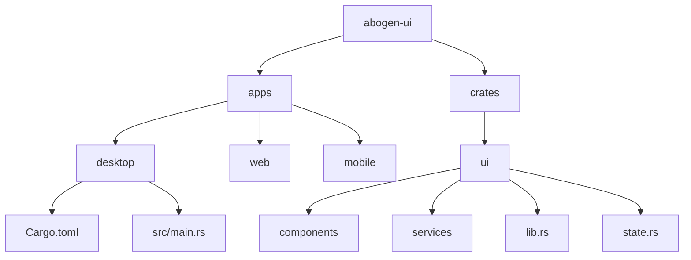
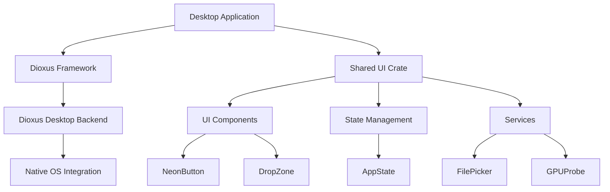
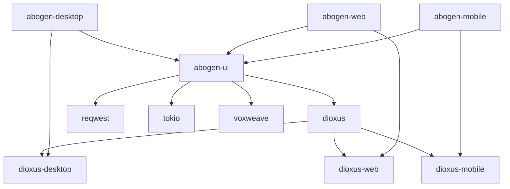

# Building the Desktop Application

<cite>
**Referenced Files in This Document**   
- [desktop/Cargo.toml](file://abogen-ui/apps/desktop/Cargo.toml)
- [ui/Cargo.toml](file://abogen-ui/crates/ui/Cargo.toml)
- [state.rs](file://abogen-ui/crates/ui/state.rs)
- [neon_button.rs](file://abogen-ui/crates/ui/components/neon_button.rs)
- [gpu_probe.rs](file://abogen-ui/crates/ui/services/gpu_probe.rs)
- [file_picker.rs](file://abogen-ui/crates/ui/services/file_picker.rs)
- [main.rs](file://abogen-ui/apps/desktop/src/main.rs)
- [README.md](file://abogen-ui/README.md)
- [BUILD_STATUS.md](file://abogen-ui/BUILD_STATUS.md)
</cite>

## Table of Contents
1. [Introduction](#introduction)
2. [Project Structure](#project-structure)
3. [Core Components](#core-components)
4. [Architecture Overview](#architecture-overview)
5. [Detailed Component Analysis](#detailed-component-analysis)
6. [Dependency Analysis](#dependency-analysis)
7. [Performance Considerations](#performance-considerations)
8. [Troubleshooting Guide](#troubleshooting-guide)
9. [Conclusion](#conclusion)

## Introduction
This document provides comprehensive guidance for building the desktop application using Dioxus with the 'desktop' feature flag. It covers the installation of required tools, configuration of the build environment, compilation process, and execution of the desktop application. The application features a cyberpunk-themed UI with advanced capabilities including video generation, text-to-speech (TTS) functionality, and GPU acceleration support.

## Project Structure
The project follows a workspace structure with shared components across multiple platforms. The desktop application is one of several platform-specific launchers that utilize a common UI crate.



**Diagram sources**
- [README.md](file://abogen-ui/README.md#L56-L84)
- [Cargo.toml](file://abogen-ui/Cargo.toml#L0-L22)

**Section sources**
- [README.md](file://abogen-ui/README.md#L0-L54)
- [Cargo.toml](file://abogen-ui/Cargo.toml#L0-L22)

## Core Components
The desktop application is built around several core components that provide essential functionality. These include the main application entry point, state management system, UI components, and platform-specific services.

**Section sources**
- [main.rs](file://abogen-ui/apps/desktop/src/main.rs#L0-L6)
- [state.rs](file://abogen-ui/crates/ui/state.rs#L0-L258)
- [neon_button.rs](file://abogen-ui/crates/ui/components/neon_button.rs#L0-L27)

## Architecture Overview
The application architecture follows a component-based design pattern with clear separation between UI components, state management, and platform-specific services. The desktop application leverages Dioxus for rendering and state management, while utilizing a shared UI crate for cross-platform consistency.



**Diagram sources**
- [desktop/Cargo.toml](file://abogen-ui/apps/desktop/Cargo.toml#L0-L13)
- [ui/Cargo.toml](file://abogen-ui/crates/ui/Cargo.toml#L0-L34)

## Detailed Component Analysis

### Desktop Application Configuration
The desktop application is configured through its Cargo.toml file, which specifies the binary target and dependencies. The configuration enables the desktop feature flag for Dioxus and includes the shared abogen-ui crate with specific features enabled.

```toml
[package]
name = "abogen-desktop"
version.workspace = true
edition.workspace = true

[[bin]]
name = "abogen-desktop"
path = "src/main.rs"

[dependencies]
dioxus = { workspace = true, features = ["desktop"] }
abogen-ui = { path = "../../crates/ui", features = ["video-generation", "real-tts", "zai-video", "coqui-tts"] }
```

This configuration establishes the desktop application as a binary with the entry point at src/main.rs. The dependency on the shared UI crate enables video generation and TTS features, including both real-tTS and Coqui TTS implementations.

**Section sources**
- [desktop/Cargo.toml](file://abogen-ui/apps/desktop/Cargo.toml#L0-L13)

### Shared UI Crate Configuration
The shared UI crate (abogen-ui) is configured to support multiple platforms and features. Its Cargo.toml file defines the library structure and feature flags that control optional functionality.

```toml
[package]
name = "abogen-ui"
version.workspace = true
edition.workspace = true

[lib]
name = "abogen_ui"
path = "lib.rs"

[dependencies]
dioxus = { workspace = true, features = ["web", "desktop", "mobile"] }
serde = { workspace = true }
serde_json = { workspace = true }
tokio = { version = "1", features = ["full"] }
log = "0.4"
reqwest = { version = "0.11", features = ["json", "multipart"], optional = true }
anyhow = "1"
directories = "5"
voxweave = { path = "../../..", features = ["coqui-tts"] }
cpal = { version = "0.15", optional = true }
hound = { version = "3.5", optional = true }

[features]
default = []
gpu = []
real-tts = []
video-generation = ["reqwest"]
zai-video = ["reqwest", "video-generation"]
coqui-tts = ["cpal", "hound"]
```

The feature flags system allows selective compilation of components based on requirements. The video-generation feature enables integration with external video services, while coqui-tts enables voice cloning capabilities with microphone recording support.

**Section sources**
- [ui/Cargo.toml](file://abogen-ui/crates/ui/Cargo.toml#L0-L34)

### State Management with Dioxus Signals
The application uses Dioxus signals for real-time state management, providing a reactive programming model that automatically updates the UI when state changes. The AppState struct contains signals for all application state variables.

```mermaid
classDiagram
class AppState {
+selected_file : Signal<Option<FileInfo>>
+queue : Signal<Vec<QueuedItem>>
+voice : Signal<String>
+speed : Signal<f64>
+subtitle_mode : Signal<SubtitleMode>
+voice_format : Signal<VoiceFormat>
+subtitle_format : Signal<SubtitleFormat>
+replace_newlines : Signal<bool>
+save_location : Signal<SaveLocation>
+use_gpu : Signal<bool>
+generate_video : Signal<bool>
+video_style : Signal<VideoStyle>
+video_resolution : Signal<VideoResolution>
+video_format : Signal<VideoFormat>
+video_prompt : Signal<Option<String>>
+is_processing : Signal<bool>
+progress : Signal<u8>
+logs : Signal<Vec<LogEntry>>
+cancel_token : Signal<Option<()>>
}
class FileInfo {
+name : String
+path : String
+size : u64
}
class QueuedItem {
+file : FileInfo
+voice : String
+speed : f64
+subtitle_mode : SubtitleMode
+voice_format : VoiceFormat
+subtitle_format : SubtitleFormat
+replace_newlines : bool
+use_gpu : bool
+generate_video : bool
+video_style : VideoStyle
+video_resolution : VideoResolution
+video_format : VideoFormat
+video_prompt : Option<String>
+save_location : SaveLocation
}
class LogEntry {
+message : String
+level : LogLevel
}
AppState --> FileInfo
AppState --> QueuedItem
AppState --> LogEntry
```

**Diagram sources**
- [state.rs](file://abogen-ui/crates/ui/state.rs#L0-L258)

**Section sources**
- [state.rs](file://abogen-ui/crates/ui/state.rs#L0-L258)

### Cyberpunk-Themed UI Components
The application features a distinctive cyberpunk aesthetic with custom UI components. The NeonButton component exemplifies this design language with its glowing visual effects.

```mermaid
classDiagram
class NeonButton {
+onclick : EventHandler<MouseEvent>
+children : Element
+primary : Option<bool>
+disabled : Option<bool>
}
NeonButton : rsx! { button { class : if primary { "neon-btn primary" } else { "neon-btn" }, disabled : disabled, onclick : move |e| { if !disabled { onclick.call(e); } }, children } }
```

The component uses conditional styling to apply different classes based on the primary property, creating a visual hierarchy within the interface. This design pattern is consistent across all UI components, maintaining the cyberpunk theme throughout the application.

**Diagram sources**
- [neon_button.rs](file://abogen-ui/crates/ui/components/neon_button.rs#L0-L27)

**Section sources**
- [neon_button.rs](file://abogen-ui/crates/ui/components/neon_button.rs#L0-L27)

### Platform Integration Services
The application includes platform-specific services for GPU acceleration detection and file system integration. These services abstract platform differences while providing essential functionality.

#### GPU Acceleration Detection
The gpu_probe.rs service determines GPU availability based on feature flags, enabling conditional use of hardware acceleration.

```rust
/// GPU acceleration probe service
/// Returns true if GPU acceleration is available

#[cfg(feature = "gpu")]
pub fn probe_gpu() -> bool {
    // Stub: return true when GPU feature is enabled
    true
}

#[cfg(not(feature = "gpu"))]
pub fn probe_gpu() -> bool {
    false
}
```

This implementation uses conditional compilation to return different values based on whether the gpu feature is enabled, allowing the application to adapt its behavior to the build configuration.

**Section sources**
- [gpu_probe.rs](file://abogen-ui/crates/ui/services/gpu_probe.rs#L0-L26)

#### File System Integration
The file_picker.rs service provides a platform-agnostic interface for file selection, with separate implementations for web and native platforms.

```rust
/// Platform-agnostic file picker service
/// Web: uses <input type="file">
/// Desktop/Mobile: uses platform-specific APIs

#[cfg(target_arch = "wasm32")]
pub mod web {
    /// Open file picker on web platform
    pub fn open_file_picker(_on_select: impl Fn(Option<FileInfo>) + 'static) {
        log::warn!("Web file picker not yet implemented");
    }
}

#[cfg(not(target_arch = "wasm32"))]
pub mod native {
    /// Open file picker on native platforms
    pub fn open_file_picker(_on_select: impl Fn(Option<FileInfo>) + 'static) {
        log::warn!("Native file picker not yet implemented");
    }
}
```

The service uses conditional compilation to select the appropriate implementation based on the target architecture, maintaining a consistent API across platforms while acknowledging that concrete implementations are pending.

**Section sources**
- [file_picker.rs](file://abogen-ui/crates/ui/services/file_picker.rs#L0-L36)

## Dependency Analysis
The application's dependency structure reveals a well-organized workspace with shared components and platform-specific configurations.



**Diagram sources**
- [desktop/Cargo.toml](file://abogen-ui/apps/desktop/Cargo.toml#L0-L13)
- [ui/Cargo.toml](file://abogen-ui/crates/ui/Cargo.toml#L0-L34)

**Section sources**
- [desktop/Cargo.toml](file://abogen-ui/apps/desktop/Cargo.toml#L0-L13)
- [ui/Cargo.toml](file://abogen-ui/crates/ui/Cargo.toml#L0-L34)

## Performance Considerations
The application is configured for optimal performance in release builds through the workspace profile configuration:

```toml
[profile.release]
opt-level = 3
lto = true
codegen-units = 1
```

This configuration enables maximum optimization, link-time optimization, and reduced codegen units for better optimization across the entire application. The use of Dioxus signals for state management provides efficient re-rendering by only updating components that depend on changed state values.

The feature flag system allows for selective compilation of components, reducing binary size and improving load times by excluding unused functionality. The separation of concerns between the shared UI crate and platform-specific launchers enables efficient compilation and reduces redundant code.

## Troubleshooting Guide
When building and running the desktop application, several common issues may arise:

1. **Missing Desktop Backend Dependencies**: Ensure that the Dioxus desktop backend dependencies are installed. On Linux, this may require additional system packages for GUI development.

2. **GPU Acceleration Issues**: If GPU acceleration is not working, verify that the gpu feature flag is enabled in the build configuration and that appropriate GPU drivers are installed.

3. **File Picker Integration**: The file picker service currently has stub implementations. For full functionality, integrate with platform-specific APIs such as Tauri for desktop platforms.

4. **Build Errors**: The project currently has two compilation errors (E0716 - temporary value dropped while borrowed) in combo.rs and drop_zone.rs. These are related to signal usage in component macro expansions and a syntax issue respectively.

5. **Feature Flag Configuration**: Ensure that required features are enabled when building. For video generation and TTS functionality, the video-generation, real-tts, zai-video, and coqui-tts features must be enabled.

**Section sources**
- [BUILD_STATUS.md](file://abogen-ui/BUILD_STATUS.md#L0-L51)

## Conclusion
The desktop application is built using Dioxus with a well-structured workspace configuration that enables code sharing across platforms. The application features a cyberpunk-themed UI with reactive state management through Dioxus signals and support for advanced features like video generation and text-to-speech. While some components have stub implementations that require further development, the overall architecture is sound and follows best practices for Rust and Dioxus development. The feature flag system provides flexibility in compilation, allowing for tailored builds based on specific requirements.