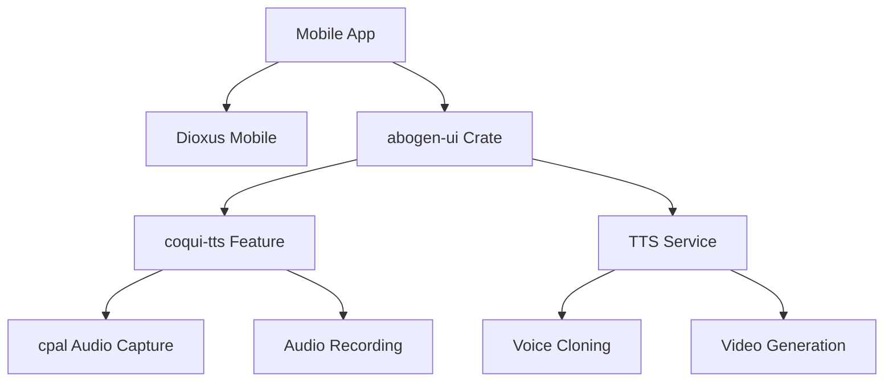
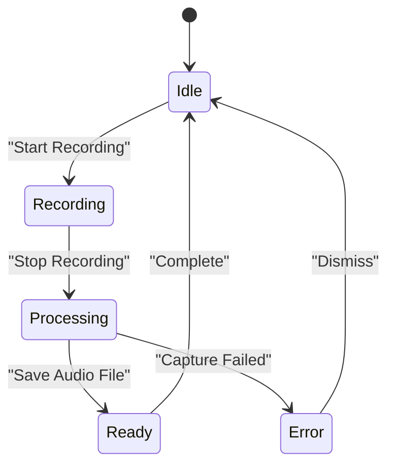
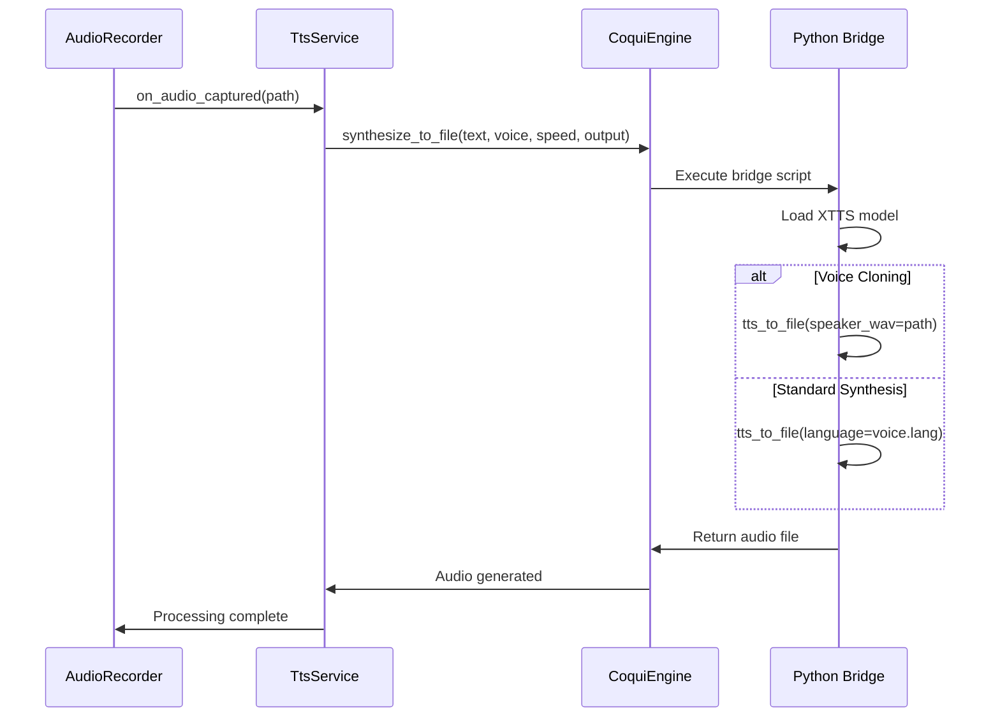

# Building the Mobile Application

<cite>
**Referenced Files in This Document **   
- [mobile/Cargo.toml](file://abogen-ui/apps/mobile/Cargo.toml)
- [mobile/src/main.rs](file://abogen-ui/apps/mobile/src/main.rs)
- [crates/ui/components/audio_recorder.rs](file://abogen-ui/crates/ui/components/audio_recorder.rs)
- [crates/ui/services/file_picker.rs](file://abogen-ui/crates/ui/services/file_picker.rs)
- [crates/ui/services/tts_service.rs](file://abogen-ui/crates/ui/services/tts_service.rs)
- [crates/ui/Cargo.toml](file://abogen-ui/crates/ui/Cargo.toml)
- [Cargo.toml](file://Cargo.toml)
- [src/coqui_tts.rs](file://src/coqui_tts.rs)
- [src/tts.rs](file://src/tts.rs)
- [python/kokoro_bridge.py](file://python/kokoro_bridge.py)
</cite>

## Table of Contents
1. [Introduction](#introduction)
2. [Mobile Toolchain Setup](#mobile-toolchain-setup)
3. [Project Configuration](#project-configuration)
4. [Core Mobile Components](#core-mobile-components)
5. [Mobile-Specific Service Integrations](#mobile-specific-service-integrations)
6. [Deployment and Optimization](#deployment-and-optimization)

## Introduction
This document provides comprehensive guidance for building the VoxWeave mobile application for Android and iOS platforms using Dioxus mobile targets. The application leverages a shared Rust codebase across desktop, web, and mobile platforms, with the mobile variant specifically configured for touch-based interactions, permission handling, and battery-efficient media processing. The implementation supports voice cloning through microphone recording, text-to-speech synthesis, and video generation with AI-powered visuals.

## Mobile Toolchain Setup
To build the mobile application, you must first configure the Rust mobile toolchain with appropriate targets for both Android and iOS platforms. This requires installing the necessary Rust target triples and ensuring the Dioxus CLI tools are properly set up.

For Android development, install the following targets using rustup:
```bash
rustup target add aarch64-linux-android armv7-linux-androideabi
```

For iOS development, install the Darwin targets:
```bash
rustup target add aarch64-apple-ios x86_64-apple-ios
```

Ensure you have the Dioxus CLI installed globally:
```bash
cargo install dioxus-cli
```

The Dioxus CLI provides essential tools for mobile development including project initialization, compilation, and deployment to both physical devices and emulators. Before compiling, verify your Android SDK and NDK are properly configured in your environment, and for iOS development, ensure Xcode and its command-line tools are installed.

**Section sources**
- [mobile/Cargo.toml](file://abogen-ui/apps/mobile/Cargo.toml)
- [Cargo.toml](file://Cargo.toml)

## Project Configuration
The mobile application is configured through the `mobile/Cargo.toml` file, which defines the binary entry point and dependencies. The application depends on the shared `abogen-ui` crate, which contains the core UI components and business logic used across all platforms.

The `mobile/Cargo.toml` specifies the binary name and entry point:
```toml
[[bin]]
name = "abogen-mobile"
path = "src/main.rs"
```

The application imports the shared UI components and enables essential features:
```toml
[dependencies]
dioxus = { workspace = true, features = ["mobile"] }
abogen-ui = { path = "../../crates/ui" }
```

The `abogen-ui` crate itself enables mobile-specific features through its feature flags system, particularly the `coqui-tts` feature which enables voice cloning capabilities. This feature activates optional dependencies like `cpal` for audio capture and `hound` for WAV file writing, both critical for mobile microphone functionality.



**Diagram sources **
- [mobile/Cargo.toml](file://abogen-ui/apps/mobile/Cargo.toml)
- [crates/ui/Cargo.toml](file://abogen-ui/crates/ui/Cargo.toml)

**Section sources**
- [mobile/Cargo.toml](file://abogen-ui/apps/mobile/Cargo.toml)
- [crates/ui/Cargo.toml](file://abogen-ui/crates/ui/Cargo.toml)

## Core Mobile Components
The mobile application's core functionality is implemented through several key components that handle platform-specific interactions. The entry point `main.rs` is minimal, simply launching the shared `App` component from the `abogen-ui` crate.

```rust
use abogen_ui::App;

fn main() {
    dioxus::launch(App);
}
```

The most critical mobile-specific component is the `AudioRecorder`, which enables voice cloning by capturing audio from the device's microphone. This component uses the `cpal` crate to access the audio input device and `hound` to write the captured samples to a WAV file. The recording process runs in a blocking thread to prevent UI freezing, with a fixed duration of 5 seconds.

The component manages several states: `Idle`, `Recording`, `Processing`, `Ready`, and `Error`. During recording, a visual pulse animation provides user feedback. The recorded audio is saved to the device's storage, with the path determined by the `directories` crate. This implementation is conditional on the `coqui-tts` feature flag, allowing the same codebase to compile for web platforms without native audio capture capabilities.



**Diagram sources **
- [mobile/src/main.rs](file://abogen-ui/apps/mobile/src/main.rs)
- [crates/ui/components/audio_recorder.rs](file://abogen-ui/crates/ui/components/audio_recorder.rs)

**Section sources**
- [mobile/src/main.rs](file://abogen-ui/apps/mobile/src/main.rs)
- [crates/ui/components/audio_recorder.rs](file://abogen-ui/crates/ui/components/audio_recorder.rs)

## Mobile-Specific Service Integrations
The application integrates several mobile-specific services to enhance functionality and user experience. These include file picking, text-to-speech synthesis with voice cloning, and video generation with AI-powered visuals.

The `file_picker.rs` service provides a platform-agnostic interface for selecting files. On native platforms (Android and iOS), it would use platform-specific APIs, while on web it would use HTML input elements. Currently, the implementation is stubbed with warning logs, indicating that actual platform integration is pending.

The `tts_service.rs` orchestrates the text-to-speech pipeline, supporting both the Kokoro and Coqui engines. For voice cloning, it routes requests to the Coqui engine when the voice profile specifies `VoiceEngine::Coqui`. The service handles audio format conversion using `ffmpeg` when available, and manages subtitle generation in multiple formats (SRT, ASS, VTT).

The voice cloning workflow involves capturing audio via the `AudioRecorder`, saving it as a WAV file, and using that file as a speaker reference in the Coqui TTS synthesis. The Python bridge script (`kokoro_bridge.py`) executes the Coqui TTS model, passing the speaker WAV file when cloning is enabled. This allows users to generate speech in their own voice or any cloned voice.



**Diagram sources **
- [crates/ui/services/file_picker.rs](file://abogen-ui/crates/ui/services/file_picker.rs)
- [crates/ui/services/tts_service.rs](file://abogen-ui/crates/ui/services/tts_service.rs)
- [src/coqui_tts.rs](file://src/coqui_tts.rs)
- [python/kokoro_bridge.py](file://python/kokoro_bridge.py)

**Section sources**
- [crates/ui/services/file_picker.rs](file://abogen-ui/crates/ui/services/file_picker.rs)
- [crates/ui/services/tts_service.rs](file://abogen-ui/crates/ui/services/tts_service.rs)
- [src/coqui_tts.rs](file://src/coqui_tts.rs)
- [src/tts.rs](file://src/tts.rs)
- [python/kokoro_bridge.py](file://python/kokoro_bridge.py)

## Deployment and Optimization
Deploying the mobile application to physical devices and app stores requires careful attention to bundle size, permission handling, and platform-specific requirements.

To compile for Android:
```bash
cargo build --target aarch64-linux-android --release
```

For iOS:
```bash
cargo build --target aarch64-apple-ios --release
```

The Dioxus CLI can then package the compiled binary into an APK or IPA file suitable for distribution. For Android, ensure the `AndroidManifest.xml` includes microphone permission:
```xml
<uses-permission android:name="android.permission.RECORD_AUDIO" />
```

For iOS, add the appropriate usage description to `Info.plist`:
```xml
<key>NSMicrophoneUsageDescription</key>
<string>This app needs access to your microphone for voice cloning.</string>
```

Bundle size optimization is critical for mobile app store submission. Enable LTO (Link Time Optimization) and size-optimized compilation in `Cargo.toml`:
```toml
[profile.release]
opt-level = "z"
lto = true
codegen-units = 1
strip = true
```

Additionally, consider splitting the binary by architecture to reduce download size, and use app bundles (AAB) for Android to enable Google Play's dynamic delivery. For iOS, enable bitcode and use App Thinning to deliver optimized versions to different device types.

Battery efficiency should be considered during video generation, which is an intensive process. The application should provide progress feedback and allow cancellation, and avoid running video generation in the background to prevent excessive battery drain.

**Section sources**
- [mobile/Cargo.toml](file://abogen-ui/apps/mobile/Cargo.toml)
- [Cargo.toml](file://Cargo.toml)