# Building the UI Application

<cite>
**Referenced Files in This Document**   
- [abogen-ui/Cargo.toml](file://abogen-ui/Cargo.toml)
- [abogen-ui/apps/desktop/Cargo.toml](file://abogen-ui/apps/desktop/Cargo.toml)
- [abogen-ui/apps/mobile/Cargo.toml](file://abogen-ui/apps/mobile/Cargo.toml)
- [abogen-ui/apps/web/Cargo.toml](file://abogen-ui/apps/web/Cargo.toml)
- [abogen-ui/apps/web/Trunk.toml](file://abogen-ui/apps/web/Trunk.toml)
- [abogen-ui/apps/web/index.html](file://abogen-ui/apps/web/index.html)
- [abogen-ui/crates/ui/lib.rs](file://abogen-ui/crates/ui/lib.rs)
- [abogen-ui/crates/ui/theme.rs](file://abogen-ui/crates/ui/theme.rs)
- [abogen-ui/crates/ui/state.rs](file://abogen-ui/crates/ui/state.rs)
- [abogen-ui/crates/ui/components/header.rs](file://abogen-ui/crates/ui/components/header.rs)
- [abogen-ui/crates/ui/components/drop_zone.rs](file://abogen-ui/crates/ui/components/drop_zone.rs)
- [abogen-ui/crates/ui/components/neon_button.rs](file://abogen-ui/crates/ui/components/neon_button.rs)
- [abogen-ui/crates/ui/components/progress_bar.rs](file://abogen-ui/crates/ui/components/progress_bar.rs)
- [abogen-ui/crates/ui/components/log_panel.rs](file://abogen-ui/crates/ui/components/log_panel.rs)
- [abogen-ui/crates/ui/components/queue_modal.rs](file://abogen-ui/crates/ui/components/queue_modal.rs)
- [abogen-ui/crates/ui/components/slider.rs](file://abogen-ui/crates/ui/components/slider.rs)
- [abogen-ui/crates/ui/components/checkbox.rs](file://abogen-ui/crates/ui/components/checkbox.rs)
- [abogen-ui/crates/ui/components/combo.rs](file://abogen-ui/crates/ui/components/combo.rs)
</cite>

## Table of Contents
1. [Introduction](#introduction)
2. [Project Structure](#project-structure)
3. [Core Components](#core-components)
4. [Architecture Overview](#architecture-overview)
5. [Detailed Component Analysis](#detailed-component-analysis)
6. [Dependency Analysis](#dependency-analysis)
7. [Performance Considerations](#performance-considerations)
8. [Troubleshooting Guide](#troubleshooting-guide)
9. [Conclusion](#conclusion)

## Introduction
This document provides comprehensive guidance for building the abogen-ui multi-platform application using Dioxus. It covers platform-specific build instructions for desktop, web, and mobile platforms, explains the monorepo structure of the UI crate, and details configuration requirements. The application features a cyberpunk-themed interface with real-time state management through Dioxus signals, supporting text-to-speech processing, subtitle generation, and video creation with Z.AI integration.

## Project Structure

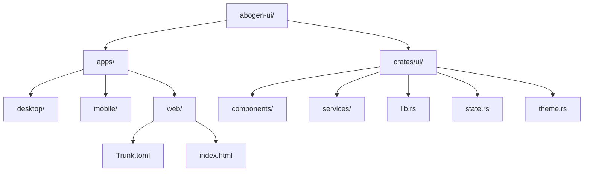

**Diagram sources**
- [abogen-ui/Cargo.toml](file://abogen-ui/Cargo.toml)
- [abogen-ui/apps/web/Trunk.toml](file://abogen-ui/apps/web/Trunk.toml)

**Section sources**
- [abogen-ui/Cargo.toml](file://abogen-ui/Cargo.toml)
- [abogen-ui/apps/desktop/Cargo.toml](file://abogen-ui/apps/desktop/Cargo.toml)
- [abogen-ui/apps/mobile/Cargo.toml](file://abogen-ui/apps/mobile/Cargo.toml)
- [abogen-ui/apps/web/Cargo.toml](file://abogen-ui/apps/web/Cargo.toml)

## Core Components

The abogen-ui application is structured as a monorepo with shared components in the `crates/ui` directory. The core functionality revolves around file processing, voice selection, and video generation with real-time feedback. State management is implemented using Dioxus signals for reactive updates across components. The UI features a cyberpunk aesthetic with neon styling, dark gradients, and Rajdhani font integration.

**Section sources**
- [abogen-ui/crates/ui/lib.rs](file://abogen-ui/crates/ui/lib.rs)
- [abogen-ui/crates/ui/state.rs](file://abogen-ui/crates/ui/state.rs)
- [abogen-ui/crates/ui/theme.rs](file://abogen-ui/crates/ui/theme.rs)

## Architecture Overview

```mermaid
graph TB
subgraph "Platform Applications"
Desktop[Desktop App]
Web[Web App]
Mobile[Mobile App]
end
subgraph "Shared UI Crate"
UI[crates/ui]
Components[Components]
State[State Management]
Theme[Theme System]
Services[Services]
end
Desktop --> UI
Web --> UI
Mobile --> UI
UI --> Components
UI --> State
UI --> Theme
UI --> Services
style UI fill:#1a1a2e,stroke:#00bfff
style Components fill:#16213e,stroke:#ff3ad4
style State fill:#16213e,stroke:#ff3ad4
style Theme fill:#16213e,stroke:#ff3ad4
style Services fill:#16213e,stroke:#ff3ad4
```

**Diagram sources**
- [abogen-ui/Cargo.toml](file://abogen-ui/Cargo.toml)
- [abogen-ui/crates/ui/lib.rs](file://abogen-ui/crates/ui/lib.rs)

## Detailed Component Analysis

### Main Application Structure
The application follows a component-based architecture with a root App component that manages global styles and state. The InnerApp component handles screen navigation between Main and Processing states, with real-time state synchronization through Dioxus signals.

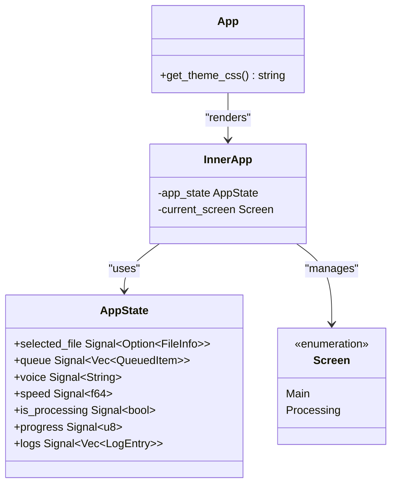

**Diagram sources**
- [abogen-ui/crates/ui/lib.rs](file://abogen-ui/crates/ui/lib.rs)
- [abogen-ui/crates/ui/state.rs](file://abogen-ui/crates/ui/state.rs)

### User Interface Components

#### Header Component
The Header component displays the application logo, version information, and navigation controls with cyberpunk styling.

```mermaid
flowchart TD
Header --> Logo["Logo (gradient square)"]
Header --> Title["Title: abogen v1.1.0"]
Header --> Caret["Caret dropdown indicator"]
style Header fill:#0A0F1A,stroke:#FF3AD4
style Logo fill:#27E8FF,stroke:#FF3AD4
style Title fill:#D7E1FF,stroke:#27E8FF
style Caret fill:#8BA1C7,stroke:#FF3AD4
```

**Diagram sources**
- [abogen-ui/crates/ui/components/header.rs](file://abogen-ui/crates/ui/components/header.rs)

#### Drop Zone Component
The DropZone component enables file selection through drag-and-drop or file browsing, supporting .txt, .epub, and .pdf formats with platform-specific handling.

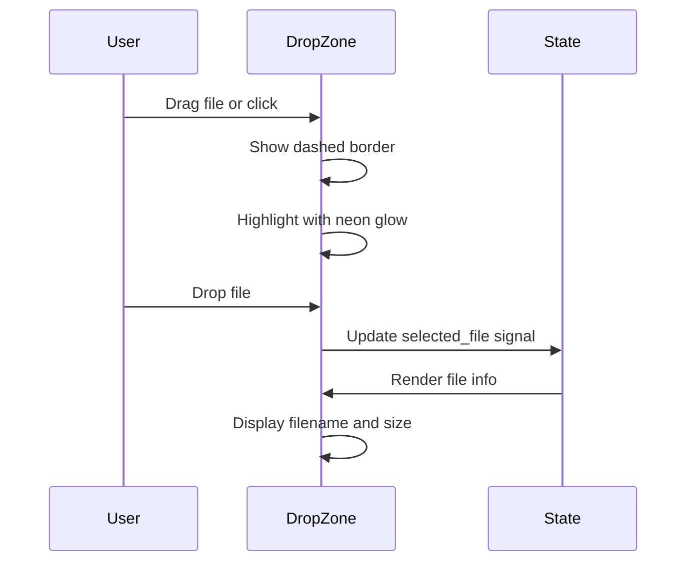

**Diagram sources**
- [abogen-ui/crates/ui/components/drop_zone.rs](file://abogen-ui/crates/ui/components/drop_zone.rs)
- [abogen-ui/crates/ui/state.rs](file://abogen-ui/crates/ui/state.rs)

#### Neon Button Component
The NeonButton component provides styled buttons with hover effects, disabled states, and primary styling options.

```mermaid
classDiagram
class NeonButton {
+onclick EventHandler
+primary bool
+disabled bool
}
NeonButton : CSS classes : neon-btn, primary
NeonButton : Colors : --neon-cyan, --neon-magenta
NeonButton : Effects : glow, transform on hover
```

**Diagram sources**
- [abogen-ui/crates/ui/components/neon_button.rs](file://abogen-ui/crates/ui/components/neon_button.rs)

#### Progress Bar Component
The ProgressBar component visualizes processing progress with percentage display and animated filling.

```mermaid
flowchart LR
ProgressBar --> Container["div.progress"]
Container --> Bar["div.bar"]
Bar --> Percentage["{progress}%"]
style Container fill:#0A0F1A,stroke:#27E8FF
style Bar fill:#39FF14,stroke:#27E8FF
style Percentage fill:#D7E1FF,stroke:#000000
```

**Diagram sources**
- [abogen-ui/crates/ui/components/progress_bar.rs](file://abogen-ui/crates/ui/components/progress_bar.rs)

#### Log Panel Component
The LogPanel component displays processing logs with color-coded entries based on log level.

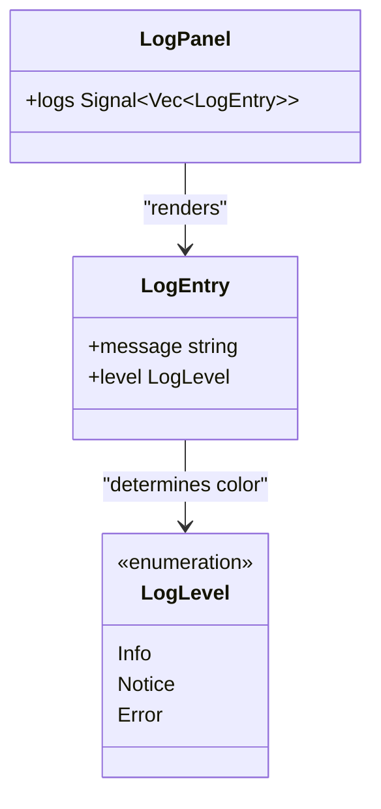

**Diagram sources**
- [abogen-ui/crates/ui/components/log_panel.rs](file://abogen-ui/crates/ui/components/log_panel.rs)
- [abogen-ui/crates/ui/state.rs](file://abogen-ui/crates/ui/state.rs)

#### Queue Modal Component
The QueueModal component provides a comprehensive interface for managing processing queue items with reordering and removal capabilities.

```mermaid
flowchart TD
QueueModal --> Overlay["Fixed overlay"]
Overlay --> Panel["Modal panel"]
Panel --> Header["Queue Management header"]
Panel --> Items["Queue items list"]
Panel --> Controls["Close button"]
Items --> Item["QueuedItem"]
Item --> MoveUp["↑ button"]
Item --> MoveDown["↓ button"]
Item --> Remove["✕ button"]
style QueueModal fill:#00000080,stroke:#FF3AD4
style Panel fill:#0A0F1A,stroke:#FF3AD4
style Item fill:#0A0F1A,stroke:#27E8FF
```

**Diagram sources**
- [abogen-ui/crates/ui/components/queue_modal.rs](file://abogen-ui/crates/ui/components/queue_modal.rs)

#### Slider Component
The Slider component allows adjustment of voice speed with real-time numeric feedback.

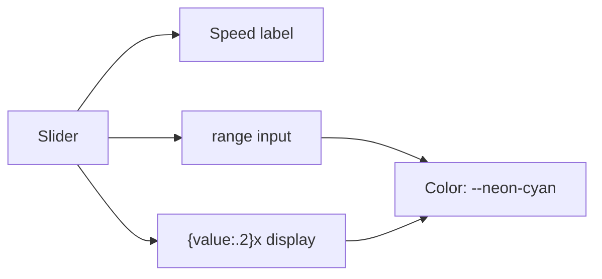

**Diagram sources**
- [abogen-ui/crates/ui/components/slider.rs](file://abogen-ui/crates/ui/components/slider.rs)

#### Checkbox Component
The CheckBox component implements styled checkboxes for boolean options with custom appearance.

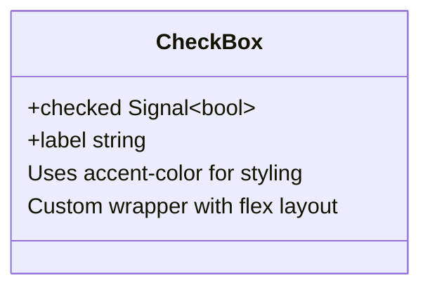

**Diagram sources**
- [abogen-ui/crates/ui/components/checkbox.rs](file://abogen-ui/crates/ui/components/checkbox.rs)

#### Combo Component
The Combo component provides a searchable dropdown for voice selection with filtering capabilities.

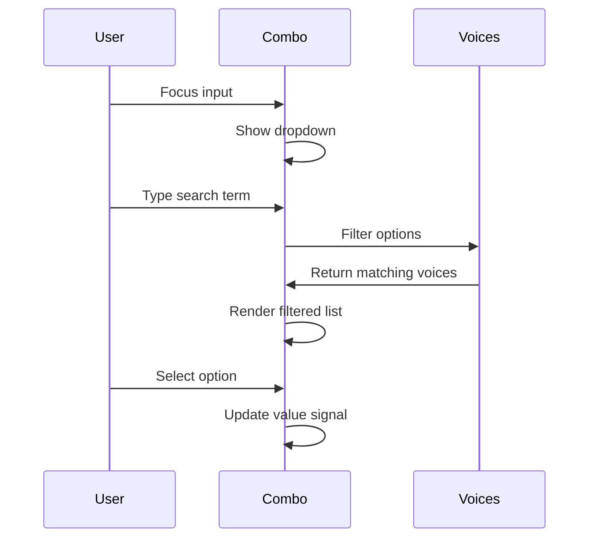

**Diagram sources**
- [abogen-ui/crates/ui/components/combo.rs](file://abogen-ui/crates/ui/components/combo.rs)
- [abogen-ui/crates/ui/services/voices.rs](file://abogen-ui/crates/ui/services/voices.rs)

## Dependency Analysis

```mermaid
graph LR
Dioxus[Dioxus Framework] --> Web[Web Features]
Dioxus --> Desktop[Desktop Features]
Dioxus --> Mobile[Mobile Features]
abogen-ui[abogen-ui] --> Dioxus
abogen-ui --> Serde[Serde]
abogen-ui --> SerdeJson[Serde JSON]
WebApp[Web App] --> Trunk[Trunk Bundler]
WebApp --> WasmBindgen[wasm-bindgen]
WebApp --> WebSys[web-sys]
DesktopApp[Desktop App] --> GPU[GPU Feature]
style Dioxus fill:#1a1a2e,stroke:#00bfff
style Web fill:#16213e,stroke:#27E8FF
style Desktop fill:#16213e,stroke:#FFB300
style Mobile fill:#16213e,stroke:#39FF14
style abogen-ui fill:#0A0F1A,stroke:#FF3AD4
style WebApp fill:#0A0F1A,stroke:#27E8FF
style DesktopApp fill:#0A0F1A,stroke:#FFB300
```

**Diagram sources**
- [abogen-ui/Cargo.toml](file://abogen-ui/Cargo.toml)
- [abogen-ui/apps/web/Cargo.toml](file://abogen-ui/apps/web/Cargo.toml)
- [abogen-ui/apps/desktop/Cargo.toml](file://abogen-ui/apps/desktop/Cargo.toml)
- [abogen-ui/apps/mobile/Cargo.toml](file://abogen-ui/apps/mobile/Cargo.toml)

## Performance Considerations

The application's performance characteristics vary significantly across platforms due to different compilation targets and runtime environments. WebAssembly compilation requires optimization for bundle size and load time, while mobile deployments need careful memory management. The desktop application benefits from native compilation but requires proper GPU acceleration handling.

For WebAssembly builds, the Trunk configuration optimizes asset bundling and enables efficient serving. The release profile in Cargo.toml specifies LTO and full optimization to minimize WASM size. Mobile builds require proper target configuration and may need additional platform-specific optimizations for smooth rendering.

**Section sources**
- [abogen-ui/Cargo.toml](file://abogen-ui/Cargo.toml)
- [abogen-ui/apps/web/Trunk.toml](file://abogen-ui/apps/web/Trunk.toml)

## Troubleshooting Guide

Common build issues include missing web targets, asset bundling errors, and platform-specific compilation problems. Ensure the Dioxus CLI and Trunk are properly installed before building. For web builds, verify that the wasm32-unknown-unknown target is installed via rustup. Check Trunk.toml configuration for correct dist and target settings.

When encountering asset loading issues, verify the index.html file correctly references the main div element and that Trunk can locate the source files. For desktop builds, ensure all native dependencies are available. Mobile builds may require additional platform SDKs and proper target triple configuration.

**Section sources**
- [abogen-ui/apps/web/Trunk.toml](file://abogen-ui/apps/web/Trunk.toml)
- [abogen-ui/apps/web/index.html](file://abogen-ui/apps/web/index.html)
- [abogen-ui/Cargo.toml](file://abogen-ui/Cargo.toml)

## Conclusion
The abogen-ui application demonstrates a robust multi-platform implementation using Dioxus, leveraging a shared UI crate for consistent design across desktop, web, and mobile platforms. The cyberpunk-themed interface, powered by custom CSS variables and neon styling, provides a distinctive user experience. Real-time state management through Dioxus signals enables responsive interactions, while the modular component architecture ensures maintainability and reusability. With proper configuration and build tooling, the application can be successfully deployed across all target platforms.