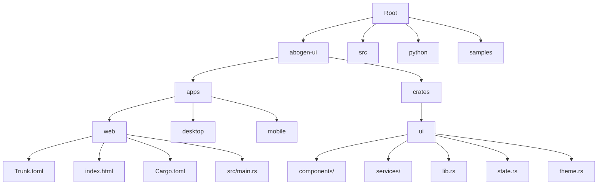
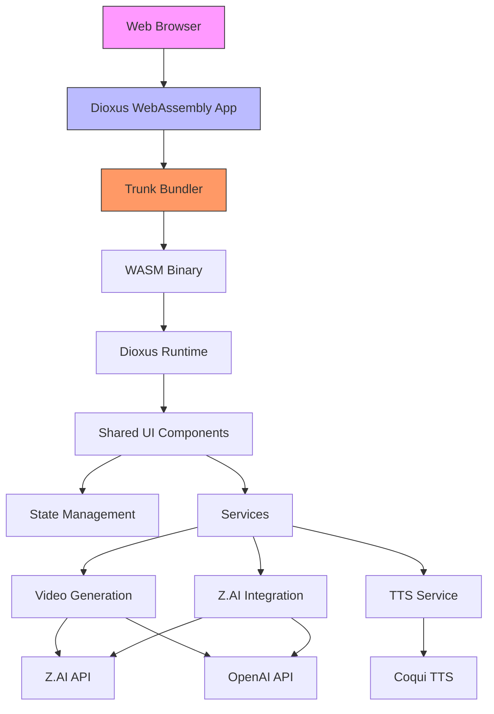
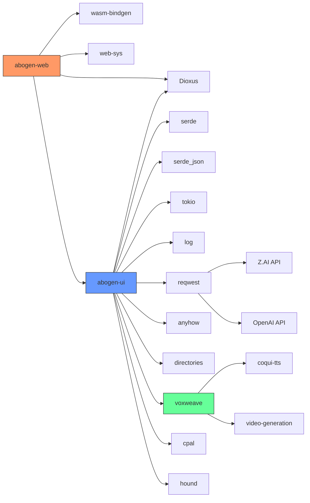

# Building the Web Application

<cite>
**Referenced Files in This Document**   
- [Trunk.toml](file://abogen-ui/apps/web/Trunk.toml)
- [index.html](file://abogen-ui/apps/web/index.html)
- [Cargo.toml](file://abogen-ui/apps/web/Cargo.toml)
- [main.rs](file://abogen-ui/apps/web/src/main.rs)
- [Cargo.toml](file://abogen-ui/crates/ui/Cargo.toml)
- [lib.rs](file://abogen-ui/crates/ui/lib.rs)
- [zai_video.rs](file://abogen-ui/crates/ui/services/zai_video.rs)
- [video.rs](file://src/video.rs)
</cite>

## Table of Contents
1. [Introduction](#introduction)
2. [Project Structure](#project-structure)
3. [Core Components](#core-components)
4. [Architecture Overview](#architecture-overview)
5. [Detailed Component Analysis](#detailed-component-analysis)
6. [Dependency Analysis](#dependency-analysis)
7. [Performance Considerations](#performance-considerations)
8. [Troubleshooting Guide](#troubleshooting-guide)
9. [Conclusion](#conclusion)

## Introduction
This document provides comprehensive guidance on building the web application using Trunk as the bundler and Dioxus for rendering WebAssembly. It covers installation, configuration, development workflows, feature integration, and common web-specific issues. The application is part of a cross-platform GUI built with Rust and Dioxus, featuring a cyberpunk aesthetic with neon accents and dark UI elements.

## Project Structure



**Diagram sources**
- [Trunk.toml](file://abogen-ui/apps/web/Trunk.toml)
- [Cargo.toml](file://abogen-ui/apps/web/Cargo.toml)
- [lib.rs](file://abogen-ui/crates/ui/lib.rs)

**Section sources**
- [Trunk.toml](file://abogen-ui/apps/web/Trunk.toml)
- [Cargo.toml](file://abogen-ui/apps/web/Cargo.toml)
- [lib.rs](file://abogen-ui/crates/ui/lib.rs)

## Core Components

The web application consists of several core components that work together to provide a seamless user experience. The entry point is defined in `main.rs` which launches the Dioxus application. The shared UI components are located in the `crates/ui` directory and are used across all platforms (web, desktop, mobile). The application uses Trunk as the bundler for WebAssembly builds, with configuration specified in `Trunk.toml`.

The UI crate exposes various components including audio recorder, checkbox, combo box, drop zone, header, log panel, neon button, progress bar, queue modal, and slider. Services provided include file picker, GPU probe, MLT video processing, TTS service, voices management, video generation, and Z.AI video integration.

**Section sources**
- [main.rs](file://abogen-ui/apps/web/src/main.rs)
- [lib.rs](file://abogen-ui/crates/ui/lib.rs)
- [components/](file://abogen-ui/crates/ui/components/)
- [services/](file://abogen-ui/crates/ui/services/)

## Architecture Overview



**Diagram sources**
- [main.rs](file://abogen-ui/apps/web/src/main.rs)
- [lib.rs](file://abogen-ui/crates/ui/lib.rs)
- [zai_video.rs](file://abogen-ui/crates/ui/services/zai_video.rs)
- [video.rs](file://src/video.rs)

## Detailed Component Analysis

### Web Application Configuration
The web application is configured through multiple files that work together to define the build process, dependencies, and runtime behavior.

#### Trunk Configuration
The `Trunk.toml` file configures the Trunk bundler with the following settings:
- **build.target**: Specifies the entry HTML file as "index.html"
- **build.dist**: Sets the distribution directory to "dist"
- **serve.addresses**: Configures the server to listen on all interfaces ("0.0.0.0")
- **serve.port**: Sets the development server port to 8080
- **serve.open**: Automatically opens the browser when starting the server
- **watch.watch**: Specifies directories and files to watch for changes during development, including "src", "../../crates/ui/src", and "index.html"

This configuration enables live reloading during development when any of the watched files change.

**Section sources**
- [Trunk.toml](file://abogen-ui/apps/web/Trunk.toml)

#### HTML Structure
The `index.html` file provides the basic structure for the web application:
- Uses UTF-8 character encoding
- Includes viewport meta tag for responsive design
- Sets the title to "abogen v1.1.0"
- Applies Rajdhani font from Google Fonts with sans-serif fallback
- Contains a single div with id "main" where the Dioxus application is mounted

The minimal HTML structure allows Dioxus to take control of the DOM and render the application components.

**Section sources**
- [index.html](file://abogen-ui/apps/web/index.html)

#### Cargo Configuration
The `Cargo.toml` file in the web application directory defines:
- Package name as "abogen-web"
- Workspace-managed version and edition
- Binary target with entry point at "src/main.rs"
- Dependencies including Dioxus with web feature, wasm-bindgen, web-sys, and the shared abogen-ui crate

The shared UI crate is referenced via a relative path to enable code sharing across platforms.

**Section sources**
- [Cargo.toml](file://abogen-ui/apps/web/Cargo.toml)

### Shared UI Components
The shared UI components are defined in the `crates/ui` directory and are used across all platform-specific applications.

#### UI Crate Configuration
The `Cargo.toml` file for the UI crate specifies:
- Package name as "abogen-ui"
- Workspace-managed version and edition
- Library name as "abogen_ui"
- Dependencies including Dioxus with web, desktop, and mobile features
- Optional dependencies for reqwest (with json and multipart features) and audio processing libraries (cpal, hound)
- Feature flags including:
  - **gpu**: Enables GPU acceleration probe
  - **real-tts**: Enables real TTS backend with Kokoro
  - **video-generation**: Enables video generation with Z.AI API (requires reqwest)
  - **zai-video**: Enables enhanced Z.AI video generation with style presets and MLT composition (depends on reqwest and video-generation)
  - **coqui-tts**: Enables Coqui TTS integration (depends on cpal and hound)

These feature flags allow conditional compilation of functionality based on the target platform and requirements.

**Section sources**
- [Cargo.toml](file://abogen-ui/crates/ui/Cargo.toml)

#### Application Entry Point
The `lib.rs` file in the UI crate defines the root application component:
- Exposes all modules (components, state, theme, services)
- Defines the `App` component that serves as the entry point
- Injects global styles using the theme CSS
- Manages application state with `AppState`
- Handles navigation between main screen and processing screen
- Implements the processing workflow with async task spawning

The application follows a component-based architecture with clear separation of concerns between UI components and business logic.

**Section sources**
- [lib.rs](file://abogen-ui/crates/ui/lib.rs)

## Dependency Analysis



**Diagram sources**
- [Cargo.toml](file://abogen-ui/apps/web/Cargo.toml)
- [Cargo.toml](file://abogen-ui/crates/ui/Cargo.toml)
- [Cargo.toml](file://Cargo.toml)

**Section sources**
- [Cargo.toml](file://abogen-ui/apps/web/Cargo.toml)
- [Cargo.toml](file://abogen-ui/crates/ui/Cargo.toml)
- [Cargo.toml](file://Cargo.toml)

## Performance Considerations

### WASM Bundle Optimization
To optimize the WASM bundle size:
- Use feature flags to include only required functionality
- Enable dead code elimination in release builds
- Consider lazy loading of heavy components like video generation
- Minimize dependencies in the web-specific build
- Use Trunk's built-in optimization features

### Development Workflow
The development workflow involves:
1. Installing Trunk: `cargo install trunk`
2. Running the development server: `trunk serve` from the web application directory
3. Accessing the application at http://localhost:8080
4. Utilizing live reload capabilities when source files change

### Production Builds
Generate production builds using:
```bash
trunk build --release
```
This command creates optimized assets in the "dist" directory as specified in Trunk.toml.

### Common Web Issues
#### WASM Compilation
Ensure all dependencies support the wasm32-unknown-unknown target. Use conditional compilation with cfg attributes for platform-specific code.

#### Asset Loading
Verify that all assets are properly referenced and available in the distribution directory. Use relative paths and consider asset hashing for cache busting.

#### CORS Issues
When calling external APIs (Z.AI, OpenAI):
- Ensure proper CORS headers are configured on the server side
- Use appropriate authentication (API keys in headers)
- Handle preflight requests correctly
- Implement proper error handling for network failures

#### Browser Compatibility
Test across modern browsers (Chrome, Firefox, Safari, Edge). The application requires WebAssembly support which is available in all modern browsers.

**Section sources**
- [Trunk.toml](file://abogen-ui/apps/web/Trunk.toml)
- [Cargo.toml](file://abogen-ui/apps/web/Cargo.toml)
- [Cargo.toml](file://abogen-ui/crates/ui/Cargo.toml)

## Troubleshooting Guide

### Environment Variables
Ensure required environment variables are set:
- ZAI_API_KEY or OPENAI_API_KEY for video generation
- Properly configure API endpoints based on the selected service

### Feature Flag Issues
When using feature flags like 'video-generation' or 'coqui-tts':
- Verify the features are enabled in Cargo.toml
- Check that required dependencies are available
- Ensure conditional code is properly guarded with cfg attributes

### Build Errors
Common build errors and solutions:
- **WASM compilation failures**: Check target support and dependency compatibility
- **Missing symbols**: Verify feature flag configuration and conditional compilation
- **Linking errors**: Ensure all native dependencies are available for the target platform

**Section sources**
- [Cargo.toml](file://abogen-ui/crates/ui/Cargo.toml)
- [video.rs](file://src/video.rs)
- [zai_video.rs](file://abogen-ui/crates/ui/services/zai_video.rs)

## Conclusion
The web application is successfully configured to use Trunk as the bundler and Dioxus for WebAssembly rendering. The build process is well-defined with clear configuration in Trunk.toml and Cargo.toml files. The shared UI architecture enables code reuse across platforms while allowing platform-specific optimizations. Feature flags provide flexibility in including functionality like video generation and Coqui TTS. The development workflow with live reloading and production build processes are properly established, making it straightforward to develop and deploy the application.