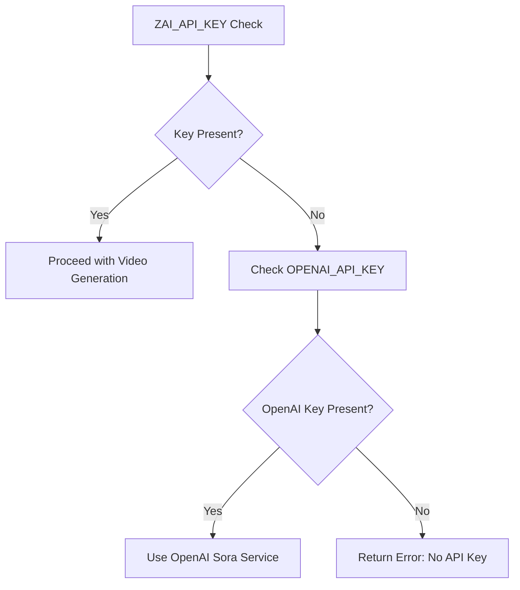
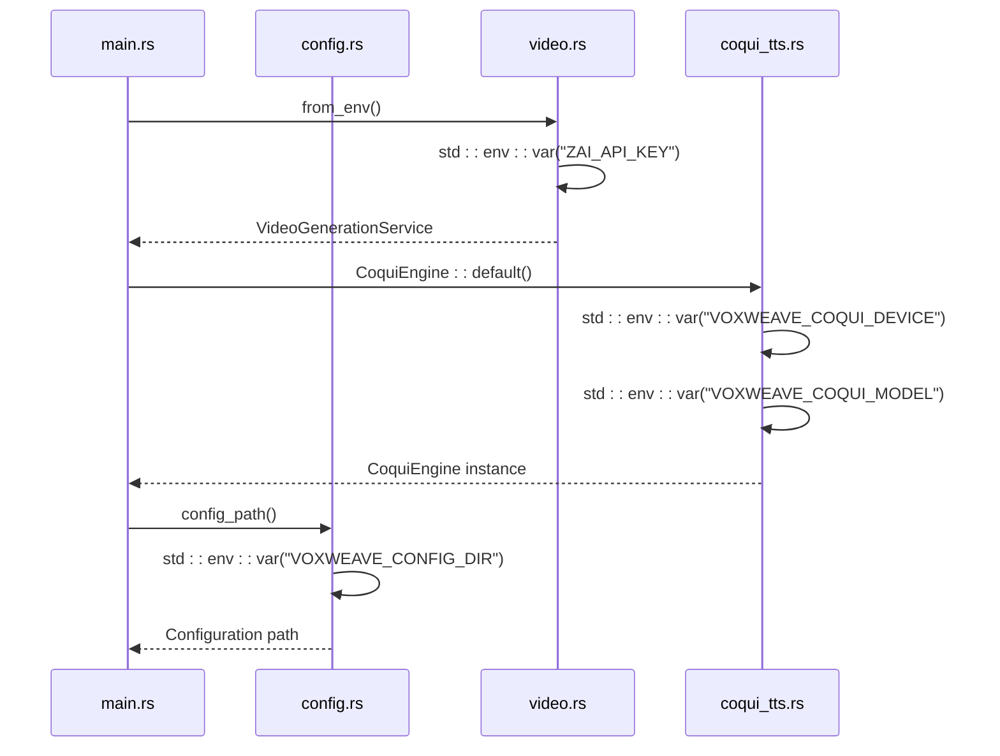

# Environment Configuration

<cite>
**Referenced Files in This Document**   
- [src/config.rs](file://src/config.rs)
- [src/main.rs](file://src/main.rs)
- [src/video.rs](file://src/video.rs)
- [src/coqui_tts.rs](file://src/coqui_tts.rs)
- [abogen-ui/crates/ui/services/zai_video.rs](file://abogen-ui/crates/ui/services/zai_video.rs)
- [QUICKSTART.md](file://QUICKSTART.md)
</cite>

## Table of Contents
1. [Introduction](#introduction)
2. [Core Environment Variables](#core-environment-variables)
3. [Configuration Loading and Validation](#configuration-loading-and-validation)
4. [Runtime Configuration Workflows](#runtime-configuration-workflows)
5. [Fallback Behaviors and Default Values](#fallback-behaviors-and-default-values)
6. [Security Considerations](#security-considerations)
7. [Cross-Platform Environment Differences](#cross-platform-environment-differences)
8. [Troubleshooting Configuration Issues](#troubleshooting-configuration-issues)
9. [Example Configuration Files](#example-configuration-files)

## Introduction

This document provides comprehensive guidance for configuring the runtime environment of VoxWeave, a text-to-speech and video generation system. The configuration system relies on environment variables to control key aspects of the application's behavior, including API access, model selection, device usage, and output paths. Understanding how these variables are loaded, validated, and used throughout the system is essential for both CLI and UI operation. This guide details all environment variables, their validation mechanisms in `src/config.rs` and `src/main.rs`, fallback behaviors, and practical usage patterns.

## Core Environment Variables

VoxWeave utilizes several environment variables to configure its runtime behavior, with distinct variables serving different subsystems. These variables are accessed through Rust's `std::env::var` function and provide critical configuration for video generation, TTS model selection, and output management.

### ZAI_API_KEY for Z.AI Video Generation

The `ZAI_API_KEY` environment variable provides authentication credentials for accessing the Z.AI video generation API. This key is required when using the video generation feature and is validated at runtime before any API calls are made.



**Diagram sources**  
- [src/video.rs](file://src/video.rs#L53-L54)
- [abogen-ui/crates/ui/services/zai_video.rs](file://abogen-ui/crates/ui/services/zai_video.rs#L51)

**Section sources**  
- [src/video.rs](file://src/video.rs#L53-L54)
- [src/main.rs](file://src/main.rs#L306-L307)

### VOXWEAVE_COQUI_DEVICE for CPU/GPU Specification

The `VOXWEAVE_COQUI_DEVICE` environment variable specifies whether the CoquiTTS engine should run on CPU or GPU. This allows users to optimize performance based on their hardware capabilities, with "cpu" and "gpu" as valid values.

### VOXWEAVE_COQUI_MODEL for Model Override

The `VOXWEAVE_COQUI_MODEL` environment variable allows users to override the default CoquiTTS model. By default, the system uses "tts_models/multilingual/multi-dataset/xtts_v2", but this can be customized to any compatible model available in the Coqui TTS repository.

### VOXWEAVE_OUTPUT_DIR for Custom Output Paths

The `VOXWEAVE_OUTPUT_DIR` environment variable specifies a custom directory for configuration files. When set, it overrides the default system-specific configuration directory, allowing for portable or customized configuration storage.

## Configuration Loading and Validation

The configuration system in VoxWeave follows a structured approach to loading and validating environment variables, ensuring robust operation across different deployment scenarios.

### Environment Variable Access Pattern

Environment variables are accessed using Rust's standard library `std::env::var` function, which returns a `Result<String, VarError>`. The system consistently uses the `unwrap_or_else` pattern to provide default values when variables are not set, ensuring graceful degradation.



**Diagram sources**  
- [src/main.rs](file://src/main.rs#L321-L331)
- [src/video.rs](file://src/video.rs#L53-L54)
- [src/coqui_tts.rs](file://src/coqui_tts.rs#L20-L22)
- [src/config.rs](file://src/config.rs#L20-L25)

**Section sources**  
- [src/video.rs](file://src/video.rs#L53-L54)
- [src/coqui_tts.rs](file://src/coqui_tts.rs#L20-L22)

### Validation in Video Generation Service

The `VideoGenerationService::from_env()` method in `src/video.rs` implements a validation chain that first attempts to use `OPENAI_API_KEY` and falls back to `ZAI_API_KEY`. If neither is present, it returns an error, preventing unauthorized API access.

## Runtime Configuration Workflows

VoxWeave supports both CLI and UI usage patterns, with environment variables playing a critical role in both workflows.

### CLI Configuration Workflow

For CLI usage, environment variables are typically set in the shell before running commands. The QUICKSTART.md guide provides examples of the recommended workflow:

1. Set the `ZAI_API_KEY` environment variable
2. Run the build process with `cargo build`
3. Execute video generation commands

```bash
export ZAI_API_KEY=your_api_key_here
cargo build
./target/debug/voxweave video samples/example.txt --style cyberpunk
```

**Section sources**  
- [QUICKSTART.md](file://QUICKSTART.md#L306-L307)
- [src/main.rs](file://src/main.rs#L306-L307)

### UI Configuration Workflow

In the UI context, the `ZaiVideoService::from_env()` method in `abogen-ui/crates/ui/services/zai_video.rs` attempts to read `ZAI_API_KEY` and returns `None` if not found. This allows the UI to gracefully handle missing credentials by disabling video generation features rather than failing outright.

## Fallback Behaviors and Default Values

The system implements thoughtful fallback behaviors to ensure usability even when environment variables are not explicitly set.

### CoquiTTS Configuration Defaults

When environment variables for CoquiTTS are not set, the system provides sensible defaults:

- `VOXWEAVE_COQUI_DEVICE`: Defaults to "cpu" for broad compatibility
- `VOXWEAVE_COQUI_MODEL`: Defaults to "tts_models/multilingual/multi-dataset/xtts_v2"
- `VOXWEAVE_COQUI_SAMPLE_RATE`: Defaults to 24,000 Hz
- `VOXWEAVE_COQUI_LANGUAGE`: Defaults to "en" (English)

These defaults are implemented in the `CoquiEngine::default()` implementation, which uses `unwrap_or_else` for string values and additional parsing for numeric values.

### Video API Key Fallback Chain

The video generation system implements a hierarchical fallback for API keys:

1. First, attempt to use `OPENAI_API_KEY`
2. If not present, fall back to `ZAI_API_KEY`
3. If neither is present, return an error

This design allows the system to support multiple video generation providers while maintaining backward compatibility.

## Security Considerations

Proper management of environment variables, particularly API keys, is critical for system security.

### API Key Storage Best Practices

The `ZAI_API_KEY` should never be hardcoded in source files or committed to version control. Instead, use one of these secure methods:

- Shell export in user profile (`.bashrc`, `.zshrc`)
- Environment file (`.env`) with proper file permissions
- Environment management tools like `direnv`
- CI/CD secret management systems

### Runtime Security

The system validates API keys at runtime rather than build time, preventing accidental exposure of keys in compiled binaries. The keys are only accessed when video generation is explicitly requested, minimizing the attack surface.

## Cross-Platform Environment Differences

Environment variable handling differs between Windows and Unix-like systems, requiring attention to platform-specific considerations.

### Shell Command Differences

- **Unix shells (bash, zsh)**: Use `export ZAI_API_KEY=value`
- **Windows Command Prompt**: Use `set ZAI_API_KEY=value`
- **Windows PowerShell**: Use `$env:ZAI_API_KEY = "value"`

### Path Handling

The `VOXWEAVE_OUTPUT_DIR` variable must use platform-appropriate path separators:
- Unix: `/path/to/output`
- Windows: `C:\path\to\output` or `/c/path/to/output` in Git Bash

## Troubleshooting Configuration Issues

Common configuration-related failures can be diagnosed and resolved using the following guidance.

### Unauthorized API Errors

If encountering unauthorized API errors:

1. Verify the `ZAI_API_KEY` is correctly set: `echo $ZAI_API_KEY`
2. Check for leading/trailing whitespace in the key
3. Ensure the key has not expired or been revoked
4. Test with a known working key if available

### Model Loading Timeouts

For CoquiTTS model loading timeouts:

1. Verify internet connectivity (models are downloaded on first use)
2. Check available disk space (models can be several GB)
3. Consider using CPU instead of GPU if experiencing driver issues
4. Pre-download models to avoid timeouts during generation

### Missing Environment Variable Warnings

The system provides clear warnings when required variables are missing:

```text
⚠️  Video generation requires ZAI_API_KEY environment variable
   Set it with: export ZAI_API_KEY=your_api_key_here
```

These messages guide users toward resolution without failing silently.

## Example Configuration Files

### Sample .env File

```env
# VoxWeave Configuration
ZAI_API_KEY=sk-xxxxxxxxxxxxxxxxxxxxxxxxxxxxxxxxxxxxxxxx
VOXWEAVE_COQUI_DEVICE=gpu
VOXWEAVE_COQUI_MODEL=tts_models/en/vctk/vits
VOXWEAVE_OUTPUT_DIR=./custom_output
```

### Shell Export Commands

```bash
# Set environment variables for current session
export ZAI_API_KEY="your_actual_api_key_here"
export VOXWEAVE_COQUI_DEVICE="gpu"
export VOXWEAVE_COQUI_MODEL="tts_models/multilingual/multi-dataset/xtts_v2"
export VOXWEAVE_OUTPUT_DIR="/path/to/custom/output"

# Verify settings
echo "ZAI_API_KEY set: ${ZAI_API_KEY:+yes}${ZAI_API_KEY:+no}"
echo "COQUI device: $VOXWEAVE_COQUI_DEVICE"
```