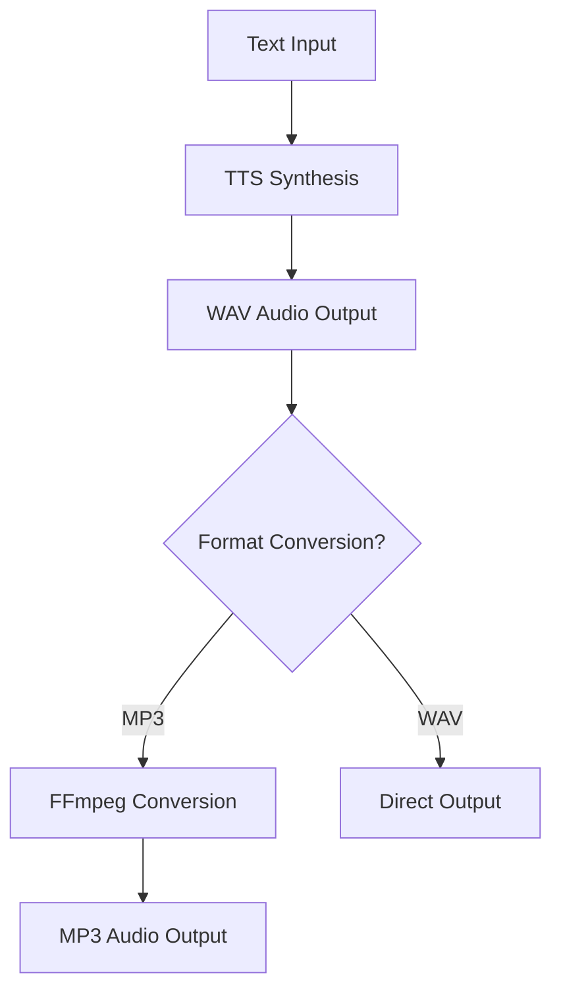
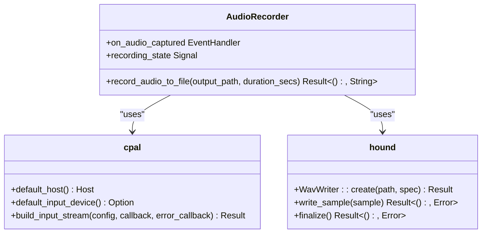
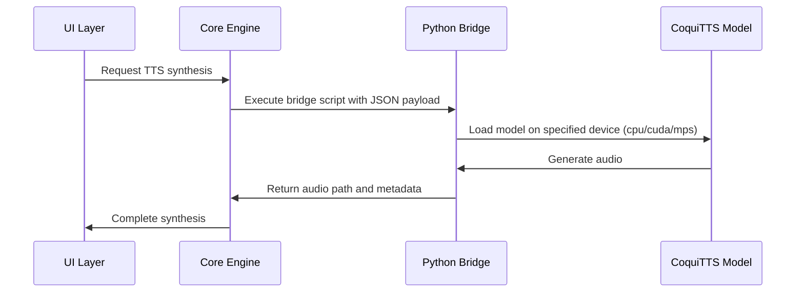

# Prerequisites

<cite>
**Referenced Files in This Document**   
- [abogen-ui/README.md](file://abogen-ui/README.md)
- [COQUI_USAGE_GUIDE.md](file://COQUI_USAGE_GUIDE.md)
- [Cargo.toml](file://Cargo.toml)
- [src/tts.rs](file://src/tts.rs)
- [src/coqui_tts.rs](file://src/coqui_tts.rs)
- [abogen-ui/crates/ui/components/audio_recorder.rs](file://abogen-ui/crates/ui/components/audio_recorder.rs)
- [abogen-ui/crates/ui/services/tts_service.rs](file://abogen-ui/crates/ui/services/tts_service.rs)
- [run_demo.sh](file://run_demo.sh)
</cite>

## Table of Contents
1. [Introduction](#introduction)
2. [Core Software Dependencies](#core-software-dependencies)
3. [System-Level Dependencies](#system-level-dependencies)
4. [Platform-Specific Installation Instructions](#platform-specific-installation-instructions)
5. [GPU Acceleration Requirements](#gpu-acceleration-requirements)
6. [Verification Commands](#verification-commands)
7. [Common Pitfalls and Solutions](#common-pitfalls-and-solutions)

## Introduction
VoxWeave is a cross-platform text-to-speech and video generation application built with Rust and Python components. This document outlines the prerequisites required to install and run VoxWeave, detailing the necessary software versions, system dependencies, and platform-specific installation instructions. The system relies on Rust for core and UI compilation, Python for CoquiTTS integration and voice cloning, and system-level tools for audio processing and format conversion.

## Core Software Dependencies

### Rust 1.80+ with Cargo
Rust is used for compiling the core VoxWeave application and the Dioxus-based UI framework. The project requires Rust 1.80 or later with Cargo as the package manager.

The `Cargo.toml` files in both the root directory and `abogen-ui/` directory define the project dependencies and features. The workspace uses Dioxus 0.7 for the UI framework, which requires Rust 1.80+.

**Role in System**: Rust compiles the core application logic, TTS engine integration, and the cross-platform UI. The build process creates native binaries for desktop platforms and WebAssembly for web deployment.

**Section sources**
- [Cargo.toml](file://Cargo.toml#L1-L27)
- [abogen-ui/Cargo.toml](file://abogen-ui/Cargo.toml#L1-L25)

### Python 3.8+ with pip
Python is essential for the CoquiTTS integration, which provides advanced text-to-speech capabilities including voice cloning. The system requires Python 3.9+ as specified in the usage guide.

The Python bridge is implemented in `src/tts.rs` as an inline script (`COQUI_BRIDGE_SCRIPT`) that communicates with the TTS model via stdin/stdout. This bridge enables voice synthesis using the Coqui TTS library.

**Role in System**: Python executes the CoquiTTS model for speech synthesis and voice cloning. The `kokoro_bridge.py` script in the `python/` directory provides similar functionality for the Kokoro TTS engine.

**Section sources**
- [COQUI_USAGE_GUIDE.md](file://COQUI_USAGE_GUIDE.md#L1-L673)
- [src/tts.rs](file://src/tts.rs#L480-L522)
- [python/kokoro_bridge.py](file://python/kokoro_bridge.py)

## System-Level Dependencies

### espeak-ng
espeak-ng is a compact open-source speech synthesizer used as a fallback TTS engine when CoquiTTS is not available.

The `EspeakEngine` implementation in `src/tts.rs` calls the `espeak` command via subprocess, using configurable parameters for voice selection and speech rate. The command path can be overridden with the `VOXWEAVE_ESPEAK_COMMAND` environment variable.

**Role in System**: Provides basic text-to-speech functionality for testing and fallback scenarios. It's used when the CoquiTTS feature is not enabled or when Python dependencies are not installed.

**Section sources**
- [src/tts.rs](file://src/tts.rs#L270-L320)
- [run_demo.sh](file://run_demo.sh#L37)

### FFmpeg
FFmpeg is used for audio format conversion in the UI layer. The `convert_audio_format` function in the TTS service converts WAV output to MP3 format using FFmpeg.

The implementation checks for the target architecture and only executes FFmpeg on non-WASM platforms, as format conversion is not supported in the web environment.

**Role in System**: Converts synthesized audio from WAV format to other formats like MP3 based on user preferences. This enables smaller file sizes and broader compatibility with audio players.



**Diagram sources**
- [abogen-ui/crates/ui/services/tts_service.rs](file://abogen-ui/crates/ui/services/tts_service.rs#L70-L103)

## Platform-Specific Installation Instructions

### Linux
On Linux systems, install the required dependencies using the package manager:

```bash
# Install Rust and Cargo
curl --proto '=https' --tlsv1.2 -sSf https://sh.rustup.rs | sh

# Install Python and pip
sudo apt update && sudo apt install python3 python3-pip

# Install system dependencies
sudo apt install espeak-ng ffmpeg

# Install audio recording dependencies
sudo apt install libasound2-dev
```

The `cpal` crate used for audio recording requires ALSA development headers on Linux systems.

**Section sources**
- [abogen-ui/crates/ui/components/audio_recorder.rs](file://abogen-ui/crates/ui/components/audio_recorder.rs#L25-L141)
- [abogen-ui/Cargo.lock](file://abogen-ui/Cargo.lock#L794-L851)

### macOS
On macOS, use Homebrew to install the required dependencies:

```bash
# Install Homebrew (if not already installed)
/bin/bash -c "$(curl -fsSL https://raw.githubusercontent.com/Homebrew/install/HEAD/install.sh)"

# Install Rust and Cargo
brew install rust

# Install Python and pip
brew install python3

# Install system dependencies
brew install espeak-ng ffmpeg

# Install audio recording dependencies
brew install core-audio
```

The audio recording functionality uses the `coreaudio-rs` crate, which interfaces with macOS's Core Audio framework.



**Diagram sources**
- [abogen-ui/crates/ui/components/audio_recorder.rs](file://abogen-ui/crates/ui/components/audio_recorder.rs#L25-L141)
- [abogen-ui/Cargo.lock](file://abogen-ui/Cargo.lock#L743-L851)

### Windows (via WSL)
For Windows users, we recommend using Windows Subsystem for Linux (WSL) to run VoxWeave:

```bash
# Install WSL2
wsl --install

# Update package list
sudo apt update

# Install Rust and Cargo
curl --proto '=https' --tlsv1.2 -sSf https://sh.rustup.rs | sh

# Install Python and pip
sudo apt install python3 python3-pip

# Install system dependencies
sudo apt install espeak-ng ffmpeg

# Install audio dependencies
sudo apt install libasound2-dev
```

Note that audio recording may require additional configuration in WSL to access the host system's microphone.

**Section sources**
- [abogen-ui/README.md](file://abogen-ui/README.md#L1-L229)
- [COQUI_USAGE_GUIDE.md](file://COQUI_USAGE_GUIDE.md#L1-L673)

## GPU Acceleration Requirements

### CUDA and cuDNN for NVIDIA GPUs
When using CoquiTTS with GPU acceleration on NVIDIA hardware, CUDA and cuDNN are required. The system uses PyTorch as the backend for CoquiTTS, which can leverage CUDA for faster inference.

The `CoquiEngine` implementation checks for CUDA availability through the `torch.cuda.is_available()` function in the Python bridge script. Users should install the CUDA-enabled version of PyTorch:

```bash
pip install torch torchvision torchaudio --index-url https://download.pytorch.org/whl/cu118
```

The device can be specified using the `VOXWEAVE_COQUI_DEVICE` environment variable:

```bash
export VOXWEAVE_COQUI_DEVICE="cuda"
```

### Apple Silicon (MPS) Support
For Apple Silicon Macs, PyTorch automatically uses the Metal Performance Shaders (MPS) backend when available. No additional installation is required beyond the standard PyTorch package.

Users can explicitly set the device to MPS:

```bash
export VOXWEAVE_COQUI_DEVICE="mps"
```

The CoquiEngine respects this environment variable and passes it to the Python bridge for model loading.



**Diagram sources**
- [src/coqui_tts.rs](file://src/coqui_tts.rs#L1-L115)
- [src/tts.rs](file://src/tts.rs#L480-L522)

## Verification Commands

After installation, verify each component with the following commands:

```bash
# Verify Rust and Cargo installation
rustc --version
cargo --version

# Verify Python and pip installation
python3 --version
pip3 --version

# Verify espeak-ng installation
espeak-ng --version

# Verify FFmpeg installation
ffmpeg -version

# Verify CoquiTTS Python dependencies
python3 -c "import TTS, torch, numpy; print('Coqui dependencies OK')"

# Test CoquiTTS installation
python3 test_coqui.py
```

The `verify.sh` script in the repository provides a comprehensive test suite that verifies the build, runs unit tests, and tests CLI functionality.

**Section sources**
- [verify.sh](file://verify.sh#L1-L141)
- [test_coqui.py](file://test_coqui.py)

## Common Pitfalls and Solutions

### Python Virtual Environment Misconfigurations
When using virtual environments, ensure that the Python interpreter path is correctly set. The system uses `python3` by default but can be configured with the `VOXWEAVE_COQUI_PYTHON` environment variable:

```bash
export VOXWEAVE_COQUI_PYTHON="python3"
```

If using a virtual environment, activate it before running VoxWeave or specify the full path to the Python interpreter.

### Missing Build Tools
On some systems, missing build tools can prevent the compilation of native dependencies. Ensure that the necessary development packages are installed:

- **Linux**: Install `build-essential` and development headers
- **macOS**: Install Xcode command line tools with `xcode-select --install`
- **Windows (WSL)**: Ensure WSL2 is properly configured with access to system resources

### Audio Recording Issues
The audio recorder may fail if no input device is available or if permissions are not granted. Check the following:

- Microphone permissions are enabled in the operating system
- The default input device is properly configured
- Required audio libraries are installed (ALSA on Linux, Core Audio on macOS)

The `AudioRecorder` component uses `cpal` for cross-platform audio capture and `hound` for WAV file writing.

**Section sources**
- [abogen-ui/crates/ui/components/audio_recorder.rs](file://abogen-ui/crates/ui/components/audio_recorder.rs#L25-L141)
- [COQUI_USAGE_GUIDE.md](file://COQUI_USAGE_GUIDE.md#L1-L673)