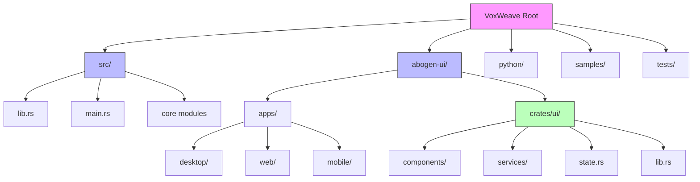
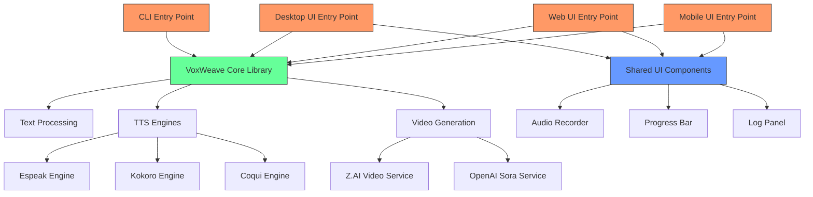
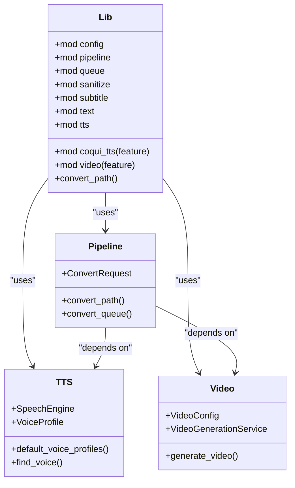
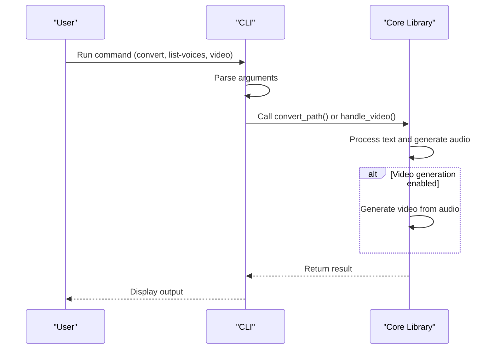
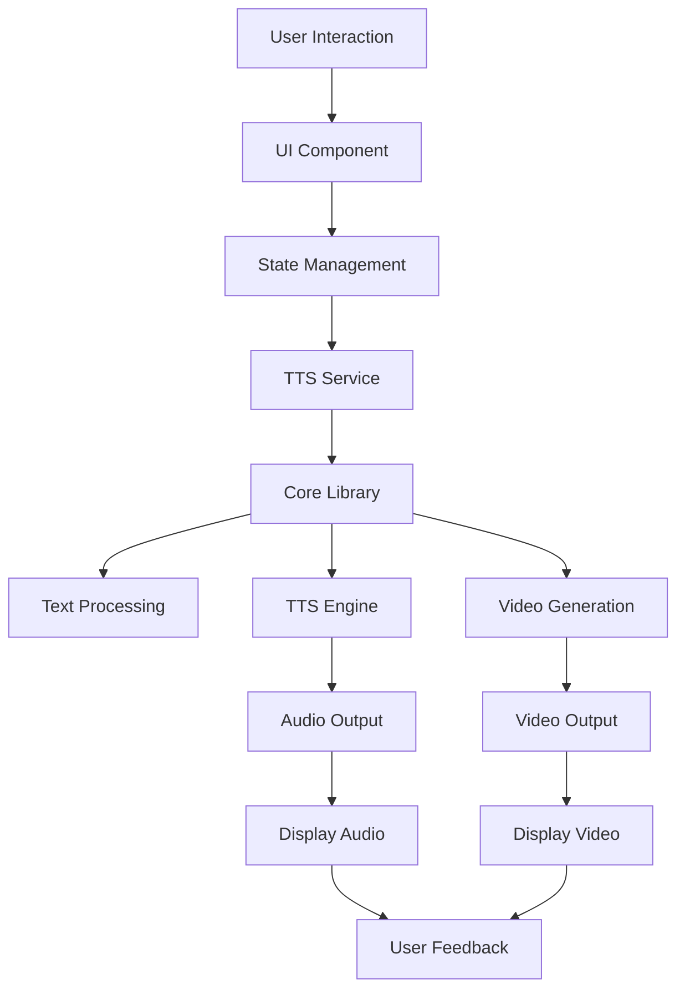

# Application Structure

<cite>
**Referenced Files in This Document**   
- [Cargo.toml](file://Cargo.toml)
- [src/lib.rs](file://src/lib.rs)
- [src/main.rs](file://src/main.rs)
- [abogen-ui/Cargo.toml](file://abogen-ui/Cargo.toml)
- [abogen-ui/apps/desktop/Cargo.toml](file://abogen-ui/apps/desktop/Cargo.toml)
- [abogen-ui/apps/web/Cargo.toml](file://abogen-ui/apps/web/Cargo.toml)
- [abogen-ui/apps/mobile/Cargo.toml](file://abogen-ui/apps/mobile/Cargo.toml)
- [abogen-ui/crates/ui/Cargo.toml](file://abogen-ui/crates/ui/Cargo.toml)
- [abogen-ui/crates/ui/lib.rs](file://abogen-ui/crates/ui/lib.rs)
- [src/pipeline.rs](file://src/pipeline.rs)
- [abogen-ui/crates/ui/state.rs](file://abogen-ui/crates/ui/state.rs)
- [abogen-ui/crates/ui/services/tts_service.rs](file://abogen-ui/crates/ui/services/tts_service.rs)
- [abogen-ui/crates/ui/services/video_generation.rs](file://abogen-ui/crates/ui/services/video_generation.rs)
- [src/video.rs](file://src/video.rs)
- [src/tts.rs](file://src/tts.rs)
- [src/coqui_tts.rs](file://src/coqui_tts.rs)
</cite>

## Table of Contents
1. [Introduction](#introduction)
2. [Project Structure](#project-structure)
3. [Core Components](#core-components)
4. [Architecture Overview](#architecture-overview)
5. [Detailed Component Analysis](#detailed-component-analysis)
6. [Dependency Analysis](#dependency-analysis)
7. [Performance Considerations](#performance-considerations)
8. [Troubleshooting Guide](#troubleshooting-guide)
9. [Conclusion](#conclusion)

## Introduction
The VoxWeave application is a multi-platform text-to-speech and video generation system with a modular architecture. It features three distinct entry points: a command-line interface (CLI), a desktop application, and a web application, all built on a shared core library. The architecture leverages feature flags to enable optional functionality like Coqui TTS and video generation, allowing for selective compilation of external dependencies. The application uses a monorepo structure for its UI components, enabling cross-platform consistency through shared UI elements and services.

## Project Structure

The VoxWeave project follows a modular structure with a clear separation between the core functionality and platform-specific entry points. The core library resides in the `src/` directory, while the UI applications are organized within the `abogen-ui/` monorepo.



**Diagram sources**
- [src/lib.rs](file://src/lib.rs)
- [abogen-ui/crates/ui/lib.rs](file://abogen-ui/crates/ui/lib.rs)

**Section sources**
- [Cargo.toml](file://Cargo.toml)
- [abogen-ui/Cargo.toml](file://abogen-ui/Cargo.toml)

## Core Components

The VoxWeave application is built around several core components that provide the foundational functionality for text processing, speech synthesis, and video generation. The core library (`src/lib.rs`) exports essential modules and functions that are used by all entry points. Key components include the text processing pipeline, TTS engines, and video generation services. The modular design allows for feature-flagged compilation of optional components like Coqui TTS and video generation.

**Section sources**
- [src/lib.rs](file://src/lib.rs)
- [src/pipeline.rs](file://src/pipeline.rs)
- [src/tts.rs](file://src/tts.rs)

## Architecture Overview

The VoxWeave architecture follows a layered design with a shared core library at its foundation. Three distinct entry points—CLI, desktop UI, and web UI—depend on this core library for text processing, TTS, and video generation logic. The UI applications are built using the Dioxus framework and share a common UI crate that ensures cross-platform consistency. Feature flags control the compilation of optional functionality, allowing for selective inclusion of external dependencies.



**Diagram sources**
- [src/lib.rs](file://src/lib.rs)
- [abogen-ui/crates/ui/lib.rs](file://abogen-ui/crates/ui/lib.rs)
- [src/tts.rs](file://src/tts.rs)
- [src/video.rs](file://src/video.rs)

## Detailed Component Analysis

### Core Library Analysis
The core library (`src/lib.rs`) serves as the foundation for all VoxWeave applications. It exports essential modules for configuration, pipeline processing, queue management, text sanitization, subtitle generation, text processing, TTS, and video generation. The library uses conditional compilation to include optional modules like Coqui TTS and video generation based on feature flags.



**Diagram sources**
- [src/lib.rs](file://src/lib.rs)
- [src/pipeline.rs](file://src/pipeline.rs)
- [src/tts.rs](file://src/tts.rs)
- [src/video.rs](file://src/video.rs)

### Entry Point Analysis
The VoxWeave application provides multiple entry points for different use cases and platforms. The CLI entry point (`src/main.rs`) provides command-line access to the core functionality, while the UI applications (`abogen-ui/apps/`) provide graphical interfaces. Each entry point is configured through its respective Cargo.toml file and depends on the shared core library.

#### CLI Entry Point
The CLI entry point provides a command-line interface to the VoxWeave functionality. It supports commands for text conversion, voice listing, and video generation. The CLI uses the Clap library for argument parsing and handles feature-flagged functionality through conditional compilation.



**Diagram sources**
- [src/main.rs](file://src/main.rs)
- [src/pipeline.rs](file://src/pipeline.rs)

#### UI Entry Points
The UI applications are built using the Dioxus framework and share a common UI crate (`abogen-ui/crates/ui/`). This shared crate provides components, services, and state management that ensure consistency across platforms. Each UI application is configured through its respective Cargo.toml file and can enable optional features through feature flags.



**Diagram sources**
- [abogen-ui/crates/ui/lib.rs](file://abogen-ui/crates/ui/lib.rs)
- [abogen-ui/crates/ui/state.rs](file://abogen-ui/crates/ui/state.rs)
- [abogen-ui/crates/ui/services/tts_service.rs](file://abogen-ui/crates/ui/services/tts_service.rs)

## Dependency Analysis

The VoxWeave application has a complex dependency graph that enables its modular functionality. The core library depends on several external crates for configuration, argument parsing, file operations, and serialization. Optional features like video generation depend on additional crates like tokio and reqwest, which are conditionally compiled based on feature flags.

```mermaid
graph TD
A[Cargo.toml] --> B[anyhow]
A --> C[clap]
A --> D[directories]
A --> E[once_cell]
A --> F[regex]
A --> G[serde]
A --> H[serde_json]
A --> I[thiserror]
A --> J[tokio] (optional)
A --> K[reqwest] (optional)
L[abogen-ui/Cargo.toml] --> M[dioxus]
L --> N[serde]
L --> O[serde_json]
L --> P[tokio]
L --> Q[reqwest] (optional)
L --> R[voxweave]
R --> A
style A fill:#f96,stroke:#333
style L fill:#f96,stroke:#333
style R fill:#6f9,stroke:#333
```

**Diagram sources**
- [Cargo.toml](file://Cargo.toml)
- [abogen-ui/Cargo.toml](file://abogen-ui/Cargo.toml)
- [abogen-ui/crates/ui/Cargo.toml](file://abogen-ui/crates/ui/Cargo.toml)

## Performance Considerations

The VoxWeave application is designed with performance in mind, particularly for resource-intensive operations like TTS and video generation. The architecture uses asynchronous processing and background tasks to maintain UI responsiveness during long-running operations. The CLI entry point uses synchronous processing for simplicity, while the UI applications leverage tokio for asynchronous operations.

The modular design allows for selective compilation of optional features, reducing the application's footprint when advanced functionality is not needed. The shared UI crate minimizes code duplication and ensures consistent performance across platforms.

## Troubleshooting Guide

When encountering issues with the VoxWeave application, consider the following common problems and solutions:

1. **Video generation fails**: Ensure the ZAI_API_KEY environment variable is set correctly.
2. **TTS engine not found**: Verify that the required Python dependencies are installed for Coqui TTS.
3. **Feature not available**: Check that the appropriate feature flags are enabled during compilation.
4. **UI not responding**: Long-running operations may block the UI thread; consider using the CLI for large processing tasks.

**Section sources**
- [src/video.rs](file://src/video.rs)
- [src/tts.rs](file://src/tts.rs)
- [abogen-ui/crates/ui/services/video_generation.rs](file://abogen-ui/crates/ui/services/video_generation.rs)

## Conclusion

The VoxWeave application demonstrates a well-structured, modular architecture that supports multiple entry points while maintaining a shared core library. The use of feature flags enables selective compilation of optional functionality, making the application adaptable to different use cases and deployment scenarios. The monorepo structure for UI components ensures consistency across platforms while allowing for platform-specific optimizations. This architecture provides a solid foundation for a scalable, maintainable text-to-speech and video generation system.