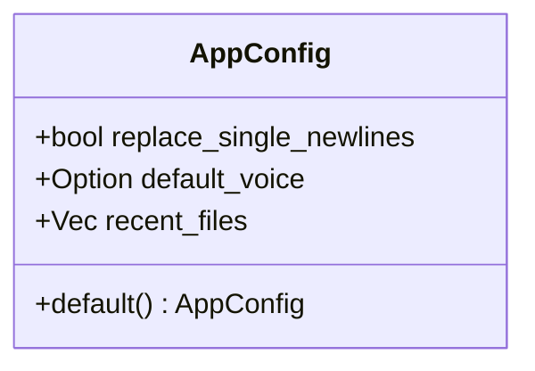
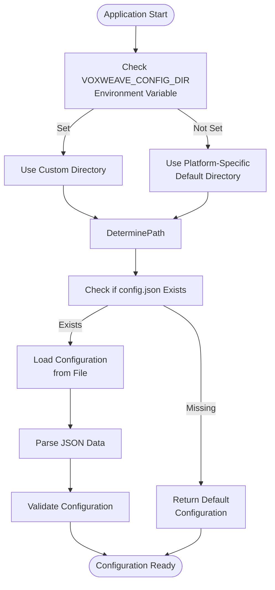
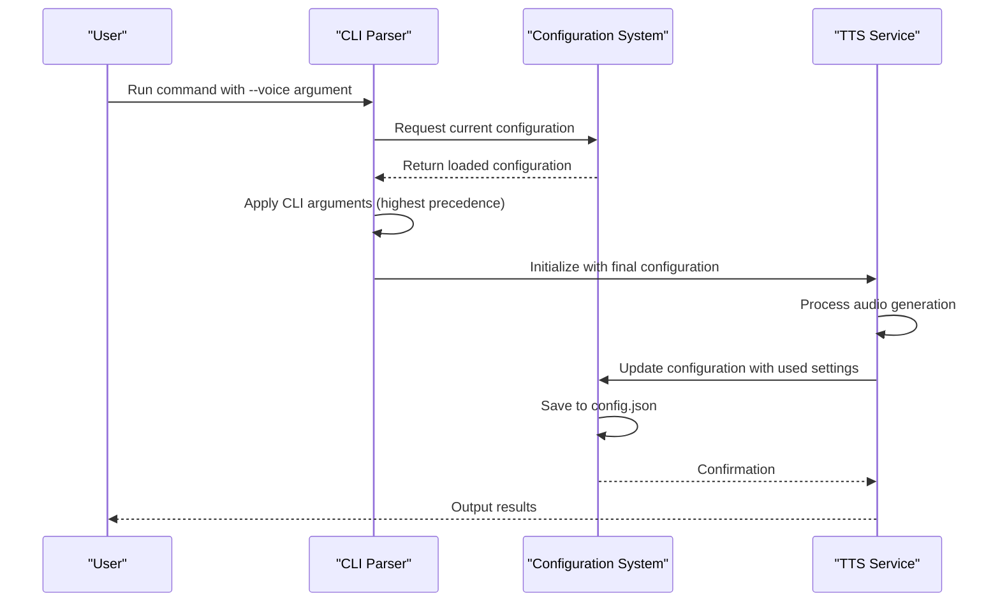

# Configuration Management

<cite>
**Referenced Files in This Document**   
- [config.rs](file://src/config.rs)
- [main.rs](file://src/main.rs)
- [video.rs](file://src/video.rs)
</cite>

## Table of Contents
1. [Introduction](#introduction)
2. [Configuration Structure](#configuration-structure)
3. [Configuration Loading Hierarchy](#configuration-loading-hierarchy)
4. [Configuration Validation](#configuration-validation)
5. [Configuration Flow Example](#configuration-flow-example)
6. [Serialization and Deserialization](#serialization-and-deserialization)
7. [Common Configuration Issues](#common-configuration-issues)
8. [Best Practices](#best-practices)

## Introduction
The configuration management system in VoxWeave provides a centralized approach to managing application settings across different components and execution contexts. The system is designed to handle TTS parameters, video generation options, and file paths through a unified configuration structure. This document details the implementation and usage patterns of the configuration system, focusing on the AppConfig struct and its supporting functions.

**Section sources**
- [config.rs](file://src/config.rs#L1-L117)

## Configuration Structure
The configuration system is built around the AppConfig struct, which centralizes all application settings. The struct contains three main configuration categories:

- **Text Processing Settings**: The `replace_single_newlines` field controls whether single newlines in input text should be replaced with spaces during processing.
- **Voice Preferences**: The `default_voice` field stores the identifier of the default voice to use for text-to-speech operations.
- **File History**: The `recent_files` vector maintains a list of recently processed files for quick access.

The AppConfig struct implements the Default trait, providing sensible default values: newline replacement is disabled, no default voice is set, and the recent files list is empty.

**Diagram sources**
- [config.rs](file://src/config.rs#L10-L25)

**Section sources**
- [config.rs](file://src/config.rs#L10-L35)

## Configuration Loading Hierarchy
The configuration system implements a hierarchical loading mechanism that prioritizes settings from different sources. The loading process follows this order of precedence:

1. **Environment Variables**: The VOXWEAVE_CONFIG_DIR environment variable can override the default configuration directory location.
2. **File System**: Configuration is persisted in a JSON file (config.json) within the appropriate system directory.
3. **Default Values**: When no configuration file exists, the system returns default settings.

The config_path function determines the appropriate location for the configuration file using the directories crate, which follows platform-specific conventions for configuration storage. On Linux systems, this is typically ~/.config/voxweave/config.json, while on macOS it's ~/Library/Preferences/com.voxweave.voxweave/config.json.

**Diagram sources**
- [config.rs](file://src/config.rs#L37-L50)

**Section sources**
- [config.rs](file://src/config.rs#L37-L50)

## Configuration Validation
The configuration system includes built-in validation to ensure required settings are present before service initialization. While the current implementation focuses on structural validation through serde deserialization, the system is designed to support additional validation rules.

The load_config function performs the following validation steps:
- Checks if the configuration file exists
- Attempts to parse the JSON content
- Returns default configuration if the file is missing
- Propagates parsing errors if the file exists but contains invalid JSON

The system also validates configuration updates through the update_config function in main.rs, which ensures that voice selections are valid by checking against the available voice profiles before saving them to the configuration.

**Section sources**
- [config.rs](file://src/config.rs#L52-L60)
- [main.rs](file://src/main.rs#L240-L260)

## Configuration Flow Example
The configuration flows from CLI arguments through the core library to individual services in a well-defined sequence. When a user runs the convert command, the following process occurs:

1. The CLI arguments are parsed by clap
2. The current configuration is loaded from disk
3. User preferences from CLI arguments take precedence over stored configuration
4. Services are initialized with the final configuration
5. Configuration is updated and saved based on the operation

For example, when specifying a voice with the --voice command-line argument, this value overrides both the configuration file setting and the default voice. After successful processing, this voice becomes the new default in the configuration file.

**Diagram sources**
- [main.rs](file://src/main.rs#L100-L150)
- [config.rs](file://src/config.rs#L62-L72)

**Section sources**
- [main.rs](file://src/main.rs#L100-L150)
- [config.rs](file://src/config.rs#L62-L72)

## Serialization and Deserialization
The configuration system uses serde for serialization and deserialization, enabling future support for configuration files in multiple formats. The AppConfig struct is annotated with Serialize and Deserialize derive macros, allowing automatic conversion between Rust structures and JSON format.

The save_config function serializes the configuration to a pretty-printed JSON format, making it human-readable and easy to edit manually if needed. This approach facilitates future expansion to support additional configuration formats such as TOML or YAML by simply adding the appropriate serde features and format-specific serializers.

The system's use of standard JSON formatting also enables integration with configuration management tools and version control systems, allowing teams to share and track configuration changes over time.

**Section sources**
- [config.rs](file://src/config.rs#L62-L72)
- [Cargo.toml](file://Cargo.toml)

## Common Configuration Issues
Several common configuration issues may arise during usage:

**Missing Environment Variables**: When using video generation features, the ZAI_API_KEY or OPENAI_API_KEY environment variables must be set. The system checks for these in the VideoGenerationService::from_env method and provides clear error messages when they are missing.

**Invalid Voice Identifiers**: If a user specifies a voice that doesn't exist in the available voice profiles, the system will fail to process the request. The select_voice function validates voice identifiers against the available profiles before proceeding.

**File Permission Issues**: The configuration system may encounter permission errors when attempting to read from or write to the configuration directory. The config_path function handles directory creation, but users may still encounter issues if they lack write permissions in the target directory.

**Corrupted Configuration Files**: If the config.json file becomes corrupted, the system will fall back to default settings. Users can resolve this by removing the corrupted file and allowing the system to generate a new one.

**Section sources**
- [video.rs](file://src/video.rs#L50-L64)
- [main.rs](file://src/main.rs#L180-L200)
- [config.rs](file://src/config.rs#L52-L60)

## Best Practices
To effectively manage configuration across different environments, follow these best practices:

**Development Environment**: Use the VOXWEAVE_CONFIG_DIR environment variable to point to a development-specific configuration directory. This allows testing configuration changes without affecting the production setup.

**Testing Environment**: In automated tests, use temporary directories for configuration storage to ensure test isolation. The existing tests demonstrate this pattern using tempfile::tempdir.

**Production Environment**: Ensure the configuration directory has appropriate permissions and is included in backup procedures. Consider using configuration management tools to deploy consistent settings across multiple production instances.

**Version Control**: While the main configuration file should not be version-controlled (as it contains user-specific settings), consider maintaining example configuration files in the repository to document available options and their default values.

**Security**: Never commit API keys or other sensitive information to version control. Use environment variables for sensitive configuration, as demonstrated by the ZAI_API_KEY and OPENAI_API_KEY handling in the video generation service.

**Section sources**
- [config.rs](file://src/config.rs#L37-L50)
- [video.rs](file://src/video.rs#L50-L64)
- [main.rs](file://src/main.rs#L350-L370)